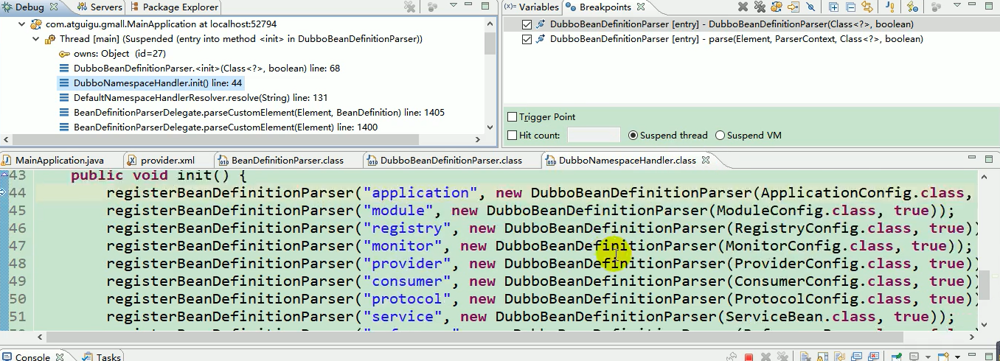
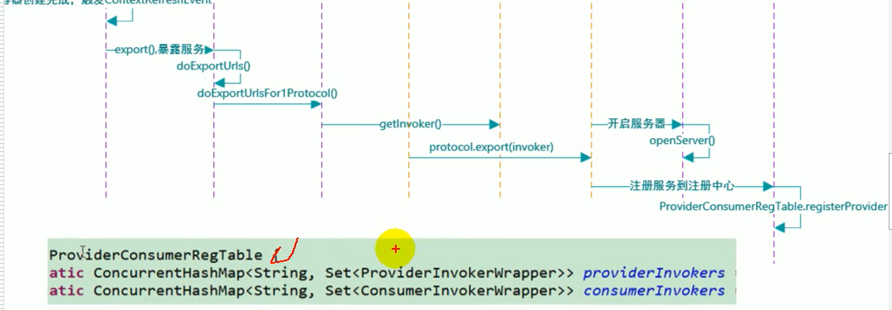

# 原理

## 0x01 Rpc原理


## 0x02 Netty

TODO，见Netty自己的笔记


## 0x03 Dubbo原理

- 框架设计
- 启动解析、加载配置信息
- 服务暴露
- 服务引用
- 服务调用


### 框架设计

参考：<http://dubbo.apache.org/zh-cn/docs/dev/design.html>


### 启动解析、加载配置信息

打断点看，DubboBeanDefinitionParser里


然后逻辑类似，如果beanClass为`ProtocolConfig、ServiceBean、ProviderConfig、ConsumerConfig、MonitorConfig`

**标签解析**

在DubboBeanDefinitionParser构造时，调用DubboNamespaceHandler.init()



对每个Config调用Parser解析

那标签解析做了什么呢？


获取和设置属性···


ServiceBean解析牵扯到服务暴露的过程


### 服务暴露流程

ServiceBean实现了接口：

```
initializingBean  (回调afterProperties方法)，
DisposableBean，
ApplicationContextAware，
ApplicationListener<ContextRefreshedEvent>（回调onApplicationEvent方法）
```

看这两个方法做了啥

**先看`initializingBean.afterProperties`方法**

这里会做各种配置信息的保存操作

**再看`ApplicationListener.onApplicationEvent`方法**

调用export方法


在最后的`protocol.export(invoker)`中

**RegistryProtocol**.export    注册中心相关，

- doLocalExport(`originInvoker`)    本地暴露（注册中心）

  - 目的：**启动Netty服务器，监听20880端口**

  - **Protocol**的openServer方法会创建**ExchangeServer**

    ```java
    server = Exchangers.bind(url, requestHandler);
    ```

  - 在**ExchangeServer**的bind里调用了**Transporters**.bind方法

  - 在**Transporters**里就可以看见**Channelhandler**等了

    Transporters里可以看见Netty底层了，有Netty各版的实现类

    相当于创建Netty的服务器

- ProviderConsumerRegTable.refisterProvider(`originInvoker, registryUrl, resigtedProviderUrl`)

  - 目的：**提供者消费者注册表—注册提供者**
  - providerInvokers
  - consumerInvokers
  - invokers.add(...)




### 服务引用流程

reference 对应  ReferenceBean  （是一个FactoryBean）

所以@Reference这里会调用工厂Bean的getObject方法

- **getObject**进行初始化init(...)

  - 设置各种属性

  - **createProxy**创建信息的**代理对象**

  - 在创建代理对象时，

    ```java
    //从注册中心（url）获取远程接口
    refprotocol.refer(interfaceClass, urls.get(0));
    ```

  - 对应**DubboProtocol**.ref  和   **RegistryProtocol**.ref

    - 先来到**RegistryProtocol**.ref

      - 获取注册中心信息
      - directory.subscribe(...)  **订阅提供者的服务**

    - 再来到**DubboProtocol**.ref

      - **创建ExchangersClient客户端**

      - 初始化客户端

        ```java
        Exchangers.connect(url, requestHandler);
        ```

      - 里面又调用**Transporters**.connect

        又到了Netty底层，创建Netty客户端

      - invokers.add(invoker) 连接属性保存

    - 再到**RegistryProtocol**

      `ProviderVonsumerRegTable.registerConsumer(invoker, url, subscribeUrl, directory)`

      **提供者消费者注册表—注册消费者**

  - 到这里，Proxy**代理对象**创建完成。引用的就是代理对象，客户调用代理对象的方法。


这里还有一个源码解析博客：<https://www.cnblogs.com/tlj2018/articles/12198391.html>


那如何通过代理对象来服务调用呢？


# 服务调用流程

参考：<http://dubbo.apache.org/zh-cn/docs/dev/design.html>


在**InvokerInvocationHandler**里

```java
invoker.invoke(new RpcInvocation(method, args)).recreate();
```

调用的是**MockClusterInvoker**的invoke方法

```java
result = this.invoker.invoke(invocation);
```

调用的是**FailoverClusterInvoker**的invoke方法（集群容错相关）

- list列出两个version的方法，得到`List<Invoker<T>> invokers`

- 获取到负载均衡机制   `loadbalance`

- `Invoker<T> invoker = select(loadbalance, invocation, copyinvokers, invoked)`

  根据负载均衡策略选择一个Invoker

- 保存信息，再`Invoker.invoke(invocation)`

  这里的invoker是ProtocolFilterWrapper等**Filter**：

  - **cache**缓存

  - **mock**本地伪装

  - **local**

- 所用总体是`Filter -> Invoker -> Filter -> Invoker`

- 到最终一般是`DubboInvoker`

  - 拿到客户端`ExchangeClient`

  - 发起请求并返回

    ```java
    return (Result) currentClient.request(inv, timeout).get();
    ```

  - 拿到结果的封装对象UserAddress，解析


### 服务暴露、消费流程（简化版本）

服务暴露、消费流程


- 服务暴露

  - 首先 Provider 启动，通过 Proxy 组件根据具体的协议 Protocol 将需要暴露出去的接口封装成 Invoker，Invoker 是 Dubbo 一个很核心的组件，代表一个可执行体。
  - 然后再通过 Exporter 包装一下，这是为了在注册中心暴露自己套的一层，然后将 Exporter 通过 Registry 注册到注册中心。

- 服务消费

  - 首先消费者启动会向注册中心拉取服务提供者的元信息，然后调用流程也是从 Proxy 开始，毕竟都需要代理才能无感知。
  - Proxy 持有一个 Invoker 对象，调用 invoke 之后需要通过 Cluster 先从 Directory 获取所有可调用的远程服务的 Invoker 列表，如果配置了某些路由规则，比如某个接口只能调用某个节点的那就再过滤一遍 Invoker 列表。
  - 剩下的 Invoker 再通过 `LoadBalance` 做负载均衡选取一个。然后再经过 Filter 做一些统计什么的，再通过 Client 做数据传输，比如用 Netty 来传输。
  - 传输需要经过 Codec 接口做协议构造，再序列化。最终发往对应的服务提供者。
  - 服务提供者接收到之后也会进行 Codec 协议处理，然后反序列化后将请求扔到线程池处理。某个线程会根据请求找到对应的 Exporter ，而找到 Exporter 其实就是找到了 Invoker，但是还会有一层层 Filter，经过一层层过滤链之后最终调用实现类然后原路返回结果。

  完成整个调用过程！

  

# 参考

- 尚硅谷_BillBill
- 官方文档
- [敖丙文章](<https://mp.weixin.qq.com/s?__biz=MzAwNDA2OTM1Ng==&mid=2453145479&idx=1&sn=7acb47806794f0fda0eb42af09595df7&chksm=8cfd2504bb8aac12db9c0cca4cec83afa741b75193c967ecf9e86ef66df6cc3dbc2d379adfeb&mpshare=1&scene=23&srcid=0818E4Dz5FguCEqqLMWTzj76&sharer_sharetime=1597715286296&sharer_shareid=e6d90aec84add5cf004cb1ab6979727c#rd>)