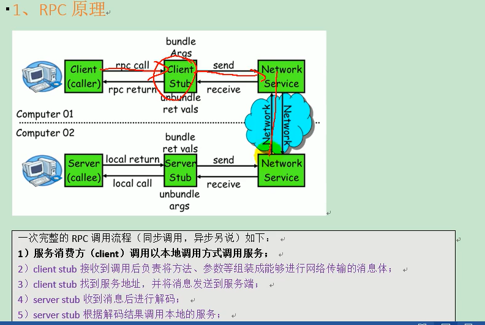

# 知识点提要

- RPC

  Remote Procedure Call 即远程过程调用

- API、SPI

  SPI：是 JDK 内置的一个服务发现机制，**它使得接口和具体实现完全解耦**。我们只声明接口，具体的实现类在配置中选择

- RPC调用流程

  

  

- RPC框架设计

  

  - **角色**

    - 服务消费者
    - 服务提供者
    - 注册中心
    - 监控中心

  - **分层结构**

    - **`Business`业务层**
      - Service，业务层，就是咱们开发的业务逻辑层
    - **`RPC`层**
      - Config，配置层，主要围绕 `ServiceConfig` 和 `ReferenceConfig`，初始化配置信息。
      - Proxy，代理层，服务提供者还是消费者都会生成一个代理类，使得服务接口透明化，代理层做远程调用和返回结果。
      - Register，注册层，封装了服务注册和发现。
      - Cluster，路由和集群容错层，负责选取具体调用的节点，处理特殊的调用要求和负责远程调用失败的容错措施。
      - Monitor，监控层，负责监控统计调用时间和次数。
      - Protocol，远程调用层，主要是封装 RPC 调用，主要负责管理 Invoker，Invoker代表一个抽象封装了的执行体，之后再做详解。
    - **`Remoting`层**
      - Exchange，信息交换层，用来封装请求响应模型，同步转异步。
      - Transport，网络传输层，抽象了网络传输的统一接口，这样用户想用 Netty 就用 Netty，想用 Mina 就用 Mina。
      - Serialize，序列化层，将数据序列化成二进制流，当然也做反序列化。

    

  - **注意事项**

    - **注册中心和监控中心是可选的**
    - 注册中心、提供方和消费方之间都是长连接
    - 监控方和提供方、消费方之间都不是长连接
    - **消费方是直接调用提供方，不经过注册中心**
    - **注册中心和监控中心宕机了也不会影响到已经正常运行的提供者和消费者**，因为消费者有本地缓存提供者的信息

  - **框架实现核心**

    - 消费者向提供者发送接口全限定名、形参列表、实参列表

    - 提供者在提供类中找到相应方法,反射调用返回结果

      ```java
      method.invoke(clazz, request.getValues())
      ```

    - 了解三层架构和调用流程

    - 再次强调：消费方（Client）是直接调用提供方（Server），不经过注册中心

- **服务暴露、消费流程**

  

  - **服务暴露**

    - 首先 Provider 启动，通过 Proxy 组件根据具体的协议 Protocol 将需要暴露出去的接口封装成 Invoker，Invoker 是 Dubbo 一个很核心的组件，代表一个可执行体。

    - 然后再通过 Exporter 包装一下，这是为了在注册中心暴露自己套的一层，然后将 Exporter 通过 Registry 注册到注册中心。

  - **服务消费**

    - 首先消费者启动会向注册中心拉取服务提供者的元信息，然后调用流程也是从 Proxy 开始，毕竟都需要代理才能无感知。

    - Proxy 持有一个 Invoker 对象，调用 invoke 之后需要通过 Cluster 先从 Directory 获取所有可调用的远程服务的 Invoker 列表，如果配置了某些路由规则，比如某个接口只能调用某个节点的那就再过滤一遍 Invoker 列表。

    - 剩下的 Invoker 再通过 `LoadBalance` 做负载均衡选取一个。然后再经过 Filter 做一些统计什么的，再通过 Client 做数据传输，比如用 Netty 来传输。

    - 传输需要经过 Codec 接口做协议构造，再序列化。最终发往对应的服务提供者。

    - 服务提供者接收到之后也会进行 Codec 协议处理，然后反序列化后将请求扔到线程池处理。某个线程会根据请求找到对应的 Exporter ，而找到 Exporter 其实就是找到了 Invoker，但是还会有一层层 Filter，经过一层层过滤链之后最终调用实现类然后原路返回结果。

    完成整个调用过程！


# 手写RPC实现


### 单进程

[原文链接](<https://mp.weixin.qq.com/s?__biz=MzAwNDA2OTM1Ng==&mid=2453145479&idx=1&sn=7acb47806794f0fda0eb42af09595df7&chksm=8cfd2504bb8aac12db9c0cca4cec83afa741b75193c967ecf9e86ef66df6cc3dbc2d379adfeb&mpshare=1&scene=23&srcid=0818E4Dz5FguCEqqLMWTzj76&sharer_sharetime=1597715286296&sharer_shareid=e6d90aec84add5cf004cb1ab6979727c#rd>)

核心代码如下：

```java
//AobingRpcFramework.java

public class AobingRpcFramework { 
     public static void export(Object service, int port) throws Exception { 
          ServerSocket server = new ServerSocket(port);
          while(true) {
              Socket socket = server.accept();
              new Thread(new Runnable() {
                  //反序列化
                  ObjectInputStream input = new ObjectInputStream(socket.getInputStream()); 
                  String methodName = input.read(); //读取方法名
                  Class<?>[] parameterTypes = (Class<?>[]) input.readObject(); //参数类型
                  Object[] arguments = (Object[]) input.readObject(); //参数
                  Method method = service.getClass().getMethod(methodName, parameterTypes);  //找到方法
                  Object result = method.invoke(service, arguments); //调用方法
                  // 返回结果
                  ObjectOutputStream output = new ObjectOutputStream(socket.getOutputStream());
                  output.writeObject(result);
              }).start();
          }
     }
    public static <T> T refer (Class<T> interfaceClass, String host, int port) throws Exception {
       return  (T) Proxy.newProxyInstance(interfaceClass.getClassLoader(), new Class<?>[] {interfaceClass}, 
            new InvocationHandler() {  
                public Object invoke(Object proxy, Method method, Object[] arguments) throws Throwable {  
                    Socket socket = new Socket(host, port);  //指定 provider 的 ip 和端口
                    ObjectOutputStream output = new ObjectOutputStream(socket.getOutputStream()); 
                    output.write(method.getName());  //传方法名
                    output.writeObject(method.getParameterTypes());  //传参数类型
                    output.writeObject(arguments);  //传参数值
                    ObjectInputStream input = new ObjectInputStream(socket.getInputStream());  
                    Object result = input.readObject();  //读取结果
                    return result;  
               }
        });  
    }  
}
```

然后提供者调用export方法，消费者调用refer方法即可


### 多进程

[原文链接](<https://gitee.com/gupaoedu-tom/netty4-samples/blob/master/gupaoedu-vip-netty-rpc/src/main/java/com/gupaoedu/vip/netty/rpc/registry/RpcRegistry.java>)

- 服务提供者

  - 开启时扫描指定包下实现类实例，**模拟`ioc`容器**

  - 对于Netty的socket接收到的：接口和参数，调用对应类方法返回结果

  - 核心代码

    ```java
    //RegistryHandler.java
    
    public class RegistryHandler extends ChannelInboundHandlerAdapter {
        //用保存所有可用的服务
        public static ConcurrentHashMap<String, Object> registryMap = new ConcurrentHashMap<String,Object>();
    
        //保存所有相关的服务类
        private List<String> classNames = new ArrayList<String>();
    
        public RegistryHandler(){
            //完成递归扫描
            scannerClass("provider");
            doRegister();
        }
    
    
        @Override
        public void channelRead(ChannelHandlerContext ctx, Object msg) throws Exception {
            Object result = new Object();
            InvokerProtocol request = (InvokerProtocol)msg;
    
            //当客户端建立连接时，需要从自定义协议中获取信息，拿到具体的服务和实参
            //使用反射调用
            if(registryMap.containsKey(request.getClassName())){
                Object clazz = registryMap.get(request.getClassName());
                Method method = clazz.getClass().getMethod(request.getMethodName(), request.getParames());
                result = method.invoke(clazz, request.getValues());
            }
            ctx.write(result);
            ctx.flush();
            ctx.close();
        }
    
        @Override
        public void exceptionCaught(ChannelHandlerContext ctx, Throwable cause) throws Exception {
            cause.printStackTrace();
            ctx.close();
        }
    
    
        /*
         * 递归扫描
         */
        private void scannerClass(String packageName){
            URL url = this.getClass().getClassLoader().getResource(packageName.replaceAll("\\.", "/"));
            File dir = new File(url.getFile());
            for (File file : dir.listFiles()) {
                //如果是一个文件夹，继续递归
                if(file.isDirectory()){
                    scannerClass(packageName + "." + file.getName());
                }else{
                    classNames.add(packageName + "." + file.getName().replace(".class", "").trim());
                }
            }
        }
    
        /**
         * 完成注册
         */
        private void doRegister(){
            if(classNames.size() == 0){ return; }
            for (String className : classNames) {
                try {
                    Class<?> clazz = Class.forName(className);
                    Class<?> i = clazz.getInterfaces()[0];
                    registryMap.put(i.getName(), clazz.newInstance());
                } catch (Exception e) {
                    e.printStackTrace();
                }
            }
        }
    }
    ```

- 服务消费者

  - 使用代理类Proxy，通过动态代理去实现RPC

    - 参数—类加载器：`clazz.getClassLoader()`
    - 参数—代理接口：`clazz.getInterfaces()`
    - 参数—`InvocationHandler`
      - 要实现`public Object invoke(...)`方法
      - 通过创建Client，发包请求返回对应方法的Result

  - 核心代码

    ```java
    public class RpcProxy {
        public static <T> T create(Class<?> clazz){
            //clazz传进来本身就是interface
            MethodProxy proxy = new MethodProxy(clazz);
            Class<?> [] interfaces = clazz.isInterface() ?
                    new Class[]{clazz} :
                    clazz.getInterfaces();
            T result = (T) Proxy.newProxyInstance(clazz.getClassLoader(),interfaces,proxy);
            return result;
        }
    
        private static class MethodProxy implements InvocationHandler {
            private Class<?> clazz;
            public MethodProxy(Class<?> clazz){
                this.clazz = clazz;
            }
    
    
            public Object invoke(Object proxy, Method method, Object[] args)  throws Throwable {
                //如果传进来是一个已实现的具体类（本次演示略过此逻辑)
                if (Object.class.equals(method.getDeclaringClass())) {
                    try {
                        return method.invoke(this, args);
                    } catch (Throwable t) {
                        t.printStackTrace();
                    }
                    //如果传进来的是一个接口（核心)
                } else {
                    return rpcInvoke(proxy,method, args);
                }
                return null;
            }
    
    
            /**
             * 实现接口的核心方法
             * @param method
             * @param args
             * @return
             */
            public Object rpcInvoke(Object proxy, Method method, Object[] args){
    
                //传输协议封装
                InvokerProtocol msg = new InvokerProtocol();
                msg.setClassName(this.clazz.getName());
                msg.setMethodName(method.getName());
                msg.setValues(args);
                msg.setParames(method.getParameterTypes());
    
                final RpcProxyHandler consumerHandler = new RpcProxyHandler();
                EventLoopGroup group = new NioEventLoopGroup();
                try {
                    Bootstrap b = new Bootstrap();
                    b.group(group)
                            .channel(NioSocketChannel.class)
                            .option(ChannelOption.TCP_NODELAY, true)
                            .handler(new ChannelInitializer<SocketChannel>() {
                                @Override
                                public void initChannel(SocketChannel ch) throws Exception {
                                    ChannelPipeline pipeline = ch.pipeline();
                                    //自定义协议解码器
                                    /** 入参有5个，分别解释如下
                                     maxFrameLength：框架的最大长度。如果帧的长度大于此值，则将抛出TooLongFrameException。
                                     lengthFieldOffset：长度字段的偏移量：即对应的长度字段在整个消息数据中得位置
                                     lengthFieldLength：长度字段的长度：如：长度字段是int型表示，那么这个值就是4（long型就是8）
                                     lengthAdjustment：要添加到长度字段值的补偿值
                                     initialBytesToStrip：从解码帧中去除的第一个字节数
                                     */
                                    pipeline.addLast("frameDecoder", new LengthFieldBasedFrameDecoder(Integer.MAX_VALUE, 0, 4, 0, 4));
                                    //自定义协议编码器
                                    pipeline.addLast("frameEncoder", new LengthFieldPrepender(4));
                                    //对象参数类型编码器
                                    pipeline.addLast("encoder", new ObjectEncoder());
                                    //对象参数类型解码器
                                    pipeline.addLast("decoder", new ObjectDecoder(Integer.MAX_VALUE, ClassResolvers.cacheDisabled(null)));
                                    pipeline.addLast("handler",consumerHandler);
                                }
                            });
    
                    ChannelFuture future = b.connect("localhost", 8080).sync();
                    future.channel().writeAndFlush(msg).sync();
                    future.channel().closeFuture().sync();
                } catch(Exception e){
                    e.printStackTrace();
                }finally {
                    group.shutdownGracefully();
                }
                return consumerHandler.getResponse();
            }
    
        }
    }
    ```

  - **注意点**

    Tom的这个例子也不算注册中心！

    - 因为消费者直接调用提供方，不经过注册中心。不过注册了多个服务上类似注册中心了。

    - 而且虽然都是代理调用，但tom版是拿map模拟ioc容器的
    - 总体来说和单进程一样，只是多进程环境+多类而已


# 参考

- [敖丙 Dubbo系列-扬帆起航](<https://mp.weixin.qq.com/s?__biz=MzAwNDA2OTM1Ng==&mid=2453145479&idx=1&sn=7acb47806794f0fda0eb42af09595df7&chksm=8cfd2504bb8aac12db9c0cca4cec83afa741b75193c967ecf9e86ef66df6cc3dbc2d379adfeb&mpshare=1&scene=23&srcid=0818E4Dz5FguCEqqLMWTzj76&sharer_sharetime=1597715286296&sharer_shareid=e6d90aec84add5cf004cb1ab6979727c#rd>)
- [Netty4核心原理第五章—基于Netty的手写Rpc框架](<https://gitee.com/gupaoedu-tom/netty4-samples/blob/master/gupaoedu-vip-netty-rpc/src/main/java/com/gupaoedu/vip/netty/rpc/registry/RpcRegistry.java>)
- 尚硅谷_BillBill
- 官方文档