# 高可用

## 0x01 zookeeper宕机和`dubbo`直连

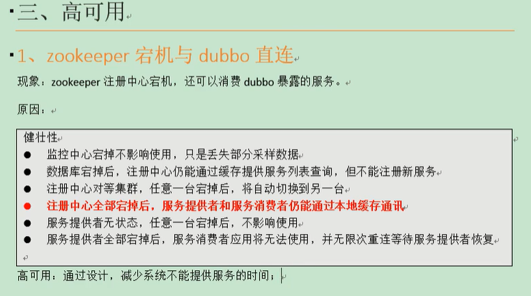

## 0x02 集群下负载均衡配置

参考：<http://dubbo.apache.org/zh-cn/docs/source_code_guide/loadbalance.html>

### `Random LoadBalance`

- **随机**，按权重设置随机概率。
- 在一个截面上碰撞的概率高，但调用量越大分布越均匀，而且按概率使用权重后也比较均匀，有利于动态调整提供者权重。

### `RoundRobin LoadBalance`

- **轮询**，按公约后的权重设置轮询比率。
- 存在慢的提供者累积请求的问题，比如：第二台机器很慢，但没挂，当请求调到第二台时就卡在那，久而久之，所有请求都卡在调到第二台上。

### `LeastActive LoadBalance`

- **最少活跃调用数**，相同活跃数的随机，活跃数指调用前后计数差。
- 使慢的提供者收到更少请求，因为越慢的提供者的调用前后计数差会越大。

### `ConsistentHash LoadBalance`

- **一致性 Hash**，相同参数的请求总是发到同一提供者。
- 当某一台提供者挂时，原本发往该提供者的请求，基于虚拟节点，平摊到其它提供者，不会引起剧烈变动。
- 算法参见：<http://en.wikipedia.org/wiki/Consistent_hashing>
- 缺省只对第一个参数 Hash，如果要修改，请配置 `<dubbo:parameter key="hash.arguments" value="0,1" />`
- 缺省用 160 份虚拟节点，如果要修改，请配置 `<dubbo:parameter key="hash.nodes" value="320" />`

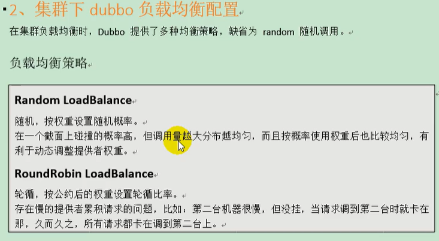

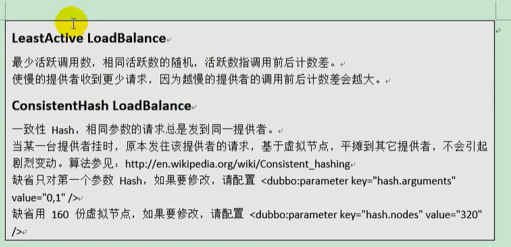

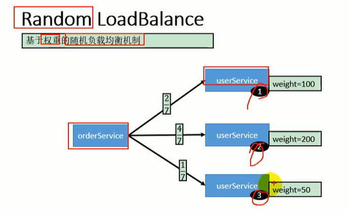

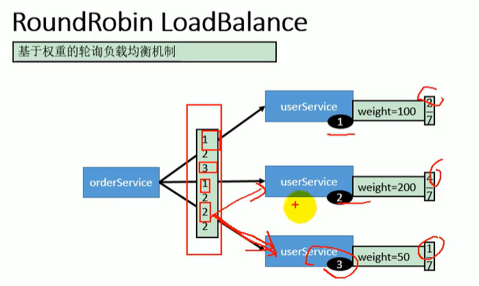

这里看下标：1231222，因为3的轮询次数用完，所以123后第二轮无3，以此类推

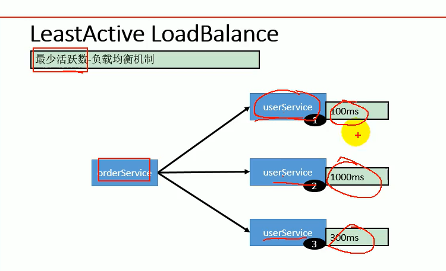

这里xxx`ms`是上一次请求调用花费时间，越小越优先

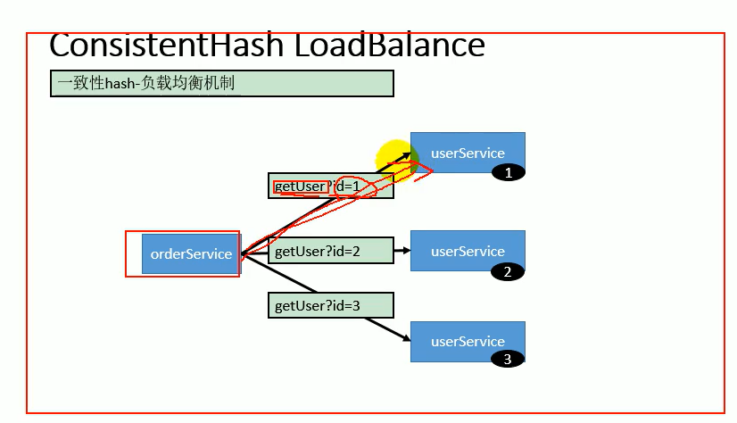

`参考：<http://dubbo.apache.org/zh-cn/docs/user/demos/loadbalance.html`>

## 配置

### 服务端服务级别

```xml
<dubbo:service interface="..." loadbalance="roundrobin" />
```

### 客户端服务级别

```xml
<dubbo:reference interface="..." loadbalance="roundrobin" />
```

### 服务端方法级别

```xml
<dubbo:service interface="...">
    <dubbo:method name="..." loadbalance="roundrobin"/>
</dubbo:service>
```

### 客户端方法级别

```xml
<dubbo:reference interface="...">
    <dubbo:method name="..." loadbalance="roundrobin"/>
</dubbo:reference>
```


# 服务降级

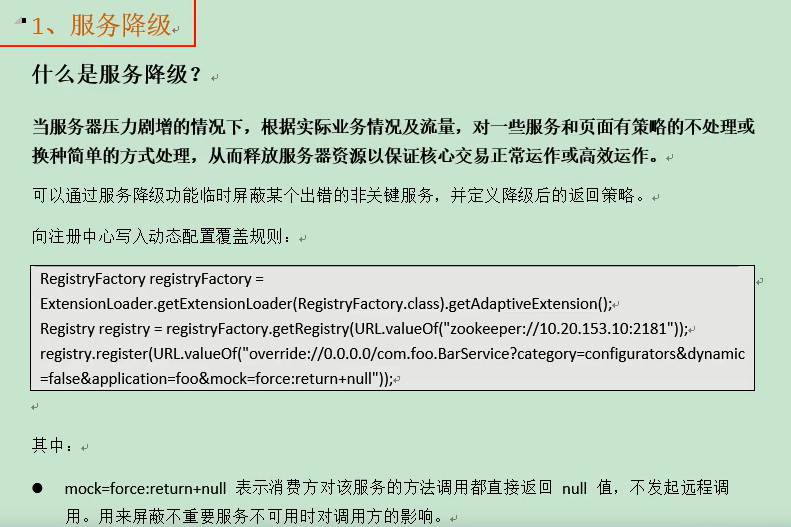


可以通过服务降级功能 [[1\]](http://dubbo.apache.org/zh-cn/docs/user/demos/service-downgrade.html#fn1) 临时屏蔽某个出错的非关键服务，并定义降级后的返回策略。

向注册中心写入动态配置覆盖规则：

```java
RegistryFactory registryFactory = ExtensionLoader.getExtensionLoader(RegistryFactory.class).getAdaptiveExtension();
Registry registry = registryFactory.getRegistry(URL.valueOf("zookeeper://10.20.153.10:2181"));
registry.register(URL.valueOf("override://0.0.0.0/com.foo.BarService?category=configurators&dynamic=false&application=foo&mock=force:return+null"));
```

其中：

- `mock=force:return+null` 表示消费方对该服务的方法调用都直接返回 null 值，不发起远程调用。用来屏蔽不重要服务不可用时对调用方的影响。
- 还可以改为 `mock=fail:return+null` 表示消费方对该服务的方法调用在失败后，再返回 null 值，不抛异常。用来容忍不重要服务不稳定时对调用方的影响。

------

1. `2.2.0` 以上版本支持 [↩︎](http://dubbo.apache.org/zh-cn/docs/user/demos/service-downgrade.html#fnref1)


# 集群容错

 集群容错

在集群调用失败时，Dubbo 提供了多种容错方案，缺省为 failover 重试。


各节点关系：

- 这里的 `Invoker` 是 `Provider` 的一个可调用 `Service` 的抽象，`Invoker` 封装了 `Provider` 地址及 `Service` 接口信息
- `Directory` 代表多个 `Invoker`，可以把它看成 `List<Invoker>` ，但与 `List` 不同的是，它的值可能是动态变化的，比如注册中心推送变更
- `Cluster` 将 `Directory` 中的多个 `Invoker` 伪装成一个 `Invoker`，对上层透明，伪装过程包含了容错逻辑，调用失败后，重试另一个
- `Router` 负责从多个 `Invoker` 中按路由规则选出子集，比如读写分离，应用隔离等
- `LoadBalance` 负责从多个 `Invoker` 中选出具体的一个用于本次调用，选的过程包含了负载均衡算法，调用失败后，需要重选

## 集群容错模式

可以自行扩展集群容错策略，参见：[集群扩展](http://dubbo.apache.org/zh-cn/docs/dev/impls/cluster.html)

### Failover Cluster

失败自动切换，当出现失败，重试其它服务器 [[1\]](http://dubbo.apache.org/zh-cn/docs/user/demos/fault-tolerent-strategy.html#fn1)。通常用于读操作，但重试会带来更长延迟。可通过 `retries="2"` 来设置重试次数(不含第一次)。

重试次数配置如下：

```xml
<dubbo:service retries="2" />
```

或

```xml
<dubbo:reference retries="2" />
```

或

```xml
<dubbo:reference>
    <dubbo:method name="findFoo" retries="2" />
</dubbo:reference>
```

### Failfast Cluster

快速失败，只发起一次调用，失败立即报错。通常用于非幂等性的写操作，比如新增记录。

### Failsafe Cluster

失败安全，出现异常时，直接忽略。通常用于写入审计日志等操作。

### Failback Cluster

失败自动恢复，后台记录失败请求，定时重发。通常用于消息通知操作。

### Forking Cluster

并行调用多个服务器，只要一个成功即返回。通常用于实时性要求较高的读操作，但需要浪费更多服务资源。可通过 `forks="2"` 来设置最大并行数。

### Broadcast Cluster

广播调用所有提供者，逐个调用，任意一台报错则报错 [[2\]](http://dubbo.apache.org/zh-cn/docs/user/demos/fault-tolerent-strategy.html#fn2)。通常用于通知所有提供者更新缓存或日志等本地资源信息。

## 集群模式配置

按照以下示例在服务提供方和消费方配置集群模式

```xml
<dubbo:service cluster="failsafe" />
```

或

```xml
<dubbo:reference cluster="failsafe" />
```

------

1. 该配置为缺省配置 [↩︎](http://dubbo.apache.org/zh-cn/docs/user/demos/fault-tolerent-strategy.html#fnref1)
2. `2.1.0` 开始支持 [↩︎](http://dubbo.apache.org/zh-cn/docs/user/demos/fault-tolerent-strategy.html#fnref2)


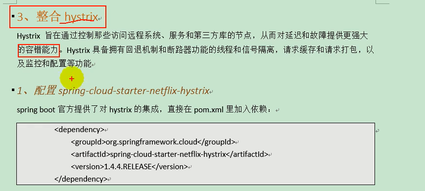

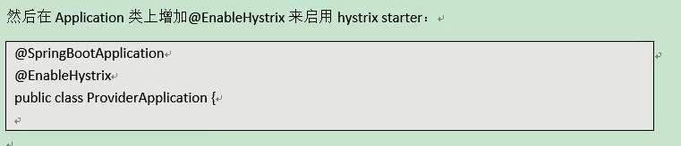

然后再**提供方方法**上加上`@HystrixCommand`

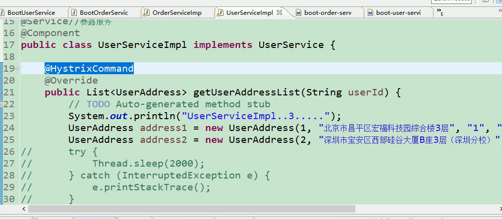

再在消费方方法丧加上`@HystrixCommand(fallbackMethod="hello")`

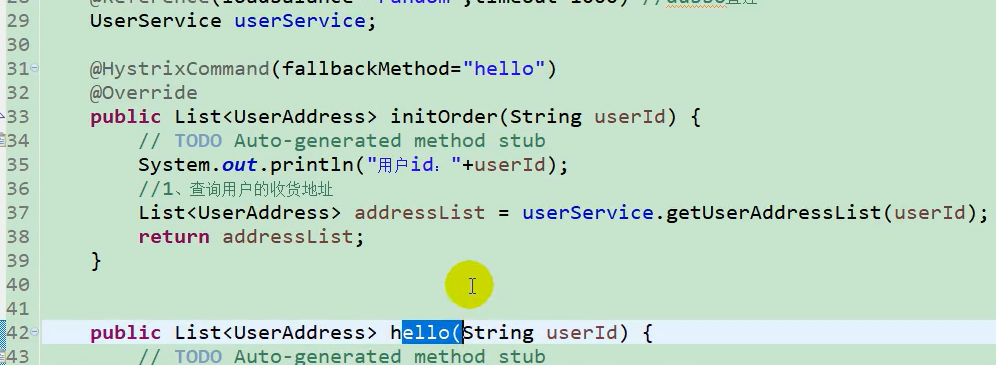

注：hello方法是失败后回调的，比如返回模拟数据


