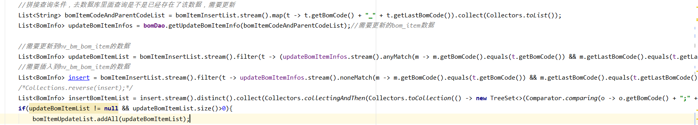

# Stream

参考资料：

- <https://www.cnblogs.com/hdllhd/p/9502662.html>


**中间操作：**

　　1.filter　　过滤掉不符合的数据

　　2.limit　　只取前x条数据

　　3.skip　　跳过（删除）x条数据

　　4.distinct　　去重复数据

　　5.sorted　　排序

　　6.map　　对数据重整，生成新的数据流（如何从用户集合流中取出用户年龄作为新的流）

​	[map和flatmap的介绍](<https://www.cnblogs.com/diegodu/p/8794857.html>)

**终端操作：**

　　1.count　　统计数据数量

　　2.forEach　　对流中每个数据都执行传入的方法

　　3.anyMatch　　至少一个匹配，返回bool

　　4.allMatch　　匹配所有，返回bool

　　5.collect　　可以传入集合中的常用方法，例如：Collector.toList()将流转回集合，Collector.groupingBy()将**流中数据分组**

　　6.reduce　　进行归约操作，例如求和等


#### 我对用法的简要理解

stream() -> map( t -> (...))  -> collect(Collectors.toList())

stream() -> filter(t -> (...))   -> collect(Collectors.toList())


# 应用例子

Wonder 2020/03/17 14:47:00
你要理解函数式接口函数式编程
Wonder 2020/03/17 14:47:08
看具体业务撒，，
Wonder 2020/03/17 14:47:17
有需要filter的就用filter
Wonder 2020/03/17 14:47:35



Wonder 2020/03/17 14:48:24
第一个用lambda把一个集合里面的两个字段用下划线拼接起来，
Wonder 2020/03/17 14:48:58
第二个lambda筛选第一个集合在第二个集合里面存在的数据
Wonder 2020/03/17 14:50:15
这不是一味的使用lambda ，实际业务逻辑需要这么多循环判断


### filter

我要遍历一个List集合，返回其中的某个值的List，返回对象某个属性值List，改怎么写

```java
list.stream().filter(student-> java.util.Objects.nonNull(student)).map(Student::getName).collect(Collectors.toList());
```


### foreach

#### [Java中foreach为什么不能给数组赋值](https://www.zhihu.com/question/36905481)

```
类似于下面情况，a的值没有被修改
int a = 1;
int b = a;
b = 2;
System.out.println(a);

因为每一次loop你只是获得了当前元素的值，却没有获得当前元素在数组中的对象句柄。这样你就无法直接操作对应的句柄。
所以当你想遍历数组并只想获得元素值的时候才用foreach。其他的时候比如想修改数组，或者想获得index的时候就别用foreach。
```

