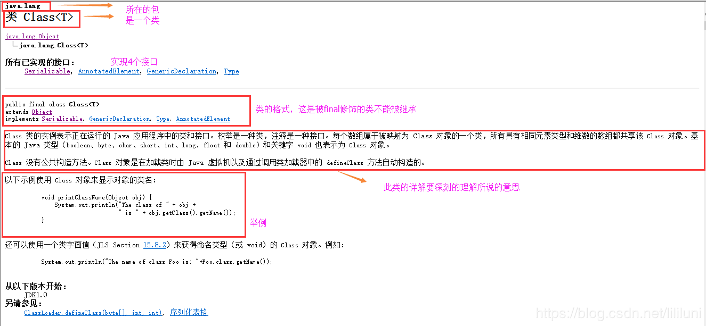

[Java 反射 -超详细讲解（附源码）](<https://blog.csdn.net/lililuni/article/details/83449088?depth_1-utm_source=distribute.pc_relevant.none-task&utm_source=distribute.pc_relevant.none-task>)

### 文章目录

- [1：反射概述](https://blog.csdn.net/lililuni/article/details/83449088?depth_1-utm_source=distribute.pc_relevant.none-task&utm_source=distribute.pc_relevant.none-task#1_4)

- [2：Class对象特点](https://blog.csdn.net/lililuni/article/details/83449088?depth_1-utm_source=distribute.pc_relevant.none-task&utm_source=distribute.pc_relevant.none-task#2Class_9)

- [3：反射的使用](https://blog.csdn.net/lililuni/article/details/83449088?depth_1-utm_source=distribute.pc_relevant.none-task&utm_source=distribute.pc_relevant.none-task#3_22)

- - [1:获取类对象](https://blog.csdn.net/lililuni/article/details/83449088?depth_1-utm_source=distribute.pc_relevant.none-task&utm_source=distribute.pc_relevant.none-task#1_34)
  - [2 利用反射机制创建对象](https://blog.csdn.net/lililuni/article/details/83449088?depth_1-utm_source=distribute.pc_relevant.none-task&utm_source=distribute.pc_relevant.none-task#2__68)
  - [3: 获取成员变量并使用](https://blog.csdn.net/lililuni/article/details/83449088?depth_1-utm_source=distribute.pc_relevant.none-task&utm_source=distribute.pc_relevant.none-task#3___212)
  - [4: 获取成员方法并使用](https://blog.csdn.net/lililuni/article/details/83449088?depth_1-utm_source=distribute.pc_relevant.none-task&utm_source=distribute.pc_relevant.none-task#4___286)
  - [5: 获取main方法并使用](https://blog.csdn.net/lililuni/article/details/83449088?depth_1-utm_source=distribute.pc_relevant.none-task&utm_source=distribute.pc_relevant.none-task#5__main_328)

- [4 : 关于反射的用法举例](https://blog.csdn.net/lililuni/article/details/83449088?depth_1-utm_source=distribute.pc_relevant.none-task&utm_source=distribute.pc_relevant.none-task#4___365)

- - [1:通过反射运行配置文件内容](https://blog.csdn.net/lililuni/article/details/83449088?depth_1-utm_source=distribute.pc_relevant.none-task&utm_source=distribute.pc_relevant.none-task#1_369)
  - [2:通过反射越过泛型检查](https://blog.csdn.net/lililuni/article/details/83449088?depth_1-utm_source=distribute.pc_relevant.none-task&utm_source=distribute.pc_relevant.none-task#2_445)


## 壹：反射概述

​       JAVA反射机制是在运行状态中，对于任意一个类，都能够知道这个类的所有属性和方法；对于任意一个对象，都能够调用它的任意一个方法和属性；这种动态获取的信息以及动态调用对象的方法的功能称为java语言的反射机制。
​     实际上，我们创建的每一个类也都是对象，即类本身是java.lang.Class类的实例对象。这个实例对象称之为类对象，也就是Class对象。

## 贰：Class对象特点



 从图中可以得出以下几点：

- Class 类的实例对象表示**正在运行的 Java 应用程序中的类和接口**。也就是jvm中有很多的实例，每个类都有唯一的Class对象。
- Class 类没有公共构造方法。Class 对象是在加载类时**由 Java 虚拟机自动构造**的。也就是说我们不需要创建，JVM已经帮我们创建了。
- Class 对象用于**提供类本身的信息**，比如有几种构造方法， 有多少属性，有哪些普通方法


## [反射获取 Class](<http://www.10qianwan.com/articledetail/116411.html>)


## 叁:反射的使用

### 1:获取类对象

获取类对象有3种方式

1. `Class.forName（）`（**常用**）
2. `Hero.class`
3. `new Hero().getClass()`

### 2:利用反射机制创建对象

基本步骤
  与传统的通过new 来获取对象的方式不同反射机制，反射会先拿到Hero的**“类对象”**,然后通过类对象获取**“构造器对象”**再通过构造器对象**创建一个对象**，具体步骤：

```
1.获取类对象 Class class = Class.forName("pojo.Hero");
2.获取构造器对象 Constructor con = clazz.getConstructor(形参.class);
3 获取对象 Hero hero =con.newInstance(实参);
```

上面是最简单的获取方法，当Hero的构造方法**不是无参构造方法时**，获取构造器对象略有不同


#### 示例1

```java
//首先拉出类的信息
//Class beanClass = Class.forName(beanDefinition.getClassName());
//List<BeanDefinition.ConstructorArg> args = beanDefinition.getConstructorArgs();
//然后放入List
//Class[] argClasses = new Class[args.size()];
//Object[] argObjects = new Object[args.size()];
//一个个取进来
//argClasses[i] = arg.getType();
//argObjects[i] = arg.getArg();
//最后
bean = beanClass.getConstructor(argClasses).newInstance(argObjects);
//argClasses：参数的类型
//argObjects：参数数据
```


#### 示例2

```java
public class ConstructorTest {
	/*
	 * 通过Class对象可以获取某个类中的：构造方法、成员变量、成员方法；并访问成员；
	 *
	 * 1.获取构造方法：
	 * 		1).批量的方法：
	 * 			public Constructor[] getConstructors()：所有"公有的"构造方法
	            public Constructor[] getDeclaredConstructors()：获取所有的构造方法(包括私有、受保护、默认、公有)

	 * 		2).获取单个的方法，并调用：
	 * 			public Constructor getConstructor(Class... parameterTypes):获取单个的"公有的"构造方法：
	 * 			public Constructor getDeclaredConstructor(Class... parameterTypes):获取"某个构造方法"可以是私有的，或受保护、默认、公有；
	 *
	 * 2.创建对象
	 * 		Constructor对象调用newInstance(Object... initargs)
	 */


    public static void main(String[] args) throws Exception {
        //1.加载Class对象
        Class clazz = Class.forName("pojo.Hero");


        //2.获取所有公有构造方法
        System.out.println("**********************所有公有构造方法*********************************");
        Constructor[] conArray = clazz.getConstructors();
        for(Constructor c : conArray){
            System.out.println(c);
        }


        System.out.println("************所有的构造方法(包括：私有、受保护、默认、公有)***************");
        conArray = clazz.getDeclaredConstructors();
        for(Constructor c : conArray){
            System.out.println(c);
        }

        System.out.println("*****************获取公有、无参的构造方法*******************************");
        Constructor con = clazz.getConstructor(null);
        //1>、因为是无参的构造方法所以类型是一个null,不写也可以：这里需要的是一个参数的类型，切记是类型
        //2>、返回的是描述这个无参构造函数的类对象。
        System.out.println("con = " + con);
        //调用构造方法
        Object obj = con.newInstance();


        System.out.println("******************获取私有构造方法，并调用*******************************");
        con = clazz.getDeclaredConstructor(float.class);
        System.out.println(con);
        //调用构造方法
        con.setAccessible(true);//暴力访问(忽略掉访问修饰符)
        obj = con.newInstance(100);
    }
}
```


## 3: 获取成员变量并使用

**基本步骤**

> 1. 获取HeroPlus类的对象 `new方法/第2章中的方法` h
>
> 2. 获取属性 `Field f1 = h.getDeclaredField("属性名")` 
>
> 3. 修改属性 `f1.set(h，实参)`，注意这里的h是对象，不是类对象


**getField**和**getDeclaredField**的区别

```
getField 只能获取public的，包括从父类继承来的字段。

getDeclaredField 可以获取本类所有的字段，包括private的，但是 不能获取继承来的字段。
(注： 这里只能获取到private的字段，但并不能访问该private字段的值,除非加上setAccessible(true))
```


### 4: 获取成员方法并使用

```java
1.获取HeroPlus类的对象 h
2.获取成员方法：
  public Method getMethod(String name ，Class<?>… parameterTypes):获取"公有方法"；（包含了   父类的方法也包含Object类）
  public Method getDeclaredMethods(String name ，Class<?>… parameterTypes) :获取成员方   法，包括私有的(不包括继承的)
  参数解释：
  name : 方法名；
  Class … : 形参的Class类型对象
调用方法
Method --> public Object invoke(Object obj,Object… args):
参数说明：
  obj : 要调用方法的对象；
  args:调用方式时所传递的实参；
```


### 5: 获取main方法并使用


## 肆：关于反射的用法举例

 反射非常强大，但是从上面的记录来看，反而觉得还不如直接调用方法来的直接和方便[2](https://blog.csdn.net/lililuni/article/details/83449088?depth_1-utm_source=distribute.pc_relevant.none-task&utm_source=distribute.pc_relevant.none-task#fn2)。

通常来说，需要在学习了**Spring 的依赖注入，反转控制**之后，才会对反射有更好的理解，所以先这里举两个例子，来演示一下反射的一种实际运用[3](https://blog.csdn.net/lililuni/article/details/83449088?depth_1-utm_source=distribute.pc_relevant.none-task&utm_source=distribute.pc_relevant.none-task#fn3)。

### 1:通过反射运行配置文件内容

```
//步骤
1.首先准备一个配置文件，就叫做spring.txt吧, 放在src目录下。
里面存放的是类的名称，和要调用的方法名。首先准备一个配置文件，就叫做spring.txt吧, 放在src目录下。里面存放的是类的名称，和要调用的方法名。
2.在测试类Test中，首先取出类名称和方法名，然后通过反射去调用这个方法。
3.当需要从调用第一个业务方法，切换到调用第二个业务方法的时候，不需要修改一行代码，也不需要重新编译，只需要修改配置文件spring.txt，再运行即可。
```


### 2:通过反射越过泛型检查


## [反射源码讲解](https://www.jianshu.com/p/3ea4a6b57f87)

