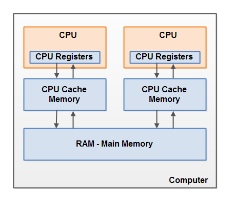
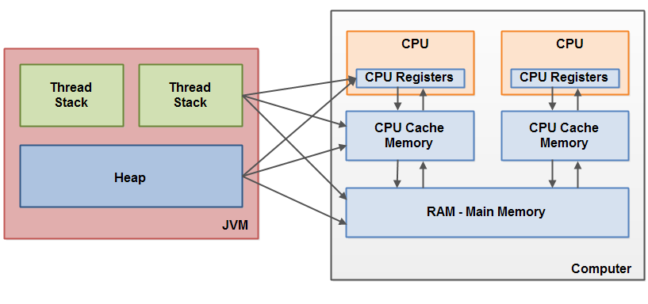
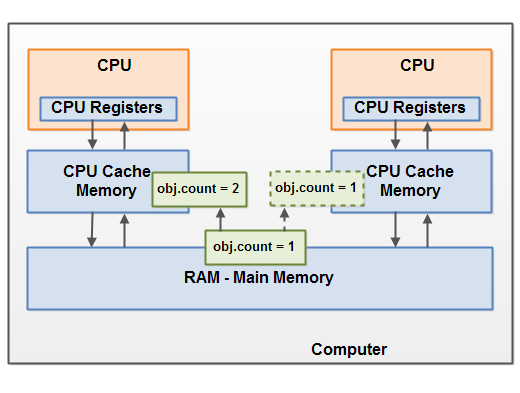
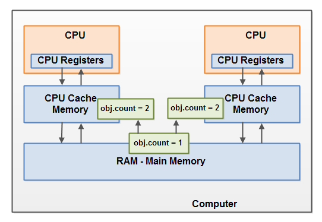

拓展学习

- [面试官：你竟然不知道JMM？JVM和JMM傻傻分不清](<https://mp.weixin.qq.com/s?__biz=MzU1MzE4OTU0OQ==&mid=2247484004&idx=1&sn=40ad451a40dd1dfaac7719f589fc9b77&chksm=fbf7eba6cc8062b05e9d9deddf4b051aecf75c0d1660f24d1f1bd3609f8fddce965789f1dfb6&mpshare=1&scene=23&srcid=&sharer_sharetime=1587962707281&sharer_shareid=e6d90aec84add5cf004cb1ab6979727c#rd>)

- [进程间通信方式+线程间通信方式](https://www.cnblogs.com/fmqdblog/p/10680077.html)


注意区分进程间通信、线程间通信。**进程间通信有共享内存方式，线程间通信是锁机制以及信号量。**

这里是**java内存模型的线程间通信方式**，有共享变量模型


# 正文


- **线程之间的通信方式**

  - 共享变量：线程通信是隐式的，线程同步是显示的
  - 消息传递：线程通信是显示的，线程同步是隐式的

- **JMM定义**：JAVA内存模型（JMM）是JAVA虚拟机在计算机内存（RAM）中的运行方式

- **JMM定义具体**：JAVA并发，线程之间通信采用的是共享变量模型，这里的共享变量模型就是JAVA内存模型（JMM），JMM决定一个线程对共享变量的写入何时对另一个线程可见。

- **JMM描述**：JMM定义了线程和主内存之间的抽象关系：线程之间的共享变量存储在主内存（main memory）中，每个线程都有一个私有的本地内存（local memory），本地内存中存储了该线程以读/写共享变量的副本。本地内存是JMM的一个抽象概念，并不真实存在。它涵盖了缓存，写缓冲区，寄存器以及其他的硬件和编译器优化。

- **JMM中线程通信步骤**

  - 首先，线程A把本地内存A中更新过的共享变量刷新到主内存中去。
  - 然后，线程B到主内存中去读取线程A之前已更新过的共享变量。
  - 从整体来看，这两个步骤实质上是线程A在向线程B发送消息，而且这个通信过程必须要经过主内存。JMM通过**控制主内存与每个线程的本地内存之间的交互**，来为java程序员提供**内存可见性保证**。

- **JVM对于Java内存模型的实现**

  在JVM内部，Java内存模型把内存分成了两部分：线程**栈区**和**堆区**。**栈区**包括**当前线程执行的方法调用相关信息**，还包含了当前方法的所有**本地变量信息**。**堆区**包含了Java应用创建的所有对象信息

  - 本地变量的存储可能情况（其实就是局部变量表···）

    ```
    1. 一个本地变量如果是原始类型，那么它会被完全存储到栈区。 
    2. 一个本地变量也有可能是一个对象的引用，这种情况下，这个本地引用会被存储到栈中，但是对象本身仍然存储在堆区。
    
    3. 对于一个对象的成员方法，这些方法中包含本地变量，仍需要存储在栈区，即使它们所属的对象在堆区。 
    4. 对于一个对象的成员变量，不管它是原始类型还是包装类型，都会被存储到堆区。
    
    5. Static类型的变量以及类本身相关信息都会随着类本身存储在堆区。
    ```

    堆中的对象可以被多线程共享。

- **硬件内存架构**

  

  ​	**我概括下，就是出现类似于线程的本地内存，CPU使用CPU缓存来解决CPU寄存器主存速度差异的问题。**

  ​	现代计算机一般都有2个以上CPU，而且每个CPU还有可能包含多个核心。因此，如果我们的应用是多线程的话，这些线程可能会在各个CPU核心中并行运行。

  在CPU内部有一组CPU寄存器，也就是CPU的储存器。CPU操作寄存器的速度要比操作计算机主存快的多。在主存和CPU寄存器之间还存在一个CPU缓存，CPU操作CPU缓存的速度快于主存但慢于CPU寄存器。某些CPU可能有多个缓存层（一级缓存和二级缓存）。计算机的主存也称作RAM，所有的CPU都能够访问主存，而且主存比上面提到的缓存和寄存器大很多。

  当一个CPU需要访问主存时，会先读取一部分主存数据到CPU缓存，进而在读取CPU缓存到寄存器。当CPU需要写数据到主存时，同样会先flush寄存器到CPU缓存，然后再在某些节点把缓存数据flush到主存。

- **Java内存模型和硬件架构之间的桥接**

  ​	**我的概括：线程有属于自己的（Java虚拟栈，本地方法栈，程序计数器），而每个CPU有属于自己的寄存器，缓存。但硬件内存架构和Java内存模型并不一致，是一个交叉关系。所以会面临两个问题：1.共享对象对各个线程的可见性  2.共享对象的竞争现象**

  ​	正如上面讲到的，Java内存模型和硬件内存架构并不一致。硬件内存架构中并没有区分栈和堆，从硬件上看，不管是栈还是堆，大部分数据都会存到主存中，当然一部分栈和堆的数据也有可能会存到CPU寄存器中，如下图所示，Java内存模型和计算机硬件内存架构是一个交叉关系：

  

  当对象和变量存储到计算机的各个内存区域时，必然会面临一些问题，其中最主要的两个问题是：

  - 共享对象对各个线程的可见性
  - 共享对象的竞争现象

- **共享对象的可见性**

  当多个线程同时操作同一个共享对象时，如果没有合理的使用volatile和synchronization关键字，一个线程对共享对象的更新有可能导致其它线程不可见。

  

  要解决共享对象可见性这个问题，我们可以使用java volatile关键字。 Java’s volatile keyword. volatile 关键字可以**保证变量会直接从主存读取，而对变量的更新也会直接写到主存**。volatile原理是基于CPU**内存屏障指令**实现的，后面会讲到。

- **共享对象的竞争现象**

  如果多个线程共享一个对象，如果它们同时修改这个共享对象，这就产生了竞争现象。

  

  要解决上面的问题我们可以使用java `synchronized`代码块。`synchronized`代码块可以保证同一个时刻只能有一个线程进入代码竞争区，synchronized代码块也能保证代码块中所有变量都将会从主存中读，当线程退出代码块时，对所有变量的更新将会flush到主存，不管这些变量是不是volatile类型的。

- **volatile和 synchronized区别**

  详细请见 [volatile和synchronized的区别](http://blog.csdn.net/suifeng3051/article/details/52611233)


# 支撑Java内存模型的基础原理

### 指令重排序

在执行程序时，为了提高性能，编译器和处理器会对指令做重排序。但是，JMM确保在不同的编译器和不同的处理器平台之上，通过插入特定类型的`Memory Barrier`来禁止特定类型的编译器重排序和处理器重排序，为上层提供一致的内存可见性保证。

1. 编译器优化重排序：编译器在不改变单线程程序语义的前提下，可以重新安排语句的执行顺序。
2. 指令级并行的重排序：如果不存在数据依赖性，处理器可以改变语句对应机器指令的执行顺序。
3. 内存系统的重排序：处理器使用缓存和读写缓冲区，这使得加载和存储操作看上去可能是在乱序执行。

### 数据依赖性

如果两个操作访问同一个变量，其中一个为写操作，此时这两个操作之间存在数据依赖性。 
编译器和处理器不会改变存在数据依赖性关系的两个操作的执行顺序，即不会重排序。

 

### **as-if-serial**

不管怎么重排序，单线程下的执行结果不能被改变，编译器、runtime和处理器都必须遵守as-if-serial语义。

 

### 内存屏障（Memory Barrier ）

上面讲到了，通过内存屏障可以禁止特定类型处理器的重排序，从而让程序按我们预想的流程去执行。内存屏障，又称内存栅栏，是一个CPU指令，基本上它是一条这样的指令：

1. 保证特定操作的执行顺序。
2. 影响某些数据（或则是某条指令的执行结果）的内存可见性。

编译器和CPU能够重排序指令，保证最终相同的结果，尝试优化性能。插入一条Memory Barrier会告诉编译器和CPU：不管什么指令**都不能和这条Memory Barrier指令重排序**。

Memory Barrier所做的另外一件事是**强制刷出各种CPU cache**，如一个`Write-Barrier`（写入屏障）将刷出所有在Barrier之前写入 cache 的数据，因此，任何CPU上的线程都能读取到这些数据的最新版本。

这和java有什么关系？上面java内存模型中讲到的volatile是基于Memory Barrier实现的。

如果一个变量是`volatile`修饰的，JMM会在写入这个字段之后插进一个`Write-Barrier`指令，并在读这个字段之前插入一个`Read-Barrier`指令。这意味着，如果写入一个`volatile`变量，就可以保证：

1. 一个线程写入变量a后，任何线程访问该变量都会拿到最新值。
2. 在写入变量a之前的写入操作，其更新的数据对于其他线程也是可见的。因为Memory Barrier会刷出cache中的所有先前的写入。

### happens-before

从jdk5开始，java使用新的JSR-133内存模型，基于happens-before的概念来阐述操作之间的内存可见性。

在JMM中，如果一个操作的执行结果需要对另一个操作可见，那么这两个操作之间必须要存在happens-before关系，这个的两个操作既可以在同一个线程，也可以在不同的两个线程中。

与程序员密切相关的happens-before规则如下：

1. 程序顺序规则：一个线程中的每个操作，happens-before于该线程中任意的后续操作。
2. 监视器锁规则：对一个锁的解锁操作，happens-before于随后对这个锁的加锁操作。
3. volatile域规则：对一个volatile域的写操作，happens-before于任意线程后续对这个volatile域的读。
4. 传递性规则：如果 A happens-before B，且 B happens-before C，那么A happens-before C。

注意：两个操作之间具有happens-before关系，并不意味前一个操作必须要在后一个操作之前执行！仅仅要求前一个操作的执行结果，对于后一个操作是可见的，且前一个操作按顺序排在后一个操作之前。

 

参考文档 : 
\1. <http://www.infoq.com/cn/articles/java-memory-model-1> 
\2. <http://www.jianshu.com/p/d3fda02d4cae>