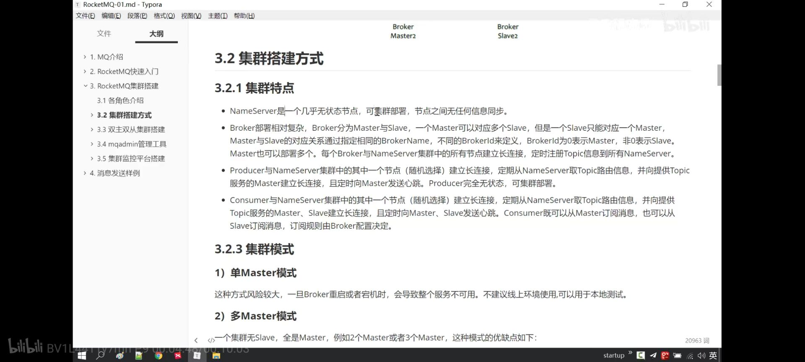
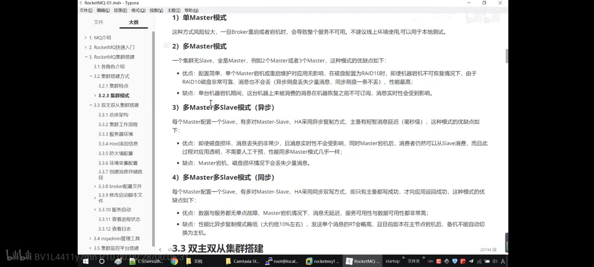

# 参考

- 【入门教程】<http://www.iocoder.cn/RocketMQ/install/?self>
- 【入门教程】<http://www.iocoder.cn/Spring-Boot/RocketMQ/?vip>
- 【入门教程】<http://www.iocoder.cn/RocketMQ/start/spring-boot-example/>
- 【入门教程】<https://blog.csdn.net/qq_27556567/article/details/88845078>
- 【官方-最佳实践】[链接](<https://github.com/apache/rocketmq/blob/master/docs/cn/best_practice.md>)
- 【安装部署】<https://www.360kuai.com/mob/transcoding?url=923ce6f792921bf89>

- 【很好-进阶】<https://blog.csdn.net/weiwoyonzhe/article/details/107799197>


# Spring中消息框架

- Spring Messaging
- SpringCloud Stream

它们都能够与Spring Boot整合并提供了一些参考的实现。和所有的实现框架一样，消息框架的目的是实现轻量级的消息驱动的微服务，可以有效地简化开发人员对消息中间件的使用复杂度，让系统开发人员可以有更多的精力关注于核心业务逻辑的处理


### 1、Spring Messaging

Spring Messaging是Spring Framework 4中添加的模块，是Spring与消息系统集成的一个扩展性的支持。它实现了从基于JmsTemplate的简单的使用JMS接口到异步接收消息的一整套完整的基础架构，Spring AMQP提供了该协议所要求的类似的功能集。 在与Spring Boot的集成后，它拥有了自动配置能力，能够在测试和运行时与相应的消息传递系统进行集成。

单纯对于客户端而言，Spring Messaging提供了一套抽象的API或者说是约定的标准，对消息发送端和消息接收端的模式进行规定，不同的消息中间件提供商可以在这个模式下提供自己的Spring实现：在消息发送端需要实现的是一个XXXTemplate形式的Java Bean，结合Spring Boot的自动化配置选项提供多个不同的发送消息方法；在消息的消费端是一个XXXMessageListener接口（实现方式通常会使用一个注解来声明一个消息驱动的POJO），提供回调方法来监听和消费消息，这个接口同样可以使用Spring Boot的自动化选项和一些定制化的属性。

如果有兴趣深入的了解Spring Messaging及针对不同的消息产品的使用，推荐阅读这个文件。参考Spring Messaging的既有实现，RocketMQ的spring-boot-starter中遵循了相关的设计模式并结合RocketMQ自身的功能特点提供了相应的API(如，顺序，异步和事务半消息等)。

### 2、Spring Cloud Stream

Spring Cloud Stream结合了Spring Integration的注解和功能，它的应用模型如下：


Spring Cloud Stream框架中提供一个独立的应用内核，它通过输入(@Input)和输出(@Output)通道与外部世界进行通信，消息源端(Source)通过输入通道发送消息，消费目标端(Sink)通过监听输出通道来获取消费的消息。这些通道通过专用的Binder实现与外部代理连接。开发人员的代码只需要针对应用内核提供的固定的接口和注解方式进行编程，而不需要关心运行时具体的Binder绑定的消息中间件。在运行时，Spring Cloud Stream能够自动探测并使用在classpath下找到的Binder。

这样开发人员可以轻松地在相同的代码中使用不同类型的中间件：仅仅需要在构建时包含进不同的Binder。在更加复杂的使用场景中，也可以在应用中打包多个Binder并让它自己选择Binder，甚至在运行时为不同的通道使用不同的Binder。

Binder抽象使得Spring Cloud Stream应用可以灵活的连接到中间件，加之Spring Cloud Stream使用利用了Spring Boot的灵活配置配置能力，这样的配置可以通过外部配置的属性和Spring Boo支持的任何形式来提供（包括应用启动参数、环境变量和application.yml或者application.properties文件），部署人员可以在运行时动态选择通道连接destination（例如，Kafka的topic或者RabbitMQ的exchange）。

Binder SPI的方式来让消息中间件产品使用可扩展的API来编写相应的Binder，并集成到Spring Cloud Steam环境，目前RocketMQ还没有提供相关的Binder，我们计划在下一步将完善这一功能，也希望社区里有这方面经验的同学积极尝试，贡献PR或建议。

**目前仅支持RabbitMQ、Kafka。**

### 3、区别

参考：<https://blog.csdn.net/cold___play/article/details/104985725>

#### 设计理念

**标准MQ：**


- 生产者/消费者之间靠消息媒介传递信息内容（Message）
- 消息必须走特定通道（MessageChannel）
- 消息通道里的消息如何被消费，谁负责收发处理（消息通道MessageChannel的子接口SubscribableChannel，由MessageHandler消息处理器所订阅）

**引入Cloud Stream：**
比如说我们用到了RabbitMQ和Kafka，由于这两个消息中间件的架构上的不同，像RabbitMQ有exchange，kafka有Topic和Partitions分区

这些中间件的差异性导致实际项目开发造成了一定的困扰，如果使用两个消息队列的其中一种，后面的业务需求，我们想往另一种消息队列进行迁移，这时候无疑就是一个灾难性的，一大堆东西都要重新推到重新做，因为它和我们的系统耦合了，这时候springcloud stram提供了一种解耦合的方式。

**统一底层差异：**

在没有绑定器这个概念的情况下，SpringBoot应用要直接与消息中间件进行信息交互的时候，由于各消息中间件构建的初衷不同，他们的实现细节上会有较大的差异性。通过定义绑定器作为中间层，完美地实现了应用程序与消息中间件细节之间的隔离。通过向应用程序暴露统一的Channel通道，使得应用程序不需要再考虑各种不同的消息中间件实现。

### Binder

Stream对消息中间件的进一步封装，可以做到代码层面对中间件的无感知，甚至于动态的切换中间件，使得微服务开发的高度解耦，服务可以关注更多自己的业务流程。


- input对应于消费者
- output对应于生产者
- stream中的消息通信方式遵循了发布-订阅模式（Topic主题进行广播）
  - RabbitMQ：Exchange
  - Kakfa：Topic


# 整体流程


- 1、启动 **Namesrv**，Namesrv起 来后监听端口，等待 Broker、Producer、Consumer 连上来，相当于一个路由控制中心。

- 2、**Broker** 启动，跟所有的 Namesrv 保持长连接，定时发送心跳包。

  > 心跳包中，包含当前 Broker 信息(IP+端口等)以及存储所有 Topic 信息。 注册成功后，Namesrv 集群中就有 Topic 跟 Broker 的映射关系。

  - 3、收发消息前，先创建 Topic 。创建 Topic 时，需要指定该 Topic 要存储在哪些 Broker上。也可以在发送消息时自动创建Topic。

- 4、**Producer** 发送消息。

  > 启动时，先跟 Namesrv 集群中的其中一台建立长连接，并从Namesrv 中获取当前发送的 Topic 存在哪些 Broker 上，然后跟对应的 Broker 建立长连接，直接向 Broker 发消息。

- 5、**Consumer** 消费消息。

  > Consumer 跟 Producer 类似。跟其中一台 `Namesrv` 建立长连接，获取当前订阅 Topic 存在哪些 Broker 上，然后直接跟 Broker 建立连接通道，开始消费消息。


# Topic、Producer、Consumer

关系：

- 一个消费者分组对应一个线程池

- **消费者组的消费者实例必须订阅完全相同的 Topic + Tag** 

- 一个Topic对应**多个消费者分组**

  > 集群消费（Clustering）：集群消费模式下，相同 Consumer Group 的每个 Consumer 实例平均分摊消息。

  - 也就是说，如果我们发送一条 Topic 为 `"DEMO_01"` 的消息，可以分别被 `"demo01-A-consumer-group-DEMO_01"` 和 `"demo01-consumer-group-DEMO_01"` 都消费一次。

  - 但是，如果我们启动两个该示例的实例，则消费者分组 `"demo01-A-consumer-group-DEMO_01"` 和 `"demo01-consumer-group-DEMO_01"` 都会有多个 Consumer 示例。此时，我们再发送一条 Topic 为 `"DEMO_01"` 的消息，只会被 `"demo01-A-consumer-group-DEMO_01"` 的一个 Consumer 消费一次，也同样只会被 `"demo01-A-consumer-group-DEMO_01"` 的一个 Consumer 消费一次。

  - 通过**集群消费**的机制，我们可以实现针对相同 Topic ，不同消费者分组实现各自的业务逻辑。例如说：用户注册成功时，发送一条 Topic 为 `"USER_REGISTER"` 的消息。然后，不同模块使用不同的消费者分组，订阅该 Topic ，实现各自的拓展逻辑：

    - 积分模块：判断如果是手机注册，给用户增加 20 积分。
    - 优惠劵模块：因为是新用户，所以发放新用户专享优惠劵。
    - 站内信模块：因为是新用户，所以发送新用户的欢迎语的站内信。
    - … 等等

    这样，我们就可以将注册成功后的业务拓展逻辑，实现业务上的解耦，未来也更加容易拓展。同时，也提高了注册接口的性能，避免用户需要等待业务拓展逻辑执行完成后，才响应注册成功。


# 集群特点

简单来说就是高可用


🦅 **1. Producer**

- 1、Producer 自身在应用中，所以**无需考虑高可用**。
- 2、Producer **配置多个 `Namesrv` 列表**，从而保证 Producer 和 `Namesrv` 的连接高可用。并且，会从 `Namesrv` 定时拉取最新的 Topic 信息。
- 3、Producer 会和所有 Consumer 直连，在发送消息时，会**选择一个 Broker** 进行发送。如果发送失败，则会使用另外一个 Broker 。
- 4、Producer 会定时**向 Broker 心跳**，证明其存活。而 Broker 会定时检测，判断是否有 Producer 异常下线。

🦅 **2. Consumer**

- 1、Consumer **需要部署多个节点**，以保证 Consumer 自身的高可用。当相同消费者分组中有新的 Consumer 上线，或者老的 Consumer 下线，会重新分配 Topic 的 Queue 到目前消费分组的 Consumer 们。
- 2、Consumer **配置多个 `Namesrv` 列表**，从而保证 Consumer 和 `Namesrv` 的连接高可用。并且，会从 Consumer 定时拉取最新的 Topic 信息。
- 3、Consumer 会**和所有 Broker 直连**，消费相应分配到的 Queue 的消息。如果消费失败，则会发回消息到 Broker 中。
- 4、Consumer 会定时向 Broker 心跳，证明其存活。而 Broker 会定时检测，判断是否有 Consumer 异常下线。

🦅 **3. Namesrv**

- 1、Namesrv 需要部署多个节点，以保证 Namesrv 的高可用。
- 2、Namesrv 本身是无状态，不产生数据的存储，是通过 Broker 心跳将 Topic 信息同步到 Namesrv 中。
- 3、多个 Namesrv 之间不会有数据的同步，是通过 Broker 向多个 Namesrv 多写。

🦅 **4. Broker**

- 1、多个 Broker 可以形成一个 Broker 分组。每个 Broker 分组存在一个 Master 和多个 Slave 节点。
  - Master 节点，可提供读和写功能。Slave 节点，可提供读功能。
  - Master 节点会不断发送新的 CommitLog 给 Slave节点。Slave 节点不断上报本地的 CommitLog 已经同步到的位置给 Master 节点。
  - Slave 节点会从 Master 节点拉取消费进度、Topic 配置等等。
- 2、多个 Broker 分组，形成 Broker 集群。
  - Broker 集群和集群之间，不存在通信与数据同步。
- 3、Broker 可以配置同步刷盘或异步刷盘，根据消息的持久化的可靠性来配置。




# 消息方式

- Producer 发送**顺序**消息，Consumer **顺序**消费消息
- Producer 发送**定时**消息
- Producer **批量**发送消息
- Producer 发送**事务**消息

- Consumer **广播**和**集群**消费消息


# 集群模式




# 消息的存储的理解


消息存储架构图中主要有下面三个跟消息存储相关的文件构成。

(1) CommitLog：消息主体以及元数据的存储主体，存储Producer端写入的消息主体内容,消息内容不是定长的。单个文件大小默认1G ，文件名长度为20位，左边补零，剩余为起始偏移量，比如00000000000000000000代表了第一个文件，起始偏移量为0，文件大小为1G=1073741824；当第一个文件写满了，第二个文件为00000000001073741824，起始偏移量为1073741824，以此类推。消息主要是顺序写入日志文件，当文件满了，写入下一个文件；


(2) ConsumeQueue：消息消费队列，引入的目的主要是提高消息消费的性能，由于RocketMQ是基于主题topic的订阅模式，消息消费是针对主题进行的，如果要遍历commitlog文件中根据topic检索消息是非常低效的。Consumer即可根据ConsumeQueue来查找待消费的消息。其中，ConsumeQueue（逻辑消费队列）作为消费消息的索引，保存了指定Topic下的队列消息在CommitLog中的起始物理偏移量offset，消息大小size和消息Tag的HashCode值。consumequeue文件可以看成是基于topic的commitlog索引文件，故consumequeue文件夹的组织方式如下：topic/queue/file三层组织结构，具体存储路径为：$HOME/store/consumequeue/{topic}/{queueId}/{fileName}。同样consumequeue文件采取定长设计，每一个条目共20个字节，分别为8字节的commitlog物理偏移量、4字节的消息长度、8字节tag hashcode，单个文件由30W个条目组成，可以像数组一样随机访问每一个条目，每个ConsumeQueue文件大小约5.72M；


拓展：RocketMQ 利用 mmap 将文件直接映射到用户态内存地址，由此将对文件的 IO 转化为对内存的 IO。

(3) IndexFile：IndexFile（索引文件）提供了一种可以通过topic、key或时间区间来查询消息的方法。Index文件的存储位置是：KaTeX parse error: Undefined control sequence: \store at position 6: HOME \̲s̲t̲o̲r̲e̲\index{fileName}，文件名fileName是以创建时的时间戳命名的，固定的单个IndexFile文件大小约为400M，一个IndexFile可以保存 2000W个索引，IndexFile的底层存储设计为在文件系统中实现HashMap结构，故rocketmq的索引文件其底层实现为hash索引。


存储机制参考：

[RocketMQ高性能之底层存储设计](https://mp.weixin.qq.com/s/yd1oQefnvrG1LLIoes8QAg)


### NameServer内部的数据结构

- topicQueueTable 维护了 Topic 和其对应消息队列的映射关系，QueueData 记录了一条队列的元信息：所在 Broker、读队列数量、写队列数量等。
- brokerAddrTable 维护了 Broker Name 和 Broker 元信息的映射关系，Broker 通常以 Master-Slave 架构部署，BrokerData 记录了同一个 Broker Name 下所有节点的地址信息。
- clusterAddrTable 维护了 Broker 的集群信息。
- brokerLiveTable 维护了 Broker 的存活信息。NameServer 在收到来自 Broker 的心跳消息后，更新 BrokerLiveInfo 中的 lastUpdateTimestamp，如果 NameServer 长时间未收到 Broker 的心跳信息，NameServer 就会将其移除。
- filterServerTable 用于消息过滤。


### RocketMQ的事务消息是如何

**Half Message(半消息)是指暂不能被Consumer消费的消息**。Producer 已经把消息成功发送到了 Broker 端，但此消息被标记为`暂不能投递`状态，处于该种状态下的消息称为半消息。需要 Producer对消息的`二次确认`后，Consumer才能去消费它。

**消息回查，由于网络闪段，生产者应用重启等原因。导致 Producer 端一直没有对 Half Message(半消息) 进行 二次确认。这是Brock**服务器会定时扫描`长期处于半消息的消息`，会主动询问 **Producer**端 该消息的最终状态(**Commit或者Rollback**),该消息即为 **消息回查**。


1. A服务先发送个Half Message给Brock端，消息中携带 B服务 即将要+100元的信息。
2. 当A服务知道Half Message发送成功后，那么开始第3步执行本地事务。
3. 执行本地事务(会有三种情况1、执行成功。2、执行失败。3、网络等原因导致没有响应)
4. 如果本地事务成功，那么Product像Brock服务器发送Commit,这样B服务就可以消费该message。
5. 如果本地事务失败，那么Product像Brock服务器发送Rollback,那么就会直接删除上面这条半消息。
6. 如果因为网络等原因迟迟没有返回失败还是成功，那么会执行`RocketMQ`的回调接口,来进行事务的回查。


# 消息堆积能力


# 消息可靠性理解


# 同步刷盘和异步刷盘


# 应用场景

- 解耦
- 异步
- 削峰

[参考链接](<https://mp.weixin.qq.com/s?__biz=MzIwMTY0NDU3Nw==&mid=2651941919&idx=2&sn=17f732aee7dcd5550bde7659f6d09ea3&chksm=8d0f0351ba788a476edf56858da4814d28cfdd441c2ca8809487747a16798760a46c76138c52&mpshare=1&scene=23&srcid=&sharer_sharetime=1586398599969&sharer_shareid=e6d90aec84add5cf004cb1ab6979727c#rd>)


# 缺点

- 系统的可用性降低
- 系统的复杂性提高
  - 保证消息没有重复消费？
  - 如何保证消息不丢失？
  - 怎么保证消息传递的顺序？
- 一致性问题


# 解决报错

- [full disk](<https://blog.csdn.net/qq_35251168/article/details/99694293?utm_medium=distribute.pc_aggpage_search_result.none-task-blog-2~all~first_rank_v2~rank_v25-3-99694293.nonecase>)

- [full disk2(rocketmq-client日志保存路径问题)](<https://blog.csdn.net/LYM0721/article/details/105257703>)

- [full disk3(报错原因)](<http://www.46caipu.com/diary/article/articleDetail.html?articleId=10>)

# 常用命令

参见：https://www.cnblogs.com/gmq-sh/p/6232633.html

- 删除Topic

  ```
  mqadmin deleteTopic –n 127.0.0.1:9876 –c DefaultCluster –t topicWarning
  ```

- [清空MQ消息的方法](<https://blog.csdn.net/jenny8080/article/details/53467536>)

  - 停止[rocketmq](http://lovesoo.org/tag/rocketmq)

    可以使用kill -9 命令强制停止[rocketmq](http://lovesoo.org/tag/rocketmq)进程

  - 删除rocketmq日志

    **rm -rf /root/logs/rocketmqlogs/\***

  - 删除rocketmq中topic等信息

    **rm -rf /root/store/\***

  - [可选] 手工[清空](http://lovesoo.org/tag/%E6%B8%85%E7%A9%BA)MQ里剩余的topic，示例命令如下：

    ```sh
    cd alibaba-rocketmq/bin
    
    sh mqadmin topicList -n 192.168.1.167:9876
    
    sh mqadmin deleteTopic -c HOSTNAME -n 192.168.1.167:9876 -t orderTopic
    
    ```

  - 重新启动rocketmq，示例命令如下：

    ```sh
    cd alibaba-rocketmq/bin
    
    nohup sh mqnamesrv -n 192.168.1.167:9876 > /dev/null 2>&1 &
    
    nohup sh mqbroker -n 192.168.1.167:9876 > /dev/null 2>&1 &
    ```

    

#  接入阿里云

在阿里云上，提供消息队列 [RocketMQ](https://help.aliyun.com/product/29530.html) 服务。那么，我们是否能够使用 RocketMQ-Spring 实现阿里云 RocketMQ 的消息的发送与消费呢？

答案是**可以**。在 [《阿里云 —— 消息队列 MQ —— 开源 Java SDK 接入说明》](https://help.aliyun.com/document_detail/128602.html) 中，提到目前开源的 Java SDK 可以接入阿里云 RocketMQ 服务。

> 如果您已使用开源 Java SDK 进行生产，只需参考方法，重新配置参数，即可实现无缝上云。
>
> **前提条件**
>
> - 已在阿里云 MQ 控制台创建资源，包括 Topic、Group ID（GID）、接入点（Endpoint），以及 AccessKeyId 和 AccessKeySecret。
> - 已下载开源 RocketMQ 4.5.1 或以上版本，以支持连接阿里云 MQ。

这里，艿艿创建了 [lab-31-rocketmq-ons](https://github.com/YunaiV/SpringBoot-Labs/tree/master/lab-31/lab-31-rocketmq-ons) 示例项目，使用 RocketMQ-Spring 接入阿里云。重点的差异，就在 [`application.yaml`](https://github.com/YunaiV/SpringBoot-Labs/blob/master/lab-31/lab-31-rocketmq-ons/src/main/resources/application.yaml) 配置文件，配置如下：

```
# rocketmq 配置项，对应 RocketMQProperties 配置类
rocketmq:
  name-server: http://onsaddr.mq-internet-access.mq-internet.aliyuncs.com:80 # 阿里云 RocketMQ Namesrv
  access-channel: CLOUD # 设置使用阿里云
  # Producer 配置项
  producer:
    group: GID_PRODUCER_GROUP_YUNAI_TEST # 生产者分组
    access-key: # 设置阿里云的 RocketMQ 的 access key ！！！这里涉及到隐私，所以这里艿艿没有提供
    secret-key: # 设置阿里云的 RocketMQ 的 secret key ！！！这里涉及到隐私，所以这里艿艿没有提供
```

- 重点，就是设置了 `rocketmq.access-channel=CLOUD` ，访问阿里云 RocketMQ 服务。

剩余的部分，和 [「3. 快速入门」](http://www.iocoder.cn/Spring-Boot/RocketMQ/?vip#) 都是一致的。胖友可以自行看看 [lab-31-rocketmq-ons](https://github.com/YunaiV/SpringBoot-Labs/tree/master/lab-31/lab-31-rocketmq-ons) 示例项目。

如果胖友在使用阿里云的话，建议量级较小的情况下，可以考虑先使用 [阿里云 —— 消息队列 MQ 服务](https://help.aliyun.com/product/29530.html) 。毕竟搭建一个高可用的 RocketMQ 量主两从的集群，最最最起码要两个 ECS 节点。同时，需要一定的维护和监控成本。😈 我们目前有个项目，就是直接使用阿里云的消息队列服务。

消息队列是非常重要的组件，推荐阅读下 RocketMQ 的最佳实践：

- [《阿里云 —— 消息队列 MQ 服务 —— 最佳实践》](https://help.aliyun.com/document_detail/95837.html)
- [《RocketMQ 官方文档 —— 最佳实践》](https://github.com/apache/rocketmq/blob/master/docs/cn/best_practice.md)