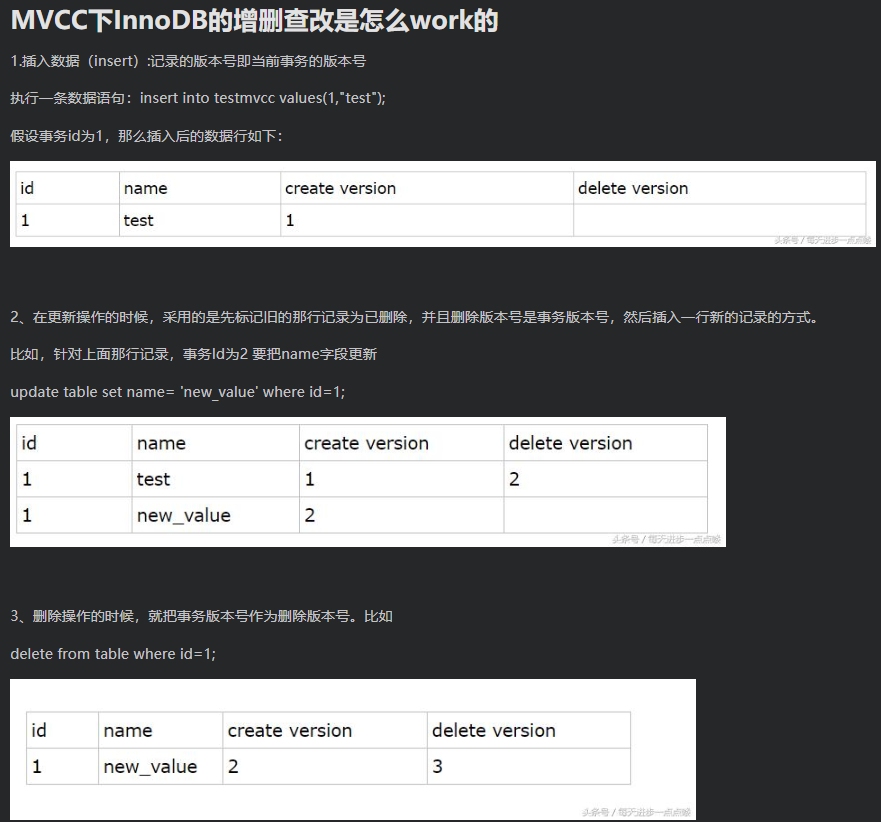

- [你能说说事务的几个特性是啥？有哪几种隔离级别？](<http://www.imooc.com/article/300601>)

- [Spring、SpringBoot、Redis、Mysql 事务管理机制汇总](https://blog.csdn.net/yuzongtao/article/details/84784252)

- 【好！！】[mysql的锁已经学了挺多了，事务的使用还得看看练练](https://blog.csdn.net/qq_38997379/article/details/89017287
  https://www.cnblogs.com/lsqbk/p/10145306.html)

- [面试官：你说对MySQL事务很熟？那我问你10个问题](<https://mp.weixin.qq.com/s?__biz=MzU2NDg0OTgyMA==&mid=2247486058&idx=2&sn=63c3162393d42c96216d37ebb711edb7&chksm=fc45f799cb327e8fb419dd236464ac41339ce7f2b37a4c8db28043b30ca78f172c5c62c70fa7&mpshare=1&scene=23&srcid=&sharer_sharetime=1585851914237&sharer_shareid=e6d90aec84add5cf004cb1ab6979727c#rd>)

- [手撕 MySQL 事务，发生了什么？](<https://mp.weixin.qq.com/s?__biz=MzI2OTQ4OTQ1NQ==&mid=2247488424&idx=3&sn=18bc46c1dd1e03a6b11d82121ce46ae5&chksm=eaded7e8dda95efe98c4dbd8ca0fb4fc26f1028f4d102e460565453e6bec4ce32ff561519093&mpshare=1&scene=23&srcid=&sharer_sharetime=1588012784766&sharer_shareid=e6d90aec84add5cf004cb1ab6979727c#rd>)


# 原理

- [Mysql的事务实现原理](<https://mp.weixin.qq.com/s?__biz=MzAwMjk5Mjk3Mw==&mid=2247488589&idx=4&sn=f3272cdac926a055c7502dd7ba7faaa5&chksm=9ac0aa6fadb723793bd3210d7f07ce66b95b3460e3b76fc41a048653357618f13b856f07b97c&mpshare=1&scene=23&srcid=&sharer_sharetime=1586050539295&sharer_shareid=e6d90aec84add5cf004cb1ab6979727c#rd>)
- [MySQL 中 ACID 底层内部实现原理详解](<https://mp.weixin.qq.com/s?__biz=MzI5NjcxNzU2MA==&mid=2247484013&idx=1&sn=6264c826dcdc8bd4c3b381a3707d7af0&chksm=ec415ffadb36d6ec51181a5f291d2062338c0ae32d522d335d7ef3b9bd69daf98ffb8d18c95e&mpshare=1&scene=23&srcid=&sharer_sharetime=1585011697632&sharer_shareid=e6d90aec84add5cf004cb1ab6979727c#rd>)
- [MVCC的使用及原理](<https://blog.csdn.net/w2064004678/article/details/83012387>)


# 总结

- 原子性：**使用 `undo log（回滚日志）`** ，从而达到回滚
- 持久性：**使用 `redo log（重做日志）`**，从而达到故障后恢复
- 隔离性：使用**锁以及MVCC**,运用的优化思想有读写分离，读读并行，读写并行
- 一致性：通过**回滚**，以及**恢复**，和在并发环境下的**隔离**做到一致性。


# 隔离性-MVCC

**MVCC** (`MultiVersion Concurrency Control`) 叫做多版本并发控制。

**InnoDB的 MVCC ，是通过在每行记录的后面保存两个隐藏的列来实现的**。

这两个列，一个保存了**行的创建时间**，一个保存了**行的过期时间**。

当然存储的并不是实际的时间值，而是系统版本号。每开始新的事务，系统版本号都会自动递增。事务开始时刻的系统版本号会作为事务的版本号，用来和查询每行记录的版本号进行比较。

客观上，我们认为他就是乐观锁的一整实现方式，就是每行都有版本号，保存时根据版本号决定是否成功。

### 基本特征

- 每行数据都存在一个版本，每次数据更新时都更新该版本。
- 修改时Copy出当前版本随意修改，各个事务之间无干扰。
- 保存时比较版本号，如果成功（commit），则覆盖原记录；失败则放弃copy（rollback）（其实还有一列称为回滚指针，用于事务回滚）

### MVCC下CRUD的运行机制

见[MVCC的使用及原理](<https://blog.csdn.net/w2064004678/article/details/83012387>)的例子



#### 4、查询操作：

从上面的描述可以看到，在查询时要符合以下两个条件的记录才能被事务查询出来：

1) 删除版本号未指定或者大于当前事务版本号，即查询事务开启后确保读取的行未被删除。(即上述事务id为2的事务查询时，依然能读取到事务id为3所删除的数据行)

2) 创建版本号 小于或者等于 当前事务版本号 ，就是说记录创建是在当前事务中（等于的情况）或者在当前事务启动之前的其他事物进行的insert。

（即事务id为2的事务只能读取到create version<=2的已提交的事务的数据集）

> #### 补充：
>
> 1.MVCC手段只适用于Msyql隔离级别中的读已提交（Read committed）和可重复读（Repeatable Read）.
>
> 注：
>
> ​	- 可重复度是在事务开始的时候生成一个当前事务全局性的快照
>
> ​	- 读提交是每次执行语句的时候都重新生成一次快照
>
> 2.Read uncimmitted由于存在脏读，即能读到未提交事务的数据行，所以不适用MVCC.
>
> 原因是MVCC的创建版本和删除版本只要在事务提交后才会产生。
>
> 3.串行化由于是会对所涉及到的表加锁，并非行锁，自然也就不存在行的版本控制问题。
>
> 4.通过以上总结，可知，MVCC主要作用于事务性的，有行锁控制的数据库模型。


# 隔离性下出现的问题

| 隔离级别 | 脏读   | 不可重复读 | 幻读   |
| -------- | ------ | ---------- | ------ |
| 读未提交 | 可能   | 可能       | 可能   |
| 读提交   | 不可能 | 可能       | 可能   |
| 可重复读 | 不可能 | 不可能     | 可能   |
| 串行化   | 不可能 | 不可能     | 不可能 |

- 读未提交下：**脏读**（一个事务回滚，另一个事务读了他回滚前的值）

  **可能会导致脏读、幻读或不可重复读**

- 读提交：**不可重复读**（事务期间，有其他事物提交，更新）

  **可以阻止脏读，但是幻读或不可重复读仍有可能发生**

- 可重复读：会**幻读**（可重复度并当前读情况下，幻读后次读到了新插入的数据）

  **可以阻止脏读和不可重复读，但幻读仍有可能发生**

  幻读解释：<https://www.jianshu.com/p/c53c8ab650b5>

  ```
  幻读(phantom read)
  前提条件：InnoDB引擎，可重复读隔离级别，使用当前读时。
  表现：一个事务(同一个read view)在前后两次查询同一范围的时候，后一次查询看到了前一次查询没有看到的行。两点需要说明：
  　　1、在可重复读隔离级别下，普通查询是快照读，是不会看到别的事务插入的数据的，幻读只在当前读下才会出现。
  　　2、幻读专指新插入的行，读到原本存在行的更新结果不算。因为当前读的作用就是能读到所有已经提交记录的最新值。
  幻读的影响
  会造成一个事务中先产生的锁，无法锁住后加入的满足条件的行。
  产生数据一致性问题，在一个事务中，先对符合条件的目标行做变更，而在事务提交前有新的符合目标条件的行加入。这样通过binlog恢复的数据是会将所有符合条件的目标行都进行变更的。
  幻读产生的原因
  行锁只能锁住行，即使把所有的行记录都上锁，也阻止不了新插入的记录。
  如何解决幻读
  将两行记录间的空隙加上锁，阻止新记录的插入；这个锁称为间隙锁。
  间隙锁与间隙锁之间没有冲突关系。跟间隙锁存在冲突关系的，是往这个间隙中插入一个记录这个操作。
  
  作者：慧鑫coming
  链接：https://www.jianshu.com/p/c53c8ab650b5
  来源：简书
  著作权归作者所有。商业转载请联系作者获得授权，非商业转载请注明出处。
  ```

  MySQL可重复读的隔离级别中并不是完全解决了幻读的问题，而是解决了读数据情况下的幻读问题。而对于修改的操作依旧存在幻读问题，就是说MVCC对于幻读的解决时不彻底的。（**因为两个事物两个update，当前读机制**）参考：<https://www.cnblogs.com/liyus/p/10556563.html>

  ```
  数据的一致性倒是没有被破坏。可重复读的隔离级别下使用了MVCC机制，select操作不会更新版本号，是快照读（历史版本）；insert、update和delete会更新版本号，是当前读（当前版本）。
  ```

- 串行化


