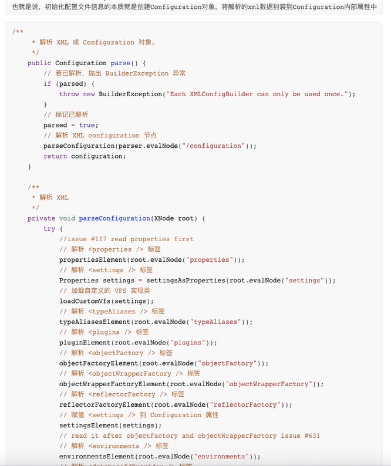
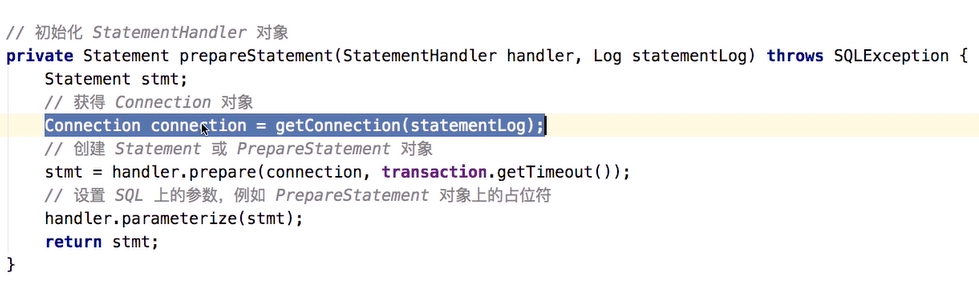

# chap1：整体架构


其余见chap1文件夹


# chap2：初始化

初始化

```java
@Test
public void test1() throws IOException {
    //1.读取配置文件，都成字节输入流，注意：现在还没解析
    InputStream resourceAsStream = Resources.getResourceAsStream("sqlMapconfig.xml");

    //2.解析配置文件，封装Configuration对象， 创建DefaultSqlSessionFactory对象
    SqlSessionFactory factory = new SqlSessionFactoryBuilder().build(resourceAsStream);

}
```

进入建造者模式的SqlsessionFactory的build方法：


SqlsessionFactory的build方法需要参数Configuration，

Configuration通过XMLConfigBuilder创建，

具体代码见截图和如下：




都是把指定的XmlDocument其中的Xnode，加载到Configuration里;

注意：`<select />`等标签封装成**mapedStatement**对象也加载到conguration

到这里，**SessionFactory**创建完毕


# Chap3 执行sql流程

简单介绍**SqlSession**

- 两个实现类

  - DefaultSqlsession
  - SqlSessionManager

- Sqlsession的创建和使用

  ```java
  @Test
  public void test1() throws IOException {
  //1.读取配置文件，都成字节输入流，注意：现在还没解析
  InputStream resourceAsStream = Resources.getResourceAsStream("sqlMapconfig.xml");
  
  //2.解析配置文件，封装Configuration对象， 创建DefaultSqlSessionFactory对象
  SqlSessionFactory factory = new SqlSessionFactoryBuilder().build(resourceAsStream);
  
  //3.生产了DeafultSqlsession实例对象， 设置了事务的不自动提交，完成了executor对象的创建
  SqlSession sqlSession = factory.openSession();
  
  //4.（1）根据传递的statementid来从Configuration中map集合中获取到了指定的MappedStatement对象
  //  （2）将查询任务委派给了executor执行器
  List<Object> objects = sqlSession.selectList("namespace.id");
  }
  ```

  

# chap4  Executor

Executor的query方法，先根据传入参数生成动态sql和缓存key

然后查询是否有缓存，有的话处理后返回

没的话查询


查询时记得加占位符


通过Configuration创建StatementHandler对象

然后由`StatementHandler.query`方法执行来完成查询

**所以查询的实际完成者为`StatementHandler`**


其中`StatementHandler.query`方法参数Statement的由来：



由`handler.prepare`方法获得，查其源码逻辑

注：

- 创建Connection对象

- 创建的是Statement或者Preparestatement

  - 如果是Statement，是通过`connection.createStatement()`获取的

    ```java
        //JDBCConnection的
    	public synchronized Statement createStatement() throws SQLException {
            this.checkClosed();
            int var1 = ResultProperties.getValueForJDBC(1003, 1007, this.rsHoldability);
            JDBCStatement var2 = new JDBCStatement(this, var1);
            return var2;
        }
    ```

  - 如果是prepareStatement，是通过c`onnection.prepareStatement(sql, keyColumnNames)`获取的

    ```java
        //JDBCConnection的
    	public synchronized PreparedStatement prepareStatement(String var1, String[] var2) throws SQLException {
            this.checkClosed();
    
            try {
                return new JDBCPreparedStatement(this, var1, 1003, 1007, this.rsHoldability, 11, (int[])null, var2);
            } catch (HsqlException var4) {
                throw JDBCUtil.sqlException(var4);
            }
        }
    ```


# chap5：StatementHandler

### 第一步：设置Statement参数

在执行`handler.query(stmt, resultHandler)`之前，

已经在`prepareStatement`方法里调用`handler.parameterize(stmt)`方法**设置好了sql上的参数**

- SimpleStatementHandler上

  ```java
    @Override
    public void parameterize(Statement statement) {
      // N/A
    }
  ```

- PrepareStatementHandler上

  ```java
    @Override
    public void parameterize(Statement statement) throws SQLException {
      parameterHandler.setParameters((PreparedStatement) statement);
    }
  ```

  还是通过**parameterHandler**完成的

  **比如`PrepareStatement`对象上的占位符参数赋值**

  `parameterHandler.setParameters`的逻辑如下

  - ①遍历BoundSql的遍历 ParamaterMapping数组
  - ②获得每个ParameterMapping对象的propertyName和value
  - ③获得 typeHandler、jdbcType 属性（typeHandler、JdbcType）
  - ④设置 ？ 占位符


### 第二步：执行查询

在`PreparementStatementHandler`中

```java
  @Override
  public <E> List<E> query(Statement statement, ResultHandler resultHandler) throws SQLException {
    PreparedStatement ps = (PreparedStatement) statement;
    // 执行查询
    ps.execute();
    // 处理结果返回
    return resultSetHandler.handleResultSets(ps);
  }
```


### 第三步：处理结果返回

`ResultSetHandler.handleResultSets`方法的逻辑：

- 创建用于返回的`multipleResults`

- 获得首个 ResultSet 对象， 并封装成 ResultSetMapper 对象

- 获得ResultMap数组

  - 获得ResultMap对象

  - 处理ResultSet，将结果添加到 `multipartResults`中
  - 获得下一个ResultSet对象，封装成 ResultSetMapper 对象


核心方法为处理ResultSet，**函数handleResultSet**

逻辑大致是：

- 创建DefaultResulthandler对象
- 处理ResultSet的每一行
- 添加结果到multipleResults


# chap6: Mapper代理


### Mapper的加载

首先关注SqlSessionFactory的build时，传的参Configuration对应的方法

```java
XMLConfigBuilder.parse()
```

其中

parse()->parseConfiguration()->mapperElement(root.evalNode("mappers"));进入

**mapperElement()函数逻辑：**

- 如果是包名

  - 获得包名

  - 添加到 Configuration 中

    - 扫描包下所有的Mapper接口，并逐个添加到MapperRegistry（addMapper）
    - **MapperRegistry**下维护了Mapper.class到MapperProxyFactory的Mapper代理工厂映射集合
    - 一个Mapper接口对应一个MapperProxyFactory，初始化时加入元素

    ```java
    //private final Map<Class<?>, MapperProxyFactory<?>> knownMappers = new HashMap<>();
    
    public <T> void addMapper(Class<T> type) {
        if (type.isInterface()) {
          if (hasMapper(type)) {
            throw new BindingException("Type " + type + " is already known to the MapperRegistry.");
          }
          boolean loadCompleted = false;
          try {
            knownMappers.put(type, new MapperProxyFactory<>(type));
            // It's important that the type is added before the parser is run
            // otherwise the binding may automatically be attempted by the
            // mapper parser. If the type is already known, it won't try.
            MapperAnnotationBuilder parser = new MapperAnnotationBuilder(config, type);
            parser.parse();
            loadCompleted = true;
          } finally {
            if (!loadCompleted) {
              knownMappers.remove(type);
            }
          }
        }
    ```

- 如果是类

  - 获得resource、url、class属性
  - 对于相对于类路径的资源引用
    - 获得 resource 的InputStream 对象
    - 创建 XMLMapperBuilder对象
    - 执行解析

- 如果是类且使用完全资源限定资源定位符（URL）

  - TODO


### getMapper

```java
@SuppressWarnings("unchecked")
public <T> T getMapper(Class<T> type, SqlSession sqlSession) {
    // 获得MapperProxyFactory对象
    final MapperProxyFactory<T> mapperProxyFactory = (MapperProxyFactory<T>) knownMappers.get(type);
    // 不存在，则抛出 BindingException
    if (mapperProxyFactory == null) {
        throw new BindingException("Type " + type + " is not known to the MapperRegistry.");
    }
    // 通过动态代理工厂生成实例
    try {
        return mapperProxyFactory.newInstance(sqlSession);
    } catch (Exception e) {
        throw new BindingException("Error getting mapper instance. Cause: " + e, e);
    }
}	
```

里面通过反射生成对应的代理Mapper类

```java
//mapperProxyFactory.java  
  protected T newInstance(MapperProxy<T> mapperProxy) {
    return (T) Proxy.newProxyInstance(mapperInterface.getClassLoader(), new Class[] { mapperInterface }, mapperProxy);
  }

  public T newInstance(SqlSession sqlSession) {
    final MapperProxy<T> mapperProxy = new MapperProxy<>(sqlSession, mapperInterface, methodCache);
    return newInstance(mapperProxy);
  }
```

注意Proxy.newProxyInstance的参数，**其中`mapperProxy`继承了InvokeHandler**，实现了具体的代理方法


# chap7:  MapperProxy

`**mapperProxy`继承了InvokeHandler**


### Invoke()

- 如果是 Object 定义的方法，直接调用

- 如果不是，反射调用

  ```
  constructor.newInstance(...).bindTo(proxy).invokeWithArguments(args);
  ```

- 获得 MapperMethod 对象，调用executor

  ```java
  mapperMethod.execute(sqlSession, args)
  ```


### Execute()

- **进入`mapperMethod.execute(sqlSession, args)`方法**

- **execute方法真正调用的，还是Sqlsession的crud方法**

函数逻辑：

- 判断mapper中的方法类型，找到对应处理代码

- 转换参数
- 执行查询，转换rowCount


返回值为List,进入对应的处理函数

```java
private <E> Object executeForMany(SqlSession sqlSession, Object[] args) {
    List<E> result;
    // 转换参数
    Object param = method.convertArgsToSqlCommandParam(args);
    // 执行 SELECT 操作
    if (method.hasRowBounds()) {
      RowBounds rowBounds = method.extractRowBounds(args);
      result = sqlSession.<E>selectList(command.getName(), param, rowBounds);
    } else {
      result = sqlSession.<E>selectList(command.getName(), param);
    }
    // issue #510 Collections & arrays support
    if (!method.getReturnType().isAssignableFrom(result.getClass())) {
      if (method.getReturnType().isArray()) {
        return convertToArray(result);
      } else {
        return convertToDeclaredCollection(sqlSession.getConfiguration(), result);
      }
    }
    return result;
  }
```


# 设计模式


