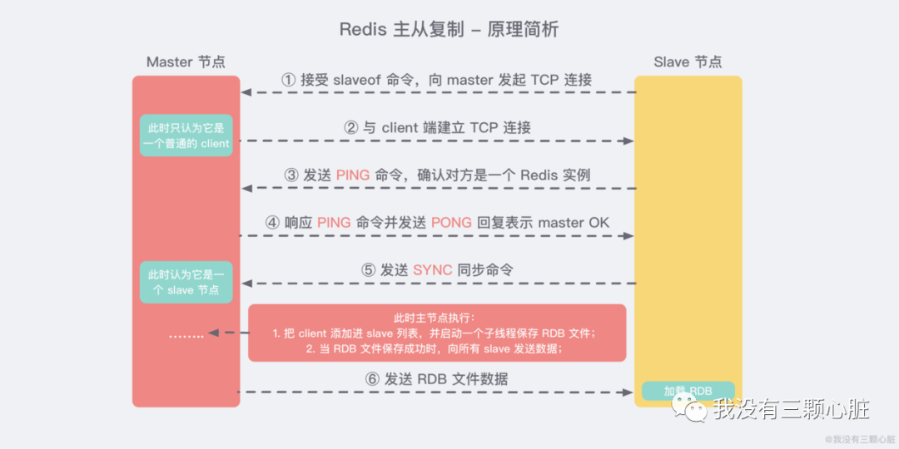

- [开发实例](<https://blog.csdn.net/weixin_40245787/article/details/87858380>)
- [Redis(9)——史上最强【集群】入门实践教程](<https://mp.weixin.qq.com/s?__biz=MzUyMTg0NDA2Ng==&mid=2247484047&idx=1&sn=9b8a62d204ed82805a997878500eef16&chksm=f9d5a682cea22f94a10b3e1d302a2b98079a0c4e72049283b3e9a34e541b4a4aa79bc0a0970d&mpshare=1&scene=23&srcid=&sharer_sharetime=1584442284935&sharer_shareid=d7c138aa61a00ac90a6c312cd2cf97f7#rd>)
- [快速搭建分布式缓存 Redis 集群](<https://mp.weixin.qq.com/s?__biz=MzAwMjk5Mjk3Mw==&mid=2247488638&idx=4&sn=a7798c04ed93147f170ba1ffdde28293&chksm=9ac0aa5cadb7234a1314030daea4da0293096ea2b1e8e0bf7104e5db71de32e5089ca20dfd74&mpshare=1&scene=23&srcid=&sharer_sharetime=1586748062388&sharer_shareid=e6d90aec84add5cf004cb1ab6979727c#rd>)
- [Redis Cluster数据分片机制](<https://mp.weixin.qq.com/s?__biz=Mzg2NjE5NDQyOA==&mid=2247483761&idx=1&sn=f3bbbe8daa995900ce2adfd4c25ef8c4&scene=19#wechat_redirect>)
- [敖丙归纳的](<https://mp.weixin.qq.com/s?__biz=MzAwNDA2OTM1Ng==&mid=2453141850&idx=2&sn=1aaae4eb3e72b958d1f45877b783e56d&chksm=8cf2dbd9bb8552cfe03119a4938809c5afe7a3b3af2ecc60178e87025bda2715f59721b7ecbd&mpshare=1&scene=23&srcid=&sharer_sharetime=1586419323975&sharer_shareid=e6d90aec84add5cf004cb1ab6979727c#rd>)

- [cluster扩容](<https://blog.csdn.net/xinzun/article/details/78520986>)

- [Redis面试汇总](<https://mp.weixin.qq.com/s?__biz=MzAwNDA2OTM1Ng==&mid=2453141850&idx=2&sn=1aaae4eb3e72b958d1f45877b783e56d&chksm=8cf2dbd9bb8552cfe03119a4938809c5afe7a3b3af2ecc60178e87025bda2715f59721b7ecbd&mpshare=1&scene=23&srcid=&sharer_sharetime=1586419323975&sharer_shareid=e6d90aec84add5cf004cb1ab6979727c&client=tim&ADUIN=635257243&ADSESSION=1593395645&ADTAG=CLIENT.QQ.5603_.0&ADPUBNO=26933#rd>)


### 主从复制的主要作用

- **数据冗余：** 主从复制实现了数据的热备份，是持久化之外的一种数据冗余方式。
- **故障恢复：** 当主节点出现问题时，可以由从节点提供服务，实现快速的故障恢复 *(实际上是一种服务的冗余)*。
- **负载均衡：** 在主从复制的基础上，配合读写分离，可以由主节点提供写服务，由从节点提供读服务 *（即写 Redis 数据时应用连接主节点，读 Redis 数据时应用连接从节点）*，分担服务器负载。尤其是在写少读多的场景下，通过多个从节点分担读负载，可以大大提高 Redis 服务器的并发量。
- **高可用基石：** 除了上述作用以外，主从复制还是哨兵和集群能够实施的 **基础**，因此说主从复制是 Redis 高可用的基础


### 同步机制

有主从同步，从从同步。

Redis第一次同步时，主节点做一次**bgsave**（通过从节点发送**psync**命令给主节点），待完成后将RDB文件全量同步到复制节点。

后续的增量数据通过**AOF日志同步**即可，有点类似数据库的binlog。




## 哨兵模式了解吗？


*上图* 展示了一个典型的哨兵架构图，它由两部分组成，哨兵节点和数据节点：

- **哨兵节点：** 哨兵系统由一个或多个哨兵节点组成，哨兵节点是特殊的 Redis 节点，不存储数据；
- **数据节点：** 主节点和从节点都是数据节点；

在复制的基础上，哨兵实现了 **自动化的故障恢复** 功能，下方是官方对于哨兵功能的描述：

- **监控（Monitoring）：** 哨兵会不断地检查主节点和从节点是否运作正常。
- **自动故障转移（Automatic failover）：** 当 **主节点** 不能正常工作时，哨兵会开始 **自动故障转移操作**，它会将失效主节点的其中一个 **从节点升级为新的主节点**，并让其他从节点改为复制新的主节点。
- **配置提供者（Configuration provider）：** 客户端在初始化时，通过连接哨兵来获得当前 Redis 服务的主节点地址。
- **通知（Notification）：** 哨兵可以将故障转移的结果发送给客户端。

其中，监控和自动故障转移功能，使得哨兵可以及时发现主节点故障并完成转移。而配置提供者和通知功能，则需要在与客户端的交互中才能体现。


### 是否使用过Redis集群，集群的高可用怎么保证，集群的原理是什么？

**Redis Sentinal** 着眼于高可用，在master宕机时会自动将slave提升为master，继续提供服务。

**Redis Cluster** 着眼于扩展性，在单个redis内存不足时，使用Cluster进行分片存储。


### 高可用

来看 Redis 的高可用。Redis 支持主从同步，提供 Cluster 集群部署模式，通过 Sentine l哨兵来监控 Redis 主服务器的状态。当主挂掉时，在从节点中根据一定策略选出新主，并调整其他从 slaveof 到新主。

选主的策略简单来说有三个：

- slave 的 priority 设置的越低，优先级越高；
- 同等情况下，slave 复制的数据越多优先级越高；
- 相同的条件下 runid 越小越容易被选中。

在 Redis 集群中，sentinel 也会进行多实例部署，sentinel 之间通过 Raft 协议来保证自身的高可用。

Redis Cluster 使用**分片机制**，在内部分为 **16384 个 slot 插槽**，分布在所有 master 节点上，每个 master 节点负责一部分 slot。数据操作时按 key 做 CRC16 来计算在哪个 slot，由哪个 master 进行处理。数据的冗余是通过 slave 节点来保障。


### Redis cluster的扩容机制

我一开始并没有整理好思路，只从Redis cluster的slot迁移说起了一些操作。然后面试官说扩容过程中会存在key的hash找节点错误问题。然后我才开始说数据迁移时的全量迁移-》增量双写-》集群原子切换-》二次读-》读切换 问题。。应该是这个思路吧。。

> 作者：Monica2333
>
> 链接：https://www.jianshu.com/p/3e678dec60a8


# 基本命令

概括   从节点  设置 `slave of  ip port`，  哨兵设置  `sentinel moniter mymaster ip port 2`

#### 设置从节点

```shell
# 在 6380 端口的 Redis 实例中使用控制台
redis-cli -p 6380
# 成为本地 6379 端口实例的从节点
127.0.0.1:6380> SLAVEOF 127.0.0.1ø 6379
OK
```

### **主从节点配置文件并启动**

```shell
#redis-master.conf
port 6379
daemonize yes
logfile "6379.log"
dbfilename "dump-6379.rdb"
```

### **创建哨兵节点配置文件并启动**

```shell
# redis-sentinel-1.conf
port 26379
daemonize yes
logfile "26379.log"
sentinel monitor mymaster 127.0.0.1 6379 2
```

### 哨兵启动

```shell
redis-server /usr/local/redis-5.0.3/redis-sentinel-1.conf --sentinel
```

