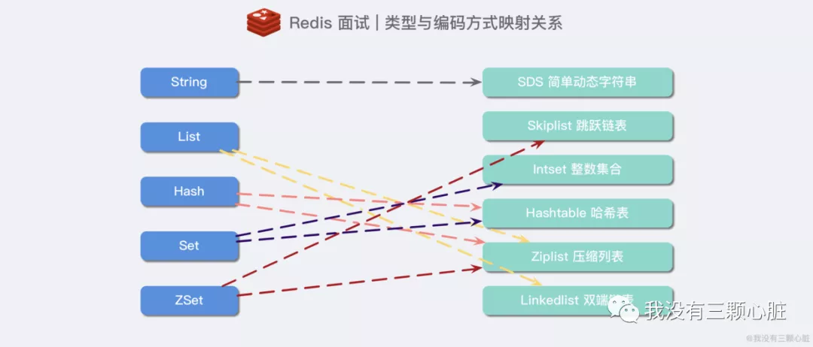

### 那小伙子，我再问你，Redis有哪些数据结构呀？

**String**、**Hash**、**List**、**Set**、**SortedSet**。

**这里我相信99%的读者都能回答上来Redis的5个基本数据类型。如果回答不出来的小伙伴我们就要加油补课哟，大家知道五种类型最适合的场景更好。**

但是，如果你是Redis中高级用户，而且你要在这次面试中突出你和其他候选人的不同，还需要加上下面几种数据结构**HyperLogLog、Geo、Pub/Sub**。

如果你还想加分，那你说还玩过**Redis Module**，像**BloomFilter，RedisSearch，Redis-ML，**这个时候面试官得眼睛就开始发亮了，心想这个小伙子**有点东西啊**。

**注：本人在面试回答到Redis相关的问题的时候，经常提到BloomFilter（布隆过滤器）这玩意的使用场景是真的多，而且用起来是真的香，原理也好理解，看一下文章就可以在面试官面前侃侃而谈了。**


### 贼牛文章

- [HyperLogLog学习](<https://mp.weixin.qq.com/s?__biz=MzUyMTg0NDA2Ng==&mid=2247484012&idx=1&sn=3624989d388d17331e1f7ad78fc7a257&chksm=f9d5a661cea22f7781ed997d05afee8f28da52a0013691961915a2831780e481ae94b6e9a1ae&scene=21#wechat_redirect>)
- [Redis最终章](<https://mp.weixin.qq.com/s?__biz=MzAwNDA2OTM1Ng==&mid=2453140980&idx=4&sn=5cfd9331f198e930b0fdb5eebf4f16c3&chksm=8cf2d777bb855e6199a77f7bdf6844fb236d610e9cb8297b1f49bb12ab5768dc6a4c0ab22432&mpshare=1&scene=23&srcid=0321lJ2wcp6b7lJBZQTsk5OX&sharer_sharetime=1584732608673&sharer_shareid=e6d90aec84add5cf004cb1ab6979727c#rd>)





# 基本数据类型

- **String**的实际应用场景比较广泛的有

  - 缓存功能
  - 计数器
  - 共享用户Session

  Redis采用了C语言，自己构建了`动态字符串（SDS）`的抽象类型。

  [学习链接](<https://mp.weixin.qq.com/s?__biz=MzAwNDA2OTM1Ng==&mid=2453144083&idx=1&sn=9a20b8370fb7017d5c4a94da94ba0f63&chksm=8cfd2090bb8aa986f33143e19ddab165abdf465518a8566da99e1158a21af0c90ad66ddef737&mpshare=1&scene=23&srcid=&sharer_sharetime=1593392664447&sharer_shareid=e6d90aec84add5cf004cb1ab6979727c#rd>)

  SDS的结构：

  ```java
  struct sdshdr{
   int len;
   int free;
   char buf[];
  }
  ```

  

  

  - 计数方式不同（O(1)）
  - 杜绝缓冲区溢出（"\0"不会误删，长度不够扩容）
  - 减少修改字符串时带来的内存重分配次数
    - 空间预分配
    - 惰性空间释放
  - 二进制安全

- **Hash**

  使用场景不多，存对象

- **List**

  **List** 是有序列表，这个还是可以玩儿出很多花样的。

  - 可以通过 **List** 存储一些列表型的数据结构，类似**粉丝列表、文章的评论列表**之类的东西。

  - 可以通过 **lrange** 命令，读取某个闭区间内的元素，可以基于 **List** 实现分页查询，这个是很棒的一个功能，基于 **Redis** 实现简单的高性能分页，可以做类似微博那种下拉不断分页的东西，性能高，就一页一页走。**文章列表或者数据分页展示的应用。**

  - 可以搞个简单的消息队列，从 **List** 头怼进去，从 **List** 屁股那里弄出来。

    **消息队列：Redis**的链表结构，可以轻松实现阻塞队列，可以使用左进右出的命令组成来完成队列的设计。比如：数据的生产者可以通过**Lpush**命令从左边插入数据，多个数据消费者，可以使用**BRpop**命令阻塞的“抢”列表尾部的数据。

- **Set**

  **Set** 是无序集合，会自动去重的那种。

  可以基于 **Set** 玩儿交集、并集、差集的操作，比如交集吧，我们可以把两个人的好友列表整一个交集，看看俩人的共同好友是谁？对吧。

- **Sorted Set**

  **Sorted set** 是排序的 **Set**，去重但可以排序，写进去的时候给一个分数，自动根据分数排序。

  - 排行榜：有序集合经典使用场景。例如视频网站需要对用户上传的视频做排行榜，榜单维护可能是多方面：按照时间、按照播放量、按照获得的赞数等。微博热搜榜，就是有个后面的热度值，前面就是名称。
  - 用**Sorted Sets**来做带权重的队列，比如普通消息的score为1，重要消息的score为2，然后工作线程可以选择按score的倒序来获取工作任务。让重要的任务优先执行。


# HyperLoglog

[HyperLoglog参考链接](<https://mp.weixin.qq.com/s?__biz=MzUyMTg0NDA2Ng==&mid=2247484012&idx=1&sn=3624989d388d17331e1f7ad78fc7a257&chksm=f9d5a661cea22f7781ed997d05afee8f28da52a0013691961915a2831780e481ae94b6e9a1ae&scene=21#wechat_redirect>)

**HyperLogLog** 是最早由 Flajolet 及其同事在 2007 年提出的一种 **估算基数的近似最优算法**。（通俗点来说，就是估计set数据的size）

使用set，B树，Bitmap，内存消耗都还挺大，所以使用概率统计的数据结构。

概率算法 **不直接存储** 数据集合本身，通过一定的 **概率统计方法预估基数值**。

- 初步—原理

  我们给定一系列的随机整数，**记录下低位连续零位的最大长度 K**，即为图中的 `maxbit`，**通过这个 K 值我们就可以估算出随机数的数量 N**。来探究一下 `K` 和 `N` 之间的关系。会发现 `K` 和 `N` 的对数之间存在显著的线性相关性：**N 约等于 2^k**

- 更近一步：分桶平均

  采用1024个桶去估计，采用了 **调和平均数**，能有效地平滑离群值的影响。

- Redis 中的 HyperLogLog 实现

  在 Redis 的 HyperLogLog 实现中，用的是 **16384** 个桶，即：2^14。总共占用内存就是：**(214) x 6 / 8** *(每个桶 6 bit，而这么多桶本身要占用 16384 bit，再除以 8 转换成 KB)*,算出来的结果就是 `12 KB`。

- ### HyperLogLog 的使用

  **HyperLogLog** 提供了两个指令 `PFADD` 和 `PFCOUNT`，字面意思就是一个是增加，另一个是获取计数。`PFADD` 和 `set` 集合的 `SADD` 的用法是一样的，来一个用户 ID，就将用户 ID 塞进去就是，`PFCOUNT` 和 `SCARD` 的用法是一致的


# 布隆过滤器

[参考链接](<https://mp.weixin.qq.com/s?__biz=MzUyMTg0NDA2Ng==&mid=2247484022&idx=1&sn=a98c479b4cac96c6af45f219a7c0bde4&chksm=f9d5a67bcea22f6d03b30ce8660f3f3ded294390fd394e138a40a439d0f96d56c8dda2082203&scene=21#wechat_redirect>)

解决缓存穿透、还有解决推送去重

当布隆过滤器说某个值存在时，这个值 **可能不存在**；当它说不存在时，那么 **一定不存在**。

- 好吧其实**应用场景**如下：
  - 大数据判断是否存在
  - 解决缓存穿透
  - 爬虫/邮箱等系统的过滤

- 过滤流程：

  向布隆过滤器查查询 `key` 是否存在时，跟 `add` 操作一样，会把这个 `key` 通过相同的多个 `hash` 函数进行运算，查看 **对应的位置** 是否 **都** 为 `1`，**只要有一个位为 0**，那么说明布隆过滤器中这个 `key` 不存在。如果这几个位置都是 `1`，并不能说明这个 `key` 一定存在，只能说极有可能存在，因为这些位置的 `1` 可能是因为其他的 `key` 存在导致的。

- 使用注意点

  - 使用时 **不要让实际元素数量远大于初始化数量**；
  - 当实际元素数量超过初始化数量时，应该对布隆过滤器进行 **重建**，重新分配一个 `size` 更大的过滤器，再将所有的历史元素批量 `add` 进行；

- ### 布隆过滤器的使用

  布隆过滤器有两个基本指令，`bf.add` 添加元素，`bf.exists` 查询元素是否存在，它的用法和 set 集合的 `sadd` 和 `sismember` 差不多。注意 `bf.add` 只能一次添加一个元素，如果想要一次添加多个，就需要用到 `bf.madd` 指令。同样如果需要一次查询多个元素是否存在，就需要用到 `bf.mexists` 指令。


# 发布/订阅与Stream

[参考链接](<https://mp.weixin.qq.com/s?__biz=MzUyMTg0NDA2Ng==&mid=2247484039&idx=1&sn=99866e4cc6c842dc6d50d68a362d53a8&chksm=f9d5a68acea22f9cf6d972c23809520137957bd26ce7e6c6cb4f4ed11ddcbbc9938c1a56eb46&mpshare=1&scene=23&srcid=&sharer_sharetime=1584867901552&sharer_shareid=e6d90aec84add5cf004cb1ab6979727c#rd>)

我们虽然可以使用一个 `list` 列表结构结合 `lpush` 和 `rpop` 来实现消息队列的功能，但是似乎很难实现实现 **消息多播** 的功能。

为了支持消息多播，**Redis** 不能再依赖于那 5 种基础的数据结构了，它单独使用了一个模块来支持消息多播，这个模块就是 **PubSub**，也就是 **PublisherSubscriber** *(发布者/ 订阅者模式)*即观察者模式。

- 快速体验

  ```python
  # 订阅频道：
  SUBSCRIBE channel [channel ....]   # 订阅给定的一个或多个频道的信息
  PSUBSCRIBE pattern [pattern ....]  # 订阅一个或多个符合给定模式的频道
  # 发布频道：
  PUBLISH channel message  # 将消息发送到指定的频道
  # 退订频道：
  UNSUBSCRIBE [channel [channel ....]]   # 退订指定的频道
  PUNSUBSCRIBE [pattern [pattern ....]]  #退订所有给定模式的频道
  ```

  

- **更为强大的 Stream** | 持久化的发布/订阅系统

  **Redis Stream** 从概念上来说，就像是一个 **仅追加内容** 的 **消息链表**，把所有加入的消息都一个一个串起来，每个消息都有一个唯一的 ID 和内容，这很简单，让它复杂的是从 Kafka 借鉴的另一种概念：**消费者组(Consumer Group)** *(思路一致，实现不同)*

  - **Consumer Group**：消费者组，可以简单看成记录流状态的一种数据结构。消费者既可以选择使用 `XREAD` 命令进行 **独立消费**，也可以多个消费者同时加入一个消费者组进行 **组内消费**。同一个消费者组内的消费者共享所有的 Stream 信息，**同一条消息只会有一个消费者消费到**，这样就可以应用在分布式的应用场景中来保证消息的唯一性。


