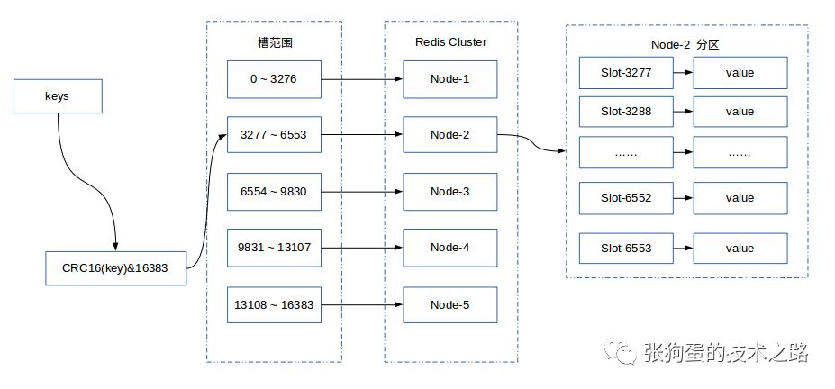

- 方法二，redistemplate默认存类是hset，所以用lua预先mysql存值到redis比较麻烦。
  现在还是方法一吧，直接存取个map操作，配合mysql批量到redis。之后MongoDB了用方法二，直接对类
- RedisTemplate lettuce 实现分布式锁
- [学习一下分布式锁 尝试手写 基于lettuce](<https://blog.csdn.net/qq_36559868/article/details/98174986?utm_source=distribute.pc_relevant.none-task>)
- [SpringBoot2与Redisson 分布式锁与消息订阅代码实现](<https://www.jianshu.com/p/49be974faf5e>)
- [Redis 分布式锁的前世今生](<https://blog.csdn.net/weixin_45132238/article/details/93617905?utm_source=distribute.pc_relevant.none-task>)
- [Java中的锁原理、锁优化、CAS、AQS](<https://mp.weixin.qq.com/s?__biz=MzI2OTQ4OTQ1NQ==&mid=2247487982&idx=2&sn=e02303bab7a3ffe462fbd6ff779e6ac4&chksm=eaded5aedda95cb87ee6140d9e9f0d94c1bd2d977d7e028991ecc79869653f0aa0d817569457&mpshare=1&scene=23&srcid=&sharer_sharetime=1583059275113&sharer_shareid=e6d90aec84add5cf004cb1ab6979727c#rd>)
- [Redis的一些“锁”事](<https://mp.weixin.qq.com/s?__biz=MzAxNjk4ODE4OQ==&mid=2247488675&idx=2&sn=8b80ea7a833d47ec21da93a7217e5789&chksm=9bed35d1ac9abcc794431c2174c776edf3695d2f5c64982036f204cfb6ce21059c541dd0576b&mpshare=1&scene=23&srcid=&sharer_sharetime=1587379892957&sharer_shareid=e6d90aec84add5cf004cb1ab6979727c#rd>)
- [关于分布式锁原理的一些学习与思考：redis分布式锁，zookeeper分布式锁](<https://mp.weixin.qq.com/s?__biz=MzI2OTQ4OTQ1NQ==&mid=2247488290&idx=2&sn=2f5f4c6946765ec92b8a57a7cc9e8f21&chksm=eaded762dda95e742329ca921e36ec4b3b02d1f923e385f91c1d55ae72b36ecf09cc05a9ac93&mpshare=1&scene=23&srcid=&sharer_sharetime=1586239991824&sharer_shareid=e6d90aec84add5cf004cb1ab6979727c#rd>)

- [基于 Redis 实现的分布式锁](<https://mp.weixin.qq.com/s?__biz=MzI2OTQ4OTQ1NQ==&mid=2247488459&idx=2&sn=0cd84e74e4f8584284922d811d284dd7&chksm=eaded78bdda95e9dba0baf92e56391494ee57a67c3c0fe7545d10057d2d0d0d2981eb43e7fe7&mpshare=1&scene=23&srcid=&sharer_sharetime=1588575936032&sharer_shareid=e6d90aec84add5cf004cb1ab6979727c#rd>)

- [关于分布式锁的面试题都在这里了](<https://mp.weixin.qq.com/s?__biz=MzI2OTQ4OTQ1NQ==&mid=2247488453&idx=3&sn=78cb2b75c044db3e5b22d222a115f172&chksm=eaded785dda95e93cec9fa47ee06ccca867ea480b4e3907839359a8cdf0d690e7476e71ebb5f&mpshare=1&scene=23&srcid=&sharer_sharetime=1588430843117&sharer_shareid=e6d90aec84add5cf004cb1ab6979727c#rd>)

- [基于redis分布式锁实现“秒杀”（含代码）](<https://mp.weixin.qq.com/s?__biz=MzAxMjEwMzQ5MA==&mid=2448890175&idx=3&sn=fc5337db5efdfe24e907024d994f0ef2&chksm=8fb54312b8c2ca0440a27af5cb3782c343bb05727386808b6eaba3f3b3b024a1acedb5c1a7d3&mpshare=1&scene=23&srcid=&sharer_sharetime=1588212540624&sharer_shareid=e6d90aec84add5cf004cb1ab6979727c#rd>)

- [redis 分布式锁的 5个坑，真是又大又深](<https://mp.weixin.qq.com/s?__biz=MzI3NzE0NjcwMg==&mid=2650127331&idx=2&sn=c801cc526c065068c4e59c7e5f53b881&chksm=f36ba6c2c41c2fd43a80f68978728dd6f0c89e30eccb67036b730f0c6fc759ab961b853c3d6c&mpshare=1&scene=23&srcid=&sharer_sharetime=1588136065881&sharer_shareid=e6d90aec84add5cf004cb1ab6979727c#rd>)

- [高并发下库存扣减解决方案--分布式锁](<https://www.jianshu.com/p/9a04aaaf6e87>)


**解决并发**用锁，**解决双写**用内存队列


## 多个系统同时操作（并发）Redis带来的数据问题

分布式锁！

- 基于Zookeeper（还不会）
- 基于Mysql
- 基于Redis


某个时刻，多个系统实例都去更新某个 key。可以基于 **Zookeeper** 实现分布式锁。每个系统通过 **Zookeeper** 获取分布式锁，确保同一时间，只能有一个系统实例在操作某个 Key，别人都不允许读和写。

你要写入缓存的数据，都是从 **MySQL** 里查出来的，都得写入 **MySQL** 中，写入 **MySQL** 中的时候必须保存一个时间戳，从 **MySQL** 查出来的时候，时间戳也查出来。

每次要**写之前，先判断**一下当前这个 Value 的时间戳是否比缓存里的 Value 的时间戳要新。如果是的话，那么可以写，否则，就不能用旧的数据覆盖新的数据。


## 你只要用缓存，就可能会涉及到缓存与数据库双存储双写，你只要是双写，就一定会有数据一致性的问题，那么你如何解决一致性问题？

般来说，如果允许缓存可以稍微的跟数据库偶尔有不一致的情况，也就是说如果你的系统**不是严格要求** “缓存+数据库” 必须保持一致性的话，最好不要做这个方案，即：**读请求和写请求串行化**，串到一个**内存队列**里去。

串行化可以保证一定不会出现不一致的情况，但是它也会导致系统的吞吐量大幅度降低，用比正常情况下多几倍的机器去支撑线上的一个请求。

把一些列的操作都放到队列里面，顺序肯定不会乱，但是并发高了，这队列很容易阻塞，反而会成为整个系统的弱点，瓶颈


### 你了解最经典的KV、DB读写模式么？

最经典的缓存+数据库读写的模式，就是 **Cache Aside Pattern**

- 读的时候，先读缓存，缓存没有的话，就读数据库，然后取出数据后放入缓存，同时返回响应。
- 更新的时候，**先更新数据库，然后再删除缓存**。

### 为什么是删除缓存，而不是更新缓存？

原因很简单，很多时候，在复杂点的缓存场景，缓存不单单是数据库中直接取出来的值，可能需要多表联合计算。

另外更新缓存的代价有时候是很高的。


# Redis实现分布式锁

**加锁**

通过SetNx向特定的Key写入一个随机值，并同时设置失效时间，写值成功即加锁成功

**原则：**

- 避免死锁（加expire，设置key的过期时间）
- 避免锁误删（加锁时，每个节点产生一个随机字符串）"KEY" -> "uuid"
- 写入随机值和设置失效时间必须同时（保证加锁的原子性）


**解锁**

匹配随机值，删除redis上的特点key数据，要保证获取数据、判断一致以及删除数据三个操作的原子性

执行如下lua脚本

```lua
if redis.call("get", KEYS[1]) == ARGV[1] then
	return redis.call("del", KEYS[1])
else
	return 0
end
```


**优化**

- 加锁心跳检测

  > （枷锁成功后启动心跳检测，解锁后停止）
  >
  > 使用了scheduler和Futrues，目前不太会

- 循环等待改成await发布订阅，继承使用**JedisPubSub**

  > （unlock时候Publish，trylock不加Subscribe，在Lock函数里tryLock失败时加上Subscribe，并且CountDownLatch调用await，解锁时收到消息调用CountDownLotch的countDown释放awiat）


# 部署问题

了要考虑客户端要怎么实现分布式锁之外，还需要考虑redis的部署问题。

redis有3种部署方式：

- 单机模式
- master-slave + sentinel选举模式
- redis cluster模式

具体见此，[链接](<https://mp.weixin.qq.com/s?__biz=MzAxNjk4ODE4OQ==&mid=2247490005&idx=2&sn=eaa1eb303aedfd7bc75440faf6bd5d66&chksm=9bed38a7ac9ab1b18469bfa02f76d029e72d6d67d628f552ee8127134d2a298526b26da3b547&mpshare=1&scene=23&srcid=0626ummIz8UIx5zxTcxobfi8&sharer_sharetime=1593172531422&sharer_shareid=e6d90aec84add5cf004cb1ab6979727c#rd>)


## Redission分布式锁原理

- 【好！】<https://www.cnblogs.com/qdhxhz/p/11046905.html>

- <https://www.cnblogs.com/kiko2014551511/p/11527108.html>
- [redis和zooper实现分布式锁链接](<https://mp.weixin.qq.com/s?__biz=MzAxNjk4ODE4OQ==&mid=2247490005&idx=2&sn=eaa1eb303aedfd7bc75440faf6bd5d66&chksm=9bed38a7ac9ab1b18469bfa02f76d029e72d6d67d628f552ee8127134d2a298526b26da3b547&mpshare=1&scene=23&srcid=0626ummIz8UIx5zxTcxobfi8&sharer_sharetime=1593172531422&sharer_shareid=e6d90aec84add5cf004cb1ab6979727c#rd>)


### 我自己的Redission核心原理分析

Redission调用lua脚本，往redis集群里进行**hset** ,格式为  `<<guid:线程id>：重入次数>`（guid为线程hash）

那么为什么能再redis集群里进行hset和hget呢？Hash一致性！！！

Hash一致性算法回忆图：


为了解决数据倾斜问题，就是新增一个节点，其他节点的数据应该平均分过来，而不是就近的节点分点数据过来，所以使用了**虚拟节点**（到实际节点的映射），做到数据分布相对均匀


图片参考链接：<https://blog.csdn.net/wlccomeon/article/details/86553831>


更好的资料：[redis Cluster数据分片机制](<https://mp.weixin.qq.com/s?__biz=Mzg2NjE5NDQyOA==&mid=2247483761&idx=1&sn=f3bbbe8daa995900ce2adfd4c25ef8c4&scene=19#wechat_redirect>)

常用的数据分片的方法有：范围分片，哈希分片，一致性哈希算法和虚拟哈希槽等。



## 网上Redisson原理分析

为了更好的理解分布式锁的原理，我这边自己画张图通过这张图来分析。


#### 1、加锁机制

线程去获取锁，获取成功: 执行lua脚本，保存数据到redis数据库。

线程去获取锁，获取失败: 一直通过while循环尝试获取锁，获取成功后，执行lua脚本，保存数据到redis数据库。

#### 2、watch dog自动延期机制

这个比较难理解，找了些许资料感觉也并没有解释的很清楚。这里我自己的理解就是:

在一个分布式环境下，假如一个线程获得锁后，突然服务器宕机了，那么这个时候在一定时间后这个锁会自动释放，你也可以设置锁的有效时间(不设置默认30秒），这样的目的主要是防止死锁的发生。

但在实际开发中会有下面一种情况:

```java
      //设置锁1秒过去
        redissonLock.lock("redisson", 1);
        /**
         * 业务逻辑需要咨询2秒
         */
        redissonLock.release("redisson");

      /**
       * 线程1 进来获得锁后，线程一切正常并没有宕机，但它的业务逻辑需要执行2秒，这就会有个问题，在 线程1 执行1秒后，这个锁就自动过期了，
       * 那么这个时候 线程2 进来了。那么就存在 线程1和线程2 同时在这段业务逻辑里执行代码，这当然是不合理的。
       * 而且如果是这种情况，那么在解锁时系统会抛异常，因为解锁和加锁已经不是同一线程了，具体后面代码演示。
       */
```

所以这个时候`看门狗`就出现了，它的作用就是 线程1 业务还没有执行完，时间就过了，线程1 还想持有锁的话，就会启动一个watch dog后台线程，不断的延长锁key的生存时间。

`注意` 正常这个看门狗线程是不启动的，还有就是这个看门狗启动后对整体性能也会有一定影响，所以不建议开启看门狗。

#### 3、为啥要用lua脚本呢？

这个不用多说，主要是如果你的业务逻辑复杂的话，通过封装在lua脚本中发送给redis，而且redis是单线程的，这样就保证这段复杂业务逻辑执行的**原子性**。

#### 4、可重入加锁机制

Redisson可以实现可重入加锁机制的原因，我觉得跟两点有关：

```
1、Redis存储锁的数据类型是 Hash类型
2、Hash数据类型的key值包含了当前线程信息。
```

下面是redis存储的数据


这里表面数据类型是Hash类型,Hash类型相当于我们java的 `<key,<key1,value>>` 类型,这里key是指 'redisson'

它的有效期还有9秒，我们再来看里们的key1值为`078e44a3-5f95-4e24-b6aa-80684655a15a:45`它的组成是:

guid + 当前线程的ID。后面的value是就和可重入加锁有关。

**举图说明**


上面这图的意思就是可重入锁的机制，它最大的优点就是相同线程不需要在等待锁，而是可以直接进行相应操作。

#### 5、Redis分布式锁的缺点

Redis分布式锁会有个缺陷，就是在Redis哨兵模式下:

`客户端1` 对某个`master节点`写入了redisson锁，此时会异步复制给对应的 slave节点。但是这个过程中一旦发生 master节点宕机，主备切换，slave节点从变为了 master节点。

这时`客户端2` 来尝试加锁的时候，在新的master节点上也能加锁，此时就会导致多个客户端对同一个分布式锁完成了加锁。

这时系统在业务语义上一定会出现问题，**导致各种脏数据的产生**。

`缺陷`在哨兵模式或者主从模式下，如果 master实例宕机的时候，可能导致多个客户端同时完成加锁。


# 我怎么用的？

- [aop+锁防治重复提交](<https://mp.weixin.qq.com/s?__biz=MzUzMTA2NTU2Ng==&mid=2247494342&idx=3&sn=526ada85c0fd955bdcadf1c8fc7ac56e&chksm=fa4a9577cd3d1c61ebe5b25b8836d6e69396444bf48307ed3a995640a92eba2fc5f5439d3b26&mpshare=1&scene=23&srcid=&sharer_sharetime=1593228796062&sharer_shareid=e6d90aec84add5cf004cb1ab6979727c#rd>)

  核心代码：

  ```java
  @Aspect
  @Component
  public class RepeatSubmitAspect {
  
      private final static Logger LOGGER = LoggerFactory.getLogger(RepeatSubmitAspect.class);
  
      @Autowired
      private RedisLock redisLock;
  
      @Pointcut("@annotation(noRepeatSubmit)")
      public void pointCut(NoRepeatSubmit noRepeatSubmit) {
      }
  
      @Around("pointCut(noRepeatSubmit)")
      public Object around(ProceedingJoinPoint pjp, NoRepeatSubmit noRepeatSubmit) throws Throwable {
          int lockSeconds = noRepeatSubmit.lockTime();
  
          HttpServletRequest request = RequestUtils.getRequest();
          Assert.notNull(request, "request can not null");
  
          // 此处可以用token或者JSessionId
          String token = request.getHeader("Authorization");
          String path = request.getServletPath();
          String key = getKey(token, path);
          String clientId = getClientId();
  
          boolean isSuccess = redisLock.tryLock(key, clientId, lockSeconds);
  
          if (isSuccess) {
              LOGGER.info("tryLock success, key = [{}], clientId = [{}]", key, clientId);
              // 获取锁成功, 执行进程
              Object result;
              try {
                  result = pjp.proceed();
  
              } finally {
                  // 解锁
                  redisLock.releaseLock(key, clientId);
                  LOGGER.info("releaseLock success, key = [{}], clientId = [{}]", key, clientId);
  
              }
  
              return result;
  
          } else {
              // 获取锁失败，认为是重复提交的请求
              LOGGER.info("tryLock fail, key = [{}]", key);
              return new ResultBean(ResultBean.FAIL, "重复请求，请稍后再试", null);
          }
  
      }
  
      private String getKey(String token, String path) {
          return token + path;
      }
  
      private String getClientId() {
          return UUID.randomUUID().toString();
      }
  
  }
  ```

  