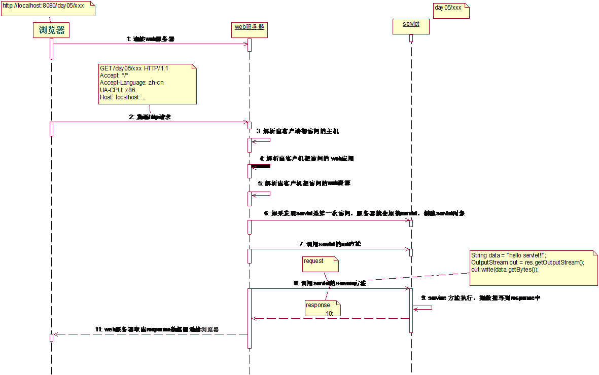

## 一、Servlet简介

　　Servlet是sun公司提供的一门用于开发动态web资源的技术。
　　Sun公司在其API中提供了一个servlet接口，用户若想用发一个动态web资源(即开发一个Java程序向浏览器输出数据)，需要完成以下2个步骤：
　　1、编写一个Java类，实现servlet接口。
　　2、把开发好的Java类部署到web服务器中。
　　按照一种约定俗成的称呼习惯，通常我们也把实现了servlet接口的java程序，称之为Servlet

## 二、Servlet的运行过程

Servlet程序是由WEB服务器调用，web服务器收到客户端的Servlet访问请求后：
　　①Web服务器首先检查是否已经装载并创建了该Servlet的实例对象。如果是，则直接执行第④步，否则，执行第②步。
　　②装载并创建该Servlet的一个实例对象。 
　　③调用Servlet实例对象的init()方法。
　　④创建一个用于封装HTTP请求消息的HttpServletRequest对象和一个代表HTTP响应消息的HttpServletResponse对象，然后调用Servlet的service()方法并将请求和响应对象作为参数传递进去。
　　⑤WEB应用程序被停止或重新启动之前，Servlet引擎将卸载Servlet，并在卸载之前调用Servlet的destroy()方法。 

# 面试题

- **1、说一说Servlet的生命周期?**

  加载和实例化、初始化、处理请求以及服务结束

- **2、JAVA SERVLET API中forward() 与redirect()的区别？**

- **3、Servlet的基本架构**

- **4、什么情况下调用doGet()和doPost()？**

- **5、servlet的生命周期**

  web容器加载servlet，生命周期开始。通过调用servlet的init()方法进行servlet的初始化。通过调用service()方法实现，根据请求的不同调用不同的do***()方法。结束服务，web容器调用servlet的destroy()方法。

- **6、页面间对象传递的方法**

- **7、JSP和Servlet有哪些相同点和不同点，他们之间的联系是什么？**

  JSP是Servlet技术的扩展，本质上是Servlet的简易方式，更强调应用的外表表达。**JSP编译后是"类servlet"**。Servlet和JSP最主要的不同点在于，Servlet的应用逻辑是在Java文件中，并且完全从表示层中的HTML里分离开来。而JSP的情况是Java和HTML可以组合成一个扩展名为.jsp的文件。**JSP侧重于视图，Servlet主要用于控制逻辑**。

- **8、四种会话跟踪技术**

  page、request、session、application

- **9、Request对象的主要方法**

- **10、我们在web应用开发过程中经常遇到输出某种编码的字符，如iso8859-1等，如何输出一个某种编码的字符串？**

  > tempStr = new String(str.getBytes("ISO-8859-1"), "GBK");

- **11、Servlet执行时一般实现哪几个方法？**

- **12、描述Cookie和Session的作用，区别和各自的应用范围，Session工作原理。**

- **13、什么是Servlet？**

  Servlet是用来处理客户端请求并产生动态网页内容的Java类。Servlet主要是用来处理或者是存储HTML表单提交的数据，产生动态内容，在无状态的HTTP协议下管理状态信息。

- **14、说一下Servlet的体系结构。**

  所有的Servlet都必须要实现的核心的接口是javax.servlet.Servlet。每一个Servlet都必须要直接或者是间接实现这个接口，或者是继承javax.servlet.GenericServlet或者javax.servlet.http.HTTPServlet。最后，Servlet使用多线程可以并行的为多个请求服务。

- **15、Applet和Servlet有什么区别？**

- **16、GenericServlet和HttpServlet有什么区别？**

- **17、解释下Servlet的生命周期。**

- **18、doGet()方法和doPost()方法有什么区别？**

- **19、什么是Web应用程序？**

- **20、什么是服务端包含(Server Side Include)？**

- **21、什么是Servlet链(Servlet Chaining)？**

- **22、如何知道是哪一个客户端的机器正在请求你的Servlet？**

- **23、HTTP响应的结构是怎么样的？**

- **24、什么是cookie？session和cookie有什么区别？**

- **25、浏览器和Servlet通信使用的是什么协议？**

- **26、什么是HTTP隧道？**

- **27、sendRedirect()和forward()方法有什么区别？**

- **28、什么是URL编码和URL解码？**

- **29、什么是Scriptlets？**

- **30、声明(Decalaration)在哪里？**

- **31、什么是表达式(Expression)？**

- **32、隐含对象是什么意思？有哪些隐含对象？**

# 参考

- <https://blog.csdn.net/zj12352123/article/details/80576748>

- <https://blog.csdn.net/Jeff_Seid/article/details/80761076>