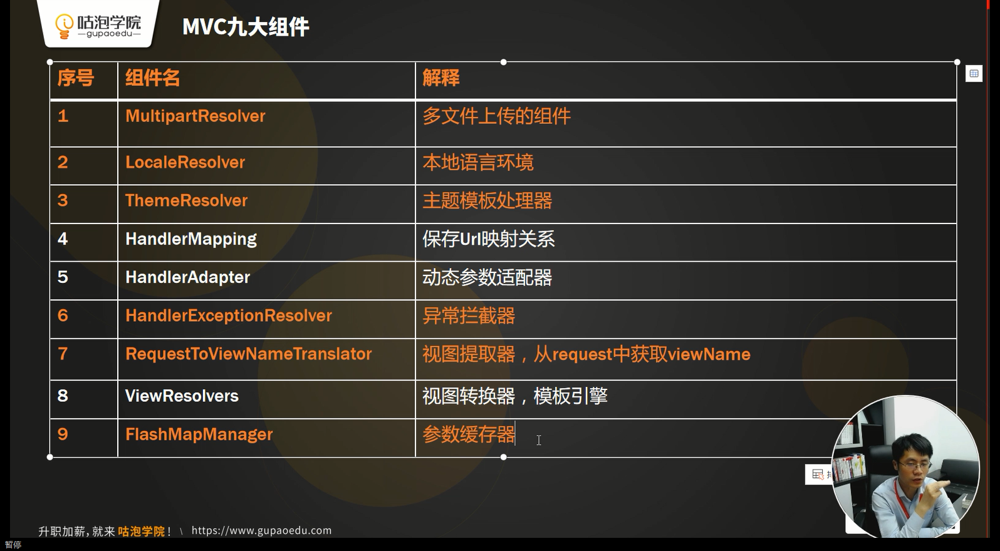
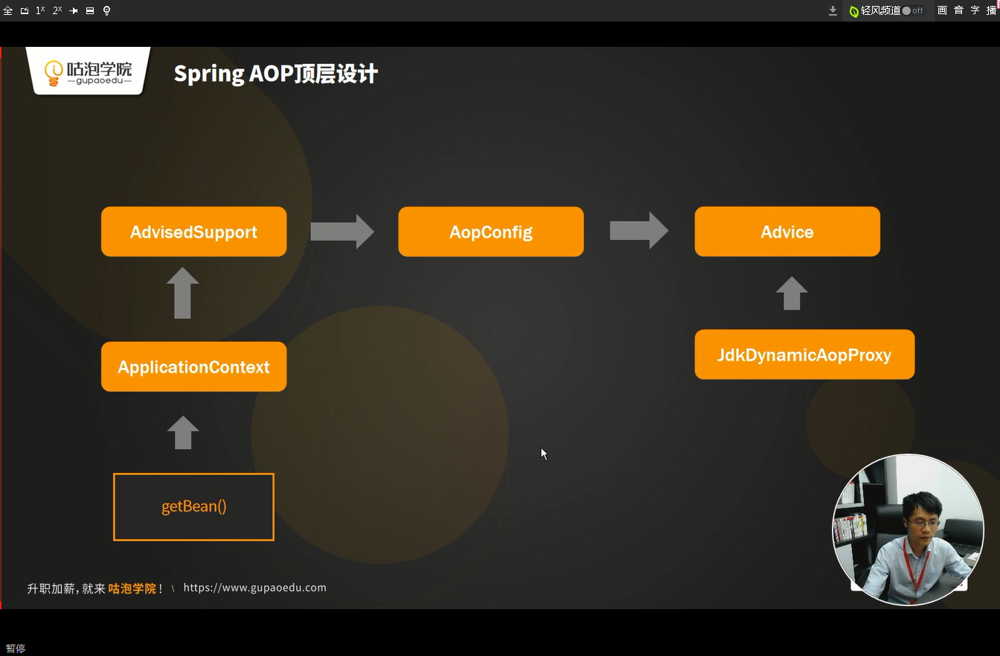

# 第一节课


总结注意点：

- 自定义Annotation的`String value()`

  ```java
  @Target({ElementType.TYPE})//注解的作用目标: TYPE接口、类、枚举；
  //——上面还有METHOD，PARAMETER可以选择
  @Retention(RetentionPolicy.RUNTIME) // 注解的保留位置：RUNTIME注解会在class字节码文件中存在，在运行时可以通过反射获取到
  @Documented//说明该注解将被包含在javadoc中
  @Indexedpublic //为Spring的模式注解添加索引，以提升应用启动性能
  @interface Component {
      String value() default "";
      //表示你的注解有一个名为 value 的可选参数。度不设置的话默认为“”。如果没有后面的回 default ""，则表示这是一个必须的参数。不指定的话会报错
  }
  ```

  其中`@Indexedpublic`的学习：[SpringFramework5.0 @Indexed注解 简单解析](<https://www.jianshu.com/p/f61f2e020a2f>)

- 重写Serverlet的init方法

  ```java
  //模板模式
  //1、加载配置文件
  doLoadConfig(config.getInitParameter("contextConfigLocation"));
  //2、扫描相关的类
  doScanner(contextConfig.getProperty("scanPackage"));
  //3、初始化所有相关的类的实例，并且放入到IOC容器之中
  doInstance();
  //4、完成依赖注入
  doAutowired();
  //5、初始化HandlerMapping
  initHandlerMapping();
  ```

- 扫描相关的类doScanner

  - 将Url路径变文件目录，转为FIle，调用listFiles()扫描

  - 获取IOC变量的Fields

    ```java
    //拿到实例对象中的所有属性
    Field[] fields = entry.getValue().getClass().getDeclaredFields();
    ```

  - 设置强制访问

    ```java
    field.setAccessible(true);//设置私有属性的访问权限
    ```

  - 遇到Directory，则递归调用doScanner

- 完成IOC容器初始化

  - BeanName的创建的注意点

  - **反射机制**创建类

    ```java
    Class<?> clazz = Class.forName(className);
    Object instance = clazz.newInstance();
    ```

    [反射和动态代理的区别](<https://blog.csdn.net/wltsysterm/article/details/68921463>)

- 完成依赖注入doAutowired

  - [class.getDeclaredFields()与class.getFields()](https://www.cnblogs.com/qiangqiangqiang/p/7777831.html)
    - getFields()只能访问类中声明为公有的字段,私有的字段它无法访问.
    - getDeclaredFields()能访问类中所有的字段,与public,private,protect无关
  - field.set()函数

- beanName的获取方法

  - ```java
    field.getType().getName();
    ```

  - ```java
    Class<?> clazz = Class.forName(className);
    String beanName = toLowerFIrstCase(clazz.getSimpleName());
    //clazz.getName
    ```

  - ```java
    String className = (scanPackage + "." + file.getName()).replaceAll(".class", "");
    ```

  - ```java
    method.getDeclaringClass().getSimpleName()
    ```

- initHandlerMapping路由方法

  - 注意@RequestMapping的嵌套情况

  - 获取Class类的Methods

    ```java
    //获取Method的url配置
    Method[] methods = clazz.getMethods();
    ```


# 第二节课


**Lazy延时加载**

我的理解：**不加载所有定义的Bean，而是Autoworied需要用什么实例化什么**

 

- BeanDefinition

  Bean的定义，保存了Bean的定义方式从配置文件中获得

- **BeanWrapper**

  Bean的包装，可能是原生对象，也可能是代理对象保存真实的实例

- BeanDefini tionReader

  顾名思义，用来读取配置文件的一个工具类


前提是所有的功能没有变

- 1、把万能`DispatcherServlet`的功能进行了拆分，为了遵循单- -职责原则

- 2、加载配置文件，分配给了谁BeanDefinitionReader

- 3、解析，扫描相关的类，分配给了谁BeanDefinitionReader

- 4、实例化，分配给了谁ApplicationContext
  - 1) BeanDefinition， 保存在beanDefinitionMap中
  - 2)包装到BeanWrapper,保存在factoryBeanInstanceCache 中

- 5、执行依赖注入，从getBean()方法开始
  - 1) instantiateBean() 方法，根据beanDefinition的信息去反射创建原生对象
  - 2) populateBean(beanName， beanDefinition，beanWrapper)  完成依赖注入


AOP应该在依赖注入之前要存入到beanWrapper中


# 第三节




### HandlerMapping做的优化：

之前是

```java
Method method = this.handlerMapping.get(url);
...
method.invoke(context.getBean(method.getDeclearingClass()), parameValues);
```

现在不通过`method.getDeclearingClass()`去反射来获得方法所在实例了，而是对实例controller进行缓存。

省去了反射获取Class类步骤，性能提升

```java
private void initHandlerMappings(GPApplicationContext context) {
	...
    //pattern 		URI的正则
    //instance 		method所在的类实例
    //method		method
	handlerMappings.add(new GPHandlerMapping(pattern,instance,method));
}
```

调用方法：

```java
private GPHandlerMapping getHandler(HttpServletRequest req) {
        String url = req.getRequestURI();
        String contextPath = req.getContextPath();
        url = url.replaceAll(contextPath,"").replaceAll("/+","/");

        for (GPHandlerMapping handlerMapping : this.handlerMappings) {
            Matcher matcher = handlerMapping.getPattern().matcher(url);
            if(!matcher.matches()){continue;}
            return handlerMapping;
        }

        return null;
    }
```


### HandlerAdapter优化：

**避免每次为`method.invoke`的参数去创建形参列表和实参列表做映射，对形参做缓存,适配handler**

- 使用  `Map<String,Integer> paramIndexMapping = new HashMap<String, Integer>();`

  使得普通参数，HttpServletRequest......得到index映射

- 将参数逐一赋进实参列表`Object [] parameValues = new Object[paramTypes.length];`时，对不同类别加以区分赋值

```java
//动态匹配参数
public GPModelAndView handle(HttpServletRequest req, HttpServletResponse resp, GPHandlerMapping handler) throws Exception {

    //形参列表：编译后就能拿到值

    Map<String,Integer> paramIndexMapping = new HashMap<String, Integer>();

    //提取加了GPRequestParam注解的参数的位置
    Annotation[][] pa = handler.getMethod().getParameterAnnotations();
    for (int i = 0; i < pa.length; i ++){
        for (Annotation a : pa[i]) {
            if(a instanceof GPRequestParam){
                String paramName = ((GPRequestParam) a).value();
                if(!"".equals(paramName.trim())){
                    paramIndexMapping.put(paramName,i);
                }
            }
        }
    }

    //提取request和response的位置
    Class<?> [] paramTypes = handler.getMethod().getParameterTypes();
    for (int i = 0; i < paramTypes.length; i++) {
        Class<?> type = paramTypes[i];
        if(type == HttpServletRequest.class || type == HttpServletResponse.class){
            paramIndexMapping.put(type.getName(),i);
        }
    }

    //实参列表：要运行时才能拿到值
    Map<String,String[]> paramsMap = req.getParameterMap();
    //声明实参列表
    Object [] parameValues = new Object[paramTypes.length];
    for (Map.Entry<String,String[]> param : paramsMap.entrySet()) {
        String value = Arrays.toString(paramsMap.get(param.getKey()))
            .replaceAll("\\[|\\]","")
            .replaceAll("\\s","");
        if(!paramIndexMapping.containsKey(param.getKey())){continue;}

        int index = paramIndexMapping.get(param.getKey());
        parameValues[index] = caseStringVlaue(value,paramTypes[index]);
    }

    if(paramIndexMapping.containsKey(HttpServletRequest.class.getName())){
        int index = paramIndexMapping.get(HttpServletRequest.class.getName());
        parameValues[index] = req;
    }

    if(paramIndexMapping.containsKey(HttpServletResponse.class.getName())){
        int index = paramIndexMapping.get(HttpServletResponse.class.getName());
        parameValues[index] = resp;
    }

	//核心！！！看这里,method和controller全出自handlerMapping
    Object result = handler.getMethod().invoke(handler.getController(),parameValues);

    if(result == null || result instanceof Void){return null;}

    boolean isModelAndView = handler.getMethod().getReturnType() == GPModelAndView.class;
    if (isModelAndView){
        return (GPModelAndView)result;
    }
    return  null;
}

private Object caseStringVlaue(String value, Class<?> paramType) {
    if(String.class == paramType){
        return value;
    }
    if(Integer.class == paramType){
        return Integer.valueOf(value);
    }else if(Double.class == paramType){
        return Double.valueOf(value);
    }else {
        if(value != null){
            return value;
        }
        return null;
    }
}
```

- 加了adapter后的dispatch流程

  ```java
  //1、根据URL拿到对应的HandlerMapping对象
  GPHandlerMapping handler = getHandler(req);
  
  if(null == handler){
      processDispatchResult(req,resp,new GPModelAndView("404"));
      return;
  }
  
  //2、根据HandlerMapping获得一个HandlerAdapter
  GPHandlerAdapter ha = getHandlerAdapter(handler);
  
  //3、根据HandlerAdapter拿到一个ModelAndView
  GPModelAndView mv = ha.handle(req,resp,handler);
  
  //4、根据ViewResolver根据ModelAndView去拿到View
  processDispatchResult(req,resp,mv);
  ```

  

### ModelAndView

统一封装，返回值可以是json，可以是用于ViewResolver的view

```java
public class GPModelAndView {
    private String viewName;
    private Map<String,?> model;
    ...
}
```

当`GPHandlerAdapter.handle(req,resp,handler)`返回一个**GPModelAndView**时，

再根据ViewResolver根据ModelAndView去拿到View

```java
//4、根据ViewResolver根据ModelAndView去拿到View
processDispatchResult(req,resp,mv);
```

调用解析

```java
//404 、500 、自定义模板
//404:   processDispatchResult(req,resp,new GPModelAndView("404"));
//500:   processDispatchResult(req,resp,new GPModelAndView("500", model));,model内含错误信息
private void processDispatchResult(HttpServletRequest req, HttpServletResponse resp, GPModelAndView mv) throws Exception {
    if(null == mv){ return; }

    if(this.viewResolvers.isEmpty()){return;}

    for (GPViewResolver viewResolver : this.viewResolvers) {
        GPView view = viewResolver.resolveViewName(mv.getViewName());
        view.render(mv.getModel(),req,resp);
        return;//一个匹配成功就返回
    }
}
```

进入viewResolver的解析和传值逻辑：

- 找到文件，放进GPView
- GPBiew内，取`Map<String,?> model`的值，结合文件的读取    替换其中要求传参的地方，
- 最终解析完放入response中返回


 ## 总结

**IoC**

- `ApplicationContext`: Spring的主入口.
- `BeanDefinitionReader`: 读取配置文件
- `BeanDefinition`: 保存配置的元信息
- `BeanWrapper`: 保存原实例对象的引用


**AOP**

`initantiateBean()`；反射创建Bean    ( 成BeanWrapper )（1）


**DI**

`getBean()`

​	initantiateBean()；反射创建Bean（2）

​	populateBean();  完成Field的注入


**MVC .**

- `DispatcherServlet`

- `HandlerMapping` :用来保存URL和Method的关系的组件

- `HandlerAdapter`:在运行阶段动态匹配参数的组件

- `ModelAndView`:用来存储方法调用之后的参数和返回值

- `ViewResolver` :根据ModelAndView的信息决定读取对应模板页面，并且调用模板引擎解析View :完成渲染，变成了一-串字符串(格式HTML) ，调用response . getWrite() .write()


```java
doDispatch ()

HandlerMapping handler = getHandler(req.getRequestURL())

HandlerAdapter ha = getHandlerAdapater(handler)

ModelAndView mv = ha.handle () ;

viewResolver . resolveViewName ()

View view = viewResolver.resolveViewName(mv)

view. render() ;
```

 

# 第四节

## AOP




# 总结

- web.xml（配置个...）
- DispatcherServlet（触发init···）
- ApplicationContext（加载···）
- BeanDefinitionReader（拿到一堆···）
- BeanDefinition
- BeanWrapper    （这个其实应该在AOP之后，aop生成的instance封进wrapper）
- 【进入AOP阶段】
- AdvisedSupport
- AopConfig
- Advice
- 【完成DI：ApplicationContext->doAutowrited->getBean->populateBean(beanName,beanDefinition,beanWrapper)】
- ----------------------------------------初始化-----------------------------
- 【触发Spring几大组件】
- HandlerMapping
- HandlerAdapter           （调用controller）
- JdkDynamicAopProxy  （调用service）【但是在GP代码里这步是在Advice后的】
- 【进入MVC】
- ModelAndView
- ViewResolver
- View                                 （返回页面）


来截取核心类来加深印象：

- DispatcherServlet的init

  

- Application构造方法

  

- doAutowrited的核心getBean    (1.实例化（可能包含aop）2.DI依赖注入)

  

- 实例化Bean的方法：instantiateBean（带AOP）

  

- 【运行阶段】

- DispatcherServlet的DoDispatch

  

 