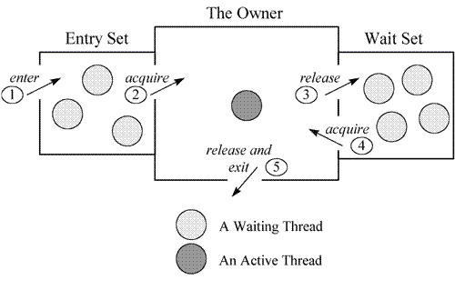

- [volatile和synchronized的区别](<https://blog.csdn.net/suifeng3051/article/details/52611233>)

  - `synchronized`关键字解决的是执行控制的问题

  - synchronized是监视锁

    - 阻止其他线程访问保护的代码块

  - synchronized设置内存屏障

    - 内存屏障指令保证了所有CPU操作结果都会直接刷到主存中，从而保证了操作的内存可见性，同时也使得先获得这个锁的线程的所有操作，都**happens-before**于随后获得这个锁的线程的操作

  - 在Java 5提供了原子数据类型`atomic wrapper classes`，对它们的`increase`之类的操作都是原子操作，不需要使用`sychronized`关键字

  - `volatile`关键字解决的是内存可见性的问题

  - 所有对`volatile`变量的读写都会直接刷到主存，即保证了变量的可见性

  - 使用`volatile`关键字仅能实现对原始变量(如boolen、 short 、int 、long等)操作的原子性，但需要特别注意， `volatile`不能保证复合操作的原子性

  - 对于`volatile`关键字，当且仅当满足以下所有条件时可使用：

    ```
    1. 对变量的写入操作不依赖变量的当前值，或者你能确保只有单个线程更新变量的值。
    2. 该变量没有包含在具有其他变量的不变式中。
    ```

  - ### volatile和synchronized的区别

    ```
    【定义】volatile本质是在告诉jvm当前变量在寄存器（工作内存）中的值是不确定的，需要从主存中读取； synchronized则是锁定当前变量，只有当前线程可以访问该变量，其他线程被阻塞住。
    【作用范围】volatile仅能使用在变量级别；synchronized则可以使用在变量、方法、和类级别的
    【保证范围】volatile仅能实现变量的修改可见性，不能保证原子性；而synchronized则可以保证变量的修改可见性和原子性
    【线程阻塞】volatile不会造成线程的阻塞；synchronized可能会造成线程的阻塞。
    【编译器优化】volatile标记的变量不会被编译器优化；synchronized标记的变量可以被编译器优化
    ```

    如果想更好地理解这两个关键字的作用，强烈建议看一下这篇文章：[Java内存模型](http://blog.csdn.net/suifeng3051/article/details/52611310)


- Volatile底层实现原理

  参考：<https://www.jianshu.com/p/ccfe24b63d87>

  简单来说，

  **volatile 变量的内存可见性是基于内存屏障（Memory Barrier）实现**，是一个 CPU 指令。

  **1.禁止特定类型的编译器重排序和处理器重排序     **

  **2.把当前线程的CPUcache刷到主存，并且特定变量直接和主存交互**

  ```java
  //在 volatile 修饰的共享变量进行写操作的时候会多出 lock 前缀的指令
  ```

  1）将当前处理器缓存行的数据写回到系统内存。（写操作）
  2）写回内存的操作会使在其他 CPU 里缓存了该内存地址的额数据无效。（其他线程的读操作）

  3）当处理器发现本地缓存失效后，就会从内存中重读该变量数据，即可以获取当前最新值。（其他线程的读操作）

- 有关内存屏障更多请见`内存屏障.md`


## [这是我看过关于 volatile 最好的文章](<https://mp.weixin.qq.com/s?__biz=MzU2NDg0OTgyMA==&mid=2247486542&idx=1&sn=601dc10d401dfc214a573478eacd45a4&chksm=fc45f1bdcb3278ab5b84e26ac915d7ce2b2e303fdb678714bfa3109d4972cb7c056b1276ba74&mpshare=1&scene=23&srcid=&sharer_sharetime=1588581354365&sharer_shareid=e6d90aec84add5cf004cb1ab6979727c#rd>)

### [面试官想到，一个Volatile，敖丙都能吹半小时](<https://mp.weixin.qq.com/s?__biz=MzAwNDA2OTM1Ng==&mid=2453142004&idx=1&sn=81ccddb6c8b37114c022c4ad50368ecf&chksm=8cf2db77bb855261b761f11025728f9d56cc7828d9f174752875d4a188e196b4e8494006f7f8&mpshare=1&scene=23&srcid=&sharer_sharetime=1588125319024&sharer_shareid=e6d90aec84add5cf004cb1ab6979727c#rd>)


- ### [Synchronized实现原理](<https://mp.weixin.qq.com/s?__biz=MzI2OTQ4OTQ1NQ==&mid=2247487982&idx=2&sn=e02303bab7a3ffe462fbd6ff779e6ac4&chksm=eaded5aedda95cb87ee6140d9e9f0d94c1bd2d977d7e028991ecc79869653f0aa0d817569457&mpshare=1&scene=23&srcid=&sharer_sharetime=1583059275113&sharer_shareid=e6d90aec84add5cf004cb1ab6979727c#rd>)

  - synchronized通过锁机制实现同步
  - synchronized是基于Monitor来实现同步的
  - Monitor从两个方面来支持线程之间的同步：
    - 互斥执行
    - 协作

1、Java 使用**对象锁** ( 使用 synchronized 获得对象锁 ) 保证工作在共享的数据集上的线程**互斥执行**。

2、使用 notify/notifyAll/wait 方法来**协同**不同线程之间的工作。

3、Class和Object都关联了一个**Monitor**。



```java
//monitor 对象的三个关键字段：
_owner 记录当前持有锁的线程
_EntryList 是一个队列，记录所有阻塞等待锁的线程
_WaitSet 也是一个队列，记录调用 wait() 方法并还未被通知的线程。
```

**Monitor** 的工作机理

- 线程进入同步方法中。
- 为了继续执行临界区代码，线程必须获取 **Monitor 锁**。如果获取锁成功，将成为该监视者对象的拥有者。任一时刻内，监视者对象只属于一个活动线程（The Owner）
- 拥有监视者对象的线程可以调用 wait() 进入等待集合（Wait Set），同时释放监视锁，进入等待状态。
- 其他线程调用 notify() / notifyAll() 接口唤醒等待集合中的线程，这些等待的线程需要**重新获取监视锁后**才能执行 wait() 之后的代码。
- 同步方法执行完毕了，线程退出临界区，并释放监视锁。

参考文档：https://www.ibm.com/developerworks/cn/java/j-lo-synchronized


- ### Synchronized具体实现

  虚拟机是如何将 synchronized 和 monitor 关联起来的呢？

  1、**同步代码块**采用`monitorenter、monitorexit`指令显式的实现。

  2、**同步方法**则使用`ACC_SYNCHRONIZED`标记符隐式的实现。

  - 实例见，[此](<https://mp.weixin.qq.com/s?__biz=MzI2OTQ4OTQ1NQ==&mid=2247487982&idx=2&sn=e02303bab7a3ffe462fbd6ff779e6ac4&chksm=eaded5aedda95cb87ee6140d9e9f0d94c1bd2d977d7e028991ecc79869653f0aa0d817569457&mpshare=1&scene=23&srcid=&sharer_sharetime=1583059275113&sharer_shareid=e6d90aec84add5cf004cb1ab6979727c#rd>)


### 概括：synchronized在jvm里实现原理

参考链接：https://blog.csdn.net/u014590757/article/details/79717549

​       jvm基于**进入和退出Monitor对象**来实现方法同步和代码块同步的。在代码同步的开始位置织入`monitorenter`,在结束同步的位置（正常结束和异常结束处）织入`monitorexit`指令实现。线程执行到monitorenter处，将会获取锁对象对应的monitor的所有权，即尝试获得对象的锁。（任意对象都有一个monitor与之关联，当且一个monitor被持有后，他处于锁定状态）


--->java的多线程安全是基于lock机制实现的，而lock的性能往往不如人意。原因是，monitorenter与monitorexit这两个控制多线程同步的bytecode原语，是jvm依赖操作系统互斥（mutex）来实现的。

--->互斥是一种会导致线程挂起，并在较短时间内又需要重新调度回原线程的，较为消耗资源的操作。

--->为了优化java的Lock机制，从java6开始引入轻量级锁的概念。轻量级锁本意是为了减少多线程进入互斥的几率，并不是要替代互斥。它利用了cpu原语**Compare-And-Swap（cas,汇编指令CMPXCHG）,尝试进入互斥前，进行补救。**

--->为了优化java的Lock机制，从java6开始引入轻量级锁的概念。轻量级锁本意是为了**减少多线程进入互斥的几率**，并不是要替代互斥。它利用了cpu原语**Compare-And-Swap（cas,汇编指令CMPXCHG）,尝试进入互斥前，进行补救。**


### 2.2.3 锁存放的位置

### 2.2.3 synchronized的锁优化

#### - 偏向锁：

#### - 轻量级锁：

### 2.2.4 锁的优缺点对比


### **可重入**

synchronized 拥有强制原子性的内部锁机制，是一把可重入锁。因此，在一个线程使用 synchronized 方法时调用该对象另一个 synchronized 方法，即一个线程得到一个对象锁后再次请求该对象锁，是永远可以拿到锁的。在 Java 中线程获得对象锁的操作是以线程为单位的，而不是以调用为单位的。 synchronized 锁的对象头的 markwork 中会记录该锁的线程持有者和计数器，当一个线程请求成功后， JVM 会记下持有锁的线程，并将计数器计为1。此时其他线程请求该锁，则必须等待。而该持有锁的线程如果再次请求这个锁，就可以再次拿到这个锁，同时计数器会递增。当线程退出一个  synchronized 方法/块时，计数器会递减，如果计数器为 0 则释放该锁锁。


### **悲观锁(互斥锁、排他锁)**

 synchronized 是一把悲观锁(独占锁)，当前线程如果获取到锁，会导致其它所有需要锁该的线程等待，一直等待持有锁的线程释放锁才继续进行锁的争抢。


- [从 synchronized 到 CAS 和 AQS - 彻底弄懂 Java 各种并发锁](<https://blog.csdn.net/u010325193/article/details/86590169>)

- [面试官和我扯了半个小时的synchronized，最后他输了](<https://mp.weixin.qq.com/s?__biz=MzIwMzY1OTU1NQ==&mid=2247489250&idx=1&sn=d6213b4c941fba79ef8eaa4a4e42bffd&chksm=96cd56aea1badfb84f34268d70f0d8824ba749f98b752ff0837434e49ca63629d84f090e5ca9&mpshare=1&scene=23&srcid=&sharer_sharetime=1587901741757&sharer_shareid=e6d90aec84add5cf004cb1ab6979727c#rd>)