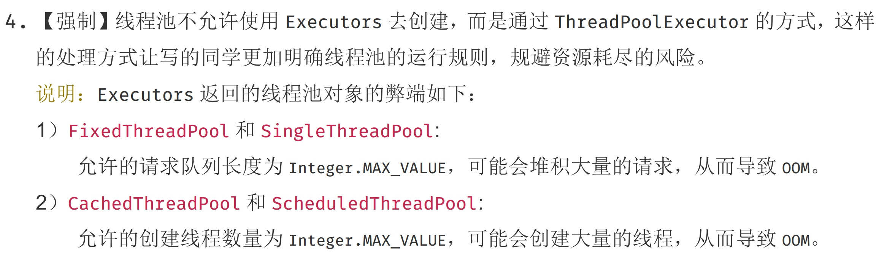
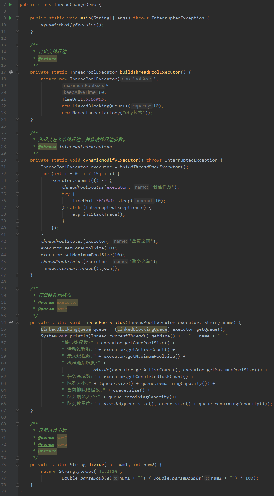
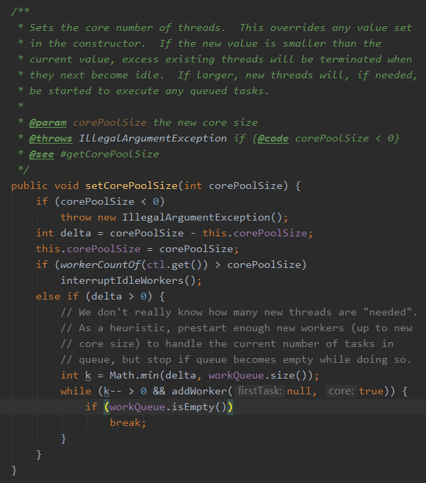
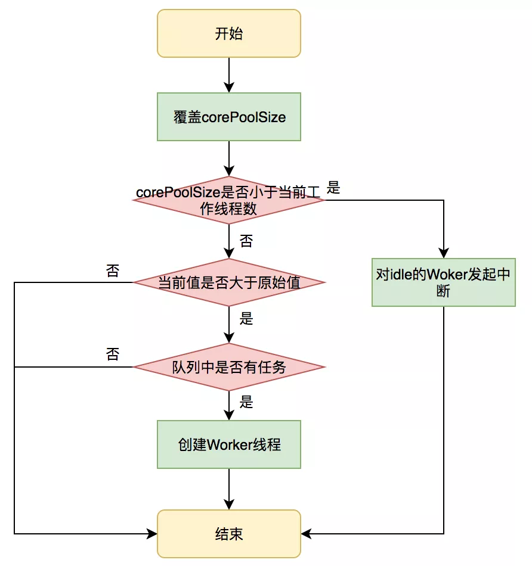
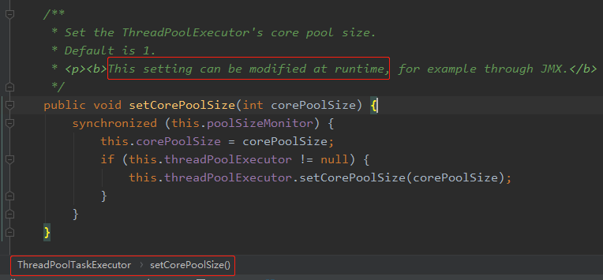
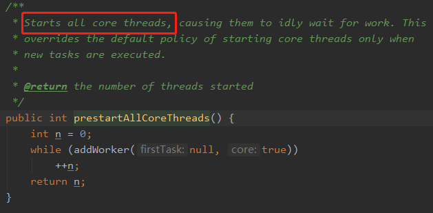
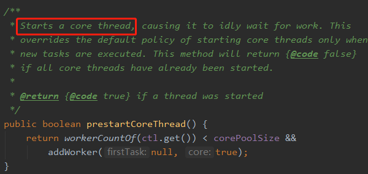
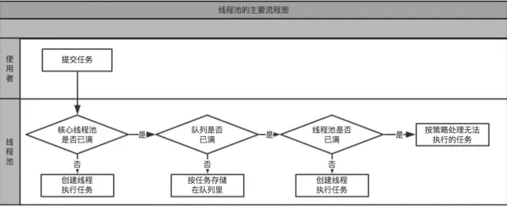
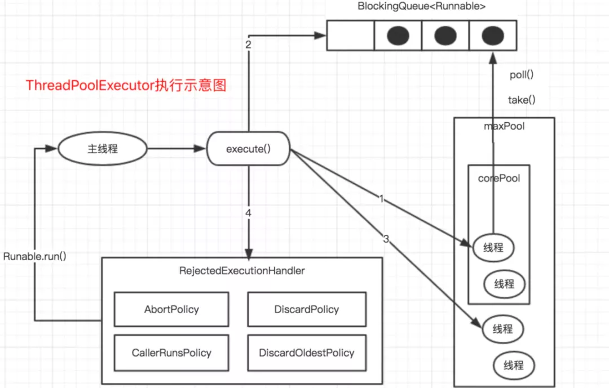

# 原因

创建一个线程，却需要调用操作系统内核的 API，然后操作系统要为线程分配一系列的资源，这个**成本就很高**了，所以**线程是一个重量级的对象，应该避免频繁创建和销毁**


# 与一般意义上池化资源对比

线程池和一般意义上的池化资源是不同的。

**一般意义上的池化资源**，都是下面这样，当你需要资源的时候就调用 acquire() 方法来申请资源，用完之后就调用 release() 释放资。

**线程池**普遍采用生产者 - 消费者模式。在 `MyThreadPool` 的内部，我们维护了一个`阻塞队列 workQueue` 和`一组工作线程`。用户通过调用 `execute()` 方法来提交 `Runnable` 任务，execute() 方法的内部实现仅仅是将任务加入到 `workQueue` 中。`MyThreadPool` 内部维护的工作线程会消费 `workQueue` 中的任务并执行任务。

```java
//简化的线程池，仅用来说明工作原理
class MyThreadPool{
  //利用阻塞队列实现生产者-消费者模式
  BlockingQueue<Runnable> workQueue;
  //保存内部工作线程
  List<WorkerThread> threads 
    = new ArrayList<>();
  // 构造方法
  MyThreadPool(int poolSize, 
    BlockingQueue<Runnable> workQueue){
    this.workQueue = workQueue;
    // 创建工作线程
    for(int idx=0; idx<poolSize; idx++){
      WorkerThread work = new WorkerThread();
      work.start();
      threads.add(work);
    }
  }
  // 提交任务
  void execute(Runnable command){
    workQueue.put(command);
  }
  // 工作线程负责消费任务，并执行任务
  class WorkerThread extends Thread{
    public void run() {
      //循环取任务并执行
      while(true){ ①
        Runnable task = workQueue.take();
        task.run();
      } 
    }
  }  
}

/** 下面是使用示例 **/
// 创建有界阻塞队列
BlockingQueue<Runnable> workQueue = 
  new LinkedBlockingQueue<>(2);
// 创建线程池  
MyThreadPool pool = new MyThreadPool(
  10, workQueue);
// 提交任务  
pool.execute(()->{
    System.out.println("hello");
});
```


## 如何使用 Java 中的线程池

Java 提供的线程池相关的工具类中，最核心的是 **`ThreadPoolExecutor`，**通过名字你也能看出来，它强调的是 **Executor**，而不是一般意义上的池化资源。

```java
ThreadPoolExecutor(
  int corePoolSize,
  int maximumPoolSize,
  long keepAliveTime,
  TimeUnit unit,
  BlockingQueue<Runnable> workQueue,
  ThreadFactory threadFactory,
  RejectedExecutionHandler handler) 
```


## 线程池参数

这个很重要！面试问这里我懵了···

- **corePoolSize**：表示线程池保有的最小线程数**（核心线程数）**。有些项目很闲，但是也不能把人都撤了，至少要留 `corePoolSize` 个人坚守阵地。

- **maximumPoolSize**：表示线程池创建的**最大线程数**。当项目很忙时，就需要加人，但是也不能无限制地加，最多就加到 `maximumPoolSize` 个人。当项目闲下来时，就要撤人了，最多能撤到 corePoolSize 个人。

- **`keepAliveTime & unit`：**当线程池数量超过了`corePoolSize`时，多余的空闲线程的存活时间（**非核心线程数闲置时间**），即超过`corePoolSize`的空闲线程，在多长时间内会被销毁；`unit：keepAliveTime`单位。

- **`workQueue`：工作队列（等待队列）**，被提交但尚未被执行

  - `SynchronousQueue`直接提交的队列

    一个特殊的`BlockingQueue`，没有容量

  - `ArrayBlockingQueue`有界的任务队列

    `线程数尽量维持在corePoolSize。有新任务时，如果小于corePoolSize，创建新核心线程；大于corePoolSIze，新任务加入等待队列；等待队列满，创建非核心线程；若大于maximumPoolSize，执行拒绝策略`

  - `LinkedBolckingQueue`无界的任务队列

    `对比有界，无界不存在入队失败。有新任务时，如果小于corePoolSize，创建新线程；大于corePoolSIze，新任务加入等待队列；`

  - `PriorityBolckingQueue`优先级队列

    一个特殊的无界队列，可以根据任务自身的优先级顺序先后执行

    **`BlockingQueue`概要和源码分析，见JUC并发容器**

- **threadFactory**：通过这个参数你可以自定义如何创建线程，例如你可以给线程指定一个有意义的名字。

- **handler：通过这个参数你可以自定义任务的拒绝策略**。如果线程池中所有的线程都在忙碌，并且工作队列也满了（前提是工作队列是有界队列），那么此时提交任务，线程池就会拒绝接收。至于拒绝的策略，你可以通过 handler 这个参数来指定。ThreadPoolExecutor 已经提供了以下 4 种策略。

  - `CallerRunsPolicy`：提交任务的线程自己去执行该任务。
  - `AbortPolicy`：默认的拒绝策略，会 `throws RejectedExecutionException`。
  - `DiscardPolicy`：直接丢弃任务，没有任何异常抛出。
  - `DiscardOldestPolicy`：丢弃最老的任务，其实就是把最早进入工作队列的任务丢弃，然后把新任务加入到工作队列。
  - Java 在 1.6 版本还增加了 allowCoreThreadTimeOut(boolean value) 方法，它可以让所有线程都支持超时，这意味着如果项目很闲，就会将项目组的成员都撤走。使用线程池要注意些什么


## 自定义拒绝策略


## 自定义线程创建：ThreadFactory


## 扩展线程池


## 堆栈去哪儿了：线程池扩展堆栈


# ThreadPoolExecutor子类

- #### `newFixedThreadPool(int nThreads)`

  `corePoolSize`和`maximumPoolSIze`一样大小，任务队列无界的线程池

  采用了`LinkedBlockingQueue`，无界的任务队列

  ```java
  public static ExecutorService newFixedThreadPool(int nThreads) {
      return new ThreadPoolExecutor(nThreads, nThreads,
      							0L, TimeUnit.MILLISECONDS,
      							new LinkedBlockingQueue<Runnable>());
  }
  ```

- #### `newSingleThreadExcutor()`

  单线程线程池

  ```java
  public static ExecutorService newSingleThreadExecutor() {
      return new FinalizableDelegatedExecutorService
      (new ThreadPoolExecutor(1, 1,
                             0L, TimeUnit.MILLISECONDS,
                             new LinkedBlockingQueue<Runnable>()));
  }
  ```

- #### `newCachedThreadPool()`

  `corePoolSize`为0，`maximumPoolSIze`无穷大的线程池。无任务时无线程。该线程池会使用空闲线程执行任务，若无空闲线程，则将任务加入到`SynchronousQueue`直接提交队列(`poll`方法和`offer`方法匹配成功)

  ```java
  public static ExecutorService newCacheedThreadPoolExecutor() {
  	return new ThreadPoolExecutor(0, Integer.MAX_VALUE,
                                   60L, TimeUnit.SECONDS,
                                   new SynchronousQueue<Runnable>());
  }
  ```

  

  #### [线程池是怎样工作的](<https://mp.weixin.qq.com/s?__biz=MzA3MTQ2MDgyOQ==&mid=2247484172&idx=1&sn=8f9eaec88e04588e76b0c4958162e6af&chksm=9f2c71bea85bf8a84a333d30f37af486469c5dc5957b3ab666378ab4bc6ec1962475cb4adb44&mpshare=1&scene=23&srcid=04305g2MuEqLbfoj2CNCXMdK&sharer_sharetime=1588258595225&sharer_shareid=e6d90aec84add5cf004cb1ab6979727c#rd>)

  ### [5.3.2 执行任务过程介绍](https://snailclimb.gitee.io/javaguide/#/./docs/java/Multithread/java%E7%BA%BF%E7%A8%8B%E6%B1%A0%E5%AD%A6%E4%B9%A0%E6%80%BB%E7%BB%93?id=_532-%e6%89%a7%e8%a1%8c%e4%bb%bb%e5%8a%a1%e8%bf%87%e7%a8%8b%e4%bb%8b%e7%bb%8d)

  **CachedThreadPool 的 execute()方法的执行示意图（该图片来源：《Java 并发编程的艺术》）：** 

  **上图说明：**

  1. 首先执行 `SynchronousQueue.offer(Runnable task)` 提交任务到任务队列。如果当前 `maximumPool` 中有闲线程正在执行 `SynchronousQueue.poll(keepAliveTime,TimeUnit.NANOSECONDS)`，那么主线程执行 offer 操作与空闲线程执行的 `poll` 操作配对成功，主线程把任务交给空闲线程执行，`execute()`方法执行完成，否则执行下面的步骤 2；
  2. 当初始 `maximumPool` 为空，或者 `maximumPool` 中没有空闲线程时，将没有线程执行 `SynchronousQueue.poll(keepAliveTime,TimeUnit.NANOSECONDS)`。这种情况下，步骤 1 将失败，此时 `CachedThreadPool` 会创建新线程执行任务，execute 方法执行完成；

- #### `newSingleThreadScheduledExecutor()`

- #### `newScheduledThreadPool(int corePoolSize)`

  [讲解见此](<https://snailclimb.gitee.io/javaguide/#/./docs/java/Multithread/java%E7%BA%BF%E7%A8%8B%E6%B1%A0%E5%AD%A6%E4%B9%A0%E6%80%BB%E7%BB%93?id=%e5%85%ad-scheduledthreadpoolexecutor-%e8%af%a6%e8%a7%a3>)

  `ScheduledThreadPoolExecutor` 使用的任务队列 `DelayQueue` 封装了一个 `PriorityQueue`，`PriorityQueue` 会对队列中的任务进行排序，执行所需时间短的放在前面先被执行(`ScheduledFutureTask` 的 time 变量小的先执行)，如果执行所需时间相同则先提交的任务将被先执行(`ScheduledFutureTask` 的 `squenceNumber` 变量小的先执行)。

  > **`ScheduledThreadPoolExecutor` 的执行主要分为两大部分：**
  >
  > 1. 当调用 `ScheduledThreadPoolExecutor` 的 **`scheduleAtFixedRate`()** 方法或者**`scheduleWirhFixedDelay`()** 方法时，会向 `ScheduledThreadPoolExecutor` 的 **`DelayQueue`** 添加一个实现了 **`RunnableScheduledFuture`** 接口的 **`ScheduledFutureTask`** 。
  > 2. 线程池中的线程从 `DelayQueue` 中获取 `ScheduledFutureTask`，然后执行任务。

  ### [6.3 ScheduledThreadPoolExecutor 执行周期任务的步骤](https://snailclimb.gitee.io/javaguide/#/./docs/java/Multithread/java%E7%BA%BF%E7%A8%8B%E6%B1%A0%E5%AD%A6%E4%B9%A0%E6%80%BB%E7%BB%93?id=_63-scheduledthreadpoolexecutor-%e6%89%a7%e8%a1%8c%e5%91%a8%e6%9c%9f%e4%bb%bb%e5%8a%a1%e7%9a%84%e6%ad%a5%e9%aa%a4)

  

  1. 线程 1 从 `DelayQueue` 中获取已到期的 `ScheduledFutureTask（DelayQueue.take()）`。到期任务是指 `ScheduledFutureTask`的 time 大于等于当前系统的时间；
  2. 线程 1 执行这个 `ScheduledFutureTask`；
  3. 线程 1 修改 `ScheduledFutureTask` 的 time 变量为下次将要被执行的时间；
  4. 线程 1 把这个修改 time 之后的 `ScheduledFutureTask` 放回 `DelayQueue` 中（`DelayQueue.add()`)。




参考链接：<https://blog.csdn.net/u010321349/article/details/83927012>


## Executor和ExecutorService区别

<https://www.cnblogs.com/whx20100101/p/9862392.html>


## 使用线程池要注意些什么

- 考虑到 `ThreadPoolExecutor` 的构造函数实在是有些复杂，所以有了静态工厂类 `Executors`，利用 Executors 你可以快速创建线程池，但不建议用。Executors 提供的很多方法默认使用的都是**无界**的 `LinkedBlockingQueue`，高负载情境下，无界队列很容易导致 OOM，而 OOM 会导致所有请求都无法处理，这是致命问题。所以**强烈建议使用有界队列**。
- 使用有界队列，当任务过多时，线程池会触发执行拒绝策略，线程池默认的拒绝策略会 throw `RejectedExecutionException` 这是个运行时异常，对于运行时异常编译器并不强制 catch 它，所以开发人员很容易忽略。因此**默认拒绝策略要慎重使用**。如果线程池处理的任务非常重要，建议自定义自己的拒绝策略；并且在实际工作中，自定义的拒绝策略往往和降级策略配合使用。
- 还要注意**异常处理**的问题


## 线程池为什么要shutdown

注意！如果当前正有线程在执行，shutdown()方法并不会立即暴力地终止所有任务，它会等待所有任务执行完成后，再关闭线程池，但它并不会立即暴力地终止所有任务


<https://blog.csdn.net/qq_26792339/article/details/99582774>

> 1.execute()中若当前池中线程数量未达到20，执行addworker(command,true),开启新的线程，执行任务;否则将任务添加到任务队列中；
>
> 2.在addworker()中创建开启worker,worker是一个实现Runnable的内部类
>
> 3.带有thread，firsttask属性。初始化worker时以自身作为runnable参数传递，创建thread。在addworder中执行t.start()后,thread会执行worker中的run()方法,run()中执行runworker()方法。
>
> 4.在runworker执行任务,调用task.run()执行任务
>
> 5.任务完成后通过getTask()不断获取任务队列中的新的任务，有任务则执行，没有任务就一直阻塞，直到线程池状态为shutdown（或stop且任务队列为空）。

`runworker()`中 **while (task != null || (task = getTask()) != null)**两个循环条件都不满足，退出循环。线程池中的线程结束。线程池关闭。

如果不shutdown已经开启的线程**会一直处于阻塞状态,即使主线程已经结束，进程也不会结束，从而使得进程阻塞**。


## 合理优化：选择线程池线程数量

- 总体来说看CPU密集还是IO密集，

  - 选择【CPU+1】个（CPU密集型），

    ```
    CPU+1原因
    即使当计算（CPU）密集型的线程偶尔由于页缺失故障或者其他原因而暂停时，这个“额外”的线程也能确保 CPU 的时钟周期不会被浪费。
    ```

  - 选择【 1 + IO耗时/CPU耗时】个(IO密集型)

- [如何设置线程池参数？美团给出了一个让面试官虎躯一震的回答。](<https://mp.weixin.qq.com/s?__biz=MzAxNjM2MTk0Ng==&mid=2247490647&idx=5&sn=97caf2a882c0e9b58bad44443b3a3524&chksm=9bf4ace2ac8325f46155171f33bae4d942c3d4ffcc4300e4c0c1facaf342cbac04b92c95e0ae&mpshare=1&scene=23&srcid=&sharer_sharetime=1587307155196&sharer_shareid=e6d90aec84add5cf004cb1ab6979727c#rd>)

- 【没上面文章好】[面试问我，创建多少个线程合适？我该怎么说](<https://mp.weixin.qq.com/s?__biz=MzAxNjM2MTk0Ng==&mid=2247490585&idx=4&sn=166899e68b72a6faba99d0851705cbd6&chksm=9bf4acacac8325ba86bf6f6369f341d60a007e4e32aa5f336a33fa3f11826eacdc5f6990d1e8&mpshare=1&scene=23&srcid=&sharer_sharetime=1586748405989&sharer_shareid=e6d90aec84add5cf004cb1ab6979727c#rd>)


都有痛点，所以使用动态化配置线程池

- 动态化配置核心线程数  `CorePoolSize`（注意当前活跃worker线程数和设置后的核心线程数关系）
- 动态化配置最大线程数  `setMaximumPoolSize`
- 动态化配置等待执行任务队列长度（自定义类，去除`LinkedQlockingQueue`对Capacity的final修饰符）



其中的核心方法，`setCorePoolSize()`

先看 `setCorePoolSize` 方法：




这个方法在美团的文章中也说明了：

> 在运行期线程池使用方调用此方法设置corePoolSize之后，线程池会直接覆盖原来的corePoolSize值，并且基于当前值和原始值的比较结果采取不同的处理策略。
> 对于当前值小于当前工作线程数的情况，说明有多余的worker线程，此时会向当前idle的worker线程发起中断请求以实现回收，多余的worker在下次idel的时候也会被回收；
> 对于当前值大于原始值且当前队列中有待执行任务，则线程池会创建新的worker线程来执行队列任务，setCorePoolSize具体流程如下：




看了美团的那篇文章后，我又去看了 Spring 的 ThreadPoolTaskExecutor类 （就是对JDK ThreadPoolExecutor 的一层包装，可以理解为装饰者模式）的 setCorePoolSize 方法：




注释上写的清清楚楚，可以在线程池运行时修改该参数。

而且，你再品一品 JDK 的源码，其实源码也体现出了有修改的含义的，两个值去做差值，只是第一次设置的时候原来的值为 0 而已


- 调整的时候可能会出现核心线程数调整之后无效的情况

  设置核心线程数的时候，同时设置最大线程数即可。

- 当 `allowCoreThreadTimeOut` 参数设置为 true 的时候，核心线程在空闲了 `keepAliveTime` 的时间后也会被回收的，相当于线程池自动给你动态修改了

- 提供队列   (`存放待执行任务的队列`)   长度的 set 方法:

  自定义一个队列，让其可以对 Capacity 参数进行修改即可。把 Capacity 参数的 final 修饰符去掉，并提供其对应的 get/set 方法。然后在程序里面把原来的队列换掉。

- 对线程池进行预热

  - 全启动

  

  - 只启动一个

    

  


# 深入分析线程池的实现原理

[参考链接](<https://mp.weixin.qq.com/s?__biz=MzIwMTY0NDU3Nw==&mid=2651941947&idx=2&sn=601b443d1415ca5c55b29cb32e929053&chksm=8d0f0375ba788a6338d7c16f3b1ea708770f5fe9d132be0583cbe42e1dfb20a51acb6a9bb58d&mpshare=1&scene=23&srcid=&sharer_sharetime=1586873996442&sharer_shareid=e6d90aec84add5cf004cb1ab6979727c#rd>)

## 线程池的实现原理

### 1.提交任务

线程池框架提供了两种方式提交任务，submit()和execute()，通过submit()方法提交的任务可以返回任务执行的结果，通过execute()方法提交的任务不能获取任务执行的结果。

submit()方法的实现有以下三种：

```
public Future<?> submit(Runnable task);
    public <T> Future<T> submit(Runnable task, T result);
    public <T> Future<T> submit(Callable<T> task);
```

下面以第一个方法为例简单看一下submit()方法的实现：

```
public Future<?> submit(Runnable task) {
        if (task == null) throw new NullPointerException();
        RunnableFuture<Void> ftask = newTaskFor(task, null);
        execute(ftask);
        return ftask;
    }
```

submit()方法是在ThreadPoolExecutor的父类AbstractExecutorService类实现的，最终还是调用的ThreadPoolExecutor类的execute()方法，下面着重看一下execute()方法的实现。

```
public void execute(Runnable command) {
        if (command == null)
            throw new NullPointerException();
        //获取线程池控制状态
        int c = ctl.get();
        // (1)
        //worker数量小于corePoolSize
        if (workerCountOf(c) < corePoolSize) {
            //创建worker,addWorker方法boolean参数用来判断是否创建核心线程
            if (addWorker(command, true))
                //成功则返回
                return;
            //失败则再次获取线程池控制状态
            c = ctl.get();
        }
        //(2)
       //线程池处于RUNNING状态，将任务加入workQueue任务缓存队列
        if (isRunning(c) && workQueue.offer(command)) {
            // 再次检查，获取线程池控制状态，防止在任务入队的过程中线程池关闭了或者线程池中没有线程了
            int recheck = ctl.get();
            //线程池不处于RUNNING状态，且将任务从workQueue移除成功
            if (! isRunning(recheck) && remove(command))
                //采取任务拒绝策略
                reject(command);
            //worker数量等于0
            else if (workerCountOf(recheck) == 0)
                //创建worker
                addWorker(null, false);
        }
        //(3)
        else if (!addWorker(command, false))  //创建worker
            reject(command);  //如果创建worker失败，采取任务拒绝策略
    }
```

execute()方法的执行流程可以总结如下：

- 若线程池工作线程数量小于corePoolSize,则创建新线程来执行任务
- 若工作线程数量大于或等于corePoolSize,则将任务加入BlockingQueue
- 若无法将任务加入BlockingQueue(BlockingQueue已满),且工作线程数量小于maximumPoolSize,则创建新的线程来执行任务
- 若工作线程数量达到maximumPoolSize,则创建线程失败,采取任务拒绝策略





### 2.创建线程

从execute()方法的实现可以看出，addWorker()方法主要负责创建新的线程并执行任务，代码实现如下：

```
//addWorker有两个参数:Runnable类型的firstTask,用于指定新增的线程执行的第一个任务;boolean类型的core,表示是否创建核心线程
//该方法的返回值代表是否成功新增一个线程
 private boolean addWorker(Runnable firstTask, boolean core) {
        retry:
        for (;;) {
            int c = ctl.get();
            int rs = runStateOf(c);

            // (1)
            if (rs >= SHUTDOWN &&
                ! (rs == SHUTDOWN &&
                   firstTask == null &&
                   ! workQueue.isEmpty()))
                return false;

            for (;;) {
                int wc = workerCountOf(c);
                //线程数超标，不能再创建线程，直接返回
                if (wc >= CAPACITY ||
                    wc >= (core ? corePoolSize : maximumPoolSize))
                    return false;
                //CAS操作递增workCount
                //如果成功，那么创建线程前的所有条件校验都满足了，准备创建线程执行任务，退出retry循环
                //如果失败，说明有其他线程也在尝试往线程池中创建线程(往线程池提交任务可以是并发的)，则继续往下执行
                if (compareAndIncrementWorkerCount(c))
                    break retry;
                //重新获取线程池控制状态
                c = ctl.get();
                // 如果线程池的状态发生了变更,如有其他线程关闭了这个线程池,那么需要回到外层的for循环
                if (runStateOf(c) != rs)
                    continue retry;
                //如果只是CAS操作失败的话，进入内层的for循环就可以了
            }
        }

        //到这里，创建线程前的所有条件校验都满足了，可以开始创建线程来执行任务
        //worker是否已经启动
        boolean workerStarted = false;
        //是否已将这个worker添加到workers这个HashSet中
        boolean workerAdded = false;
        Worker w = null;
        try {
            //创建一个worker，从这里可以看出对线程的包装
            w = new Worker(firstTask);
            //取出worker中的线程对象,Worker的构造方法会调用ThreadFactory来创建一个新的线程
            final Thread t = w.thread;
            if (t != null) {
                //获取全局锁, 并发的访问线程池workers对象必须加锁,持有锁的期间线程池也不会被关闭
                final ReentrantLock mainLock = this.mainLock;
                mainLock.lock();
                try {
                    //重新获取线程池的运行状态
                    int rs = runStateOf(ctl.get());

                    //小于SHUTTDOWN即RUNNING
                    //等于SHUTDOWN并且firstTask为null,不接受新的任务,但是会继续执行等待队列中的任务
                    if (rs < SHUTDOWN ||
                        (rs == SHUTDOWN && firstTask == null)) {
                        //worker里面的thread不能是已启动的
                        if (t.isAlive())
                            throw new IllegalThreadStateException();
                       //将新创建的线程加入到线程池中
                        workers.add(w);
                        int s = workers.size();
                        // 更新largestPoolSize
                        if (s > largestPoolSize)
                            largestPoolSize = s;
                        workerAdded = true;
                    }
                } finally {
                    mainLock.unlock();
                }
                //线程添加线程池成功，则启动新创建的线程
                if (workerAdded) {
                    t.start();
                    workerStarted = true;
                }
            }
        } finally {
            //若线程启动失败,做一些清理工作,例如从workers中移除新添加的worker并递减wokerCount
            if (! workerStarted)
                addWorkerFailed(w);
        }
        //返回线程是否启动成功
        return workerStarted;
    }
```

因为代码(1)处的逻辑不利于理解，我们通过(1)的等价实现来理解:

```
if (rs>=SHUTDOWN && !(rs == SHUTDOWN && firstTask == null && ! workQueue.isEmpty()))
//等价实现
rs>=SHUTDOWN && (rs != SHUTDOWN || firstTask != null || workQueue.isEmpty())
```

其含义为,满足下列条件之一则直接返回false，线程创建失败:

- rs > SHUTDOWN,也就是STOP,TIDYING或TERMINATED，此时不再接受新的任务，且中断正在执行的任务
- rs = SHUTDOWN且firstTask != null，此时不再接受任务，但是仍会处理任务缓存队列中的任务
- rs = SHUTDOWN，队列为空

多说一句，若线程池处于 SHUTDOWN， firstTask 为 null，且 workQueue 非空，那么还得创建线程继续处理任务缓存队列中的任务。

总结一下，addWorker()方法完成了如下几件任务：

1. 原子性的增加workerCount
2. 将用户给定的任务封装成为一个worker，并将此worker添加进workers集合中
3. 启动worker对应的线程
4. 若线程启动失败，回滚worker的创建动作，即从workers中移除新添加的worker，并原子性的减少workerCount

### 3.工作线程的实现

从addWorker()方法的实现可以看出，工作线程的创建和启动都跟ThreadPoolExecutor中的内部类Worker有关。下面我们分析Worker类来看一下工作线程的实现。

Worker类继承自AQS类，具有锁的功能；实现了Runable接口，可以将自身作为一个任务在线程中执行。

```
private final class Worker
        extends AbstractQueuedSynchronizer
        implements Runnable
```

Worker的主要字段就下面三个，代码也比较简单。

```
//用来封装worker的线程，线程池中真正运行的线程,通过线程工厂创建而来
        final Thread thread;
        //worker所对应的第一个任务，可能为空
        Runnable firstTask;
        //记录当前线程完成的任务数
        volatile long completedTasks;
```

Worker的构造函数如下。

```
Worker(Runnable firstTask) {
            //设置AQS的state为-1，在执行runWorker()方法之前阻止线程中断
            setState(-1);
            //初始化第一个任务
            this.firstTask = firstTask;
            //利用指定的线程工厂创建一个线程，注意，参数是Worker实例本身this
            //也就是当执行start方法启动线程thread时，真正执行的是Worker类的run方法
            this.thread = getThreadFactory().newThread(this);
        }
```

Worker类继承了AQS类，重写了其相应的方法，实现了一个自定义的同步器，实现了不可重入锁。

```
//是否持有独占锁
        protected boolean isHeldExclusively() {
            return getState() != 0;
        }
        //尝试获取锁
        protected boolean tryAcquire(int unused) {
            if (compareAndSetState(0, 1)) {
                //设置独占线程
                setExclusiveOwnerThread(Thread.currentThread());
                return true;
            }
            return false;
        }
        //尝试释放锁
        protected boolean tryRelease(int unused) {
            //设置独占线程为null
            setExclusiveOwnerThread(null);
            setState(0);
            return true;
        }
        //获取锁
        public void lock()        { acquire(1); }
        //尝试获取锁
        public boolean tryLock()  { return tryAcquire(1); }
        //释放锁
        public void unlock()      { release(1); }
        //是否持有锁
        public boolean isLocked() { return isHeldExclusively(); }
```

Worker类还提供了一个中断线程thread的方法。

```
void interruptIfStarted() {
            Thread t;
            //AQS状态大于等于0，worker对应的线程不为null，且该线程没有被中断
            if (getState() >= 0 && (t = thread) != null && !t.isInterrupted()) {
                try {
                    t.interrupt();
                } catch (SecurityException ignore) {
                }
            }
        }
```

再来看一下Worker类的run()方法的实现，会发现run()方法最终调用了ThreadPoolExecutor类的runWorker()方法。

```
public void run() {
            runWorker(this);
        }
```

### 4.线程复用机制

通过上文可以知道，worker中的线程start 后，执行的是worker的run()方法，而run()方法最终会调用ThreadPoolExecutor类的runWorker()方法，runWorker()方法实现了线程池中的线程复用机制。下面我们来看一下runWorker()方法的实现。

```
final void runWorker(Worker w) {
        //获取当前线程
        Thread wt = Thread.currentThread();
        //获取w的firstTask
        Runnable task = w.firstTask;
        //设置w的firstTask为null
        w.firstTask = null;
        // 释放锁，设置AQS的state为0，允许中断
        w.unlock();
        //用于标识线程是否异常终止，finally中processWorkerExit()方法会有不同逻辑
        boolean completedAbruptly = true;
        try {
            //循环调用getTask()获取任务,不断从任务缓存队列获取任务并执行
            while (task != null || (task = getTask()) != null) {
                //进入循环内部，代表已经获取到可执行的任务，则对worker对象加锁，保证线程在执行任务过程中不会被中断
                w.lock();
                if ((runStateAtLeast(ctl.get(), STOP) ||  //若线程池状态大于等于STOP，那么意味着该线程要中断
                     (Thread.interrupted() &&      //线程被中断
                      runStateAtLeast(ctl.get(), STOP))) &&  //且是因为线程池内部状态变化而被中断
                    !wt.isInterrupted())           //确保该线程未被中断
                    //发出中断请求
                    wt.interrupt();
                try {
                    //开始执行任务前的Hook方法
                    beforeExecute(wt, task);
                    Throwable thrown = null;
                    try {
                        //到这里正式开始执行任务
                        task.run();
                    } catch (RuntimeException x) {
                        thrown = x; throw x;
                    } catch (Error x) {
                        thrown = x; throw x;
                    } catch (Throwable x) {
                        thrown = x; throw new Error(x);
                    } finally {
                        //执行任务后的Hook方法
                        afterExecute(task, thrown);
                    }
                } finally {
                    //置空task，准备通过getTask()获取下一个任务
                    task = null;
                    //completedTasks递增
                    w.completedTasks++;
                    //释放掉worker持有的独占锁
                    w.unlock();
                }
            }
            completedAbruptly = false;
        } finally {
            //到这里，线程执行结束，需要执行结束线程的一些清理工作
            //线程执行结束可能有两种情况：
            //1.getTask()返回null，也就是说，这个worker的使命结束了，线程执行结束
            //2.任务执行过程中发生了异常
            //第一种情况，getTask()返回null，那么getTask()中会将workerCount递减
            //第二种情况，workerCount没有进行处理，这个递减操作会在processWorkerExit()中处理
            processWorkerExit(w, completedAbruptly);
        }
    }
```

runWorker()方法是线程池的核心，实现了线程池中的线程复用机制，来看一下

runWorker()方法都做了哪些工作：

1. 运行第一个任务firstTask之后，循环调用getTask()方法获取任务,不断从任务缓存队列获取任务并执行；
2. 获取到任务之后就对worker对象加锁，保证线程在执行任务的过程中不会被中断，任务执行完会释放锁；
3. 在执行任务的前后，可以根据业务场景重写beforeExecute()和afterExecute()等Hook方法；
4. 执行通过getTask()方法获取到的任务
5. 线程执行结束后，调用processWorkerExit()方法执行结束线程的一些清理工作

从runWorker()方法的实现可以看出，runWorker()方法中主要调用了getTask()方法和processWorkerExit()方法，下面分别看一下这两个方法的实现。

#### getTask()的实现

getTask()方法用来不断地从任务缓存队列获取任务并交给线程执行，下面分析一下其实现。

```
private Runnable getTask() {
        //标识当前线程是否超时未能获取到task对象
        boolean timedOut = false;

        for (;;) {
            //获取线程池的控制状态
            int c = ctl.get();
            //获取线程池的运行状态
            int rs = runStateOf(c);

            //如果线程池状态大于等于STOP，或者处于SHUTDOWN状态，并且阻塞队列为空，线程池工作线程数量递减，方法返回null，回收线程
            if (rs >= SHUTDOWN && (rs >= STOP || workQueue.isEmpty())) {
                decrementWorkerCount();
                return null;
            }

            //获取worker数量
            int wc = workerCountOf(c);

            //标识当前线程在空闲时，是否应该超时回收
            // 如果allowCoreThreadTimeOut为ture，或当前线程数大于核心池大小，则需要超时回收
            boolean timed = allowCoreThreadTimeOut || wc > corePoolSize;

            //如果worker数量大于maximumPoolSize(有可能调用了 setMaximumPoolSize(),导致worker数量大于maximumPoolSize)
            if ((wc > maximumPoolSize || (timed && timedOut))  //或者获取任务超时
                && (wc > 1 || workQueue.isEmpty())) {  //workerCount大于1或者阻塞队列为空（在阻塞队列不为空时，需要保证至少有一个工作线程）
                if (compareAndDecrementWorkerCount(c))
                    //线程池工作线程数量递减，方法返回null，回收线程
                    return null;
                //线程池工作线程数量递减失败，跳过剩余部分，继续循环
                continue;
            }

            try {
                //如果允许超时回收，则调用阻塞队列的poll()，只在keepAliveTime时间内等待获取任务，一旦超过则返回null
                //否则调用take()，如果队列为空，线程进入阻塞状态，无限时等待任务，直到队列中有可取任务或者响应中断信号退出
                Runnable r = timed ?
                    workQueue.poll(keepAliveTime, TimeUnit.NANOSECONDS) :
                    workQueue.take();
                //若task不为null，则返回成功获取的task对象
                if (r != null)
                    return r;
                // 若返回task为null，表示线程空闲时间超时，则设置timeOut为true
                timedOut = true;
            } catch (InterruptedException retry) {
                //如果此worker发生了中断，采取的方案是重试，没有超时
                //在哪些情况下会发生中断？调用setMaximumPoolSize()，shutDown()，shutDownNow()
                timedOut = false;
            }
        }
    }
```

接下来总结一下getTask()方法会在哪些情况下返回：

1. 线程池处于RUNNING状态，阻塞队列不为空，返回成功获取的task对象
2. 线程池处于SHUTDOWN状态，阻塞队列不为空，返回成功获取的task对象
3. 线程池状态大于等于STOP，返回null，回收线程
4. 线程池处于SHUTDOWN状态，并且阻塞队列为空，返回null，回收线程
5. worker数量大于maximumPoolSize，返回null，回收线程
6. 线程空闲时间超时，返回null，回收线程

#### processWorkerExit()的实现

processWorkerExit()方法负责执行结束线程的一些清理工作，下面分析一下其实现。

```
private void processWorkerExit(Worker w, boolean completedAbruptly) {
        //如果用户任务执行过程中发生了异常，则需要递减workerCount
        if (completedAbruptly)
            decrementWorkerCount();

        final ReentrantLock mainLock = this.mainLock;
        //获取全局锁
        mainLock.lock();
        try {
            //将worker完成任务的数量累加到总的完成任务数中
            completedTaskCount += w.completedTasks;
            //从workers集合中移除该worker
            workers.remove(w);
        } finally {
            //释放锁
            mainLock.unlock();
        }
        //尝试终止线程池
        tryTerminate();
        //获取线程池控制状态
        int c = ctl.get();
        if (runStateLessThan(c, STOP)) {  //线程池运行状态小于STOP
            if (!completedAbruptly) {  //如果用户任务执行过程中发生了异常，则直接调用addWorker()方法创建线程
                //是否允许核心线程超时
                int min = allowCoreThreadTimeOut ? 0 : corePoolSize;
                //允许核心超时并且workQueue阻塞队列不为空，那线程池中至少有一个工作线程
                if (min == 0 && ! workQueue.isEmpty())
                    min = 1;
                //如果工作线程数量workerCount大于等于核心池大小corePoolSize，
                //或者允许核心超时并且workQueue阻塞队列不为空时，线程池中至少有一个工作线程，直接返回
                if (workerCountOf(c) >= min)
                    return;
                //若不满足上述条件，则调用addWorker()方法创建线程
            }
            //创建新的线程取代当前线程
            addWorker(null, false);
        }
    }
```

processWorkerExit()方法中主要调用了tryTerminate()方法，下面看一下tryTerminate()方法的实现。

```
final void tryTerminate() {
        for (;;) {
            //获取线程池控制状态
            int c = ctl.get();
            if (isRunning(c) ||    //线程池的运行状态为RUNNING
                runStateAtLeast(c, TIDYING) ||    //线程池的运行状态大于等于TIDYING
                (runStateOf(c) == SHUTDOWN && ! workQueue.isEmpty()))  //线程池的运行状态为SHUTDOWN且阻塞队列不为空
                //不能终止，直接返回
                return;

            //只有当线程池的运行状态为STOP，或线程池运行状态为SHUTDOWN且阻塞队列为空时，可以执行到这里
            //如果线程池工作线程的数量不为0
            if (workerCountOf(c) != 0) {
                //仅仅中断一个空闲的worker
                interruptIdleWorkers(ONLY_ONE);
                return;
            }

            //只有当线程池工作线程的数量为0时可以执行到这里
            final ReentrantLock mainLock = this.mainLock;
            //获取全局锁
            mainLock.lock();
            try {
                if (ctl.compareAndSet(c, ctlOf(TIDYING, 0))) {  //CAS操作设置线程池运行状态为TIDYING，工作线程数量为0
                    try {
                        //执行terminated()钩子方法
                        terminated();
                    } finally {
                        //设置线程池运行状态为TERMINATED，工作线程数量为0
                        ctl.set(ctlOf(TERMINATED, 0));
                        //唤醒在termination条件上等待的所有线程
                        termination.signalAll();
                    }
                    return;
                }
            } finally {
                //释放锁
                mainLock.unlock();
            }
            //若CAS操作失败则重试
        }
    }
```

tryTerminate()方法的作用是尝试终止线程池，它会在所有可能终止线程池的地方被调用，满足终止线程池的条件有两个：首先，线程池状态为STOP,或者为SHUTDOWN且任务缓存队列为空；其次，工作线程数量为0。

满足了上述两个条件之后，tryTerminate()方法获取全局锁，设置线程池运行状态为TIDYING，之后执行terminated()钩子方法，最后设置线程池状态为TERMINATED。

至此，线程池运行状态变为TERMINATED，工作线程数量为0，workers已清空，且workQueue也已清空，所有线程都执行结束，线程池的生命周期到此结束。

### 5.关闭线程池

关闭线程池有两个方法，shutdown()和shutdownNow()，下面分别看一下这两个方法的实现。

#### shutdown()的实现

shutdown()方法将线程池运行状态设置为SHUTDOWN，此时线程池不会接受新的任务，但会处理阻塞队列中的任务。

```
public void shutdown() {
        final ReentrantLock mainLock = this.mainLock;
        //获取全局锁
        mainLock.lock();
        try {
            //检查shutdown权限
            checkShutdownAccess();
            //设置线程池运行状态为SHUTDOWN
            advanceRunState(SHUTDOWN);
            //中断所有空闲worker
            interruptIdleWorkers();
            //用onShutdown()钩子方法
            onShutdown();
        } finally {
            //释放锁
            mainLock.unlock();
        }
        //尝试终止线程池
        tryTerminate();
    }
```

shutdown()方法首先会检查是否具有shutdown的权限，然后设置线程池的运行状态为SHUTDOWN，之后中断所有空闲的worker，再调用onShutdown()钩子方法，最后尝试终止线程池。

shutdown()方法调用了interruptIdleWorkers()方法中断所有空闲的worker，其实现如下。

```
private void interruptIdleWorkers() {
        interruptIdleWorkers(false);
    }

    //onlyOne标识是否只中断一个线程
    private void interruptIdleWorkers(boolean onlyOne) {
        final ReentrantLock mainLock = this.mainLock;
        //获取全局锁
        mainLock.lock();
        try {
            //遍历workers集合
            for (Worker w : workers) {
                //worker对应的线程
                Thread t = w.thread;
                //线程未被中断且成功获得锁
                if (!t.isInterrupted() && w.tryLock()) {
                    try {
                        //发出中断请求
                        t.interrupt();
                    } catch (SecurityException ignore) {
                    } finally {
                        //释放锁
                        w.unlock();
                    }
                }
                //若只中断一个线程，则跳出循环
                if (onlyOne)
                    break;
            }
        } finally {
            //释放锁
            mainLock.unlock();
        }
    }
```

#### shutdownNow()的实现

shutdownNow()方法将线程池运行状态设置为STOP，此时线程池不会接受新任务，也不会处理阻塞队列中的任务，并且中断正在运行的任务。

```
public List<Runnable> shutdownNow() {
        List<Runnable> tasks;
        final ReentrantLock mainLock = this.mainLock;
        //获取全局锁
        mainLock.lock();
        try {
            //检查shutdown权限
            checkShutdownAccess();
            //设置线程池运行状态为STOP
            advanceRunState(STOP);
            //中断所有worker
            interruptWorkers();
            //将任务缓存队列中等待执行的任务取出并放到list中
            tasks = drainQueue();
        } finally {
            //释放锁
            mainLock.unlock();
        }
        //尝试终止线程池
        tryTerminate();
        //返回任务缓存队列中等待执行的任务列表
        return tasks;
    }
```

shutdownNow()方法与shutdown()方法相似，不同之处在于，前者设置线程池的运行状态为STOP，之后中断所有的worker(并非只是空闲的worker)，尝试终止线程池之后，返回任务缓存队列中等待执行的任务列表。

shutdownNow()方法调用了interruptWorkers()方法中断所有的worker(并非只是空闲的worker)，其实现如下。

```
private void interruptWorkers() {
        final ReentrantLock mainLock = this.mainLock;
        //获取全局锁
        mainLock.lock();
        try {
            //遍历workers集合
            for (Worker w : workers)
                //调用Worker类的interruptIfStarted()方法中断线程
                w.interruptIfStarted();
        } finally {
            //释放锁
            mainLock.unlock();
        }
    }
```

### 线程池原理总结

至此，我们已经阅读了线程池框架的核心类ThreadPoolExecutor类的大部分源码，由衷地赞叹这个类很多地方设计的巧妙之处：

- 将线程池的运行状态和工作线程数量打包在一起，并使用了大量的位运算
- 使用CAS操作更新线程控制状态ctl，确保对ctl的更新是原子操作
- 内部类Worker类继承了AQS，实现了一个自定义的同步器，实现了不可重入锁
- 使用while循环自旋地从任务缓存队列中获取任务并执行，实现了线程复用机制
- 调用interrupt()方法中断线程，但注意该方法并不能直接中断线程的运行，只是发出了中断信号，配合BlockingQueue的take()，poll()方法的使用，打断线程的阻塞状态

其实，线程池的本质就是生产者消费者模式，线程池的调用者不断向线程池提交任务，线程池里面的工作线程不断获取这些任务并执行(从任务缓存队列获取任务或者直接执行任务)。

读完本文，相信大家对线程池的实现原理有了深刻的认识，比如向线程池提交一个任务之后线程池的执行流程，一个任务从被提交到被执行会经历哪些过程，一个工作线程从被创建到正常执行到执行结束的执行过程，等等。


# 线程池和Future

- FutureTask类有一个内部类Sync，一些实质性的工作会委托Sync类实现。补充了解
- （Complete）Future和线程池的Demo：<https://blog.csdn.net/qq_31821675/article/details/105189304>


# 我有用过吗

### 1.用于测试

<https://zhuanlan.zhihu.com/p/85166364>，参考这里

```java
private ExecutorService pool = Executors.newFixedThreadPool(20);

    @BeforeClass
    public static void init() {
        JedisPoolConfig jedisPoolConfig = new JedisPoolConfig();
        jedisPoolConfig.setMaxTotal(200);
        JedisPool jedisPool = new JedisPool(jedisPoolConfig, "localhost");
        limiter = RedLimiter.create("1000", 1, jedisPool,true);
    }

    @org.junit.Test
    public void acquire() throws Exception {
        for (int i = 0; i < 10; i++) {
            final int index = i;
            pool.execute(() -> {
                double acquire = limiter.acquire(1);
                System.out.println(index + " \t" + acquire + " \t" + new Date());
            });
        }
        Thread.sleep(12 * 1000L);
    }
```

### 2.铁塔项目

配置3个线程池，用于3个不同的业务

- **稽核入口**
- 稽核入口进入后，取完对应数据，**分别执行策略**
- **显示进度**用的线程池
- **定时任务**用的线程池（默认）


线程数的设置是考虑业务数目和常识设置的，不太遵循设置线程的规则