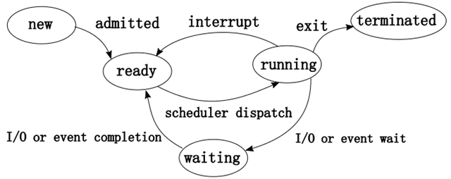

进程和线程的概念 资源怎么分配的？

```
（1）线程是CPU独立运行和独立调度的基本单位；
（2）进程是资源分配的基本单位；
两者的联系：进程和线程都是操作系统所运行的程序运行的基本单元。
区别：
（1）进程具有独立的空间地址，一个进程崩溃后，在保护模式下不会对其它进程产生影响。
	进程是资源分配的最小单位，线程是独立调度的最小单位。
	同一个进程中的多个线程之间可以并发执行，他们共享进程资源。
	线程不拥有资源，线程可以访问隶属进程的资源，进程有自己的独立空间地址，线程没有自己的独立空间地址，但是线程有自己的栈和局部变量并且共享进程的堆。
（2）线程只是一个进程的不同执行路径，线程有自己的堆栈和局部变量，但线程之间没有单独的地址空间，线程拥有的是进程的地址空间
堆：　是大家共有的空间，分全局堆和局部堆。全局堆就是所有没有分配的空间，局部堆就是用户分配的空间。堆在操作系统对进程初始化的时候分配，运行过程中也可以向系统要额外的堆，但是记得用完了要还给操作系统，要不然就是内存泄漏。
栈：是个线程独有的，保存其运行状态和局部自动变量的。栈在线程开始的时候初始化，每个线程的栈互相独立
与线程“绑定”的是栈，用于存储自动变量。每一个线程建立的时候，都会新建一个默认栈与之配合。堆则是通常与进程相关，用于存储全局性的变量，进程建立的时候，会建立默认堆。于是，每一个线程都有自己的栈，然后访问共同的堆
————————————————
版权声明：本文为CSDN博主「javHao」的原创文章，遵循 CC 4.0 BY-SA 版权协议，转载请附上原文出处链接及本声明。
原文链接：https://blog.csdn.net/weixin_40695328/article/details/89004094
```


### [进程线程区别](<https://mp.weixin.qq.com/s?__biz=MzAxMTkwODIyNA==&mid=2247495602&idx=1&sn=a9cc887afec47511ab0ff8932ecf2229&chksm=9bbb4a5dacccc34b8dd10d096f7037de0b65f9629fa4d7eb6fd15fb28e970119166f997c025d&mpshare=1&scene=23&srcid=&sharer_sharetime=1591794261471&sharer_shareid=e6d90aec84add5cf004cb1ab6979727c#rd>)


- [今天，进程告诉我线程它它它它不想活了](https://mp.weixin.qq.com/s?__biz=MzU2NDg0OTgyMA==&mid=2247485434&idx=1&sn=579bb39a22b69e1a084bd797c216e3fb&chksm=fc45fa09cb32731f39125338553ab0f0ace16a365fed44ad802ca0dacf51fa568478f07771e3&mpshare=1&scene=23&srcid=&sharer_sharetime=1582037666752&sharer_shareid=e6d90aec84add5cf004cb1ab6979727c#rd)
- [万字长文带你还原进程和线程](https://mp.weixin.qq.com/s?__biz=MzU2NDg0OTgyMA==&mid=2247485411&idx=1&sn=d27392473fbb5589d2f796d4e583bcb0&chksm=fc45fa10cb327306c50a7e78010a3689208d360c574ddc2c10af0c9f89830239f48f33b58dbd&mpshare=1&scene=23&srcid=&sharer_sharetime=1582037697883&sharer_shareid=e6d90aec84add5cf004cb1ab6979727c#rd)


# 面试问题

7. 线程切换的开销是多久？你们项目打开一个请求的时间是多久，主要花在哪里了？
8. 怎么创建线程？
9. 操作系统，切换进程有哪几种策略，着重讲一下优先级多级队列。


- [进程间通信方式+线程间通信方式](https://www.cnblogs.com/fmqdblog/p/10680077.html)


- [JVM线程状态，park, wait, sleep, interrupt, yeild 对比](<https://blog.csdn.net/AlbertFly/article/details/80828284>)

  ```
  NEW, RUNNABLE, BLOCKED, WAITING, TIMED_WAITING, TERMINATED
  BLOCKED是等待获得对象锁
  WAITING是调用了wait, sleep, park
  =============================================================================
  sleep， 进入TIMED_WAITING状态，不出让锁
  wait, 进入TIMED_WAITING状态，出让锁，并进入对象的等待队列
  park, 进入WAITING状态，对比wait不需要获得锁就可以让线程WAITING，通过unpark唤醒
  interrupt, 只是给线程发个信号，如果在wait, sleep会收到exception
  yeild, 在操作系统层面让线程从running变成ready状态，等待继续被调度。在jvm的线程状态还是RUNNABLE
  ```

  


#### 进程调度算法？适用场景？

FIFO，时间片轮转，优先级调度，短作业优先


### 进程的状态

1.**就绪状态**（Ready）：进程已获得除处理器外的所需资源,等待分配处理器资源；只要分配了处理器进程就可执行.就绪进程可以按多个优先级来划分队列.例如,当一个进程由于时间片用完而进入就绪状态时,排入低...

2.**运行状态**(Running)：进程占用处理器资源；处于此状态的进程的数目小于等于处理器的数目.在没有其他进程可以执行时(如所有进程都在阻塞状态),通常会自动执行系统的空闲进程

3.**阻塞状态**(Blocked)：由于进程等待某种条件（如I/O操作或进程同步）,在条件满足之前无法继续执行.该事件发生前即使把处理机分配给该进程,也无法运行


### java用（）机制实现了进程之间的同步执行

- 监视器
- 虚拟机
- 多个CPU
- 异步调用

这个题目错了一个字，应该是说线程而不是进程，正确答案应该是A。最近在书上偶然看到是用管程(moniter)实现的，这里把moniter翻译成的监视器,或者说锁机制。做个记号。正确答案应该是A。最近在书上偶然看到是用管程(moniter)实现的，这里把moniter翻译成的监视器,或者说锁机制。做个记号


# [进程间通信方式+线程间通信方式](https://www.cnblogs.com/fmqdblog/p/10680077.html)

## 进程间通信

　　**管道（pipe）**：管道是一种半双工的通信方式，数据只能单向流动，而且只能在具有亲缘关系的进程间使用进程间的亲缘关系通常是指父子进程关系。

　　**命名管道（named pipe/FIFO）**：命名管道也是半双工的通信方式，但是它允许无亲缘关系进程间的通信。

　　**信号量（semophonre）**：信号量是一个计数器，可以用来控制多个进程队共享资源的访问。它常作为一个锁机制，防止某进程在访问共享资源时，其他进程也访问此资源。因此，主要作为进程间以及同一进程内不同线程之间的同步手段。

　　**消息队列（message queue）**：消息队列是由消息的链表，存放在内核中并由消息队列标识符标识。消息队列克服了信号传递信息少，管道只能承载无格式字节流以及缓冲区大小受限等缺点。

　　**信号（sinal）**：信号是一种比较复杂的通信方式，用于通知接受进程某个事件已经发生。

　　**共享内存（shared memory）**：共享内存就是映射一段能被其他进程所访问的内存，这段共享内存由一个进程创建，但多个进程都可以访问。共享内存是最快的ipc通信方式，它是针对其他进程间通信方式运行效率低而专门设计的。它往往和其他通信方式如信号量，配合使用来实现进程间的同步和通信。

　　**套接字（socket）**：套接字也是一种进程间通信机制，与其他通信机制不同的是，它可用于不同设备间的进程通信。

　　**全双工管道**：共享内存、信号量、消息队列、管道和命名管道只适用于本地进程间通信，套接字和全双工管道可用于远程通信，因此可用于网络编程。

## 线程间通信

- **锁机制**：包括互斥锁、条件变量、读写锁

　　　　互斥锁：提供了以排他方式防止数据结构被并发修改的方法。

　　　　读写锁：允许多个线程同时共享数据，而对写操作是互斥的。

　　　　条件变量：可以以原子的方式阻塞进程，直到某个特定条件为真为止。对条件的测试是在互斥锁的保护下进行的。条件变量始终与互斥锁一起使用。

> ​	Java中线程通信协作的最常见的两种方式：
>
> 　　一.syncrhoized加锁的线程的**Object类**的wait()/notify()/notifyAll()
>
> 　　二.ReentrantLock类加锁的线程的**Condition类的**await()/signal()/signalAll()
>
> 　　线程间直接的数据交换：
>
> 　　三.通过管道进行线程间通信：1）字节流；2）字符流  　
>
> 参考和例子：<https://www.cnblogs.com/xdyixia/p/9386133.html>

- **信号量机制（Semaphore）**：包括无名进程信号量和命名线程信号量

- **信号机制（Signal）**：类似进程间的信号处理

　　


## Thread 优先级

<https://blog.csdn.net/weixin_37139197/article/details/81989749>


# 分析进程方法：

- [资深程序员总结：分析Linux进程的6个方法，全都告诉你！](<https://mp.weixin.qq.com/s?__biz=MzU0OTk3ODQ3Ng==&mid=2247487246&idx=1&sn=a6deb95b51d1aa2fc654fbdcf071438f&chksm=fba6e70dccd16e1bb0d75c637f55a87fd0bfc880acb0baa8256b5b8289f5e999e3cf5398d870&mpshare=1&scene=23&srcid=&sharer_sharetime=1586783838268&sharer_shareid=e6d90aec84add5cf004cb1ab6979727c#rd>)


# 线程创建方式

Java可以用三种方式来创建线程，如下所示：

1）继承Thread类创建线程

2）实现Runnable接口创建线程

3）使用Callable和Future创建线程

```
1】创建Callable接口的实现类，并实现call()方法，然后创建该实现类的实例（从java8开始可以直接使用Lambda表达式创建Callable对象）。
2】使用FutureTask类来包装Callable对象，该FutureTask对象封装了Callable对象的call()方法的返回值
3】使用FutureTask对象作为Thread对象的target创建并启动线程（因为FutureTask实现了Runnable接口）
4】调用FutureTask对象的get()方法来获得子线程执行结束后的返回值
```


**--------------------------------------三种创建线程方法对比--------------------------------------**

实现Runnable和实现Callable接口的方式基本相同，不过是后者执行call()方法有返回值，后者线程执行体run()方法无返回值，因此可以把这两种方式归为一种这种方式与继承Thread类的方法之间的差别如下：

1、线程只是实现Runnable或实现Callable接口，还可以继承其他类。

2、这种方式下，多个线程可以共享一个target对象，非常适合多线程处理同一份资源的情形。

3、但是编程稍微复杂，如果需要访问当前线程，必须调用Thread.currentThread()方法。

4、继承Thread类的线程类不能再继承其他父类（Java单继承决定）。

注：一般推荐采用实现接口的方式来创建多线程


参考


- [java中创建线程的三种方法以及区别](https://www.cnblogs.com/3s540/p/7172146.html)

