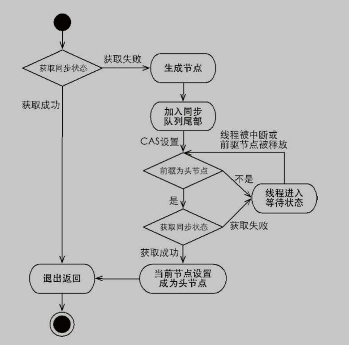

- [高并发场景下锁的使用技巧](<https://mp.weixin.qq.com/s?__biz=MzAxNjk4ODE4OQ==&mid=2247488332&idx=3&sn=da334ae1f173962462fc9153aa293e43&chksm=9bed323eac9abb28b3bb91294f136aee0468c75ad409f899658ba5032028df3e96a1213554cd&mpshare=1&scene=23&srcid=&sharer_sharetime=1581792549834&sharer_shareid=e6d90aec84add5cf004cb1ab6979727c#rd>)
- 【顶】[聊聊 Java 的几把 JVM 级锁](<https://mp.weixin.qq.com/s?__biz=Mzg2OTA0Njk0OA==&mid=2247486216&idx=2&sn=ad6b53cfab99dcb0aac78020d200ab16&chksm=cea244c3f9d5cdd553e279268905b8d593c7f25a588f798a09ca42b2b171df86108db56d1438&mpshare=1&scene=23&srcid=&sharer_sharetime=1581947474968&sharer_shareid=e6d90aec84add5cf004cb1ab6979727c#rd>)
- 【覆盖面全】[Java中的锁[原理、锁优化、CAS、AQS]](<https://mp.weixin.qq.com/s?__biz=MzI2OTQ4OTQ1NQ==&mid=2247487982&idx=2&sn=e02303bab7a3ffe462fbd6ff779e6ac4&chksm=eaded5aedda95cb87ee6140d9e9f0d94c1bd2d977d7e028991ecc79869653f0aa0d817569457&mpshare=1&scene=23&srcid=&sharer_sharetime=1583059275113&sharer_shareid=e6d90aec84add5cf004cb1ab6979727c#rd>)
- 【顶】[15.多线程编程中锁的4种状态-无锁状态 偏向锁状态 轻量级锁状态 重量级锁状态](<https://blog.csdn.net/u014590757/article/details/79717549>)


### 2.2.3 锁存放的位置

锁标记存放在Java对象头的Mark Word中。

对象头的Mark Word包括   对象的HashCode， 对象分代年龄，是否是偏向锁，锁标志位


`HotSpot`通过**markOop**类型**实现Mark Word**，具体实现位于markOop.hpp文件中。

**对象头区域此处存储的信息包括两部分：**

```
1、对象自身的运行时数据( MarkWord )

存储 hashCode、GC 分代年龄、锁类型标记、偏向锁线程 ID 、 CAS 锁指向线程 LockRecord 的指针等， synconized 锁的机制与这个部分( markwork )密切相关，用 markword 中最低的三位代表锁的状态，其中一位是偏向锁位，另外两位是普通锁位。

2、对象类型指针( Class Pointer )

对象指向它的类元数据的指针、 JVM 就是通过它来确定是哪个 Class 的实例。
```

**实例数据区域** 

此处存储的是对象真正有效的信息，比如对象中所有字段的内容

**对齐填充区域**

JVM 的实现 **HostSpot 规定对象的起始地址必须是 8 字节的整数倍**，换句话来说，现在 64 位的 OS 往外读取数据的时候一次性读取 64bit 整数倍的数据，也就是 8 个字节，所以 **HotSpot 为了高效读取对象，就做了"对齐"**，如果一个对象实际占的内存大小不是 8byte 的整数倍时，就"补位"到 8byte 的整数倍。所以对齐填充区域的大小不是固定的。


先`MarkWord`**存到栈**，然后`MarkWord`区域替换为指针，为了修改成为自己线程的id，最后结束后`markword`从

栈中恢复过来


### 2.2.3 synchronized的锁优化

JavaSE1.6为了减少获得锁和释放锁带来的性能消耗，引入了“偏向锁”和“轻量级锁”。

> 一：java多线程互斥，和java多线程引入偏向锁和轻量级锁的原因？

**概括**：Synchronized是基于进入和退出**Moniter对象**实现的，而`moniterenter`指令和`moniterexit`指令依赖于操作系统的互斥实现。程序挂起的话会**从用户态到内核态**，消耗大量资源，得避免，减少多线程进入互斥的几率。在尝试进入互斥前**使用CAS**进行补救。

```
一：java多线程互斥，和java多线程引入偏向锁和轻量级锁的原因？

--->synchronized的重量级别的锁，就是在线程运行到该代码块的时候，让程序的运行级别从用户态切换到内核态，把所有的线程挂起，让cpu通过操作系统指令，去调度多线程之间，谁执行代码块，谁进入阻塞状态。这样会频繁出现程序运行状态的切换，线程的挂起和唤醒，这样就会大量消耗资源，程序运行的效率低下。为了提高效率，jvm的开发人员，引入了偏向锁，和轻量级锁，尽量让多线程访问公共资源的时候，不进行程序运行状态的切换。
====================================================================================
--->jvm规范中可以看到synchronized在jvm里实现原理，jvm基于进入和退出Monitor对象来实现方法同步和代码块同步的。在代码同步的开始位置织入monitorenter,在结束同步的位置（正常结束和异常结束处）织入monitorexit指令实现。线程执行到monitorenter处，将会获取锁对象对应的monitor的所有权，即尝试获得对象的锁。（任意对象都有一个monitor与之关联，当且一个monitor被持有后，他处于锁定状态）
--->java的多线程安全是基于lock机制实现的，而lock的性能往往不如人意。原因是，monitorenter与monitorexit这两个控制多线程同步的bytecode原语，是jvm依赖操作系统互斥（mutex）来实现的。
--->互斥是一种会导致线程挂起，并在较短时间内又需要重新调度回原线程的，较为消耗资源的操作。
--->为了优化java的Lock机制，从java6开始引入轻量级锁的概念。轻量级锁本意是为了减少多线程进入互斥的几率，并不是要替代互斥。它利用了cpu原语Compare-And-Swap（cas,汇编指令CMPXCHG）,尝试进入互斥前，进行补救。
```

————————————————

**在JavaSE1.6中，锁一共有4种状态**，级别从低到高依次是：**无锁状态、偏向锁状态、轻量级锁状态和重量级锁状态**，这几个状态会随着竞争情况逐渐升级。

**锁可以升级但不能降级**，意味着偏向锁升级成轻量级锁后不能降级成偏向锁。这种锁升级却不能降级的策略，目的是为了提高获得锁和释放锁的效率。


## [Synchronized优化和有锁升级过程！！！](<https://mp.weixin.qq.com/s?__biz=Mzg2OTA0Njk0OA==&mid=2247486216&idx=2&sn=ad6b53cfab99dcb0aac78020d200ab16&chksm=cea244c3f9d5cdd553e279268905b8d593c7f25a588f798a09ca42b2b171df86108db56d1438&mpshare=1&scene=23&srcid=&sharer_sharetime=1581947474968&sharer_shareid=e6d90aec84add5cf004cb1ab6979727c#rd>)


```
如上图所示， synchronized 锁升级的顺序为：偏向锁->轻量级锁->重量级锁，每一步触发锁升级的情况如下：
===================================================================================
偏向锁
在 JDK1.8 中，【其实默认是轻量级锁】，但如果设定了 -XX:BiasedLockingStartupDelay = 0 ，那在对一个 Object 做 syncronized 的时候，会立即上一把偏向锁。偏向第一个线程，这个线程在修改对象头MarkWord成为偏向锁的时候使用CAS操作，并将对象头中的ThreadID改成自己的ID，之后再次访问这个对象时，只需要对比ID，不需要再使用CAS在进行操作。当处于偏向锁状态时， markwork 会记录当前线程 ID 

===================================================================================
升级到轻量级锁   ————对比线程ID，通过 CAS (自旋)的操作竞争将锁对象头中的 markwork 设置为指向自己的 LR 的指针

当下一个线程参与到偏向锁竞争时，会先判断 markword 中保存的线程 ID 是否与这个线程 ID 相等，如果不相等，会立即撤销偏向锁，升级为轻量级锁。每个线程在自己的线程栈中生成一个 LockRecord ( LR )，然后每个线程通过 CAS (自旋)的操作将锁对象头中的 markwork 设置为指向自己的 LR 的指针，哪个线程设置成功，就意味着获得锁。关于 synchronized 中此时执行的 CAS 操作是通过 native 的调用 HotSpot 中 bytecodeInterpreter.cpp 文件 C++ 代码实现的，有兴趣的可以继续深挖。
===================================================================================
升级到重量级锁——————如果锁竞争加剧(如线程自旋次数或者自旋的线程数超过某阈值）需要做内核态到用户态的转换

如果锁竞争加剧(如线程自旋次数或者自旋的线程数超过某阈值， JDK1.6 之后，由 JVM 自己控制该规则)，就会升级为重量级锁。此时就会向操作系统申请资源，线程挂起，【进入到操作系统内核态的等待队列中】，等待操作系统调度，然后映射回用户态。在重量级锁中，由于需要做【内核态到用户态的转换】，而这个过程中需要消耗较多时间，也就是"重"的原因之一。
===================================================================================
```


面试题：

```
简单介绍了Java对象头，我们下面再看Monitor。

1 偏向锁的实现：偏向锁不需要使用类似lock中的cas操作获得锁，而是通过判断对象头中maskword的偏向锁线程id判断自己是否获得了锁，如果不是则检查偏向锁是否开启，如果没有开启则使用（膨胀为轻量级锁），如果开启了就尝试用cas操作把线程id改为自己的id。

2 轻量级锁的实现。把对象头中的maskword复制到当前线程的栈帧中，然后使用cas操作尝试使对象头的指针指向锁记录mask word，如果操作成功则获得锁，如果失败，则尝试自旋获取锁。

3 如果轻量级锁升级，则变成重量级锁，也就是monitor in和monitor out。
```


### 偏向锁

无锁竞争的情况下为了减少锁竞争的资源开销，引入偏向锁。

**（第一次对象用CAS操作，之后都不需要。直到有线程竞争，升级）**

**重点：线程ID、Mark Word中偏向锁的标识、仅第一次CAS**

```
大多数情况下，锁不仅不存在多线程竞争，而且总是由同一线程多次获得，为了让线程获得锁的代价更低而引入了偏向锁。当一个线程访问同步块并获取锁时，会在对象头和栈帧中的锁记录里存储锁偏向的线程ID，以后该线程在进入和退出同步块时不需要进行CAS操作来加锁和解锁，只需简单地测试一下对象头的Mark Word里是否存储着指向当前线程的偏向锁。如果测试成功，表示线程已经获得了锁。(即偏向锁的线程ID是当前线程的)

如果测试失败，则需要再测试一下Mark Word中偏向锁的标识是否设置成1（表示当前是偏向锁）：

如果设置了，则尝试使用CAS将对象头的偏向锁指向当前线程。

如果没有设置，则使用CAS竞争锁（则证明此时已经不是偏向锁了，那么就用CAS去竞争锁，此时已经是轻量级以上的锁了）；

--->a线程获得锁，会在a线程的的栈帧里创建lockRecord，在lockRecord里和锁对象的MarkWord里存储线程a的线程id.以后该线程的进入，就不需要cas操作，只需要判断是否是当前线程。

--->a线程获取锁，不会释放锁。直到b线程也要竞争该锁时，a线程才会释放锁。

--->偏向锁的释放，（其实就是线程b要操作的时候，看是否可以释放掉a线程的偏向锁）需要等待全局安全点（在这个时间点上没有正在执行的字节码），它会首先暂停拥有偏向锁的线程(达到安全点再暂停阿~)，然后检查持有偏向锁的线程是否还活着，如果线程不处于活动状态，则将锁对象的MarkWord设置成无锁状态，再指向b线程。如果线程仍然活着，拥有偏向锁的栈会被执行。线程a不需要用到该偏向锁了，则恢复到无锁，如果还要用，则和b产生竞争，标记对象不适合作为偏向锁。最后唤醒暂停的线程。

--->关闭偏向锁，通过jvm的参数-XX:UseBiasedLocking=false,则默认会进入轻量级锁。

 

偏向锁升级：一个对象刚开始实例化的时候，没有任何线程来访问它的时候。它是可偏向的，意味着，它现在认为只可能有一个线程来访问它，所以当第一个线程来访问它的时候，它会偏向这个线程，此时，对象持有偏向锁。偏向第一个线程，这个线程在修改对象头MarkWord成为偏向锁的时候使用CAS操作，并将对象头中的ThreadID改成自己的ID，之后再次访问这个对象时，只需要对比ID，不需要再使用CAS在进行操作。

一旦有第二个线程访问这个对象，因为偏向锁不会主动释放，所以第二个线程可以看到对象时偏向状态，这时表明在这个对象上已经存在竞争了，检查原来持有该对象锁的线程是否依然存活。如果挂了，则可以将对象变为无锁状态，然后重新偏向新的线程，如果原来的线程依然存活，则马上执行那个线程的操作栈，检查该对象的使用情况，如果仍然需要持有偏向锁，则偏向锁升级为轻量级锁（偏向锁就是这个时候升级为轻量级锁的）。

如果不存在使用了，则可以将对象回复成无锁状态，然后重新偏向。


再来一次：

引入偏向锁是为了在无多线程竞争的情况下尽量减少不必要的轻量级锁执行路径，因为轻量级锁的获取及释放依赖多次CAS原子指令，而偏向锁只需要在置换ThreadID的时候依赖一次CAS原子指令（由于一旦出现多线程竞争的情况就必须撤销偏向锁，所以偏向锁的撤销操作的性能损耗必须小于节省下来的CAS原子指令的性能消耗）。上面说过，轻量级锁是为了在线程交替执行同步块时提高性能，而偏向锁则是在只有一个线程执行同步块时进一步提高性能。

1、偏向锁获取过程：

　　（1）访问Mark Word中偏向锁的标识是否设置成1，锁标志位是否为01——确认为可偏向状态。

　　（2）如果为可偏向状态，则测试线程ID是否指向当前线程，如果是，进入步骤（5），否则进入步骤（3）。

　　（3）如果线程ID并未指向当前线程，则通过CAS操作竞争锁。如果竞争成功，则将Mark Word中线程ID设置为当前线程ID，然后执行（5）；如果竞争失败，执行（4）。

　　（4）如果CAS获取偏向锁失败，则表示有竞争。当到达全局安全点（safepoint）时获得偏向锁的线程被挂起，偏向锁升级为轻量级锁，然后被阻塞在安全点的线程继续往下执行同步代码。

　　（5）执行同步代码。

2、偏向锁的释放：

偏向锁的撤销在上述第四步骤中有提到。偏向锁只有遇到其他线程尝试竞争偏向锁时，持有偏向锁的线程才会释放锁，线程不会主动去释放偏向锁。偏向锁的撤销，需要等待全局安全点（在这个时间点上没有字节码正在执行），它会首先暂停拥有偏向锁的线程，判断锁对象是否处于被锁定状态，撤销偏向锁后恢复到未锁定（标志位为“01”）或轻量级锁（标志位为“00”）的状态。

这个得看拥有该偏向锁是否还有需要用，如果该线程已经死了或者没用了，则恢复未锁定，再重新偏向即可，否则，则升级，并且偏向状态为0，此时已经不是偏向锁了。~
```


### 轻量级锁
轻量级锁所适应的场景是线程交替执行同步块的情况。

```
（1）在代码进入同步块的时候，如果同步对象锁状态为无锁状态（锁标志位为“01”状态，是否为偏向锁为“0”），虚拟机首先将在当前线程的栈帧中建立一个名为锁记录（Lock Record）的空间，用于存储锁对象目前的Mark Word的拷贝，官方称之为 Displaced Mark Word。

（2）拷贝对象头中的Mark Word复制到锁记录中。

（3）拷贝成功后，虚拟机将使用CAS操作尝试将对象的Mark Word更新为指向Lock Record的指针，并将Lock record里的owner指针指向object mark word。如果更新成功，则执行步骤（4），否则执行步骤（5）。

（4）如果这个更新动作成功了，那么这个线程就拥有了该对象的锁，并且对象Mark Word的锁标志位设置为“00”，即表示此对象处于轻量级锁定状态.

（5）如果这个更新操作失败了，虚拟机首先会检查对象的Mark Word是否指向当前线程的栈帧，如果是就说明当前线程已经拥有了这个对象的锁，那就可以直接进入同步块继续执行。否则说明多个线程竞争锁，轻量级锁就要膨胀为重量级锁，锁标志的状态值变为“10”，Mark Word中存储的就是指向重量级锁（互斥量）的指针，后面等待锁的线程也要进入阻塞状态。
```

 而当前线程便尝试使用自旋来获取锁，自旋就是为了不让线程阻塞，而采用循环去获取锁的过程。


### 重量级锁

重量级锁：就是让**争抢锁的线程从用户态转换成内核态。**让`cpu`借助操作系统进行线程协调。


### 锁膨胀


### 锁粗化（Lock Coarsening）

这是JVM 对 synchronized 的优化。

也就是减少不必要的紧连在一起的unlock，lock操作，将多个连续的锁扩展成一个**范围更大的锁**。

```
--->原则上，我们在编写代码的时候，总是推荐将同步块的作用范围限制得尽量小——只在共享数据的实际作用域中才进行同步，这样是为了使得需要同步的操作数量尽可能变小，如果存在锁竞争，那等待锁的线程也能尽快地拿到锁。

--->大部分情况下，上面的原则都是正确的，但是如果一系列的连续操作都对同一个对象反复加锁和解锁，甚至加锁操作是出现在循环体中的，那即使没有线程竞争，频繁地进行互斥同步操作也会导致不必要的性能损耗。

--->如果虚拟机探测到有这样一串零碎的操作都对同一个对象加锁，将会把加锁同步的范围扩展（锁粗化）到整个操作序列的外部。
```


### 锁消除

锁削除是指虚拟机即时编译器在运行时，对一些代码上要求同步，但是被检测到**不可能存在共享数据竞争的锁**进行**削除**。

```
--->锁削除是指虚拟机即时编译器在运行时，对一些代码上要求同步，但是被检测到不可能存在共享数据竞争的锁进行削除。锁削除的主要判定依据来源于逃逸分析的数据支持（第11章已经讲解过逃逸分析技术），如果判断到一段代码中，在堆上的所有数据都不会逃逸出去被其他线程访问到，那就可以把它们当作栈上数据对待，认为它们是线程私有的，同步加锁自然就无须进行。 

--->也许读者会有疑问，变量是否逃逸，对于虚拟机来说需要使用数据流分析来确定，但是程序员自己应该是很清楚的，怎么会在明知道不存在数据争用的情况下要求同步呢？答案是有许多同步措施并不是程序员自己加入的，同步的代码在Java程序中的普遍程度也许超过了大部分读者的想象。比如：（只是说明概念，但实际情况并不一定如例子）在线程安全的环境中使用stringBuffer进行字符串拼加。则会在java文件编译的时候，进行锁销除。
```


### 适应性自旋

​	这是JVM 对 synchronized 的优化。

​       自适应意味着自旋的时间不再固定了，而是**由前一次在同一个锁上的自旋时间及锁的拥有者的状态来决定**。如果在同一个锁对象上，自旋等待刚刚成功获得过锁，并且持有锁的线程正在运行中，那么虚拟机就会认为这次自旋也很有可能再次成功，进而它将允许自旋等待持续相对更长的时间，比如100个循环。另一方面，如果对于某个锁，自旋很少成功获得过，那在以后要获取这个锁时将可能省略掉自旋过程，以避免浪费处理器资源。


> 二：为什么要自旋或者自适应自旋？

```
--->前面我们讨论互斥同步的时候，提到了互斥同步对性能最大的影响是阻塞的实现，挂起线程和恢复线程的操作都需要转入内核态中完成，这些操作给系统的并发性能带来了很大的压力。同时，虚拟机的开发团队也注意到在许多应用上，共享数据的锁定状态只会持续很短的一段时间，为了这段时间去挂起和恢复线程并不值得。如果物理机器有一个以上的处理器，能让两个或以上的线程同时并行执行，我们就可以让后面请求锁的那个线程“稍等一会”，但不放弃处理器的执行时间，看看持有锁的线程是否很快就会释放锁。为了让线程等待，我们只须让线程执行一个忙循环（自旋），这项技术就是所谓的自旋锁。 

 --->自旋锁在JDK 1.4.2中就已经引入，只不过默认是关闭的，可以使用-XX:+UseSpinning参数来开启，在JDK 1.6中就已经改为默认开启了。自旋等待不能代替阻塞，且先不说对处理器数量的要求，自旋等待本身虽然避免了线程切换的开销，但它是要占用处理器时间的，所以如果锁被占用的时间很短，自旋等待的效果就会非常好，反之如果锁被占用的时间很长，那么自旋的线程只会白白消耗处理器资源，而不会做任何有用的工作，反而会带来性能的浪费。因此自旋等待的时间必须要有一定的限度，如果自旋超过了限定的次数仍然没有成功获得锁，就应当使用传统的方式去挂起线程了。自旋次数的默认值是10次，用户可以使用参数-XX:PreBlockSpin来更改。 

--->在JDK 1.6中引入了自适应的自旋锁。自适应意味着自旋的时间不再固定了，而是由前一次在同一个锁上的自旋时间及锁的拥有者的状态来决定。如果在同一个锁对象上，自旋等待刚刚成功获得过锁，并且持有锁的线程正在运行中，那么虚拟机就会认为这次自旋也很有可能再次成功，进而它将允许自旋等待持续相对更长的时间，比如100个循环。另一方面，如果对于某个锁，自旋很少成功获得过，那在以后要获取这个锁时将可能省略掉自旋过程，以避免浪费处理器资源。有了自适应自旋，随着程序运行和性能监控信息的不断完善，虚拟机对程序锁的状况预测就会越来越准确，虚拟机就会变得越来越“聪明”了。 
```


### 2.2.4 锁的优缺点对比


| 锁       | 优点                                                         | 缺点                                              | 适用场景                               |
| -------- | ------------------------------------------------------------ | ------------------------------------------------- | -------------------------------------- |
| 偏向锁   | 加锁和解锁不需要额外的消耗，和执行非同步方法相比仅存在纳秒级的差距 | 如果线程间存在锁竞争，会带来额外的锁撤销的消耗    | **适用于只有一个线程访问同步块场景**   |
| 轻量级锁 | 竞争的线程不会阻塞，提高了程序的响应速度                     | 如果始终得不到索竞争的线程，使用**自旋**会消耗CPU | **追求响应速度，同步块执行速度非常快** |
| 重量级锁 | 线程竞争不使用自旋，不会消耗CPU                              | 线程阻塞，响应时间缓慢                            | **追求吞吐量，同步块执行速度较慢**     |


### **可重入**

synchronized 拥有强制原子性的内部锁机制，是一把可重入锁。因此，在一个线程使用 synchronized 方法时调用该对象另一个 synchronized 方法，即一个线程得到一个对象锁后再次请求该对象锁，是永远可以拿到锁的。在 Java 中线程获得对象锁的操作是以线程为单位的，而不是以调用为单位的。 synchronized 锁的对象头的 markwork 中会记录该锁的线程持有者和计数器，当一个线程请求成功后， JVM 会记下持有锁的线程，并将计数器计为1。此时其他线程请求该锁，则必须等待。而该持有锁的线程如果再次请求这个锁，就可以再次拿到这个锁，同时计数器会递增。当线程退出一个  synchronized 方法/块时，计数器会递减，如果计数器为 0 则释放该锁锁。


### **悲观锁(互斥锁、排他锁)**

 synchronized 是一把悲观锁(独占锁)，当前线程如果获取到锁，会导致其它所有需要锁该的线程等待，一直等待持有锁的线程释放锁才继续进行锁的争抢。


### [什么是乐观锁，什么是悲观锁](<https://www.jianshu.com/p/d2ac26ca6525>)

- “先取锁再访问”。悲观锁修改数据之前先锁定，再修改。主要是共享锁（读锁）或者排他锁（写锁）
- 相信事务之间的数据竞争(data race)的概率是比较小的，因此**尽可能直接做下去**，直到**提交的时候才去锁定**。**在数据进行提交更新的时候，才会正式对数据的冲突与否进行检测**，如果发现冲突了，则返回给用户错误的信息，让用户决定如何去做。所以**不会产生任何锁和死锁**。相对于悲观锁，在对数据库进行处理的时候，乐观锁并不会使用数据库提供的锁机制。一般的实现乐观锁的方式就是**记录数据版本**。


# 2.3、CAS

**CAS**，在Java并发应用中通常指`CompareAndSwap`或`CompareAndSet`，即比较并交换。

1、CAS是一个**原子操作**，它比较一个**内存位置的值**并且只**有相等时**修改这个内存位置的值为**新的值**，**保证了新的值总是基于最新的信息计算的**，如果有其他线程在这期间修改了这个值则CAS失败。CAS**返回**`是否成功`或者`内存位置原来的值`用于判断是否CAS成功。

2、**JVM中的CAS操作**是利用了处理器提供的**CMPXCHG**`(compare and exchange)`指令实现的，这个指令也不能保证原子性，需要在前面加上 lock 指令。lock 指令可以保证一个 CPU 核心在操作期间独占一片内存区域。

> CAS 主要分三步，读取-比较-修改。其中比较是在检测是否有冲突，如果检测到没有冲突后，其他线程还能修改这个值，那么 CAS 还是无法保证正确性。所以最关键的是要保证比较-修改这两步操作的原子性。
>
> CAS 底层是靠调用 CPU 指令集的 `cmpxchg` 完成的，它是 x86 和 Intel 架构中的 compare and exchange 指令。在多核的情况下，这个指令也不能保证原子性，需要在前面加上 lock 指令。lock 指令可以保证一个 CPU 核心在操作期间独占一片内存区域。那么 这又是如何实现的呢？
>
> 在处理器中，一般有两种方式来实现上述效果：总线锁和缓存锁。在多核处理器的结构中，CPU 核心并不能直接访问内存，而是统一通过一条总线访问。总线锁就是锁住这条总线，使其他核心无法访问内存。这种方式代价太大了，会导致其他核心停止工作。而缓存锁并不锁定总线，只是锁定某部分内存区域。当一个 CPU 核心将内存区域的数据读取到自己的缓存区后，它会锁定缓存对应的内存区域。锁住期间，其他核心无法操作这块内存区域。

```
CAS 就是通过这种方式实现比较和交换操作的原子性的。
值得注意的是， CAS 只是保证了操作的原子性，并不保证变量的可见性，因此变量需要加上 volatile 关键字。
```


**优点**：

- 竞争不大的时候系统开销小。

**缺点**：

- 循环时间长开销大。
- ABA问题。
- 只能保证一个共享变量的原子操作。


无关紧要的一段话：

```
在高并发的情况下，我们对一个 Integer 类型的整数直接进行 i++ 的时候，无法保证操作的原子性，会出现线程安全的问题。为此我们会用 juc 下的 AtomicInteger ，它是一个提供原子操作的 Interger 类，内部也是通过 CAS 实现线程安全的。但当大量线程同时去访问时，就会因为大量线程执行 CAS 操作失败而进行空旋转，导致 CPU 资源消耗过多，而且执行效率也不高。

解决方法：oug Lea 大神应该也不满意，于是在 JDK1.8 中对 CAS 进行了优化，提供了 LongAdder ，它是基于了 CAS 分段锁的思想实现的。
```


# 3、JAVA中锁的实现

## 3.1、队列同步器（AQS）

`AQS 是基于 volitale 和 CAS 实现的`

队列同步器`AbstractQueuedSynchronizer`（以下简称同步器），**是用来构建锁或者其他同步组件的基础框架**

- 它使用了一个`int`成员变量表示**同步状态**

  ```
  AQS 是基于 volitale 和 CAS 实现的，其中 AQS 中维护一个 valitale 类型的变量 state 来做一个可重入锁的重入次数，加锁和释放锁也是围绕这个变量来进行的。state 为0表示没有任何线程持有这个锁，线程持有该锁后将 state 加1，释放时减1。多次持有释放则多次加减。
  ```

- 通过内置的**FIFO双向队列**来完成**获取锁线程**的排队工作
  - 链表除了头结点外，每一个节点都记录了线程的信息，代表一个等待线程。
  - 同步器包含两个节点类型的应用，一个指向头节点，一个指向尾节点，未获取到锁的线程会创建节点线程安全（`compareAndSetTail`）的加入队列尾部。同步队列遵循FIFO，首节点是获取同步状态成功的节点。
  - 未获取到锁的线程将创建一个节点，设置到尾节点
  - 首节点的线程在释放锁时，将会唤醒后继节点。而后继节点将会在获取锁成功时将自己设置为首节点


下面参考<https://blog.csdn.net/u010325193/article/details/86590169>

## 请求锁

请求锁时有三种可能：

1. 如果没有线程持有锁，则请求成功，当前线程直接获取到锁。
2. 如果当前线程已经持有锁，则使用 CAS 将 state 值加1，表示自己再次申请了锁，释放锁时减1。这就是可重入性的实现。
3. 如果由其他线程持有锁，那么将自己添加进等待队列。

```java
final void lock() {
    if (compareAndSetState(0, 1))   
        setExclusiveOwnerThread(Thread.currentThread()); //没有线程持有锁时，直接获取锁，对应情况1
    else
        acquire(1);
}
 
public final void acquire(int arg) {
    if (!tryAcquire(arg) && //在此方法中会判断当前持有线程是否等于自己，对应情况2
        acquireQueued(addWaiter(Node.EXCLUSIVE), arg)) //将自己加入队列中，对应情况3
        selfInterrupt();
}
```


## 创建 Node 节点并加入链表

如果没竞争到锁，这时候就要进入等待队列。队列是默认有一个 head 节点的，并且不包含线程信息。上面情况3中，addWaiter 会创建一个 Node，并添加到链表的末尾，Node 中持有当前线程的引用。同时还有一个成员变量 waitStatus，表示线程的等待状态，初始值为0。我们还需要关注两个值：

- CANCELLED，值为1，表示取消状态，就是说我不要这个锁了，请你把我移出去。
- SINGAL，值为-1，表示下一个节点正在挂起等待，注意是下一个节点，不是当前节点。

同时，加到链表末尾的操作使用了 CAS+死循环的模式，很有代表性，拿出来看一看：

```java
Node node = new Node(mode);
for (;;) {
    Node oldTail = tail;
    if (oldTail != null) {
        U.putObject(node, Node.PREV, oldTail);
        if (compareAndSetTail(oldTail, node)) {
            oldTail.next = node;
            return node;
        }
    } else {
        initializeSyncQueue();
    }
}
```

可以看到，在死循环里调用了 CAS 的方法。如果多个线程同时调用该方法，那么每次循环都只有一个线程执行成功，其他线程进入下一次循环，重新调用。N个线程就会循环N次。这样就在无锁的模式下实现了并发模型。


## 挂起等待

- 如果此节点的上一个节点是头部节点，则再次尝试获取锁，获取到了就移除并返回。获取不到就进入下一步；
- 判断前一个节点的 waitStatus，如果是 SINGAL，则返回 true，并调用 LockSupport.park() 将线程挂起；
- 如果是 CANCELLED，则将前一个节点移除；
- 如果是其他值，则将前一个节点的 waitStatus 标记为 SINGAL，进入下一次循环。

可以看到，一个线程最多有两次机会，还竞争不到就去挂起等待。

```java
final boolean acquireQueued(final Node node, int arg) {
    try {
        boolean interrupted = false;
        for (;;) {
            final Node p = node.predecessor();
            if (p == head && tryAcquire(arg)) {
                setHead(node);
                p.next = null; // help GC
                return interrupted;
            }
            if (shouldParkAfterFailedAcquire(p, node) &&
                parkAndCheckInterrupt())
                interrupted = true;
        }
    } catch (Throwable t) {
        cancelAcquire(node);
        throw t;
    }
}
复制代码
```


## 释放锁

- 调用 tryRelease，此方法由子类实现。实现非常简单，如果当前线程是持有锁的线程，就将 state 减1。减完后如果 state 大于0，表示当前线程仍然持有锁，返回 false。如果等于0，表示已经没有线程持有锁，返回 true，进入下一步；
- 如果头部节点的 waitStatus 不等于0，则调用LockSupport.unpark()唤醒其下一个节点。头部节点的下一个节点就是等待队列中的第一个线程，这反映了 AQS 先进先出的特点。另外，即使是非公平锁，进入队列之后，还是得按顺序来。

```java
public final boolean release(int arg) {
    if (tryRelease(arg)) { //将 state 减1
        Node h = head;
        if (h != null && h.waitStatus != 0)
            unparkSuccessor(h);
        return true;
    }
    return false;
}
 
private void unparkSuccessor(Node node) {
    int ws = node.waitStatus;
    if (ws < 0)
        node.compareAndSetWaitStatus(ws, 0);
        
    Node s = node.next;
    if (s == null || s.waitStatus > 0) { 
        s = null;
        for (Node p = tail; p != node && p != null; p = p.prev)
            if (p.waitStatus <= 0)
                s = p;
    }
    if (s != null) //唤醒第一个等待的线程
        LockSupport.unpark(s.thread);
}
```


## 公平锁如何实现

上面分析的是非公平锁，那公平锁呢？很简单，在竞争锁之前判断一下等待队列中有没有线程在等待就行了。

```java
protected final boolean tryAcquire(int acquires) {
    final Thread current = Thread.currentThread();
    int c = getState();
    if (c == 0) {
        if (!hasQueuedPredecessors() && //判断等待队列是否有节点
            compareAndSetState(0, acquires)) {
            setExclusiveOwnerThread(current);
            return true;
        }
    }
    ......
    return false;
}
```


**AQS连问···我不会，得补补**

<https://www.cnblogs.com/tong-yuan/p/11768904.html>


### 3.1.3、独占式/共享式锁获取

**独占式**：有且只有一个线程能获取到锁，如：`ReentrantLock` <-----[源码层面理解](<https://www.cnblogs.com/takumicx/p/9402021.html>)

**共享式**：可以多个线程同时获取到锁，如：`CountDownLatch`


#### 独占式

- 每个节点自旋观察自己的前一节点是不是Header节点，如果是，就去尝试获取锁

- 独占式锁获取流程

  

  

#### 共享式

- 共享式与独占式的区别：

  

- 共享锁获取流程

  


# 4、锁的使用用例

## 4.1、`ConcurrentHashMap`的实现原理及使用


​		`ConcurrentHashMap`类图


​		`ConcurrentHashMap`数据结构


**结论**：`ConcurrentHashMap`使用的**锁分段**技术。首先将数据分成一段一段地存储，然后给每一段数据配一把锁，当一个线程占用锁访问其中一个段数据的时候，其他段的数据也能被其他线程访问。