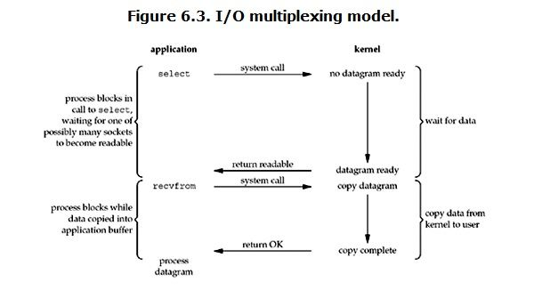

# 介绍

​    在谈及网络IO的时候总避不开阻塞、非阻塞、同步、异步、IO多路复用、select、poll、epoll等这几个词语。在面试的时候也会被经常问到这几个的区别。本文就来讲一下这几个词语的含义、区别以及使用方式。
Unix网络编程一书中作者给出了五种IO模型：

```
1、BlockingIO - 阻塞IO
2、NoneBlockingIO - 非阻塞IO
3、IO multiplexing - IO多路复用
4、signal driven IO - 信号驱动IO
5、asynchronous IO - 异步IO
```

这五种IO模型中前四个都是**同步的IO**，只有最后一个是**异步IO**。`信号驱动IO`使用的比较少，重点介绍其他几种IO以及在Java中的应用。


# 阻塞、非阻塞、同步、异步以及IO多路复用

​    在进行网络IO的时候会涉及到用户态和内核态，并且在用户态和内核态之间会发生数据交换，从这个角度来说我们可以把IO抽象成两个阶段：

​	1、**用户态**等待内核态数据准备好

​	2、将数据从内核态**拷贝**到用户态。

之所以会有同步、异步、阻塞和非阻塞这几种说法就是根据程序在这两个阶段的处理方式不同而产生的。


- ## 同步阻塞

  

  ​       当在用户态调用read操作的时候，如果这时候kernel还没有准备好数据，那么用户态会一直阻塞等待，直到有数据返回。当kernel准备好数据之后，用户态继续等待kernel把数据从内核态拷贝到用户态之后才可以使用。这里会发生**两种等待**：

  - 一个是用户态等待kernel**有数据可以读**
  - 另外一个是当有数据可读时用户态等待kernel把**数据拷贝**到用户态。

  ​       在Java中同步阻塞的实现对应的是**传统的文件IO操作**以及**Socket的accept**的过程。在Socket调用accept的时候，程序会一直等待知道有描述符就绪，并且把就绪的数据拷贝到用户态，然后程序中就可以拿到对应的数据。

- ## 同步非阻塞

  

  ​        对比第一张同步阻塞IO的图就会发现，在同步非阻塞模型下**第一个阶段是不等待的**，无论有没有数据准备好，都是立即返回。**第二个阶段仍然是需要等待的**，用户态需要等待内核态把数据拷贝过来才能使用。对于同步非阻塞模式的处理，需要每隔一段时间就去询问一下内核数据是不是可以读了，如果内核说可以，那么就开始第二阶段等待。

- ## IO多路复用

  IO多路复用也是同步的。

  

  ​        IO多路复用的方式看起来跟同步阻塞是一样的，**两个阶段都是阻塞的**，但是IO多路复用可以实现以较小的代价同时监听多个IO。**通常情况下是通过一个线程来同时监听多个描述符，只要任何一个满足就绪条件，那么内核态就返回**。IO多路复用使得传统的每请求每线程的处理方式得到**解耦**，**一个线程可以同时处理多个IO请求，然后交到后面的线程池里处理**，这也是netty等框架的处理方式，所谓的**reactor模式**。IO多路复用的实现**依赖于操作系统的select、poll和epoll**，后面会详细介绍这几个系统调用。
  ​    IO多路复用在Java中的实现方式是**在Socket编程中使用非阻塞模式，然后配置感兴趣的事件，通过调用select函数来实现**。select函数就是对应的第一个阶段。如果给select配置了超时参数，**在指定时间内**没有感兴趣事件发生的话，**select调用也会返回**，这也是为什么要做非阻塞模式下运行。

- ## 异步IO

  

  ​       异步模式下，前面提到的两个阶段都不会等待。使用异步模式，用户态调用read方法的时候，相当于告诉内核数据发送给我之后告诉我一声我先去干别的事情了。在这两个阶段都不会等待，只需要在内核态通知数据准备好之后使用即可。通常情况下使用异步模式都**会使用callback**，当数据可用之后执行callback函数。


# IO多路复用

IO多路复用基础是select，poll，epoll

- ### select

  ```
  int select(int maxfdp1, fd_set *readset,fd_set *writeset,fd_set *exceptset,const struct timeval *timeout)
  
     - maxfdp1为指定的待监听的描述符的个数，因为描述符是从0开始的，所以需要加1。
     - readset为要监听的读描述符。
     - writeset为要监听的写描述符。
     - exceptset为要监听的异常描述符。
     - timeout监听没有准备好的描述符的话，多久可以返回。
      select操作的逻辑是首先将要监听的读、写以及异常描述符拷贝到内核空间，然后遍历所有的描述符，如果有感兴趣的事件发生，那么就返回。
  select在使用的过程中有三个问题：
  1、被监控的fds(描述符)集合限制为1024，1024太小了
  2、需要将描述符集合从用户空间拷贝到内核空间
  3、当有描述符可操作的时候都需要遍历一下整个描述符集合才能知道哪个是可操作的，效率很低。
  ```

- ### poll

  ```
  int poll(struct pollfd[] fds, unsigned int nfds, int timeout)
  
  poll操作与select操作类似，仍旧避免不了描述符从用户空间拷贝到内核空间，但是poll不再有1024个描述符的限制。对于事件的触发通知还是使用遍历所有描述符的方式，因此在大量连接的情况下也存在遍历低效的问题。poll函数在传递参数的时候统一的将要监听的描述符和事件封装在了pollfd结构体数组中。
  ```

- ### epoll

  ```
  epoll有三个方法：epoll_create、epoll_ctl和epoll_wait。
  - epoll_create是创建一个epoll句柄；
  - epoll_ctl是注册要监听的事件类型；
  - epoll_wait则是等待事件的产生。 通过这三个方法epoll解决了select的三个问题。
  
  epoll_create方法来创建一个epoll句柄，这个句柄监听的描述符的数量不再有限制
  
  epoll_ctl用于注册新事件和取消注册事件，当需要修改时，调用epoll_ctl修改内核空间中的文件描述符即可
  在调用epoll_ctl注册感兴趣的事件的时候，实际上会为设置的事件添加一个回调函数，当对应的感兴趣的事件发生的时候，回调函数就会触发，然后将自己加到一个链表中。
  
  epoll_wait函数的作用就是去查看这个链表中有没有已经准备就绪的事件，如果有的话就通知应用程序处理，如此操作epoll_wait只需要遍历就绪的事件描述符即可。
  ```

- # [select、poll、epoll之间的区别(搜狗面试)](https://www.cnblogs.com/aspirant/p/9166944.html)


# epoll在Java中的使用

​    目前针对**Java服务器的非阻塞编程基本都是基于epoll的**。在进行非阻塞编程的时候有两个步骤：

​	1、注册感兴趣的事情；

​	2、调用select方法，查找感兴趣的事件。

### 注册感兴趣的事件


### select方法

- 首先调用**EPollArrayWrapper**的poll方法，该方法做两件事：
  - 1、调用epollCtl方法向epoll中注册感兴趣的事件
  - 2、调用epollWait方法返回已就绪的文件描述符集合

- 然后调用**updateSelectedKeys**方法调用
  - **把epoll中就绪的文件描述符加到ready队列中等待上层应用处理**, 
  - updateSelectedKeys通过fdToKey**查找文件描述符**对应的SelectionKey，
  - 并在SelectionKey对应的channel中添**加对应的事件**到**ready队列**。


# 水平触发LT与边缘触发ET

`epoll`支持两种触发模式,分别是:

- **水平触发**
- **边缘触发**

​      LT是缺省的工作方式，并且同时支持block和no-block socket。在这种做法中，内核告诉你一个文件描述符是否就绪了，然后你可以对这个就绪的fd进行IO操作。**如果你不作任何操作，内核还是会继续通知你的**。
​      ET是高速工作方式，只支持no-block socket。**在这种模式下，当描述符从未就绪变为就绪时，内核会通知你一次，并且除非你做了某些操作导致那个文件描述符不再为就绪状态了，否则不会再次发送通知**。
​      可以看到，本来内核在被DMA中断，捕获到IO设备来数据后，只需要查找这个数据属于哪个文件描述符，进而通知线程里等待的函数即可，但是，LT要求内核在通知阶段还要继续再扫描一次刚才所建立的内核fd和io对应的那个数组，因为应用程序可能没有真正去读上次通知有数据后的那些fd，这种沟通方式效率是很低下的，只是方便编程而已；
​      JDK并没有实现边缘触发，关于边缘触发和水平触发的差异简单列举如下，边缘触发的性能更高，但编程难度也更高，netty就重新实现了Epoll机制，采用边缘触发方式；另外像nginx等也采用的是边缘触发。


# 题目


<https://www.nowcoder.com/test/question/done?tid=30500411&qid=44765#summary>

关于linux的I/O复用接口select和epoll,下列说法错误的是()

```
A select调用时会进行线性遍历,epoll采用回调函数机制,不需要线性遍历
B select的最大连接数为FD_SETSIZE
C select较适合于有大量并发连接,且活跃链接较多的场景
D epoll较适用于有大量并发连接，但活跃连接不多的场景
E epoll的效率不随FD数目增加而线性下降
F epoll通过共享存储实现内核和用户的数据交互
```

答案C

select 和 epoll效率差异的原因：select采用轮询方式处理连接，epoll是触发式处理连接。

Select:

> 1.Socket数量限制：该限制可操作的Socket数由FD_SETSIZE决定，内核默认32*32=1024.
>
> 2.操作限制：通过遍历FD_SETSIZE(1024)个Socket来完成调度，不管哪个Socket是活跃的，都遍历一遍。

Epoll

> 1.Socket数量无限制：该模式下的Socket对应的fd列表由一个数组来保存，大小不限制（默认4k）。
>
> 2.操作无限制：基于内核提供的反射模式，有活跃Socket时，内核访问该Socket的callback，不需要遍历轮询。

但当所有的Socket都活跃的时候，所有的callback都被唤醒，会导致资源的竞争。既然都是要处理所有的Socket，

那么遍历是最简单最有效的实现方式。


# 参考

- <https://www.cnblogs.com/yunxitalk/p/9031306.html>