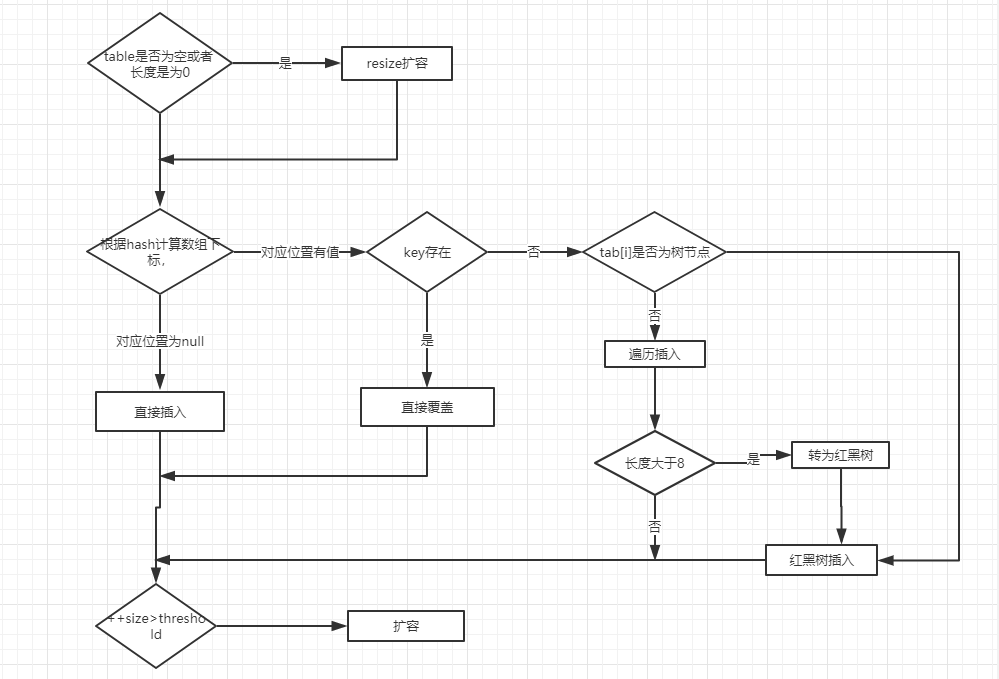

# 概述

- [HashMap 简介](https://snailclimb.gitee.io/javaguide/#/docs/java/collection/HashMap?id=hashmap-%e7%ae%80%e4%bb%8b)

  **HashMap 主要用来存放键值对，它基于哈希表的Map接口实现，是常用的Java集合之一。**

  JDK1.8 之前 HashMap 由 数组+链表 组成的，数组是 HashMap 的主体，链表则是主要为了解决哈希冲突而存在的（“拉链法”解决冲突）.JDK1.8 以后在解决哈希冲突时有了较大的变化，当链表长度大于阈值（默认为 8）时，将链表转化为红黑树（将链表转换成红黑树前会判断，如果当前数组的长度小于 64，那么会选择先进行数组扩容，而不是转换为红黑树），以减少搜索时间，具体可以参考 `treeifyBin`方法。

- 底层数据结构分析
  - [JDK1.8之前](https://snailclimb.gitee.io/javaguide/#/docs/java/collection/HashMap?id=jdk18%e4%b9%8b%e5%89%8d)
  - [JDK1.8之后](https://snailclimb.gitee.io/javaguide/#/docs/java/collection/HashMap?id=jdk18%e4%b9%8b%e5%90%8e)

- [HashMap常用方法测试](https://snailclimb.gitee.io/javaguide/#/docs/java/collection/HashMap?id=hashmap%e5%b8%b8%e7%94%a8%e6%96%b9%e6%b3%95%e6%b5%8b%e8%af%95)


#### 面试表述流程

- `HashMap` **主要用来存放键值对**，它基于哈希表的Map接口实现，是常用的Java集合之一

- **JDK1.8 之前** HashMap 由 数组+链表 **组成**的，数组**是 HashMap 的主体**，链表则**是主要为了解决哈希冲突**而存在的（“拉链法”解决冲突）.JDK1.8 以后**在解决哈希冲突时有了较大的变化**，当链表长度大于阈值（默认为 8）时，将链表转化为红黑树（将链表转换成红黑树前会判断，如果当前数组的长度小于 64，那么会选择先进行数组扩容，而不是转换为红黑树），**以减少搜索时间**
- HashMap的索引计算

- HashMap的putVal
- HashMap的resize


# 类的属性

```java
public class HashMap<K,V> extends AbstractMap<K,V> implements Map<K,V>, Cloneable, Serializable {
    // 序列号
    private static final long serialVersionUID = 362498820763181265L;    
    // 默认的初始容量是16
    static final int DEFAULT_INITIAL_CAPACITY = 1 << 4;   
    // 最大容量
    static final int MAXIMUM_CAPACITY = 1 << 30; 
    // 默认的填充因子
    static final float DEFAULT_LOAD_FACTOR = 0.75f;
    // 当桶(bucket)上的结点数大于这个值时会转成红黑树
    static final int TREEIFY_THRESHOLD = 8; 
    // 当桶(bucket)上的结点数小于这个值时树转链表
    static final int UNTREEIFY_THRESHOLD = 6;
    // 桶中结构转化为红黑树对应的table的最小大小
    static final int MIN_TREEIFY_CAPACITY = 64;
    // 存储元素的数组，总是2的幂次倍
    transient Node<k,v>[] table; 
    // 存放具体元素的集
    transient Set<map.entry<k,v>> entrySet;
    // 存放元素的个数，注意这个不等于数组的长度。
    transient int size;
    // 每次扩容和更改map结构的计数器
    transient int modCount;   
    // 临界值 当实际大小(容量*填充因子)超过临界值时，会进行扩容
    int threshold;
    // 加载因子
    final float loadFactor;
}
```

摘自JavaGuide，源码内有大段大段的英文注释哈哈。这个类的属性也是我一个面试失败的点。

【我的错误表达】

我说给定的`默认容量`为 16，`负载因子`为 0.75，然后链表到达阈值`threshold`时变为红黑树，阈值`threshold`是通过`容量X负载因子`计算出来的。唉，这里是搞混了。

**阈值**，是针对`Node<k,v>[] table`**存储元素的数组大小**，不是某一个链表的大小。


# 热点

- HashMap源码分析
  - [构造方法](https://snailclimb.gitee.io/javaguide/#/docs/java/collection/HashMap?id=%e6%9e%84%e9%80%a0%e6%96%b9%e6%b3%95)
  - [put方法](https://snailclimb.gitee.io/javaguide/#/docs/java/collection/HashMap?id=put%e6%96%b9%e6%b3%95)
  - [get方法](https://snailclimb.gitee.io/javaguide/#/docs/java/collection/HashMap?id=get%e6%96%b9%e6%b3%95)
  - [resize方法](https://snailclimb.gitee.io/javaguide/#/docs/java/collection/HashMap?id=resize%e6%96%b9%e6%b3%95)

putVal助记的图是极好的:+1:




# 自己看源码时的一些记录

- **索引计算路线**

  ```java
  //1.Key的HashCode，将高位与低位做异或
      static final int hash(Object key) {
          int h;
          // key.hashCode()：返回散列值也就是hashcode
          // ^ ：按位异或
          // >>>:无符号右移，忽略符号位，空位都以0补齐
          return (key == null) ? 0 : (h = key.hashCode()) ^ (h >>> 16);
      }
  //2.index = (n - 1) & hash
  这里n-1是当前索引最大值，与操作即是整除，取范围内的位数值
  所以相同index的hash值不一样，是hash值高位不同
  ```

  

- **转为红黑树的一些细节**

  JDK1.8 之前 HashMap 由 数组+链表 组成的，数组是 HashMap 的主体，链表则是主要为了解决哈希冲突而存在的（“拉链法”解决冲突）.JDK1.8 以后在解决哈希冲突时有了较大的变化，**当链表长度大于阈值（默认为 8）时**，将链表转化为红黑树（将链表转换成红黑树前会判断，**如果当前数组的长度小于 64**，那么会选择先进行数组扩容，而不是转换为红黑树），以减少搜索时间，具体可以参考 `treeifyBin`方法。

```java
putVal函数中，遍历链表时，如果Node节点数超过转换树的阈值8

if (binCount >= TREEIFY_THRESHOLD - 1) // -1 for 1st
   treeifyBin(tab, hash);
   break;
//=================================================
进入treeifyBin函数：将对应链表转为红黑树
这里
if (tab == null || (n = tab.length) < MIN_TREEIFY_CAPACITY)
            resize();
//==================================================
所以链表达到了默认阈值8
如果不满足
// 桶中结构转化为红黑树对应的table的最小大小
    static final int MIN_TREEIFY_CAPACITY = 64;
则会先扩容到满足要求，满足后下一次调用treeifyBin才会转为红黑树
```


- 计算扩容的阈值

  **给定的默认容量为 16，负载因子为 0.75**。Map 在使用过程中不断的往里面存放数据，**当数量达到了 16 * 0.75 = 12 就需要将当前 16 的容量进行扩容**

  ```java
  //HashMap的构造函数中
  this.threshold = tableSizeFor(initialCapacity);
  //看出来是通过容量计算容量的阈值的
  static final int tableSizeFor(int cap) {
          int n = cap - 1;
          n |= n >>> 1;
          n |= n >>> 2;
          n |= n >>> 4;
          n |= n >>> 8;
          n |= n >>> 16;
          return (n < 0) ? 1 : (n >= MAXIMUM_CAPACITY) ? MAXIMUM_CAPACITY : n + 1;
      }
  //理解，参考https://zhidao.baidu.com/question/291266003.html
  以65举例子，因为简单
  
  n-=1;// n=1000000(二进制)
  ...//16、8无变化
  n|=n>>>4;//n=n|(n>>>4)=1000000|0000100=1000100
  n|=n>>>2;//n=n|(n>>>2)=1000100|0010001=1010101
  ...
  看出规律来了吧，右移多少位，就把最高位右边的第x位设置为1；
  第二次，就把两个为1的右边xx位再设置为1；
  第n次，就把上一步出现的1右边xxxx位置为1；//xxx随便写写，意会
  这样执行完，原来是1000000，变成了1111111，最后加1，就变成2的整数次方数了。
  tableSizeFor(8) = 8
  tableSizeFor(9) = 16
  tableSizeFor(4) = 4
  tableSizeFor(5) = 8
  tableSizeFor(0) = 0
  tableSizeFor(1) = 1
  
  得出结论，阈值是比   容量（=  实际initcap或者数组size/ loadFactor）  大的最小二次方数
  所以  容量 * loadFactor  得到的是实际的cap，即阈值
  			//对应源码示例，readObject函数
  			int mappings = s.readInt(); // Read number of mappings (size)
  			float fc = (float)mappings / lf + 1.0f;
  			int cap = ((fc < DEFAULT_INITIAL_CAPACITY) ?
                         DEFAULT_INITIAL_CAPACITY :
                         (fc >= MAXIMUM_CAPACITY) ?
                         MAXIMUM_CAPACITY :
                         tableSizeFor((int)fc));
              float ft = (float)cap * lf;
              threshold = ((cap < MAXIMUM_CAPACITY && ft < MAXIMUM_CAPACITY) ?
                           (int)ft : Integer.MAX_VALUE);
  			Node<K,V>[] tab = (Node<K,V>[])new Node[cap];
              table = tab;
  所以，比如下面的构造函数，threshold和initCap数值小时不大，挺快就会触发扩容
  public HashMap(int initialCapacity, float loadFactor) {
      //......
      this.loadFactor = loadFactor;
      this.threshold = tableSizeFor(initialCapacity);
  }
  ```


- 线程不安全：链表成环举例

  当时看了懂的博客地址忘了，放一个随便搜的：<https://www.cnblogs.com/wen-he/p/11496050.html>


- 扩容时的**rehash**

  因为扩容是扩两倍，即`n<<<1`(n为数组大小) ， 所以 `(n-1) &hash` 计算出的索引值，更新依据只会是hash中的新一位  “0” 或者  “1”

  ```
  e.g.
  n为8，n-1二进制为  111
  hash1   为      1101
  hash2   为      0101
  此时hash1和hash2是同一个索引：5
  n<<<1 为16   n-1二进制为   1111
  hash1与后为      1101
  hash2与后为      0101
  此时hash1索引是13，hash2索引是5
  ```

  所以新索引只会在原索引【`j`】上，或者再【`j+OldCap`】上

  ```
  e.g.
  原索引为15，容量cap为16
  则新索引为15   或者   15+16=31上
  ```

  


# `HashMap`和`TreeMap`

面试一般问`TreeMap`和跳表区别，不过这边记录下看到的`HashMap`和`TreeMap`区别。


`HashMap`：适用于在Map中插入、删除和定位元素。

`HashMap`：基于哈希表实现。使用`HashMap`要求添加的键类明确定义了`hashCode()`和`equals()`[可以重写`hashCode()`和`equals()]`，为了优化`HashMap`空间的使用，您可以调优初始容量和负载因子。


`Treemap`：适用于按自然顺序或自定义顺序遍历键(key)

`TreeMap`：基于红黑树实现。`TreeMap`没有调优选项，因为该树总处于平衡状态


## `HashMap`与`HashTable` 的区别

面试的时候面试官总是问完 HashMap 后会问 HashTable 其实 HashTable 也算是比较古老的类了。翻看 HashTable 的源码可以发现有如下区别：

1. `HashMap` 是线程不安全的，HashTable是线程安全的。
2. `HashMap` 允许 key 和 Vale 是 null，但是只允许一个 key 为 null,且这个元素存放在哈希表 0 角标位置。 `HashTable` 不允许key、value 是 null
3. `HashMap` 内部使用`hash(Object key)`扰动函数对 key 的 `hashCode` 进行扰动后作为 `hash` 值。`HashTable` 是直接使用 key 的 `hashCode()` 返回值作为 hash 值。
4. `HashMap`默认容量为 2^4 且容量一定是 2^n ; `HashTable` 默认容量是11,不一定是 2^n
5. `HashTable` 取哈希桶下标是直接用模运算,扩容时新容量是原来的2倍+1。`HashMap` 在扩容的时候是原来的两倍，且哈希桶的下标使用 &运算代替了取模。

6.Hashtable是Dictionary的子类，`HashMap`是Map接口的一个实现类；

**HashMap是Hashtable的轻量级实现（非线程安全的实现），他们都完成了Map接口，主要区别在于HashMap允许空（null）键值（key）,由于非线程安全，效率上可能高于Hashtable。**


# 为什么`HashMap`引入了红黑树而不是其他结构？

<https://blog.csdn.net/qq_36545800/article/details/106143187>

### 先了解一下有关二叉树的基本内容。

①二叉排序树(又称二叉查找树)：
1)若左子树不为空，则左子树上所有结点的值均小于根结点的值。
2)若右子树不为空，则右子树上所有结点的值均小于根节点的值。
3)左右子树也为二叉排序树。

②平衡二叉树(AVL树)：是一种二叉查找树，当且仅当两个子树的高度差不超过1时，这个树是平衡二叉树。

③红黑树：是许多二叉查找树中的一种，它能保证在最坏的情况下，基本动态集合操作时间为O(lgn).

#### 问题1：为什么不使用二叉排序树？
问题主要出现在二叉排序树在添加元素的时候极端情况下会出现线性结构。

**举例说明**：由于二叉排序树左子树所有节点的值均小于根节点的特点，如果我们添加的元素都比根节点小，会导致左子树线性增长，这样就失去了用树型结构替换链表的初衷，导致查询时间增长。所以这是不用二叉查找树的原因。

#### 问题2：为什么不使用平衡二叉树呢？

①红黑树不追求"完全平衡"，即不像AVL那样要求节点的 `|balFact| <= 1`，它只要求部分达到平衡，但是提出了**为节点增加颜色**，红黑是**用非严格的平衡来换取增删节点时候旋转次数的降低**，**任何不平衡都会在三次旋转之内解决**，而AVL是严格平衡树，因此在增加或者删除节点的时候，根据不同情况，旋转的次数比红黑树要多。
      就**插入节点导致树失衡的情况**，AVL和RB-Tree**都是最多两次树旋转**来实现复衡rebalance，旋转的量级是O(1)
**删除节点导致失衡**，AVL需要维护从被删除节点到根节点root这条路径上所有节点的平衡，旋转的量级**为O(`logN`)，**而RB-Tree**最多只需要旋转3次**实现复衡，只需O(1)，所以说RB-Tree删除节点的rebalance的效率更高，开销更小！
      AVL的结构相较于RB-Tree更为平衡，插入和删除引起失衡，如2所述，RB-Tree复衡效率更高；当然，由于AVL高度平衡，因此AVL的Search效率更高啦。
针对插入和删除节点导致失衡后的rebalance操作，红黑树能够提供一个比较"便宜"的解决方案，降低开销，是对search，insert ，以及delete效率的折衷，总体来说，RB-Tree的统计性能高于AVL.
故引入RB-Tree是功能、性能、空间开销的折中结果。
② AVL更平衡，结构上更加直观，时间效能针对读取而言更高；维护稍慢，空间开销较大。
③ 红黑树，读取略逊于AVL，维护强于AVL，空间开销与AVL类似，内容极多时略优于AVL，维护优于AVL。
基本上主要的几种平衡树看来，红黑树有着良好的稳定性和完整的功能，性能表现也很不错，综合实力强，在诸如STL的场景中需要稳定表现。


# 面试问题

杭州某公司二面的时候问过我，`TreeMap`和跳表的区别，当时只会跳表，这里待补充。


[java--Iterator迭代问题：集合并发访问异常](<https://blog.csdn.net/weixin_34320159/article/details/93958939>)


# 参考链接

- <https://snailclimb.gitee.io/javaguide/#/docs/java/collection/HashMap>
- https://juejin.im/post/5ac83fa35188255c5668afd0

