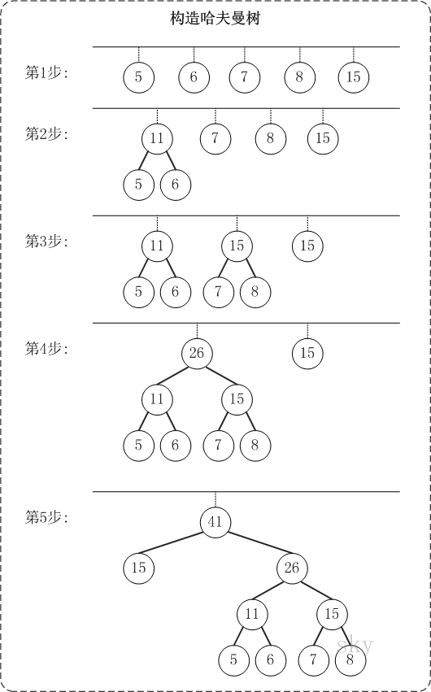

# 哈夫曼树

# 哈夫曼编码

**译码的惟一性问题**

要求任一字符的编码都不能是另一字符编码的前缀，这种编码称为前缀编码（其实是非前缀码）。 在编码过程要考虑两个问题，数据的最小冗余编码问题，译码的惟一性问题，利用最优二叉树可以很好地解决上述两个问题

**用二叉树设计二进制前缀编码**

以电文中的字符作为叶子结点构造二叉树。然后将二叉树中结点引向其左孩子的分支标 ‘0’，引向其右孩子的分支标 ‘1’； 每个字符的编码即为从根到每个叶子的路径上得到的 0, 1 序列。如此得到的即为二进制前缀编码。

 

**编码**： A：0， C：10，B：110，D：111 

任意一个叶子结点都不可能在其它叶子结点的路径中。

用哈夫曼树设计总长最短的二进制前缀编码

假设各个字符在电文中出现的次数（或频率）为 wi ，其编码长度为 li，电文中只有 n 种字符，则电文编码总长为：

设计电文总长最短的编码，设计哈夫曼树（以 n 种字符出现的频率作权），

由哈夫曼树得到的二进制前缀编码称为哈夫曼编码   

**例：**如果需传送的电文为 ‘ABACCDA’，即：A, B, C, D 

的频率（即权值）分别为 0.43, 0.14, 0.29, 0.14，试构造哈夫曼编码。

**编码**： A：0， C：10，  B：110， D：111 。电文 ‘ABACCDA’ 便为 ‘0110010101110’（共 13 位）。

**例**：如果需传送的电文为 ‘ABCACCDAEAE’，即：A, B, C, D, E 的频率（即权值）分别为0.36, 0.1, 0.27, 0.1, 0.18，试构造哈夫曼编码。

**编码**： A：11，C：10，E：00，B：010，D：011 ，则电文 ‘ABCACCDAEAE’ 便为 ‘110101011101001111001100’（共 24 位，比 33 位短）。

**译码**

从哈夫曼树根开始，对待译码电文逐位取码。若编码是“0”，则向左走；若编码是“1”，则向右走，一旦到达叶子结点，则译出一个字符；再重新从根出发，直到电文结束。

电文为 “1101000” ，译文只能是“CAT”

# 参考链接

- <https://www.cnblogs.com/wkfvawl/p/9783271.html>
- 上面链接对应的图：<https://github.com/wangkuiwu/datastructs_and_algorithm/blob/master/pictures/tree/huffman/03.jpg>
- 类似博客：<https://www.cnblogs.com/kubixuesheng/p/4397798.html>