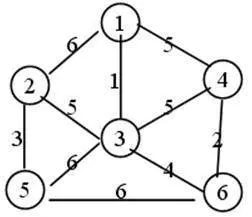
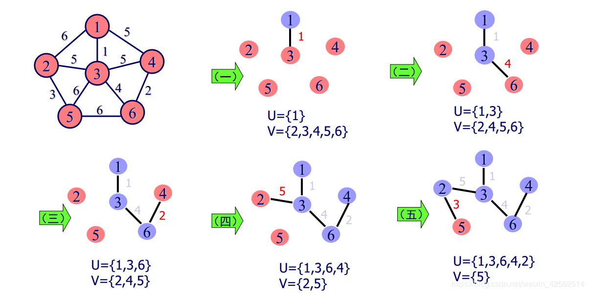

# 图的最小生成树算法

**如果在生成树上添加一条边，一定会构成一个环。**

- 好资料：<https://blog.csdn.net/zhangbaodan1/article/details/81459358>


- Kruskal算法

  - 步骤

    ```
    1. 把所有权值的边进行排序
    2. 找出最小权值最小的边，记录此时连接的点
    3. 继续寻找 下个权值最小的边，如果 此时形成的图没有环，此边就生效，并记录心新连接的点
    4. 重复上述步骤 ，直到连接了所有的边
    ```

  - e.g.

    

    顺序：(1,3),(4,6),(2,5),(3,6),(2,3)

- Prim算法

  ```
   基本思想：在图中任取一个顶点K作为开始点，令U={k}， V=W-U，其中W为图中所有顶点集，然后找一个顶点在U中，另一个顶点在V中的边中最短的一条，找到后，将该边作为最小生成树的边保存起来，并将该边顶点全部加入U集合中，并从V中删去这些顶点，然后再重复此过程，直到V为空集止。
  ```

  


### Kruskal和Prim的区别

- 单位不同 Prim  以点为单位 以边为判定条件 找出  代价最小的点。 KRUSKAL 是以 边的为单位 ，以点为 判定条件找出可用的边
- 算法的数据结构不同， PRIM 针对的是 邻接矩阵  ，Kruskal  针对 是 边集数组


### 一个含有n个顶点e条边的有向图用邻接表表示，删除与某个顶点相关的所有弧的时间复杂度怎么计算？

删除与某个顶点V欧相关的所有百边的过程：

- 先删除下标为V的顶度点表节点的单链表，出边数最多为n-1，对应时间复杂度为O（n），
- 再扫描所以版边表的结点，删除所有的顶点V的入边，对应的时间复杂度为O(e)。
- 故权总的时间复杂度为O(n+e)。


# 最短路径算法

- # [Dijkstra 最短路径算法 秒懂详解](https://www.cnblogs.com/jason2003/p/7222182.html)


# 极小连通图和极大连通图

<https://blog.csdn.net/qq_37134008/article/details/85325251>

**极小连通子图与极大连通子图**是在**无向图**中进行讨论的

**极大连通子图是讨论连通分量的,极小连通子图是讨论生成树的**


**连通图**：
	在**无向图**中，若从定点V1到V2有路径，则称顶点V1和V2是连通的。如果**图中任意一对顶点都是连通的**，则称此图是连通图。（连通的无向图）

**极大连通图**

- 在连通图中等于本身
- 在非连通图中有多个，且**此时加入任何一个不在图的点集中的点都会导致它不再连通**

**极小连通图**

- **只存在于连通图中**
- **之所以称为极小是因为此时如果删除一条边，就无法构成生成树，也就是说给极小连通子图的每个边都是不可少的**

- **如果在生成树上添加一条边，一定会构成一个环。**
- **只要能连通图的所有顶点而又不产生回路的任何子图都是它的生成树**


检查连通性——并查集算法，见此：<https://blog.csdn.net/qq_41593380/article/details/81146850>