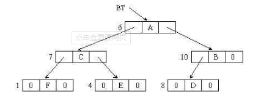

- <https://blog.csdn.net/haodawang/article/details/79568768>

- 以前有一题，是算叶子节点得数量，节点总数量为n=m（度）+1。然后用总节点数-度不为0得节点数。

- 含有n个结点的二叉树采用二叉链表存储时，空指针域的个数为：

  

  n个结点的二叉链表中，有2n个链域，每一条非空链域对应一条树枝，而**树支的个数为n-1（计算方法：每个节点都有指向该节点的父树枝，除了根节点，所以n-1）**，因此，空节点个数为2n-(n-1)=n+1

- 假设二叉链表含有31个空指针域,则含有多少个结点:   30呗~

  

