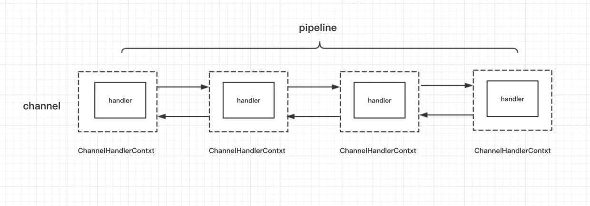
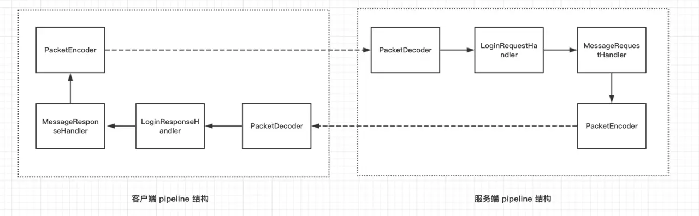
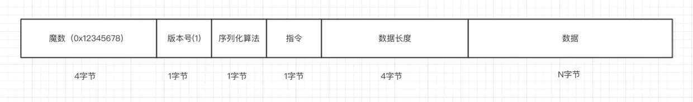
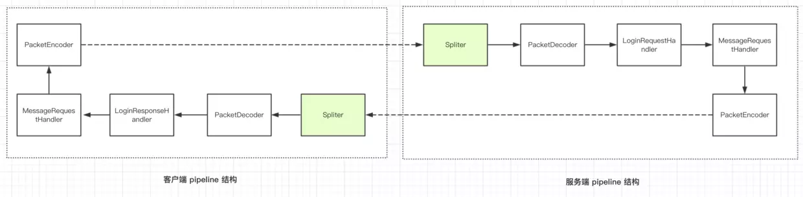

- <https://mp.weixin.qq.com/mp/homepage?__biz=MzA3MTQ2MDgyOQ==&hid=4&sn=9d1829a1b7ab87973a3277a8152037fc&scene=18#wechat_redirect>
- <https://github.com/aalansehaiyang/technology-talk/blob/master/middle-software/Netty.md>

- ### Netty入门与实战:仿写微信IM即时通讯系统

  <https://www.jianshu.com/p/7522bda72a25>

- JAVA读源码之Netty深入剖析3-2

  试读白嫖：<https://coding.imooc.com/class/chapter/230.html#Anchor>


## 使用Netty而不是用JDK原生NIO的原因

1. 使用 JDK 自带的NIO需要了解太多的概念，编程复杂，一不小心 bug 横飞
2. Netty 底层 IO 模型随意切换，而这一切只需要做微小的改动，改改参数，Netty可以直接从 NIO 模型变身为 IO 模型
3. Netty 自带的拆包解包，异常检测等机制让你从NIO的繁重细节中脱离出来，让你只需要关心业务逻辑
4. Netty 解决了 JDK 的很多包括空轮询在内的 Bug
5. Netty 底层对线程，selector 做了很多细小的优化，精心设计的 reactor 线程模型做到非常高效的并发处理
6. 自带各种协议栈让你处理任何一种通用协议都几乎不用亲自动手
7. Netty 社区活跃，遇到问题随时邮件列表或者 issue
8. Netty 已经历各大 RPC 框架，消息中间件，分布式通信中间件线上的广泛验证，健壮性无比强大


## Netty的工作机制

参考：<https://mp.weixin.qq.com/s?__biz=MzA3MTQ2MDgyOQ==&mid=2247483852&idx=1&sn=f8a35cd3b08fd58471372d04ffbadf35>




## Netty客户端与服务端启动流程

三个重要概念：

- 线程模型(NioEventLoopGroup)

  > `bossGroup`表示监听端口，accept 新连接的线程组，`workerGroup`表示处理每一条连接的数据读写的线程组

- IO模型(channel())

- 业务处理逻辑(*Handler)


**各个函数的解析**：

- <https://juejin.im/book/5b4bc28bf265da0f60130116/section/5b4daf9ee51d4518f543f130>
- <https://mp.weixin.qq.com/s?__biz=MzA3MTQ2MDgyOQ==&mid=2247483940&idx=1&sn=6595fcee353d1704e1a1865df669e65c>

**其中channel的四步骤（创建、初始化、注册、绑定）对应代码和流程**

channel()方法传入类来设置反射的Factory,用于之后创建channel

在bind一开始调用newChannel()方法创建channel  （用于accept的channel）

然后继续initAndRegister  

- 初始化——设置属性和*handler加入pipeline
- Register，channel注册到selector里

最后bind0

- channel绑定到指定host和端口


## ChannelFuture和addListener

服务端的bind()和客户端的connect是异步的

Listener可以实现递增端口重连、和失败重连

**定时任务**

失败重连时，设置重连的时间延时可以使用定时任务

```java
connect(bootstrap, "juejin.im", 80, MAX_RETRY);

private static void connect(Bootstrap bootstrap, String host, int port, int retry) {
    bootstrap.connect(host, port).addListener(future -> {
        if (future.isSuccess()) {
            System.out.println("连接成功!");
        } else if (retry == 0) {
            System.err.println("重试次数已用完，放弃连接！");
        } else {
            // 第几次重连
            int order = (MAX_RETRY - retry) + 1;
            // 本次重连的间隔
            int delay = 1 << order;
            System.err.println(new Date() + ": 连接失败，第" + order + "次重连……");
            bootstrap.config().group().schedule(() -> connect(bootstrap, host, port, retry - 1), delay, TimeUnit
                    .SECONDS);
        }
    });
}
```

`config()`返回的是配置参数的抽象`BootstrapConfig`，

`group()`返回的是一开始的时候配置的线程模型 `workerGroup`

 `schedule` 方法即可实现定时任务逻辑


## pipeLine和channelHandler

`ch.pipeline()` 返回的是和这条连接相关的逻辑处理链，采用了责任链模式

自己编写IO业务逻辑处理器，继承自 `ChannelInboundHandlerAdapter`：

- `channelActive()`方法，**这个方法会在客户端连接建立成功之后被调用**。客户端连接建立成功之后，调用到 `channelActive()` 方法，在这个方法里面，我们编写向服务端写数据的逻辑
-  `channelRead()`，**这个方法在接收到客户端发来的数据之后被回调**

写：

```java
ByteBuf out = getByteBuf(ctx);//ByteBuf buffer = ctx.alloc().buffer();
ctx.channel().writeAndFlush(out);
```

读

```java
//参数：Object msg
ByteBuf byteBuf = (ByteBuf) msg;
byteBuf.toString(Charset.forName("utf-8")
```


1. channelHandler 分为 inBound 和 outBound 两种类型的接口，分别是处理数据读与数据写的逻辑，可与 tcp 协议栈联系起来。
2. 两种类型的 handler 均有相应的默认实现，默认会把事件传递到下一个，这里的传递事件其实说白了就是把本 handler 的处理结果传递到下一个 handler 继续处理。
3. inBoundHandler 的执行顺序与我们实际的添加顺序相同，而 outBoundHandler 则相反。


## ChannelInboundHandlerAdapter 与 ChannelOutboundHandlerAdapter



**这里就是编码解码交给特殊的Handler完成，这样在channelhandler中传递的是Packet而不是ByteBuf**

> 我们使用 `4.1.6.Final` 版本，默认情况下用的是堆外内存，在 [ByteBuf](https://juejin.im/book/5b4bc28bf265da0f60130116/section/5b4db03b6fb9a04fe91a6e93) 这一小节中我们提到，堆外内存我们需要自行释放，在我们前面小节的解码的例子中，其实我们已经漏掉了这个操作，这一点是非常致命的，随着程序运行越来越久，内存泄露的问题就慢慢暴露出来了， 而这里我们使用 `ByteToMessageDecoder`，Netty 会自动进行内存的释放，我们不用操心太多的内存管理方面的逻辑，关于如何自动释放内存大家有兴趣可以参考一下 [ByteToMessageDecoder的实现原理(8-2)](https://coding.imooc.com/class/chapter/230.html#Anchor)。


- `ByteToMessageDecoder`先将二进制转化为数据包Packet，导入inHandler
- **channelRead**内`ctx.fireChannelRead(packet)`，将解码完毕的数据包传递到下一个handler
- 除了使用`if  else（ctx.fireChannelRead）`，也可以使用 **`SimpleChannelInboundHandler` 来**简化我们的指令处理逻辑
  - 泛型指定为特定Packet
  - 接收的参数不是之前的`Object( ByteBuf) Msg`，而是`Packet`
  - 读时传递也直接传Packet：`ctx.channel().writeAndFlush(messageResponsePacket);`

- `MessageToByteEncoder`，数据包Packet转二进制，去write


这里SimpleChannelInboundHandler的channelRead0()第二个参数，还是通过ChannelInboundHandlerAdapter#channelRead()方法的第二个参数来的


## ByteBuf


Java官方的NIO提供了一个ByteBuffer类作为字节的容器。但是ByteBuffer的使用比较复杂，尤其是需要通过flip()方法对读写进行切换。[Java NIO之缓冲区  ByteBuffer](<http://www.tianxiaobo.com/2018/03/04/Java-NIO%E4%B9%8B%E7%BC%93%E5%86%B2%E5%8C%BA/>)

**因此netty重新设计了一个字节容器，即ByteBuf。**ByteBuf被设计为一个抽象类，其有以下特点：

- 定义了两个不同的索引，分别为读和写索引
- 读写模式不需要调用flip()进行切换
- 实现了ReferenceCounted接口，支持引用计数
- 支持池化
- 方法可以链式调用
- 容器可以按需增长


**ByteBuf结构**

- readIndex
- writeIndex
- capacity
- **maxCapacity**

ByteBuf中字节内容的读取有两种方式：随机读取和顺序读取。


【0 - readIndex) ：**discardable bytes**（已读过字节—已丢弃）

【readIndex - writeIndex) ：**readable bytes**

【readIndex - writeIndex) ：**readable bytes**

【writeIndex - capacity) : **writable bytes**


**为什么设置双指针？**

- 避免flip()方法在读模式和写模式之间进行来回的切换，读和写互不影响，可以同时进行
- 所有的网络通信都涉及字节序列的移动，ByteBuf的两个指针正好保证了这一点，并且非常高效的保证了这一点。


**读写指针相关API**（保存当前readIndex位置）

```java
// 代码片段1
int readerIndex = buffer.readerIndex();
// .. 其他操作
buffer.readerIndex(readerIndex);


// 代码片段二
buffer.markReaderIndex();
// .. 其他操作
buffer.resetReaderIndex();
```

**读写API**

- writeBytes(byte[] src) 
- buffer.readBytes(byte[] dst)

- setByte() 系列

  > 唯一的区别就是 **get/set 不会改变读写指针，而 read/write 会改变读写指针**


### [初级例子](<https://juejin.im/book/5b4bc28bf265da0f60130116/section/5b4db03b6fb9a04fe91a6e93>)


### [高级例子](<https://mp.weixin.qq.com/s?__biz=MzA3MTQ2MDgyOQ==&mid=2247483888&idx=1&sn=01f5fc45857515c385241d49fd56cd28&scene=19#wechat_redirect>)

> **特别注意点**：将读取的内容丢弃步骤时，虽然readIndex和writeIndex相对位置没变，但writeIndex前移，前移的地方还保留的原本的内容，只是这两个字节由原来的“可读”变成了现在的“可写”

下面是例子：

**(1)读取一段内容**

#### 


image-byte-buf-use-3


接着我们有读取了2个字节的内容，这时读指针向后移动了2个字节，读指针的值变成了2，写指针不变，此时0和读指针之间的内容变成了“可丢弃”的状态了，我们用粉色来表示。

**(2)将读取的内容丢弃**

#### 


image-byte-buf-use-4


紧接着，我们将刚刚读取完的2个字节丢弃掉，这时ByteBuf把读指针与写指针之间的内容（即 `3`、`4`、`5` 三个字节）移动到了0的位置，并且将读指针更新为0，写指针更新为原来写指针的值减去原来读指针的值。但是需要注意的是，第4和第5个字节的位置上，还保留的原本的内容，只是这两个字节由原来的“可读”变成了现在的“可写”。


**ByteBuf扩容**

具体见此，[图解ByteBuf读、写与扩容](<https://mp.weixin.qq.com/s?__biz=MzA3MTQ2MDgyOQ==&mid=2247483888&idx=1&sn=01f5fc45857515c385241d49fd56cd28&scene=19#wechat_redirect>)


**ByteBuf创建方法**

- 官方推荐：Unpooled中的一些辅助方法

  `ByteBufAllocator`是一个专门负责ByteBuf分配的接口，对应的`Unpooled`实现类就是`UnpooledByteBufAllocator`

- 项目中：ChannelHandlerContext.alloc().ioBuffer()

- 平台是否支持Unsafe区别


**ByteBuf种类**

- EmptyByteBuf
- WrappedByteBuf
- AbstractByteBuf


**ByteBuf池化**

​	ByteBuf类实现了ReferenceCounted接口，该接口标记一个类是一个需要用引用计数来管理的类。

​	如果引用计数为0，则释放当前对象。 在ByteBuf的各个子类中，他们会自己决定如何释放对象，如果是池化的 ByteBuf，那么就会返回到池子中，如果不是池化的，则销毁底层的字节数组引用或者释放对应的堆外内存。 

**ByteBuf回收**

Netty 对二进制数据的抽象 ByteBuf 的结构，本质上它的原理就是，它引用了一段内存，这段内存可以是堆内也可以是堆外的。由于 Netty 使用了堆外内存，而堆外内存是不被 jvm 直接管理的，也就是说申请到的内存无法被垃圾回收器直接回收，所以需要我们手动回收。

**经过 slice() 或者 duplicate() 返回的 ByteBuf 调用 write 系列方法都会影响到 原始的 ByteBuf，但是它们都维持着与原始 ByteBuf 相同的内存引用计数和不同的读写指针**

Netty 的 ByteBuf 是通过引用计数的方式管理的，如果一个 ByteBuf 没有地方被引用到，需要回收底层内存。

- retain() ：+1
- release()：-1


**截取ByteBuf**

调用下面这三个方法，记得引用计数+1，不然引用计数归0截取也消失了，所以引用计数多1点

- slice()：截取读的部分，共享内存和引用，不同的读写指针
- duplicate()：截取整个，共享内存和引用，不同的读写指针
- copy()：从原始的 ByteBuf 中拷贝所有的信息，包括读写指针以及底层对应的数据

改进：在截取内存片段的同时，增加内存的引用计数

```java
// retainedSlice 等价于
slice().retain();

// retainedDuplicate() 等价于
duplicate().retain()
```

**使用到 slice 和 duplicate 方法的时候，千万要理清内存共享，引用计数共享，读写指针不共享几个概念**。容易犯的错：

- 多次释放
- 不释放造成内存泄漏


 **Netty的零拷贝（或者说ByteBuf的复用）主要体现在以下几个方面**:

- DirectByteBuf通过直接在堆外分配内存的方式，避免了数据从堆内拷贝到堆外的过程
- 通过组合ByteBuf类：即CompositeByteBuf，将多个ByteBuf合并为一个逻辑上的ByteBuf, 而不需要进行数据拷贝
- 通过各种包装方法, 将 byte[]、ByteBuf、ByteBuffer等包装成一个ByteBuf对象，而不需要进行数据的拷贝
- 通过slice方法, 将一个ByteBuf分解为多个共享同一个存储区域的ByteBuf, 避免了内存的拷贝，这在需要进行拆包操作时非常管用
- 通过FileRegion包装的FileChannel.tranferTo方法进行文件传输时, 可以直接将文件缓冲区的数据发送到目标Channel, 减少了通过循环write方式导致的内存拷贝。但是这种方式是需要得到操作系统的零拷贝的支持的，如果netty所运行的操作系统不支持零拷贝的特性，则netty仍然无法做到零拷贝


## 客户端和服务端通讯协议编解码

我们把 Java 对象根据协议封装成二进制数据包的过程成为编码，而把从二进制数据包中解析出 Java 对象的过程成为解码。



**Java 对象的序列化**

- 具体的序列化算法标识
- 将 Java 对象转换成字节数组
- 将字节数组转换成某种类型的 Java 对象

**编码：封装成二进制的过程**

```java
private static final int MAGIC_NUMBER = 0x12345678;

public ByteBuf encode(Packet packet) {
    // 1. 创建 ByteBuf 对象
    ByteBuf byteBuf = ByteBufAllocator.DEFAULT.ioBuffer();
    // 2. 序列化 Java 对象
    byte[] bytes = Serializer.DEFAULT.serialize(packet);//这里是上一步的序列化java对象

    // 3. 实际编码过程
    byteBuf.writeInt(MAGIC_NUMBER);
    byteBuf.writeByte(packet.getVersion());
    byteBuf.writeByte(Serializer.DEFAULT.getSerializerAlgorithm());
    byteBuf.writeByte(packet.getCommand());
    byteBuf.writeInt(bytes.length);
    byteBuf.writeBytes(bytes);

    return byteBuf;
}
```

**解码：解析 Java 对象的过程**

```java
public Packet decode(ByteBuf byteBuf) {
    // 跳过 magic number
    byteBuf.skipBytes(4);

    // 跳过版本号
    byteBuf.skipBytes(1);

    // 序列化算法标识
    byte serializeAlgorithm = byteBuf.readByte();

    // 指令
    byte command = byteBuf.readByte();

    // 数据包长度
    int length = byteBuf.readInt();

    byte[] bytes = new byte[length];
    byteBuf.readBytes(bytes);

    Class<? extends Packet> requestType = getRequestType(command);
    Serializer serializer = getSerializer(serializeAlgorithm);

    if (requestType != null && serializer != null) {
        return serializer.deserialize(requestType, bytes);
    }

    return null;
}
```


## 实战：Netty 实现客户端登录

流程：

ClientHandler.channelActive()  ——>   ServerHandler.channelRead() ——> ClientHandler.channelRead()


- `PacketCodec`处理（序列化+）编码解码

  map存放`<Byte   command, Class<? extends Packet>   clazz>`,编码时存，解码时取来序列化

- `LoginRequestPacket`登录请求数据包

- `LoginResponsePacket`登录响应数据包


## 实战：实现客户端与服务端收发消息

**客户端流程：**

先是登录的流程，在接收login响应包时设置登陆成功标志位

再connect后addListener，接收控制台输入 ——>  校验是否登陆成功  ——> 成功后发Msg包  ——> 接收Msg包

**服务端流程：**

channelRead读到login包时，返回login响应包

channelRead读到Msg包时，返回Msg包


- 定义客户端发送至服务端的消息对象 `MessageRequestPacket`
- 定义服务端发送至客户端的消息对象 `MessageResponsePacket`

- 判断客户端是否登陆成功：发消息前，检验Channel的attr属性内是否有登陆成功的标志位


## 实战：构建客户端与服务端Pipeline

见上面：`ChannelInboundHandlerAdapter 与 ChannelOutboundHandlerAdapter`


## 实战：拆包粘包理论与解决方案

我们需要在客户端根据自定义协议来组装我们应用层的数据包，然后在服务端根据我们的应用层的协议来组装数据包，这个过程通常**在服务端称为拆包，而在客户端称为粘包**。

**拆包和粘包是相对的**，一端粘了包，另外一端就需要将粘过的包拆开，举个栗子，发送端将三个数据包粘成两个 TCP 数据包发送到接收端，接收端就需要根据应用协议将两个数据包重新组装成三个数据包。

#### Netty 自带的拆包器

- 固定长度的拆包器 FixedLengthFrameDecoder
- 行拆包器 LineBasedFrameDecoder
- 分隔符拆包器 DelimiterBasedFrameDecoder

- 【最通用、自定义】基于长度域拆包器 LengthFieldBasedFrameDecoder

  ```java
  new LengthFieldBasedFrameDecoder(Integer.MAX_VALUE, 7, 4);
  ```

#### 拒绝非本协议连接

每个客户端发过来的数据包都做一次快速判断，判断当前发来的数据包是否是满足我的自定义协议， 我们只需要继承自 LengthFieldBasedFrameDecoder 的 `decode()` 方法，然后在 decode 之前判断前四个字节是否是等于我们定义的魔数 `0x12345678`

```java
public class Spliter extends LengthFieldBasedFrameDecoder {
    private static final int LENGTH_FIELD_OFFSET = 7;
    private static final int LENGTH_FIELD_LENGTH = 4;

    public Spliter() {
        super(Integer.MAX_VALUE, LENGTH_FIELD_OFFSET, LENGTH_FIELD_LENGTH);
    }

    @Override
    protected Object decode(ChannelHandlerContext ctx, ByteBuf in) throws Exception {
        // 屏蔽非本协议的客户端
        if (in.getInt(in.readerIndex()) != PacketCodeC.MAGIC_NUMBER) {
            ctx.channel().close();
            return null;
        }

        return super.decode(ctx, in);
    }
}
```

至此，我们服务端和客户端的 pipeline 结构为




## channelHandler生命周期

**启动，ChannelHandler 回调方法的执行顺序为**

```
handlerAdded() -> channelRegistered() -> channelActive() -> channelRead() -> channelReadComplete()
```

下面，我们来逐个解释一下每个回调方法的含义

1. `handlerAdded()` ：指的是当检测到新连接之后，调用 `ch.pipeline().addLast(new LifeCyCleTestHandler());` 之后的回调，表示在当前的 channel 中，已经成功添加了一个 handler 处理器。
2. `channelRegistered()`：这个回调方法，表示当前的 channel 的所有的逻辑处理已经和某个 NIO 线程建立了绑定关系，类似我们在[Netty 是什么？](https://juejin.im/book/5b4bc28bf265da0f60130116/section/5b4bc28b5188251b1f224ee5)这小节中 BIO 编程中，accept 到新的连接，然后创建一个线程来处理这条连接的读写，只不过 Netty 里面是使用了线程池的方式，只需要从线程池里面去抓一个线程绑定在这个 channel 上即可，这里的 NIO 线程通常指的是 `NioEventLoop`,不理解没关系，后面我们还会讲到。
3. `channelActive()`：当 channel 的所有的业务逻辑链准备完毕（也就是说 channel 的 pipeline 中已经添加完所有的 handler）以及绑定好一个 NIO 线程之后，这条连接算是真正激活了，接下来就会回调到此方法。
4. `channelRead()`：客户端向服务端发来数据，每次都会回调此方法，表示有数据可读。
5. `channelReadComplete()`：服务端每次读完一次完整的数据之后，回调该方法，表示数据读取完毕。


**关闭，ChannelHandler 回调方法的执行顺序为**

```
channelInactive() -> channelUnregistered() -> handlerRemoved()
```

到了这里，相信大家应该已经能够看到，这里的回调方法的执行顺序是新连接建立时候的逆操作，下面我们还是来解释一下每个方法的含义

1. `channelInactive()`: 表面这条连接已经被关闭了，这条连接在 TCP 层面已经不再是 ESTABLISH 状态了
2. `channelUnregistered()`: 既然连接已经被关闭，那么与这条连接绑定的线程就不需要对这条连接负责了，这个回调就表明与这条连接对应的 NIO 线程移除掉对这条连接的处理
3. `handlerRemoved()`：最后，我们给这条连接上添加的所有的业务逻辑处理器都给移除掉。


最后，**我们用一幅图来标识 ChannelHandler 的生命周期**


## ChannelHandler 生命周期各回调方法用法举例

Netty 对于一条连接的在各个不同状态下回调方法的定义还是蛮细致的，这个好处就在于我们能够基于这个机制写出扩展性较好的应用程序。

### 1. ChannelInitializer 的实现原理

仔细翻看一下我们的服务端启动代码，我们在给新连接定义 handler 的时候，其实只是通过 `childHandler()` 方法给新连接设置了一个 handler，这个 handler 就是 `ChannelInitializer`，而在 `ChannelInitializer` 的 `initChannel()` 方法里面，我们通过拿到 channel 对应的 pipeline，然后往里面塞 handler

> NettyServer.java

```
.childHandler(new ChannelInitializer<NioSocketChannel>() {
    protected void initChannel(NioSocketChannel ch) {
        ch.pipeline().addLast(new LifeCyCleTestHandler());
        ch.pipeline().addLast(new PacketDecoder());
        ch.pipeline().addLast(new LoginRequestHandler());
        ch.pipeline().addLast(new MessageRequestHandler());
        ch.pipeline().addLast(new PacketEncoder());
    }
});
```

这里的 `ChannelInitializer` 其实就利用了 Netty 的 handler 生命周期中 `channelRegistered()` 与 `handlerAdded()` 两个特性，我们简单翻一翻 `ChannelInitializer` 这个类的源代码：

> ChannelInitializer.java

```
    protected abstract void initChannel(C ch) throws Exception;

    public final void channelRegistered(ChannelHandlerContext ctx) throws Exception {
        // ...
        initChannel(ctx);
        // ...
    }

    public void handlerAdded(ChannelHandlerContext ctx) throws Exception {
        // ...
        if (ctx.channel().isRegistered()) {
            initChannel(ctx);
        }
        // ...
    }

    private boolean initChannel(ChannelHandlerContext ctx) throws Exception {
        if (initMap.putIfAbsent(ctx, Boolean.TRUE) == null) {
            initChannel((C) ctx.channel());
            // ...
            return true;
        }
        return false;
    }
```

这里，我把非重点代码略去，逻辑会更加清晰一些

1. `ChannelInitializer` 定义了一个**抽象**的方法 `initChannel()`，这个抽象方法由我们自行实现，我们在服务端启动的流程里面的实现逻辑就是往 pipeline 里面塞我们的 handler 链
2. `handlerAdded()` 和 `channelRegistered()` 方法，都会尝试去调用 `initChannel()` 方法，`initChannel()` 使用 `putIfAbsent()` 来防止 `initChannel()` 被调用多次
3. 如果你 debug 了 `ChannelInitializer` 的上述两个方法，你会发现，在 `handlerAdded()` 方法被调用的时候，channel 其实已经和某个线程绑定上了，所以，就我们的应用程序来说，这里的 `channelRegistered()` 其实是多余的，那为什么这里还要尝试调用一次呢？我猜测应该是担心我们自己写了个类继承自 `ChannelInitializer`，然后覆盖掉了 `handlerAdded()` 方法，这样即使覆盖掉，在 `channelRegistered()` 方法里面还有机会再调一次 `initChannel()`，把我们自定义的 handler 都添加到 pipeline 中去。

### 2. handlerAdded() 与 handlerRemoved()

这两个方法通常可以用在一些资源的申请和释放

### 3. channelActive() 与 channelInActive()

1. 对我们的应用程序来说，这两个方法表明的含义是 TCP 连接的建立与释放，通常我们在这两个回调里面统计单机的连接数，`channelActive()` 被调用，连接数加一，`channelInActive()` 被调用，连接数减一
2. 另外，我们也可以在 `channelActive()` 方法中，实现对客户端连接 ip 黑白名单的过滤，具体这里就不展开了

### 4. channelRead()

我们在前面小节讲拆包粘包原理，服务端根据自定义协议来进行拆包，其实就是在这个方法里面，每次读到一定的数据，都会累加到一个容器里面，然后判断是否能够拆出来一个完整的数据包，如果够的话就拆了之后，往下进行传递，这里就不过多展开，感兴趣的同学可以阅读一下

[netty源码分析之拆包器的奥秘](https://www.jianshu.com/p/dc26e944da95)

### 5. channelReadComplete()

前面小节中，我们在每次向客户端写数据的时候，都通过 `writeAndFlush()` 的方法写并刷新到底层，其实这种方式不是特别高效，我们可以在之前调用 `writeAndFlush()` 的地方都调用 `write()` 方法，然后在这个方面里面调用 `ctx.channel().flush()` 方法，相当于一个批量刷新的机制，当然，如果你对性能要求没那么高，`writeAndFlush()` 足矣。

关于 ChannelHandler 的生命周期相关的内容我们就讲到这，最后，我们对本小节内容作下总结

## 总结

1. 我们详细剖析了 ChannelHandler（主要是`ChannelInBoundHandler`）的各个回调方法，连接的建立和关闭，执行回调方法有个逆向的过程
2. 每一种回调方法都有他各自的用法，但是有的时候某些回调方法的使用边界有些模糊，恰当地使用回调方法来处理不同的逻辑，可以使你的应用程序更为优雅。


## 实战：使用channelHandler的热插拔实现登录校验

```java
public class AuthHandler extends ChannelInboundHandlerAdapter {

    @Override
    public void channelRead(ChannelHandlerContext ctx, Object msg) throws Exception {
        if (!LoginUtil.hasLogin(ctx.channel())) {
            ctx.channel().close();
        } else {
            // 一行代码实现逻辑的删除
            ctx.pipeline().remove(this);
            super.channelRead(ctx, msg);
        }
    }

    @Override
    public void handlerRemoved(ChannelHandlerContext ctx) {
        if (LoginUtil.hasLogin(ctx.channel())) {
            System.out.println("当前连接登录验证完毕，无需再次验证, AuthHandler 被移除");
        } else {
            System.out.println("无登录验证，强制关闭连接!");
        }
    }
}
```

**执行逻辑：**

> 登录  
> 1.登录时，启动时
> Wed Feb 20 10:25:38 CST 2019: AuthHandler --> handlerAdded
> Wed Feb 20 10:25:38 CST 2019: AuthHandler --> channelRegistered
> Wed Feb 20 10:25:38 CST 2019: AuthHandler --> channelActive
> Wed Feb 20 10:25:38 CST 2019: 收到客户端登录请求......
> Wed Feb 20 10:25:38 CST 2019: 客户端登录成功......
> Wed Feb 20 10:25:38 CST 2019: AuthHandler --> channelReadComplete
> 2.发消息时
> Wed Feb 20 10:26:16 CST 2019: AuthHandler --> channelRead
> Wed Feb 20 10:26:16 CST 2019: AuthHandler --> handlerRemoved
> 当前连接登录验证完毕，无需再次验证, AuthHandler 被移除
> 未登录 
> 1.启动时
> Wed Feb 20 10:27:36 CST 2019: AuthHandler --> handlerAdded
> Wed Feb 20 10:27:36 CST 2019: AuthHandler --> channelRegistered
> Wed Feb 20 10:27:36 CST 2019: AuthHandler --> channelActive
> 2.发消息时
> Wed Feb 20 10:28:06 CST 2019: AuthHandler --> channelRead
> Wed Feb 20 10:28:06 CST 2019: AuthHandler --> channelReadComplete
> Wed Feb 20 10:28:06 CST 2019: AuthHandler --> channelInactive
> Wed Feb 20 10:28:06 CST 2019: AuthHandler --> channelUnregistered
> Wed Feb 20 10:28:06 CST 2019: AuthHandler --> handlerRemoved
> 无登录验证，强制关闭连接!

**总结**
1. 如果有很多业务逻辑的 handler 都要进行某些相同的操作，我们完全可以抽取出一个 handler 来单独处理
2. 如果某一个独立的逻辑在执行几次之后（这里是一次）不需要再执行了，那么我们可以通过 ChannelHandler 的热插拔机制来实现动态删除逻辑，应用程序性能处理更为高效


# 实战：客户端互聊原理与实现


1. 如上图，A 要和 B 聊天，首先 A 和 B 需要与服务器建立连接，然后进行一次登录流程，服务端保存用户标识和 TCP 连接的映射关系。
2. A 发消息给 B，首先需要将带有 B 标识的消息数据包发送到服务器，然后服务器从消息数据包中拿到 B 的标识，找到对应的 B 的连接，将消息发送给 B。


## TODO。。。。。。


# 实战：群聊的发起与通知

**服务端逻辑：**

1. 首先，我们这里创建一个 `ChannelGroup`。这里简单介绍一下 `ChannelGroup`：它可以把多个 chanel 的操作聚合在一起，可以往它里面添加删除 channel，可以进行 channel 的批量读写，关闭等操作，详细的功能读者可以自行翻看这个接口的方法。这里我们一个群组其实就是一个 channel 的分组集合，使用 `ChannelGroup` 非常方便。
2. 接下来，我们遍历待加入群聊的 userId，如果存在该用户，就把对应的 channel 添加到 `ChannelGroup` 中，用户昵称也添加到昵称列表中。
3. 然后，我们创建一个创建群聊响应的对象，其中 `groupId` 是随机生成的，群聊创建结果一共三个字段，这里就不展开对这个类进行说明了。
4. 最后，我们调用 `ChannelGroup` 的聚合发送功能，将拉群的通知批量地发送到客户端，接着在服务端控制台打印创建群聊成功的信息，至此，服务端处理创建群聊请求的逻辑结束。


