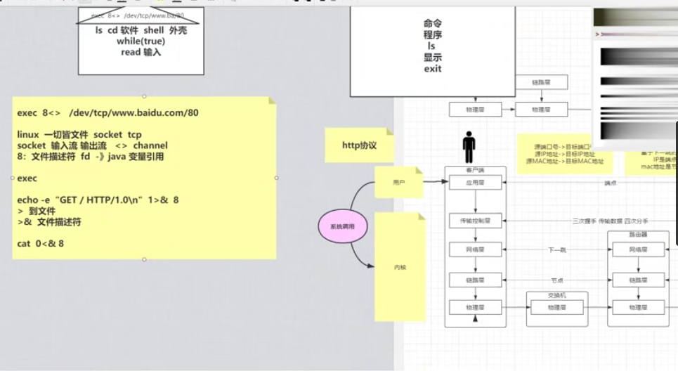
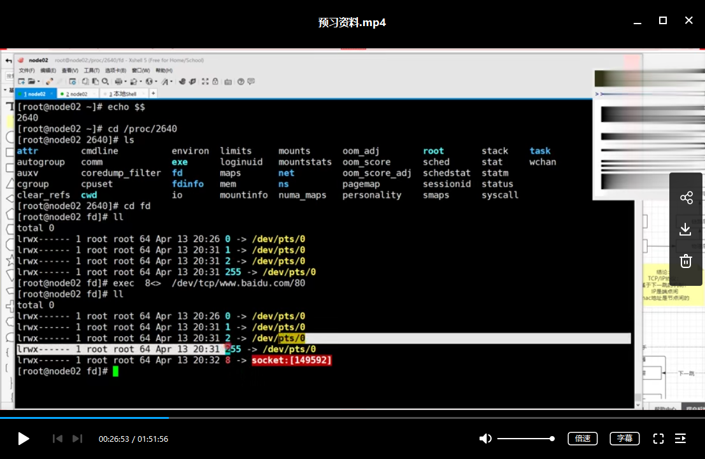
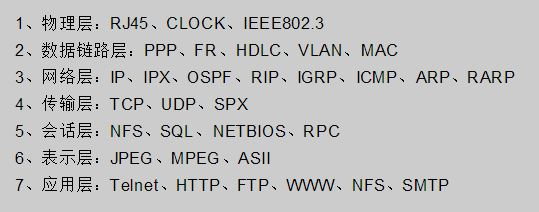
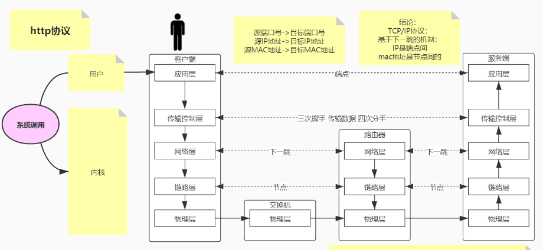
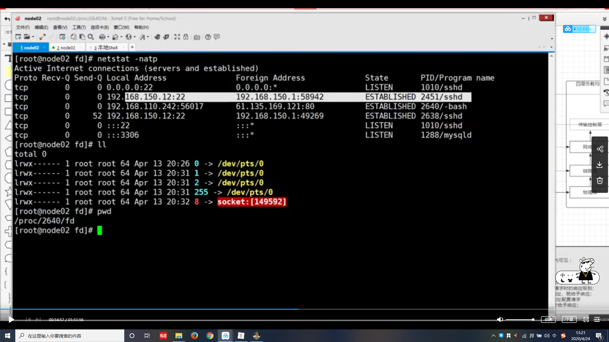
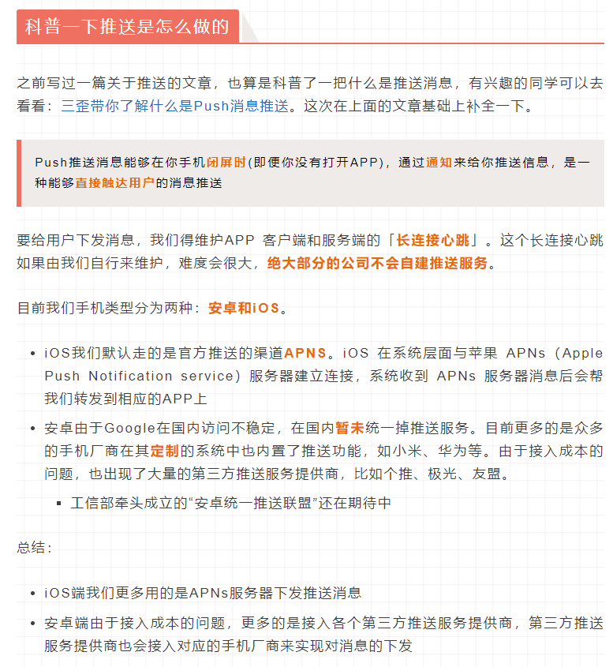
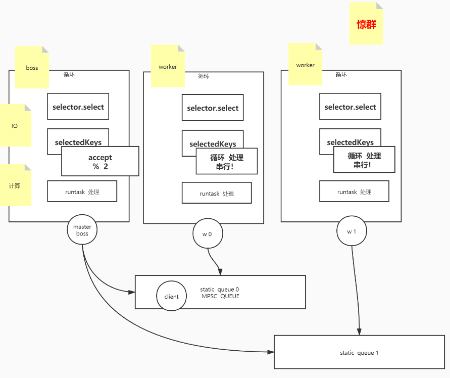

# Socket


### 学习顺序

- 复习了TCP(通过`Warm-up.master`项目)

- C语言Socket

- Java网络编程

- Java-Socket示例（BIO）

- NIO示例

- BIO   —》   nio单线程多路复用   —》nio多线程多路复用

  Select、Poll  —》  Epoll

  归纳总结BIO->NIO  和  Select到epoll的联系

- Netty入门

- Dubbo入门


推荐马士兵老师的Netty课，和JAVA高并发程序设计书，我的文章主要是参考这些来总结的····

马老师的我只上了体验课哈哈，后序学习靠网上资源了，有钱再考虑付费资源了。


# 基础概念

本地的进程间通信（IPC）有很多种方式，但可以总结为下面4类：

- 消息传递（管道、FIFO、消息队列）
- 同步（互斥量、条件变量、读写锁、文件和写记录锁、信号量）
- 共享内存（匿名的和具名的）
- 远程过程调用（Solaris门和Sun RPC）


一切皆文件。Socket也是一个fd（文件描述符），有相应的输入流，输出流，错误流。

exec 设置新的fd为socket，规定输入输出流到 `/dev/tcp/www.baidu.com/80`

然后echo输入命令，从当前exec进程的1（标准输出流）重定向到文件描述符8进行输出，于是socket访问百度。

然后exec的0（输入流）重定向到8，于是输出8的返回值，就是百度想响应




- 扩展点1：

  `exec is a shell builtin`，exec是个软件外壳

  $$ 这个程式的PID(脚本运行的当前[进程ID](https://www.baidu.com/s?wd=%E8%BF%9B%E7%A8%8BID&tn=SE_PcZhidaonwhc_ngpagmjz&rsv_dl=gh_pc_zhidao)号)，使用$$可以查看当前exec进程的PID

  exec也是个文件流，其中如果`exec ls`这样添加`command`的话，exec进程会被替换成命令，命令关闭进程消失

  而exec 8<> `/dev/tcp/www.baidu.com/80`只是创建和设置文件描述符，exec还是当前进程

- 扩展点2：

  可以稍微熟悉一点ISO七层协议和TCP五层协议，这个例子中用户关注Http层面的，而内核关注TCP，socket，流等等

- 拓展点3：

  `/dev/tcp/www.baidu.com/80`这里看着像文件路径，其实打开这个文件就类似于发出了一个socket调用。

  可以看看这个`/dev/tcp/`介绍：<https://www.jianshu.com/p/b07deeda6d64>

  再举个例子：

  `/proc/2640/fd`是指2640这个进程底下的文件描述符。

  

  这里可以看到，确实8的socket被添加到fd了

  


# 这里讲一讲ISO网络层的基础知识

第几层拥塞控制？第三层

各层职责：<https://blog.csdn.net/chengonghao/article/details/51892667/>

各层协议：




跟着osi七层和tcp/ip五层模型走一遍流程：

放一张tcp/ip五层模型的：




然后来看看在网络层的流程，如何IP寻址：


网络号：IP（主机号）和掩码得到的

e.g. 

```
IPADDR=192.168.150.12
NETMASK=255.255.255.0
GATEWAY=192.168.150.2
DNS1=233.5.5.5
DNS2=114.114.114.114
```

那么网络号为`192.168.150.0`


再看看路由部分


`route -n`查看路由表（记录了目的地址，下一跳）


前两个类似于a访问b，都在一个局域网内，于是直接通过eth0(访问外网的端口)，IP+掩码与完，代表直接可以通过eth0连接到192.168.150.0这个网络；如果访问这个网络内主机，可直接通信不需要跳跃

那如果外网和路由器交互呢？


这里访问`www.baidu.com`，百度的ip是`61.135.169.125`。然后到了路由表，将百度的ip`61.135.169.125`与掩码依次做与运算，得到61.135.169.0，和`192.168.150.0`（路由表该记录中的目标地址）不匹配

与第二个掩码做与运算，得到61.135.0.0，和169.254.0.0不一样，不匹配

与第三个掩码做与运算，得到0.0.0.0，和0.0.0.0一样，匹配，路由器转发到对应网关`192.168.150.2`

掩码和网络号都为`0.0.0.0`的叫做默认网关。


网络层封百度（请求端）的IP地址，而如何正确到下一跳地址？链路层封个下一跳的MAC地址（ARP协议）

使用arp -a 查看


也就是数据包内硬件地址是网络路由器的，ip地址是百度的

所以数据包内有：C端IP，S端IP，路由器MAC（随着跳跃不断更换）


如果ARP内无对应下一跳MAC地址呢？会阻塞式的触发arp协议去获取MAC地址，执行顺序：

ARP -> TCP三次握手 -> TCP四次挥手


如果自己添加一个地址，然后去ping该地址


这里额eth0是以太网卡，lo是虚拟网卡

执行命令后：


然后去ping该地址，由于没有路由，是ping不同的：


于是得给出一个正确的下一跳，所以得给到eth0,就是给到192.168.150.13

执行命令：(gw是下一跳)

> route add -host 192.168.88.88 gw 192.168.150.13


其余计算机网络知识请见：<https://github.com/wolverinn/Waking-Up/blob/master/Computer%20Network.md>


# [Linux Socket编程（不限Linux）](https://www.cnblogs.com/skynet/archive/2010/12/12/1903949.html)

- 1、网络中进程之间如何通信？
- 2、Socket是什么？
- 3、socket的基本操作
  - 3.1、socket()函数
  - 3.2、bind()函数
  - 3.3、listen()、connect()函数
  - 3.4、accept()函数
  - 3.5、read()、write()函数等
  - 3.6、close()函数
- 4、socket中TCP的三次握手建立连接详解
- 5、socket中TCP的四次握手释放连接详解
- 6、一个例子


# Socket动手实践

- <https://www.cnblogs.com/swordfall/p/10781281.html>
- <https://blog.csdn.net/qq_36544760/article/details/79404672>

- 最好的例子：EchoClient，请见JAVA高并发程序设计（第二版），博文视点社区可下载源码。


# Socket在TCP建立连接时有几个？

> 答：有3个。
>

首先，我们创建 `ServerSocket` 后，内核会创建一个 socket。这个 socket 既可以拿来监听客户连接，也可以连接远端的服务。由于 `ServerSocket` 是用来监听客户连接的，紧接着它就会对内核创建的这个 socket 调用 `listen` 函数。这样一来，这个 socket 就成了所谓的 listening socket，它开始监听客户的连接。

接下来，我们的客户端创建一个 `Socket`，同样的，内核也创建一个 socket 实例。内核创建的这个 socket 跟 `ServerSocket` 一开始创建的那个没有什么区别。不同的是，接下来 `Socket` 会对它执行 `connect`，发起对服务端的连接。前面我们说过，socket API 其实是 TCP 层的封装，所以 `connect` 后，内核会发送一个 `SYN` 给服务端。

现在，我们切换角色到服务端。**服务端的主机在收到这个 SYN 后，会创建一个新的 socket**，这个新创建的 socket 跟客户端继续执行三次握手过程。

三次握手完成后，我们执行的 `serverSocket.accept()` 会返回一个 `Socket` 实例，这个 socket 就是上一步内核自动帮我们创建的。

所以说，在一个客户端连接的情况下，其实有 3 个 socket。

关于内核自动创建的这个 socket，还有一个很有意思的地方。它的端口号跟 `ServerSocket` 是一毛一样的。咦！！不是说，一个端口只能绑定一个 socket 吗？其实这个说法并不够准确。

前面我说的TCP 通过端口号来区分数据属于哪个进程的说法，在 socket 的实现里需要改一改。Socket 并不仅仅使用端口号来区别不同的 socket 实例，而是使用 `<peer addr:peer port, local addr:local port>` 这个四元组。

在上面的例子中，我们的 `ServerSocket` 长这样：`<*:*, *:9877>`。意思是，可以接受任何的客户端，和本地任何 IP。

`accept` 返回的 `Socket` 则是这样：
`<127.0.0.1:xxxx, 127.0.0.1:9877>`，其中`xxxx` 是客户端的端口号。

如果数据是发送给一个已连接的 socket，内核会找到一个完全匹配的实例，所以数据准确发送给了对端。

如果是客户端要发起连接，这时候只有 `<*:*, *:9877>` 会匹配成功，所以 `SYN` 也准确发送给了监听套接字。

`Socket/ServerSocket` 的区别我们就讲到这里。如果读者觉得不过瘾，可以参考《TCP/IP 详解》卷1、卷2。




这里可以看到，每个socket对应一个进程。那么能否多个socket对应一个进程？

能，**IO多路复用（SELECT，POLL，EPOLL）**，学到Netty的时候会挖。


**那么到底一台服务器能够支持多少TCP并发连接呢？**

首先需要考虑文件句柄的限制。在linux下编写网络服务器程序的朋友肯定都知道每一个tcp连接都要占一个文件描述符，一旦这个文件描述符使用完了，新的连接到来返回给我们的错误是“Socket/File:Can't open so many files”。这时你需要明白操作系统对可以打开的最大文件数的限制。

我们可以通过 `ulimit -n`命令、/etc/security/limits.conf 文件 以及 /etc/sysctl.conf 文件等来修改文件句柄数。

其次要考虑的是端口范围的限制，操作系统上端口号1024以下是系统保留的，从1024-65535是用户使用的。

由于每个TCP连接都要占一个端口号，所以我们最多可以有60000多个并发连接。我想有这种错误思路朋友不在少数吧？面试官也比较喜欢在这里引导挖坑，类似的问题还有：一个UDP连接可以复用已经被TCP连接占用的端口嘛？

**如何标识一个TCP连接？** 系统使用一个4四元组来唯一标识一个TCP连接：本地端口号 local port、本地IP地址 local ip、远端端口号 remote port、远端IP地址 remote ip。

server通常固定在某个本地端口上监听，等待client的连接请求。不考虑地址重用（unix的SO_REUSEADDR选项）的情况下，即使server端有多个ip，本地监听端口也是独占的，因此server端tcp连接4元组中只有remote ip（也就是client ip）和remote port（客户端port）是可变的，因此最大tcp连接为客户端ip数×客户端port数，对IPV4，不考虑ip地址分类等因素，最大tcp连接数约为2的32次方（ip数）×2的16次方（port数），也就是server端单机最大tcp连接数约为2的48次方。

上面给出的结论都是理论上的单机TCP并发连接数，实际上单机并发连接数肯定要受硬件资源（内存）、网络资源（带宽）的限制，至少对我们的需求现在可以做到数十万级的并发了。


**高性能网络编程(二)：上一个10年，著名的C10K并发连接问题**：<http://www.52im.net/thread-566-1-1.html>


# Socket发送数据相关

参考：<https://www.jianshu.com/p/cde27461c226>

在实际应用中，socket发送的数据并不是按照一行一行发送的，比如我们常见的报文，那么我们就不能要求每发送一次数据，都在增加一个“\n”标识，这是及其不专业的，在实际应用中，通过是采用**数据长度+类型+数据的方式**，在我们常接触的Redis（RESP协议）就是采用这种方式，


五：socket 指定长度发送数据

在实际应用中，网络的数据在TCP/IP协议下的socket都是采用数据流的方式进行发送，那么在发送过程中就要求我们将数据流转出字节进行发送，读取的过程中也是采用字节缓存的方式结束。那么问题就来了，在socket通信时候，我们大多数发送的数据都是不定长的，所有接受方也不知道此次数据发送有多长，因此无法精确地创建一个缓冲区（字节数组）用来接收，在不定长通讯中，通常使用的方式时每次默认读取8*1024长度的字节，若输入流中仍有数据，则再次读取，一直到输入流没有数据为止。但是如果发送数据过大时，发送方会对数据进行分包发送，这种情况下或导致接收方判断错误，误以为数据传输完成，因而接收不全。在这种情况下就会引出一些问题，诸如半包，粘包，分包等问题，为了后续一些例子中好理解，我在这里直接将半包，粘包，分包概念性东西在写一下（引用度娘）

**5.1 半包**

接受方没有接受到一个完整的包，只接受了部分。

原因：TCP为提高传输效率，将一个包分配的足够大，导致接受方并不能一次接受完。

影响：长连接和短连接中都会出现

**5.2 粘包**

发送方发送的多个包数据到接收方接收时粘成一个包，从接收缓冲区看，后一包数据的头紧接着前一包数据的尾。

分类：一种是粘在一起的包都是完整的数据包，另一种情况是粘在一起的包有不完整的包

出现粘包现象的原因是多方面的:

1)发送方粘包：由TCP协议本身造成的，TCP为提高传输效率，发送方往往要收集到足够多的数据后才发送一包数据。若连续几次发送的数据都很少，通常TCP会根据优化算法把这些数据合成一包后一次发送出去，这样接收方就收到了粘包数据。

2)接收方粘包：接收方用户进程不及时接收数据，从而导致粘包现象。这是因为接收方先把收到的数据放在系统接收缓冲区，用户进程从该缓冲区取数据，若下一包数据到达时前一包数据尚未被用户进程取走，则下一包数据放到系统接收缓冲区时就接到前一包数据之后，而用户进程根据预先设定的缓冲区大小从系统接收缓冲区取数据，这样就一次取到了多包数据。

5.3**分包**

分包（1）：在出现粘包的时候，我们的接收方要进行分包处理；

分包（2）：一个数据包被分成了多次接收；

原因：1. IP分片传输导致的；2.传输过程中丢失部分包导致出现的半包；3.一个包可能被分成了两次传输，在取数据的时候，先取到了一部分（还可能与接收的缓冲区大小有关系）。

影响：粘包和分包在长连接中都会出现

那么如何解决半包和粘包的问题，就涉及一个一个数据发送如何标识结束的问题，通常有以下几种情况

固定长度：每次发送固定长度的数据；

特殊标示：以回车，换行作为特殊标示；获取到指定的标识时，说明包获取完整。

字节长度：包头+包长+包体的协议形式，当服务器端获取到指定的包长时才说明获取完整；

所以大部分情况下，双方使用socket通讯时都会约定一个定长头放在传输数据的最前端，用以标识数据体的长度，通常定长头有整型int，短整型short，字符串Strinng三种形式。

下面我们通过几个简单的小示例，演示发送接受定长数据，前面我们讲过通过特殊标识的方式，可是有什么我们发送的数据比较大，并且数据本身就会包含我们约定的特殊标识，那么我们在接受数据时，就会出现半包的情况，通过这种情况下，我们都是才有包头+包长+包体的协议模式，每次发送数据的时候，我们都会固定前4个字节为数据长度，那到数据长度后，我们就可以非常精确的创建一个数据缓存区用来接收数据。

那么下面就先通过包类型+包长度+消息内容定义一个socket通信对象，数据类型为byte类型，包长度为int类型，消息内容为byte类型。

首先我们创建府服务端socket。

```java
package socket.socket1.socket5;

import java.io.DataInputStream;

import java.io.IOException;

import java.io.InputStream;

import java.net.ServerSocket;

import java.net.Socket;

public class ServerSocketTest {

public static void main(String[] args) {

try {

ServerSocket serverSocket =new ServerSocket(9999);

​                Socket client = serverSocket.accept();

​                InputStream inputStream = client.getInputStream();

​                DataInputStream dataInputStream =new DataInputStream(inputStream);

​                while (true){

​                    byte b = dataInputStream.readByte();

​                    int len = dataInputStream.readInt();

​                    byte[] data =new byte[len -5];

​                    dataInputStream.readFully(data);

​                    String str =new String(data);

​                    System.out.println("获取的数据类型为："+b);

​                    System.out.println("获取的数据长度为："+len);

​                    System.out.println("获取的数据内容为："+str);

​                }

}catch (IOException e) {

e.printStackTrace();

​        }

}

}
```

在服务端创建后，我们通过DataInputStream 数据流进行数据获取，首先我们获取数据的类型，然后在获取数据的长度，因为数据实际有效长度是整个数据的长度减去5，（包括前个字节为数据类型，前二到五个字节为数据长度）。然后根据数据的实际有效长度创建数据缓存区，用户存放数据，这边确保每次接接受数据的完整性，不会出现半包与粘包的情况。在数据读取的时候，我们通过readFully（）方法读取数据。下面我们来创建socket的客户端：

```java
package socket.socket1.socket5;

import java.io.*;

import java.net.Socket;

import java.util.Scanner;

public class ClientSocketTest {

public static void main(String[] args) {

try {

Socket socket =new Socket("127.0.0.1",9999);

​            OutputStream outputStream = socket.getOutputStream();

​            DataOutputStream dataOutputStream =new DataOutputStream(outputStream);

​            Scanner scanner =new Scanner(System.in);

​            if(scanner.hasNext()){

​            String str = scanner.next();

​                int type =1;

​                byte[] data = str.getBytes();

​                int len = data.length +5;

​                dataOutputStream.writeByte(type);

​                dataOutputStream.writeInt(len);

​                dataOutputStream.write(data);

​                dataOutputStream.flush();

​            }

}catch (IOException e) {

e.printStackTrace();

​        }

}

}
```

客户端socket创建后，我们通过dataOutputStream输出流中的writeByte（）方法，设置数据类型，writeInt（）方法设置数据长度，然后通过write（）方法将数据发送到服务端进行通信，发送完毕后，为了确保数据完全发送，通过调用flush()方法刷新缓冲区。

下面我们通过控制可以看到服务端接受数据的情况：

客户端发送数据：


服务端接受数据：


上面服务端分别接受到数据的类型，长度和详细内容，具体下面的错误异常是由于客户端发送一次后关闭，服务端任在接受数据，就会出现连接重置的错误，这是一个简单的通过数据类型+数据长度+数据内容的方法发送数据的一个小例子，让大家了解socket通信数据发送的原理，在实际应用中，原理不出其左右，只是在业务逻辑上完善而已。


# Socket 长连接的实现

使用心跳检测，详情见[手把手教你写socket长连接](<https://mp.weixin.qq.com/s?__biz=MzIwMTAzMTMxMg==&mid=2649492841&idx=1&sn=751872addc47d2464b8935be17d715d6&chksm=8eec8696b99b0f80b2ebb8e4c346adf177ad206401d83c17aca4047d883b0cc7c0788619df9d&mpshare=1&scene=23&srcid=0414wCYB3qSggPRaiXjRcdfQ&sharer_sharetime=1586798718840&sharer_shareid=e6d90aec84add5cf004cb1ab6979727c#rd>)，

和Github：https://github.com/Jekton/Echo

长连接socket、心跳检测的实现代码是和Android有关的，然后找到个情景加深记忆：



这里是出自大佬3歪的文章，[原文见此](<https://mp.weixin.qq.com/s?__biz=MzI4Njg5MDA5NA==&mid=2247487092&idx=1&sn=15ab7e0d1b9536f44e5635ea59dc6bb8&chksm=ebd74f75dca0c6631c471fb538289e5efb60df04d5917612799e8a7e41e1ccb086e685593fcd&mpshare=1&scene=23&srcid=&sharer_sharetime=1587921293201&sharer_shareid=e6d90aec84add5cf004cb1ab6979727c#rd>)


**以下长连接的内容出自：<https://www.jianshu.com/p/cde27461c226**>

六：socket 建立长连接

在了解socket长连接和短连接之前，我们先通过一个概念性的东西，理解一下什么叫长连接，什么叫短连接，长连接的原理和短连接的原理，

**6.1 长连接**

指在一个连接上可以连续发送多个[数据包](https://links.jianshu.com/go?to=https%3A%2F%2Fbaike.baidu.com%2Fitem%2F%25E6%2595%25B0%25E6%258D%25AE%25E5%258C%2585%2F489739)，在连接保持期间，如果没有数据包发送，需要双方发链路检测包。整个通讯过程，客户端和服务端只用一个Socket对象，长期保持Socket的连接。

**6.2 短连接**

短连接服务是每次请求都建立链接，交互完之后关闭链接，

**6.3 长连接与短连接的优势**

长连接多用于操作频繁，点对点的通讯，而且连接数不能太多情况。每个TCP连接都需要三步握手，这需要时间，如果每个操作都是短连接，再操作的话那么处理速度会降低很多，所以每个操作完后都不断开，下次处理时直接发送数据包就OK了，不用建立TCP连接。例如：数据库的连接用长连接，如果用短连接频繁的通信会造成socket错误，而且频繁的socket 创建也是对资源的浪费。

而像WEB网站的http服务一般都用[短链接](https://links.jianshu.com/go?to=https%3A%2F%2Fbaike.baidu.com%2Fitem%2F%25E7%259F%25AD%25E9%2593%25BE%25E6%258E%25A5)，因为长连接对于服务端来说会耗费一定的资源，而像WEB网站这么频繁的成千上万甚至上亿客户端的连接用[短连接](https://links.jianshu.com/go?to=https%3A%2F%2Fbaike.baidu.com%2Fitem%2F%25E7%259F%25AD%25E8%25BF%259E%25E6%258E%25A5)会更省一些资源，如果用长连接，而且同时有成千上万的用户，如果每个用户都占用一个连接的话，那可想而知吧。所以并发量大，但每个用户无需频繁操作情况下需用短连好。（度娘）

在这章之前，你看到所有的例子，都是短连接，每次连接完毕后，都是自动断开，如果需要重新连接，则需要建立新的连接对象，比如像前一章我们看到的例子中，服务端有connection reset错误，就是短连接的一种。接下来，我们主要讲解一下长连接原理，在实际应用中，长连接他并不是真正意义上的长连接，（他不像我们打电话一样，电话通了之后一直不挂的这种连接）。他们是通过一种称之为心跳包或者叫做链路检测包，去定时检查socket 是否关闭，输入/输出流是否关闭。

**在这里有个问题，也是好多初学者比较困惑的，也是好多初学socket时候，遇到的一个问题，那就是socket是通过流的方式通信的，既然关闭流，就是关闭socket，那么长连接不是很简单吗？就是我们读取流中的信息后，不关闭流，等下次使用时，直接往流中扔数据不就行了？**

针对这个问题，我做个详细的解答，尽可能的描述清楚，首先我们socket是针对应用层与TCP/ip数据传输协议封装的一套方案，那么他的底层也是通过Tcp/Tcp/ip或则UDP通信的，所以说socket本身并不是一直通信协议，而是一套接口的封装。而tcp/IP协议组里面的应用层包括FTP、HTTP、TELNET、SMTP、DNS等协议，我们知道，http1.0是短连接，http1.1是长连接，我们在打开http通信协议里面在Response headers中可以看到这么一句Connection:keep-alive。他是干什么的，他就是表示长连接，但是他并不是一直保持的连接，他有一个时间段，如果我们想一直保持这个连接怎么办？那就是在制定的时间内让客户端和服务端进行一个请求，请求可以是服务端发起，也可以是客户端发起，通常我们是在客户端不定时的发送一个字节数据给服务端，这个就是我们称之为心跳包，想想心跳是怎么跳动的，是不是为了检测人活着，心会定时的跳动，就是这个原理。


# 基于Socket的服务端多线程

实现的伪代码：

```java
Socket clientSocket = ServerSocket,accept();
//HandleMsg是一个Runnable，内部处理socket的输入流和输出流来实现收发消息
Executors.newCachedThreadPool(HandleMsg(clientSocket));
```


此时还是**BIO**的，也就是负责一个socket的线程，CPU会画很长的时间去等待iO。(接收、读、写的IO操作很费时)

所以要将网络IO的等待时间从线程中分离出来，于是有了NIO。


### 之后的思路顺序：

BIO   —》   单线程多路复用   —》多线程多路复用

Select、Poll  —》  Epoll

归纳总结BIO->NIO  和  Select到epoll的联系


# NIO：IO同步，处理异步

NIO有两种意思，第一种n为nonblocking，非阻塞网络。

第二种是new io{channel，bytebuffer，selector（多路复用器）}

非阻塞nio意思是还是使用accept（非阻塞的），read（非阻塞的），那就得无限循环+判断是否为null。

所以得优化，使用select，poll或者epoll，**多路复用器**


我的理解就是IO多路复用中的select方式。

**关键组件**：Channel，Buffer，Selector，线程池，**SelectionKey**（很重要，表示一对Selector和Channel关系）；

[Java NIO之缓冲区  ByteBuffer](<http://www.tianxiaobo.com/2018/03/04/Java-NIO%E4%B9%8B%E7%BC%93%E5%86%B2%E5%8C%BA/>)

# NIO解决的BIO问题

来自：<https://juejin.im/book/5b4bc28bf265da0f60130116/section/5b4bc28b5188251b1f224ee5>

上面的 demo，从服务端代码中我们可以看到，在传统的 IO 模型中，每个连接创建成功之后都需要一个线程来维护，每个线程包含一个 while 死循环，那么 1w 个连接对应 1w 个线程，继而 1w 个 while 死循环，这就带来如下几个问题：

1. **线程资源受限**：线程是操作系统中非常宝贵的资源，同一时刻有大量的线程处于阻塞状态是非常严重的资源浪费，操作系统耗不起
2. **线程切换效率低下**：单机 CPU 核数固定，线程爆炸之后操作系统频繁进行线程切换，应用性能急剧下降。
3. 除了以上两个问题，IO 编程中，我们看到数据读写是**以字节流为单位**。

为了解决这三个问题，JDK 在 1.4 之后提出了 NIO。


下面放几个我认为讲的不错的，可以再进一步加深印象和了解：

 - [【好】NIO和BIO区别](<https://github.com/qiurunze123/miaosha/blob/master/docs/netty.md>)

- [区别介绍2](<https://www.jianshu.com/p/8b3af5bf4ce1>)

- [区别介绍3](<https://mp.weixin.qq.com/s?__biz=MzIzMzgxOTQ5NA==&mid=2247483922&idx=1&sn=c9fdc5cd64df5a412b9dc2fc6f9e4880&chksm=e8fe9e1bdf89170d9f0d08dc0320b15238869dd6c8b9496d82b1af75d0ddc102327438029a89&mpshare=1&scene=23&srcid=04309vp8meGa4KgjZn6n3bZq&sharer_sharetime=1588211264912&sharer_shareid=e6d90aec84add5cf004cb1ab6979727c#rd>)

- 区别介绍4:     [一个故事讲清楚NIO](<https://mp.weixin.qq.com/s?__biz=MzI3NjU2ODA5Mg==&mid=2247484266&idx=1&sn=a1cd76802b4f2ae5c9a652c126ebb424&chksm=eb72c219dc054b0f6ab88259d8b82d2b0cd1a1fb1d01f43a988488824ef6fa1f03f3d5c9ace4&mpshare=1&scene=23&srcid=0430DLk3OcbyQUjlEJ8Xic36&sharer_sharetime=1588211183498&sharer_shareid=e6d90aec84add5cf004cb1ab6979727c#rd>)


# 单线程多路复用+线程池

## 使用NIO构建一个Echo服务器

参考来源：JAVA高并发程序设计（第二版）

### 流程：

- 创建ServerSocketChannel

- 给ServerSocketChannel调bind绑定个InetSocketAddress

- 创建Selector

- ServerSocket绑定到Selector，注册感兴趣的事件为OP_ACCEPT

- ServerSocketChannel死循环调用select(),获取已经准备好的SelectionKey集合

- 进入处理SelectionKey步骤，对每个SelectionKey在处理前在集合中移除（防治重复处理）

- 判断SelectionKey所代表的的Channel是否在Acceptable状态，是则进行客户端的接收

  ```
  - 使用新的clientChannel来代表这连接
  - 将新的clientChannel注册到Selector上，获取SelectionKey
  - 并告诉Selector现在对OP_READ操作很感兴趣
  - 创建一个带有LinkedList<ByteBuffer>对象的容器，加入该SelectionKey
  - 该容器用于共享ByteBuffer，也就是输入流读到容器，输出流从这里取数据
  ```

- 判断SelectionKey所代表的的Channel是否可以读了，是则进行客户端的读取

  ```
  - 接收一个SelectionKey，获取其中的channel
  - 准备8K的缓冲区bb，len=channel.read(bb)，读取的数据放于变量bb中
  （这里len = channel.read(bb)完成后要判断len<0不，小于0记得关闭连接，有循环的话则跳出循环）
  - 读取完成后，重置缓冲区，指针复位，头指针指向头，尾指针指向limit，为数据处理做准备
  - 将受到的数据bb，使用线程池  压入SelectionKey中的容器中
  - 在Selector上重新注册感兴趣的事件为OP_WRITE |  OP_READ
  ```

- 判断SelectionKey所代表的的Channel是否可以写了，是则进行客户端的写入

  ```
  - 接收一个SelectionKey，获取其中的容器
  - 获得容器LinkedList<ByteBuffer>对象的顶部元素ByteBuffer bb
  - int len = channel.write(bb)写回客户端
  - bb.remaining() == 0，判断是否全部发送完成，完成则移除这个缓存对象（顶部元素bb）
  - 在全部数据发送完成后（这里意思是LinkedList<ByteBuffer>为空），需要将写事件(OP_WRITE)从感兴趣的操作中移除
  ```


**注意点**：

- 不阻塞点：1.接收accept(通过Selector)    2.Read(通过Selector)        3.HandleMsg(通过线程池)

- 读写共用同一个**SelectionKey**！这样可以获取到相同的容器，得到输入流的结果   和   输出流的数据源。

- 读操作，对于数据压入容器、重新注册感兴趣的事件，使用线程池进行处理来减少处理时间：

  ```java
  class HandleMsg implements Runnable{
      SelectionKey sk;
      ByteBuffer bb;
      public HandleMsg(SelectionKey sk, ByteBuffer bb) {
          this.sk = sk;
          this.bb = bb;
      }
      @Override
      public void run() {
          //这里的EchoClient便是上文提到的容器
          EchoClient echoClient = (EchoClient)sk.attachment();
          //把bb压入容器
          echoClient.enqueue(bb);
          //重新注册感兴趣的事件
          sk.interestOps(SelectionKey.OP_READ | SelectionKey.OP_WRITE);
          //强迫selector立即返回
          selector.wakeup();
      }
  }
  //doRead()中对于HandleMsg的调用：
  //len = channel.read(bb);
  //bb.flip();    <---读取完重置（翻转）缓冲区，头指针回位，尾指针指向limit
  //tp.execute(new HandleMsg(sk, bb));   <--提交线程池，任务执行
  ```

  


还有个NIO实现客户端，就不说明了···


# 多线程多路复用

# 还有种NIO的实现模式！类似于Netty！


有boss（一个）和worker（两个）两种线程，每个线程都有一个seletor

boss负责accept事件，然后将该Channel，**注册到worker的seletor里**

（实现方法：boss获得的Channel放入BlockingQueue中，Worker来取出来放到自己的selector里注册）

worker负责read和write事件，用线程内的seletor发现~

基本的处理写法和上面差不多，但有明确分工的问题，解决**惊群**问题





也可以混杂模型，boss即是boss也是worker


#### 和上面`JAVA高并发实战`的实现不同之处：

- 上面的实现，HandleMsg使用线程池，但是Accept和Read都注册在主线程（boss线程）的Selector上

- 这里的实现，Accept注册在主线程（boss线程）的Selector上，Read注册在从线程（worker线程）的Selector上


# Netty引申

Netty就是boss和worker线程组成的ServerBoostTrap。(boss, worker)的组合，即便NioEventGroup里有两个boss，也只会初始化1个boss。


# Java NIO 选择器(Selector)的内部实现（poll epoll）

NIO底层实现poll, epoll(jdk1.5update 9  和jdk1.6  仅限于 linux 2.6以上 )

下面是NIO源码中的Selector的创建

- <https://www.cnblogs.com/duanxz/p/6782792.html>
- <https://blog.csdn.net/weixin_34238633/article/details/86427793>

我们调用`SelectorProvider.provider()`获取Selector，根据条件获取的是Epoll或者Poll的


### 接着了解多路复用的Select、Poll、Epoll


- 参考我的**操作系统md**内对于Select，Poll，Epoll的介绍

- 然后还有这个：<https://blog.csdn.net/maikelsong/article/details/80520279>


这里有一个多路复用select、poll、epoll直观的对比，好图！


### 疑问1：epoll是多路复用还是信号驱动？

**看这一篇**，[IO多路复用、信号驱动IO以及epoll](https://www.cnblogs.com/arnoldlu/p/10264350.html)

这里还要注意，水平触发和边缘触发

简单理解：

select和poll是多路复用

epoll是多路复用+信号驱动


- 水平触发通知：如果文件描述符上可以非阻塞地执行IO系统调用，此时认为它已经就绪。

- 边缘触发通知：如果文件描述符自上次状态检查以来有了新的IO活动，此时需要触发通知。

| IO模式          | 水平触发 | 边缘触发 |
| --------------- | -------- | -------- |
| select()/poll() | √        |          |
| 信号驱动IO      |          | √        |
| epoll           | √        | √        |

当采用**水平触发**通知时，可以在任意时刻检查文件描述符的就绪状态。表示当文件描述符处于就绪态时，就可以对其执行一些IO操作；然后重复检查文件描述符。看看是否仍然处于就绪态，此时可以执行更多的IO。由于水平触发模式允许我们在任意时刻重复检查IO状态，没有必要每次当文件描述符就绪后需要尽可能多地址性IO。

 

当采用**边缘触发**时，只有当IO事件发生时才会收到通知，因此：

- 在接收到一个IO事件通知后，程序应该在相应的文件描述符上尽可能多地执行IO。如果不那么做，可能失去执行IO的机会，导致数据丢失或者程序出现阻塞。
- 如果程序采用循环来对文件描述符执行尽可能多的IO，而文件描述符又被设置为可阻塞的，那么最终当没有更多的IO可执行时，IO系统调用就会阻塞。因此，每个被检查的文件描述符都应该设置为非阻塞模式，在得到IO事件通知后重复执行IO操作。


### 疑问2：socket.accept（）和Selector.select()区别

[accept和select的区别](https://www.cnblogs.com/zhchy89/p/8850048.html)

这里其实没啥可比性···别搞混啦


# Epoll直观感受

获取epoll执行过程的命令：


在输出的out文件中，观察selector前后变化：

selector()有感兴趣事件发生前，epoll_wait轮询内核内特定的链表


selector()有感兴趣事件发生后，


#### 下面是代码对应epoll的完整执行过程


# Epoll理解重点

对于epoll来说：

- epoll_create在内存里开了空间（返回selector这个内核空间的的文件描述符）

- epoll_ctl来实现注册，把比如  `4fd  accept`  这个事件  注册到  7fd的内核空间内

- epoll_wait在内核态轮询**链表**，看有没有感兴趣时间发生


不是因为调了epoll_wait，cpu就去处理感兴趣事件，

**而是网卡接收数据，导致cpu中断时，产生事件，事件可以触发call back回调函数，才使得就绪的感兴趣的fd到内核中的链表，然后让epoll_wait去发现链表上的事件**

epoll可理解为信号驱动的


详细可参见：

# [epoll的本质](https://www.cnblogs.com/Joy-Hu/p/10762239.html)


# 一些概念区分与联系

select，poll，epoll只是NIO的多路复用器Selector的实现方式，

而通过Selector的不同用法，实现了boss和worker形式


 这里：

- netty的boss和worker概念（boss只负责accept，worker只负责读写），

- epoll的seletor的fd在内核中的空间，里有感兴趣的事件（比如4fd的accept，8fd的read）


这两个概念不冲突的。也就是说，

- boss的selector的fd空间内感兴趣的事件只有serverSocket的accept，
- 而worker的selector的fd空间内感兴趣的只有read  write
  


# 参考

- Wake-up：<https://github.com/wolverinn/Waking-Up/blob/master/Computer%20Network.md>
- <https://www.cnblogs.com/skynet/archive/2010/12/12/1903949.html>
- <https://www.cnblogs.com/swordfall/p/10781281.html>
- <https://blog.csdn.net/qq_36544760/article/details/79404672>
- socket编程：<https://blog.csdn.net/u010066903/article/details/52827297>
- [手把手教你写socket长连接](<https://mp.weixin.qq.com/s?__biz=MzIwMTAzMTMxMg==&mid=2649492841&idx=1&sn=751872addc47d2464b8935be17d715d6&chksm=8eec8696b99b0f80b2ebb8e4c346adf177ad206401d83c17aca4047d883b0cc7c0788619df9d&mpshare=1&scene=23&srcid=0414wCYB3qSggPRaiXjRcdfQ&sharer_sharetime=1586798718840&sharer_shareid=e6d90aec84add5cf004cb1ab6979727c#rd>)：使用心跳检测
- [Java NIO 实现 EchoServer EchoClient](<https://www.jianshu.com/p/7e4b4e2ca744>)————可以看本地离线网页
- 实战JAVA高并发程序设计
- 马士兵教育Netty
- <https://github.com/qiurunze123/miaosha/blob/master/docs/netty.md>
- [NettyRPC入门手册](https://github.com/tang-jie/NettyRPC/wiki/NettyRPC%E5%BC%80%E5%8F%91%E6%8C%87%E5%8D%97)
- [Netty RPC的简易DEMO](<https://mp.weixin.qq.com/s?__biz=MzAwMDczMjMwOQ==&mid=2247483688&idx=1&sn=96f589f8a9153d50fcbf834f0cd25ec8&chksm=9ae53cd2ad92b5c4f1c0467e31945a6b3eb28f700a5df94dd0137917314c4184b7345bd4a64d&mpshare=1&scene=23&srcid=0503bHWeAafWk4hD8K1Ei0BE&sharer_sharetime=1588439386298&sharer_shareid=e6d90aec84add5cf004cb1ab6979727c#rd>)
- <http://mp.weixin.qq.com/mp/homepage?__biz=MzA3MTQ2MDgyOQ==&hid=4&sn=9d1829a1b7ab87973a3277a8152037fc&scene=18#wechat_redirect>
- [谈谈如何使用Netty开发实现高性能的RPC服务器](https://www.cnblogs.com/jietang/p/5615681.html)
- nio简单服务器开发问题解决改进：<http://www.cocoachina.com/articles/115048>