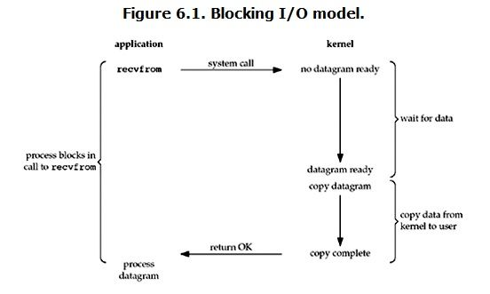
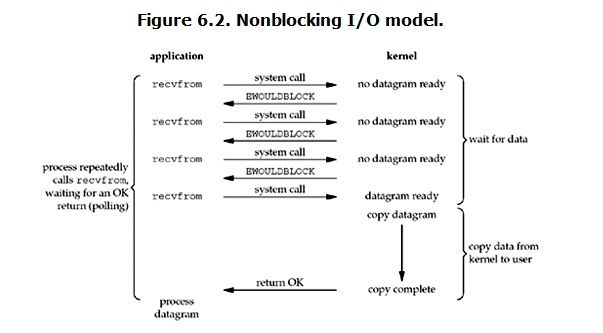
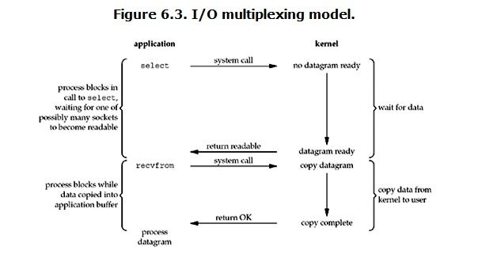
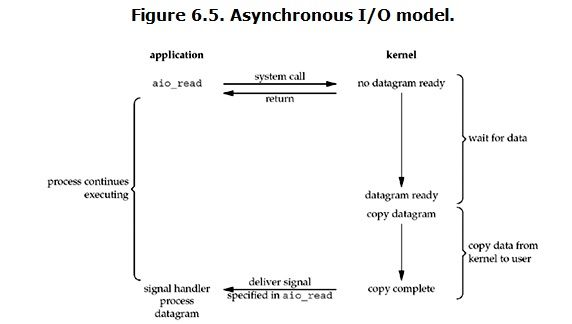
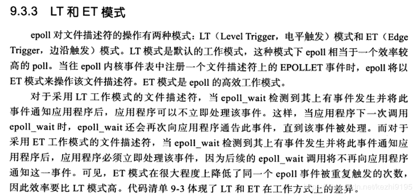

# JAVA网络IO学习小记（下）

- JAVA  BIO
- JAVA  NIO
  - NIO解决的BIO问题
  - 单线程多路复用
  - 多线程多路复用
- Selector多路复用器的内部实现（poll，epoll）
- 操作系统IO模型
- Netty知识体系梳理和提要
- 之后的学习拓展


这篇比较乱:cry:,因为明天就要开始实习了，还有一堆事，所以有空再仔细理一理了。


# BIO：同步并阻塞

**BIO**是最基础的，可以讲的不多。

两个例子：

- <https://blog.csdn.net/DRB321/article/details/89740252>
- <https://blog.csdn.net/uniquewonderq/article/details/89764358>

**BIO**的`ServerSocket`每accept后产生一个socket，都得需要一个线程进行处理

所以这里可以用线程池去管理这些处理socket的Thread，下面是伪代码：

```java
Socket clientSocket = ServerSocket,accept();
//HandleMsg是一个Runnable，内部处理socket的输入流和输出流来实现收发消息
Executors.newCachedThreadPool(HandleMsg(clientSocket));
```


此时还是**BIO**的，也就是负责一个socket的线程，**CPU会花很长的时间去等待iO**。(接收accept、读read、写write的IO操作很费时)

所以要将网络IO的等待时间从线程中分离出来，于是有了NIO。


# NIO：IO同步，处理异步

NIO有两种意思：

- 第一种n为nonblocking，非阻塞网络。

- 第二种是new io{由channel，bytebuffer，selector（多路复用器）组成}

非阻塞nio意思是还是使用accept（非阻塞的），read（非阻塞的），那就得无限循环+判断是否为null。

所以得优化，将Thread从socket网络IO的等待时间中分离出来。于是有了**多路复用器**。

多路复用器从底层来说就是IO复用中的select、poll、epoll，从代码层面说就是Selector。


**关键组件**：Channel，Buffer，Selector，线程池，**SelectionKey**（很重要，表示一对Selector和Channel关系）；

**组件拓展**：[Java NIO之缓冲区  ByteBuffer](<http://www.tianxiaobo.com/2018/03/04/Java-NIO%E4%B9%8B%E7%BC%93%E5%86%B2%E5%8C%BA/>)


## NIO解决的BIO问题

来自：<https://juejin.im/book/5b4bc28bf265da0f60130116/section/5b4bc28b5188251b1f224ee5>

上面的 demo，从服务端代码中我们可以看到，在传统的 IO 模型中，每个连接创建成功之后都需要一个线程来维护，每个线程包含一个 while 死循环，那么 1w 个连接对应 1w 个线程，继而 1w 个 while 死循环，这就带来如下几个问题：

1. **线程资源受限**：线程是操作系统中非常宝贵的资源，同一时刻有大量的线程处于阻塞状态是非常严重的资源浪费，操作系统耗不起
2. **线程切换效率低下**：单机 CPU 核数固定，线程爆炸之后操作系统频繁进行线程切换，应用性能急剧下降。
3. 除了以上两个问题，IO 编程中，我们看到数据读写是**以字节流为单位**。

为了解决这三个问题，JDK 在 1.4 之后提出了 NIO。


下面放几个我认为讲的不错的，可以再进一步加深印象和了解：

- [【好】NIO和BIO区别](<https://github.com/qiurunze123/miaosha/blob/master/docs/netty.md>)
- [区别介绍2](<https://www.jianshu.com/p/8b3af5bf4ce1>)
- [区别介绍3](<https://mp.weixin.qq.com/s?__biz=MzIzMzgxOTQ5NA==&mid=2247483922&idx=1&sn=c9fdc5cd64df5a412b9dc2fc6f9e4880&chksm=e8fe9e1bdf89170d9f0d08dc0320b15238869dd6c8b9496d82b1af75d0ddc102327438029a89&mpshare=1&scene=23&srcid=04309vp8meGa4KgjZn6n3bZq&sharer_sharetime=1588211264912&sharer_shareid=e6d90aec84add5cf004cb1ab6979727c#rd>)
- 区别介绍4:     [一个故事讲清楚NIO](<https://mp.weixin.qq.com/s?__biz=MzI3NjU2ODA5Mg==&mid=2247484266&idx=1&sn=a1cd76802b4f2ae5c9a652c126ebb424&chksm=eb72c219dc054b0f6ab88259d8b82d2b0cd1a1fb1d01f43a988488824ef6fa1f03f3d5c9ace4&mpshare=1&scene=23&srcid=0430DLk3OcbyQUjlEJ8Xic36&sharer_sharetime=1588211183498&sharer_shareid=e6d90aec84add5cf004cb1ab6979727c#rd>)


## NIO单线程多路复用

这里其实和BIO类似，但由于设置了非阻塞方式，所以selecter的轮询是必不可少的。

Nio的单线程多路复用总体流程：

- 单线程只单个selecter线程轮询取出所有感兴趣事件socket的fd
- 对应每个取出的fd，线程池分配线程进行处理


下面通过一个例子来说明：**使用NIO构建一个Echo服务器**

> 参考来源：JAVA高并发程序设计（第二版）
>

### 流程：

- 创建ServerSocketChannel

- 给ServerSocketChannel调bind绑定个InetSocketAddress

- 创建Selector

- ServerSocket绑定到Selector，注册感兴趣的事件为OP_ACCEPT

- ServerSocketChannel死循环调用select(),获取已经准备好的SelectionKey集合

- 进入处理SelectionKey步骤，对每个SelectionKey在处理前在集合中移除（防治重复处理）

- 判断SelectionKey所代表的的Channel是否在Acceptable状态，是则进行客户端的接收

  ```
  - 使用新的clientChannel来代表这连接
  - 将新的clientChannel注册到Selector上，获取SelectionKey
  - 并告诉Selector现在对OP_READ操作很感兴趣
  - 创建一个带有LinkedList<ByteBuffer>对象的容器，加入该SelectionKey
  - 该容器用于共享ByteBuffer，也就是输入流读到容器，输出流从这里取数据
  ```

- 判断SelectionKey所代表的的Channel是否可以读了，是则进行客户端的读取

  ```
  - 接收一个SelectionKey，获取其中的channel
  - 准备8K的缓冲区bb，len=channel.read(bb)，读取的数据放于变量bb中
  （这里len = channel.read(bb)完成后要判断len<0不，小于0记得关闭连接，有循环的话则跳出循环）
  - 读取完成后，重置缓冲区，指针复位，头指针指向头，尾指针指向limit，为数据处理做准备
  - 将受到的数据bb，使用线程池  压入SelectionKey中的容器中
  - 在Selector上重新注册感兴趣的事件为OP_WRITE |  OP_READ
  ```

- 判断SelectionKey所代表的的Channel是否可以写了，是则进行客户端的写入

  ```
  - 接收一个SelectionKey，获取其中的容器
  - 获得容器LinkedList<ByteBuffer>对象的顶部元素ByteBuffer bb
  - int len = channel.write(bb)写回客户端
  - bb.remaining() == 0，判断是否全部发送完成，完成则移除这个缓存对象（顶部元素bb）
  - 在全部数据发送完成后（这里意思是LinkedList<ByteBuffer>为空），需要将写事件(OP_WRITE)从感兴趣的操作中移除
  ```


**注意点**：

- 不阻塞点：1.接收accept(通过Selector)    2.Read(通过Selector)        3.HandleMsg(通过线程池)

- 读写共用同一个**SelectionKey**！这样可以获取到相同的容器，得到输入流的结果   和   输出流的数据源。

- 读操作，对于数据压入容器、重新注册感兴趣的事件，使用线程池进行处理来减少处理时间：

  ```java
  class HandleMsg implements Runnable{
      SelectionKey sk;
      ByteBuffer bb;
      public HandleMsg(SelectionKey sk, ByteBuffer bb) {
          this.sk = sk;
          this.bb = bb;
      }
      @Override
      public void run() {
          //这里的EchoClient便是上文提到的容器
          EchoClient echoClient = (EchoClient)sk.attachment();
          //把bb压入容器
          echoClient.enqueue(bb);
          //重新注册感兴趣的事件
          sk.interestOps(SelectionKey.OP_READ | SelectionKey.OP_WRITE);
          //强迫selector立即返回
          selector.wakeup();
      }
  }
  //doRead()中对于HandleMsg的调用：
  //len = channel.read(bb);
  //bb.flip();    <---读取完重置（翻转）缓冲区，头指针回位，尾指针指向limit
  //tp.execute(new HandleMsg(sk, bb));   <--提交线程池，任务执行
  ```

还有个NIO实现客户端，就不说明了···


## NIO多线程多路复用

这种实现方式，是类似于Netty的思想（当然Netty要复杂多了哈哈）

理解多线程多路复用，得搞清楚其中的**IO模型**和**线程模型**。

- 多路复用IO模型可以简单理解为多个Selecter，一个Selecter专门负责发现OP_ACCEPT事件，其他Selecter负责发现OP_READ和OP_WRITE事件。

- 多路复用线程模型可以理解为boss线程和worker线程机制；

  - boss线程专门负责处理OP_ACCEPT事件的，即负责发现OP_ACCEPT的Selecter运行在此线程中，阻塞轮询来发现；
  - worker线程负责处理OP_READ事件和OP_WRITE时间的，当有感兴趣的事件发生时，就交由worker线程去处理这些耗时较长的工作。

  

这里放一个示意图~


  从例子角度出发，多线程多路复用和多线程多路复用的不同之处：

- 上面的实现，HandleMsg使用线程池，但是Accept和Read都注册在主线程（boss线程）的Selector上

- 这里的实现，Accept注册在主线程（boss线程）的Selector上，Read注册在从线程（worker线程）的Selector上


# Selector多路复用器的内部实现（poll，epoll）

NIO底层实现poll, epoll(jdk1.5update 9  和jdk1.6  仅限于 linux 2.6以上 )

下面是NIO源码中的Selector的创建

- <https://www.cnblogs.com/duanxz/p/6782792.html>
- <https://blog.csdn.net/weixin_34238633/article/details/86427793>

我们调用`SelectorProvider.provider()`获取Selector，根据条件获取的是Epoll或者Poll的


### 接着了解多路复用的Select、Poll、Epoll


- 参考我的**操作系统md**内对于Select，Poll，Epoll的介绍（会放在介绍完Epoll完之后贴出来）
- 然后还有这个：<https://blog.csdn.net/maikelsong/article/details/80520279>


这里有一个多路复用select、poll、epoll直观的对比，好图！


### 疑问1：epoll是多路复用还是信号驱动？

**看这一篇**，[IO多路复用、信号驱动IO以及epoll](https://www.cnblogs.com/arnoldlu/p/10264350.html)

这里还要注意，水平触发和边缘触发

简单理解：

select和poll是多路复用

epoll是多路复用+信号驱动


- 水平触发通知：如果文件描述符上可以非阻塞地执行IO系统调用，此时认为它已经就绪。
- 边缘触发通知：如果文件描述符自上次状态检查以来有了新的IO活动，此时需要触发通知。

| IO模式          | 水平触发 | 边缘触发 |
| --------------- | -------- | -------- |
| select()/poll() | √        |          |
| 信号驱动IO      |          | √        |
| epoll           | √        | √        |

当采用**水平触发**通知时，可以在任意时刻检查文件描述符的就绪状态。表示当文件描述符处于就绪态时，就可以对其执行一些IO操作；然后重复检查文件描述符。看看是否仍然处于就绪态，此时可以执行更多的IO。由于水平触发模式允许我们在任意时刻重复检查IO状态，没有必要每次当文件描述符就绪后需要尽可能多地址性IO。

 

当采用**边缘触发**时，只有当IO事件发生时才会收到通知，因此：

- 在接收到一个IO事件通知后，程序应该在相应的文件描述符上尽可能多地执行IO。如果不那么做，可能失去执行IO的机会，导致数据丢失或者程序出现阻塞。
- 如果程序采用循环来对文件描述符执行尽可能多的IO，而文件描述符又被设置为可阻塞的，那么最终当没有更多的IO可执行时，IO系统调用就会阻塞。因此，每个被检查的文件描述符都应该设置为非阻塞模式，在得到IO事件通知后重复执行IO操作。


### 疑问2：socket.accept（）和Selector.select()区别

[accept和select的区别](https://www.cnblogs.com/zhchy89/p/8850048.html)

这里其实没啥可比性···别搞混啦


# Epoll直观感受

获取epoll执行过程的命令：


在输出的out文件中，观察selector前后变化：

selector()有感兴趣事件发生前，epoll_wait轮询内核内特定的链表


selector()有感兴趣事件发生后，


#### 下面是代码对应epoll的完整执行过程


# Epoll理解重点

对于epoll来说：

- epoll_create在内存里开了空间（返回selector这个内核空间的的文件描述符）
- epoll_ctl来实现注册，把比如  `4fd  accept`  这个事件  注册到  7fd的内核空间内
- epoll_wait在内核态轮询**链表**，看有没有感兴趣时间发生


不是因为调了epoll_wait，cpu就去处理感兴趣事件，

**而是网卡接收数据，导致cpu中断时，产生事件，事件可以触发call back回调函数，才使得就绪的感兴趣的fd到内核中的链表，然后让epoll_wait去发现链表上的事件**

epoll可理解为信号驱动的


详细可参见：

# [epoll的本质](https://www.cnblogs.com/Joy-Hu/p/10762239.html)


# 操作系统五种IO模型，及Epoll介绍补充

下面摘自`操作系统.md`，哈哈是我以前的笔记，写的有点乱···

## 介绍

    在谈及网络IO的时候总避不开阻塞、非阻塞、同步、异步、IO多路复用、select、poll、epoll等这几个词语。在面试的时候也会被经常问到这几个的区别。本文就来讲一下这几个词语的含义、区别以及使用方式。
Unix网络编程一书中作者给出了五种IO模型：

```
1、BlockingIO - 阻塞IO
2、NoneBlockingIO - 非阻塞IO
3、IO multiplexing - IO多路复用
4、signal driven IO - 信号驱动IO
5、asynchronous IO - 异步IO
```

这五种IO模型中前四个都是**同步的IO**，只有最后一个是**异步IO**。`信号驱动IO`使用的比较少，重点介绍其他几种IO以及在Java中的应用。


## 阻塞、非阻塞、同步、异步以及IO多路复用

    在进行网络IO的时候会涉及到用户态和内核态，并且在用户态和内核态之间会发生数据交换，从这个角度来说我们可以把IO抽象成两个阶段：
    
    1、**用户态**等待内核态数据准备好
    
    2、将数据从内核态**拷贝**到用户态。

之所以会有同步、异步、阻塞和非阻塞这几种说法就是根据程序在这两个阶段的处理方式不同而产生的。


- ### 同步阻塞

  

         当在用户态调用read操作的时候，如果这时候kernel还没有准备好数据，那么用户态会一直阻塞等待，直到有数据返回。当kernel准备好数据之后，用户态继续等待kernel把数据从内核态拷贝到用户态之后才可以使用。这里会发生**两种等待**：

  - 一个是用户态等待kernel**有数据可以读**
  - 另外一个是当有数据可读时用户态等待kernel把**数据拷贝**到用户态。

         在Java中同步阻塞的实现对应的是**传统的文件IO操作**以及**Socket的accept**的过程。在Socket调用accept的时候，程序会一直等待知道有描述符就绪，并且把就绪的数据拷贝到用户态，然后程序中就可以拿到对应的数据。

- ### 同步非阻塞

  

          对比第一张同步阻塞IO的图就会发现，在同步非阻塞模型下**第一个阶段是不等待的**，无论有没有数据准备好，都是立即返回。**第二个阶段仍然是需要等待的**，用户态需要等待内核态把数据拷贝过来才能使用。对于同步非阻塞模式的处理，需要每隔一段时间就去询问一下内核数据是不是可以读了，如果内核说可以，那么就开始第二阶段等待。

- ### IO多路复用

  IO多路复用也是同步的。

  

          IO多路复用的方式看起来跟同步阻塞是一样的，**两个阶段都是阻塞的**，但是IO多路复用可以实现以较小的代价同时监听多个IO。**通常情况下是通过一个线程来同时监听多个描述符，只要任何一个满足就绪条件，那么内核态就返回**。IO多路复用使得传统的每请求每线程的处理方式得到**解耦**，**一个线程可以同时处理多个IO请求，然后交到后面的线程池里处理**，这也是netty等框架的处理方式，所谓的**reactor模式**。IO多路复用的实现**依赖于操作系统的select、poll和epoll**，后面会详细介绍这几个系统调用。
      IO多路复用在Java中的实现方式是**在Socket编程中使用非阻塞模式，然后配置感兴趣的事件，通过调用select函数来实现**。select函数就是对应的第一个阶段。如果给select配置了超时参数，**在指定时间内**没有感兴趣事件发生的话，**select调用也会返回**，这也是为什么要做非阻塞模式下运行。

- ### 异步IO

  

         异步模式下，前面提到的两个阶段都不会等待。使用异步模式，用户态调用read方法的时候，相当于告诉内核数据发送给我之后告诉我一声我先去干别的事情了。在这两个阶段都不会等待，只需要在内核态通知数据准备好之后使用即可。通常情况下使用异步模式都**会使用callback**，当数据可用之后执行callback函数。


## IO多路复用

IO多路复用基础是select，poll，epoll

- ### select

  ```
  int select(int maxfdp1, fd_set *readset,fd_set *writeset,fd_set *exceptset,const struct timeval *timeout)
  
     - maxfdp1为指定的待监听的描述符的个数，因为描述符是从0开始的，所以需要加1。
     - readset为要监听的读描述符。
     - writeset为要监听的写描述符。
     - exceptset为要监听的异常描述符。
     - timeout监听没有准备好的描述符的话，多久可以返回。
      select操作的逻辑是首先将要监听的读、写以及异常描述符拷贝到内核空间，然后遍历所有的描述符，如果有感兴趣的事件发生，那么就返回。
  select在使用的过程中有三个问题：
  1、被监控的fds(描述符)集合限制为1024，1024太小了
  2、需要将描述符集合从用户空间拷贝到内核空间
  3、当有描述符可操作的时候都需要遍历一下整个描述符集合才能知道哪个是可操作的，效率很低。
  ```

- ### poll

  ```
  int poll(struct pollfd[] fds, unsigned int nfds, int timeout)
  
  poll操作与select操作类似，仍旧避免不了描述符从用户空间拷贝到内核空间，但是poll不再有1024个描述符的限制。对于事件的触发通知还是使用遍历所有描述符的方式，因此在大量连接的情况下也存在遍历低效的问题。poll函数在传递参数的时候统一的将要监听的描述符和事件封装在了pollfd结构体数组中。
  ```

- ### epoll

  ```
  epoll有三个方法：epoll_create、epoll_ctl和epoll_wait。
  - epoll_create是创建一个epoll句柄；
  - epoll_ctl是注册要监听的事件类型；
  - epoll_wait则是等待事件的产生。 通过这三个方法epoll解决了select的三个问题。
  
  epoll_create方法来创建一个epoll句柄，这个句柄监听的描述符的数量不再有限制
  
  epoll_ctl用于注册新事件和取消注册事件，当需要修改时，调用epoll_ctl修改内核空间中的文件描述符即可
  在调用epoll_ctl注册感兴趣的事件的时候，实际上会为设置的事件添加一个回调函数，当对应的感兴趣的事件发生的时候，回调函数就会触发，然后将自己加到一个链表中。
  
  epoll_wait函数的作用就是去查看这个链表中有没有已经准备就绪的事件，如果有的话就通知应用程序处理，如此操作epoll_wait只需要遍历就绪的事件描述符即可。
  ```

- ### [select、poll、epoll之间的区别(搜狗面试)](https://www.cnblogs.com/aspirant/p/9166944.html)


## epoll在Java中的使用

    目前针对**Java服务器的非阻塞编程基本都是基于epoll的**。在进行非阻塞编程的时候有两个步骤：
    
    1、注册感兴趣的事情；
    
    2、调用select方法，查找感兴趣的事件。

### 注册感兴趣的事件


### select方法

- 首先调用**EPollArrayWrapper**的poll方法，该方法做两件事：
  - 1、调用epollCtl方法向epoll中注册感兴趣的事件
  - 2、调用epollWait方法返回已就绪的文件描述符集合

- 然后调用**updateSelectedKeys**方法调用
  - **把epoll中就绪的文件描述符加到ready队列中等待上层应用处理**, 
  - updateSelectedKeys通过fdToKey**查找文件描述符**对应的SelectionKey，
  - 并在SelectionKey对应的channel中添**加对应的事件**到**ready队列**。


## 水平触发LT与边缘触发ET

`epoll`支持两种触发模式,分别是:

- **水平触发**
- **边缘触发**

      LT是缺省的工作方式，并且同时支持block和no-block socket。在这种做法中，内核告诉你一个文件描述符是否就绪了，然后你可以对这个就绪的fd进行IO操作。**如果你不作任何操作，内核还是会继续通知你的**。
      ET是高速工作方式，只支持no-block socket。**在这种模式下，当描述符从未就绪变为就绪时，内核会通知你一次，并且除非你做了某些操作导致那个文件描述符不再为就绪状态了，否则不会再次发送通知**。
      可以看到，本来内核在被DMA中断，捕获到IO设备来数据后，只需要查找这个数据属于哪个文件描述符，进而通知线程里等待的函数即可，但是，LT要求内核在通知阶段还要继续再扫描一次刚才所建立的内核fd和io对应的那个数组，因为应用程序可能没有真正去读上次通知有数据后的那些fd，这种沟通方式效率是很低下的，只是方便编程而已；
      JDK并没有实现边缘触发，关于边缘触发和水平触发的差异简单列举如下，边缘触发的性能更高，但编程难度也更高，netty就重新实现了Epoll机制，采用边缘触发方式；另外像nginx等也采用的是边缘触发。




## 多路复用题目

<https://www.nowcoder.com/test/question/done?tid=30500411&qid=44765#summary>

关于linux的I/O复用接口select和epoll,下列说法错误的是()

```
A select调用时会进行线性遍历,epoll采用回调函数机制,不需要线性遍历
B select的最大连接数为FD_SETSIZE
C select较适合于有大量并发连接,且活跃链接较多的场景
D epoll较适用于有大量并发连接，但活跃连接不多的场景
E epoll的效率不随FD数目增加而线性下降
F epoll通过共享存储实现内核和用户的数据交互
```

答案C

select 和 epoll效率差异的原因：select采用轮询方式处理连接，epoll是触发式处理连接。

Select:

> 1.Socket数量限制：该限制可操作的Socket数由FD_SETSIZE决定，内核默认32*32=1024.
>
> 2.操作限制：通过遍历FD_SETSIZE(1024)个Socket来完成调度，不管哪个Socket是活跃的，都遍历一遍。

Epoll

> 1.Socket数量无限制：该模式下的Socket对应的fd列表由一个数组来保存，大小不限制（默认4k）。
>
> 2.操作无限制：基于内核提供的反射模式，有活跃Socket时，内核访问该Socket的callback，不需要遍历轮询。

但当所有的Socket都活跃的时候，所有的callback都被唤醒，会导致资源的竞争。既然都是要处理所有的Socket，

那么遍历是最简单最有效的实现方式。


### `操作系统.md`的参考

- <https://www.cnblogs.com/yunxitalk/p/9031306.html>


好啦，接着继续多路用用~~


# 一些概念区分与联系

select，poll，epoll只是NIO的多路复用器Selector的实现方式，

而通过Selector的不同用法，实现了boss和worker形式


 这里：

- netty的boss和worker概念（boss只负责accept，worker只负责读写），
- epoll的seletor的fd在内核中的空间，里有感兴趣的事件（比如4fd的accept，8fd的read）


这两个概念不冲突的。也就是说，

- boss的selector的fd空间内感兴趣的事件只有serverSocket的accept，
- 而worker的selector的fd空间内感兴趣的只有read  write


目前NIO相关的就这么多拉，然后再放一点Netty的：


# Netty


- <https://mp.weixin.qq.com/mp/homepage?__biz=MzA3MTQ2MDgyOQ==&hid=4&sn=9d1829a1b7ab87973a3277a8152037fc&scene=18#wechat_redirect>

- <https://github.com/aalansehaiyang/technology-talk/blob/master/middle-software/Netty.md>

- ### Netty入门与实战:仿写微信IM即时通讯系统

  <https://www.jianshu.com/p/7522bda72a25>

- JAVA读源码之Netty深入剖析3-2

  试读白嫖：<https://coding.imooc.com/class/chapter/230.html#Anchor>


## 使用Netty而不是用JDK原生NIO的原因

1. 使用 JDK 自带的NIO需要了解太多的概念，编程复杂，一不小心 bug 横飞
2. Netty 底层 IO 模型随意切换，而这一切只需要做微小的改动，改改参数，Netty可以直接从 NIO 模型变身为 IO 模型
3. Netty 自带的拆包解包，异常检测等机制让你从NIO的繁重细节中脱离出来，让你只需要关心业务逻辑
4. Netty 解决了 JDK 的很多包括空轮询在内的 Bug
5. Netty 底层对线程，selector 做了很多细小的优化，精心设计的 reactor 线程模型做到非常高效的并发处理
6. 自带各种协议栈让你处理任何一种通用协议都几乎不用亲自动手
7. Netty 社区活跃，遇到问题随时邮件列表或者 issue
8. Netty 已经历各大 RPC 框架，消息中间件，分布式通信中间件线上的广泛验证，健壮性无比强大


## Netty的工作机制

参考：<https://mp.weixin.qq.com/s?__biz=MzA3MTQ2MDgyOQ==&mid=2247483852&idx=1&sn=f8a35cd3b08fd58471372d04ffbadf35>


## Netty客户端与服务端启动流程

三个重要概念：

- 线程模型(NioEventLoopGroup)

  > `bossGroup`表示监听端口，accept 新连接的线程组，`workerGroup`表示处理每一条连接的数据读写的线程组

- IO模型(channel())

- 业务处理逻辑(*Handler)


**各个函数的解析**：

- <https://juejin.im/book/5b4bc28bf265da0f60130116/section/5b4daf9ee51d4518f543f130>
- <https://mp.weixin.qq.com/s?__biz=MzA3MTQ2MDgyOQ==&mid=2247483940&idx=1&sn=6595fcee353d1704e1a1865df669e65c>

**其中channel的四步骤（创建、初始化、注册、绑定）对应代码和流程**

channel()方法传入类来设置反射的Factory,用于之后创建channel

在bind一开始调用newChannel()方法创建channel  （用于accept的channel）

然后继续initAndRegister  

- 初始化——设置属性和*handler加入pipeline
- Register，channel注册到selector里

最后bind0

- channel绑定到指定host和端口


## ChannelFuture和addListener

服务端的bind()和客户端的connect是异步的

Listener可以实现递增端口重连、和失败重连

**定时任务**

失败重连时，设置重连的时间延时可以使用定时任务

```java
connect(bootstrap, "juejin.im", 80, MAX_RETRY);

private static void connect(Bootstrap bootstrap, String host, int port, int retry) {
    bootstrap.connect(host, port).addListener(future -> {
        if (future.isSuccess()) {
            System.out.println("连接成功!");
        } else if (retry == 0) {
            System.err.println("重试次数已用完，放弃连接！");
        } else {
            // 第几次重连
            int order = (MAX_RETRY - retry) + 1;
            // 本次重连的间隔
            int delay = 1 << order;
            System.err.println(new Date() + ": 连接失败，第" + order + "次重连……");
            bootstrap.config().group().schedule(() -> connect(bootstrap, host, port, retry - 1), delay, TimeUnit
                    .SECONDS);
        }
    });
}
```

`config()`返回的是配置参数的抽象`BootstrapConfig`，

`group()`返回的是一开始的时候配置的线程模型 `workerGroup`

 `schedule` 方法即可实现定时任务逻辑


## pipeLine和channelHandler

`ch.pipeline()` 返回的是和这条连接相关的逻辑处理链，采用了责任链模式

自己编写IO业务逻辑处理器，继承自 `ChannelInboundHandlerAdapter`：

- `channelActive()`方法，**这个方法会在客户端连接建立成功之后被调用**。客户端连接建立成功之后，调用到 `channelActive()` 方法，在这个方法里面，我们编写向服务端写数据的逻辑
- `channelRead()`，**这个方法在接收到客户端发来的数据之后被回调**

写：

```java
ByteBuf out = getByteBuf(ctx);//ByteBuf buffer = ctx.alloc().buffer();
ctx.channel().writeAndFlush(out);
```

读

```java
//参数：Object msg
ByteBuf byteBuf = (ByteBuf) msg;
byteBuf.toString(Charset.forName("utf-8")
```


1. channelHandler 分为 inBound 和 outBound 两种类型的接口，分别是处理数据读与数据写的逻辑，可与 tcp 协议栈联系起来。
2. 两种类型的 handler 均有相应的默认实现，默认会把事件传递到下一个，这里的传递事件其实说白了就是把本 handler 的处理结果传递到下一个 handler 继续处理。
3. inBoundHandler 的执行顺序与我们实际的添加顺序相同，而 outBoundHandler 则相反。


## ChannelInboundHandlerAdapter 与 ChannelOutboundHandlerAdapter


**这里就是编码解码交给特殊的Handler完成，这样在channelhandler中传递的是Packet而不是ByteBuf**

> 我们使用 `4.1.6.Final` 版本，默认情况下用的是堆外内存，在 [ByteBuf](https://juejin.im/book/5b4bc28bf265da0f60130116/section/5b4db03b6fb9a04fe91a6e93) 这一小节中我们提到，堆外内存我们需要自行释放，在我们前面小节的解码的例子中，其实我们已经漏掉了这个操作，这一点是非常致命的，随着程序运行越来越久，内存泄露的问题就慢慢暴露出来了， 而这里我们使用 `ByteToMessageDecoder`，Netty 会自动进行内存的释放，我们不用操心太多的内存管理方面的逻辑，关于如何自动释放内存大家有兴趣可以参考一下 [ByteToMessageDecoder的实现原理(8-2)](https://coding.imooc.com/class/chapter/230.html#Anchor)。


- `ByteToMessageDecoder`先将二进制转化为数据包Packet，导入inHandler
- **channelRead**内`ctx.fireChannelRead(packet)`，将解码完毕的数据包传递到下一个handler
- 除了使用`if  else（ctx.fireChannelRead）`，也可以使用 **`SimpleChannelInboundHandler` 来**简化我们的指令处理逻辑
  - 泛型指定为特定Packet
  - 接收的参数不是之前的`Object( ByteBuf) Msg`，而是`Packet`
  - 读时传递也直接传Packet：`ctx.channel().writeAndFlush(messageResponsePacket);`
- `MessageToByteEncoder`，数据包Packet转二进制，去write


这里SimpleChannelInboundHandler的channelRead0()第二个参数，还是通过ChannelInboundHandlerAdapter#channelRead()方法的第二个参数来的


## ByteBuf


Java官方的NIO提供了一个ByteBuffer类作为字节的容器。但是ByteBuffer的使用比较复杂，尤其是需要通过flip()方法对读写进行切换。[Java NIO之缓冲区  ByteBuffer](<http://www.tianxiaobo.com/2018/03/04/Java-NIO%E4%B9%8B%E7%BC%93%E5%86%B2%E5%8C%BA/>)

**因此netty重新设计了一个字节容器，即ByteBuf。**ByteBuf被设计为一个抽象类，其有以下特点：

- 定义了两个不同的索引，分别为读和写索引
- 读写模式不需要调用flip()进行切换
- 实现了ReferenceCounted接口，支持引用计数
- 支持池化
- 方法可以链式调用
- 容器可以按需增长


**ByteBuf结构**

- readIndex
- writeIndex
- capacity
- **maxCapacity**

ByteBuf中字节内容的读取有两种方式：随机读取和顺序读取。


【0 - readIndex) ：**discardable bytes**（已读过字节—已丢弃）

【readIndex - writeIndex) ：**readable bytes**

【readIndex - writeIndex) ：**readable bytes**

【writeIndex - capacity) : **writable bytes**


**为什么设置双指针？**

- 避免flip()方法在读模式和写模式之间进行来回的切换，读和写互不影响，可以同时进行
- 所有的网络通信都涉及字节序列的移动，ByteBuf的两个指针正好保证了这一点，并且非常高效的保证了这一点。


**读写指针相关API**（保存当前readIndex位置）

```java
// 代码片段1
int readerIndex = buffer.readerIndex();
// .. 其他操作
buffer.readerIndex(readerIndex);


// 代码片段二
buffer.markReaderIndex();
// .. 其他操作
buffer.resetReaderIndex();
```

**读写API**

- writeBytes(byte[] src) 

- buffer.readBytes(byte[] dst)

- setByte() 系列

  > 唯一的区别就是 **get/set 不会改变读写指针，而 read/write 会改变读写指针**


### [初级例子](<https://juejin.im/book/5b4bc28bf265da0f60130116/section/5b4db03b6fb9a04fe91a6e93>)


### [高级例子](<https://mp.weixin.qq.com/s?__biz=MzA3MTQ2MDgyOQ==&mid=2247483888&idx=1&sn=01f5fc45857515c385241d49fd56cd28&scene=19#wechat_redirect>)

> **特别注意点**：将读取的内容丢弃步骤时，虽然readIndex和writeIndex相对位置没变，但writeIndex前移，前移的地方还保留的原本的内容，只是这两个字节由原来的“可读”变成了现在的“可写”

下面是例子：

**(1)读取一段内容**

#### 


image-byte-buf-use-3


接着我们有读取了2个字节的内容，这时读指针向后移动了2个字节，读指针的值变成了2，写指针不变，此时0和读指针之间的内容变成了“可丢弃”的状态了，我们用粉色来表示。

**(2)将读取的内容丢弃**

#### 


image-byte-buf-use-4


紧接着，我们将刚刚读取完的2个字节丢弃掉，这时ByteBuf把读指针与写指针之间的内容（即 `3`、`4`、`5` 三个字节）移动到了0的位置，并且将读指针更新为0，写指针更新为原来写指针的值减去原来读指针的值。但是需要注意的是，第4和第5个字节的位置上，还保留的原本的内容，只是这两个字节由原来的“可读”变成了现在的“可写”。


**ByteBuf扩容**

具体见此，[图解ByteBuf读、写与扩容](<https://mp.weixin.qq.com/s?__biz=MzA3MTQ2MDgyOQ==&mid=2247483888&idx=1&sn=01f5fc45857515c385241d49fd56cd28&scene=19#wechat_redirect>)


**ByteBuf创建方法**

- 官方推荐：Unpooled中的一些辅助方法

  `ByteBufAllocator`是一个专门负责ByteBuf分配的接口，对应的`Unpooled`实现类就是`UnpooledByteBufAllocator`

- 项目中：ChannelHandlerContext.alloc().ioBuffer()

- 平台是否支持Unsafe区别


**ByteBuf种类**

- EmptyByteBuf
- WrappedByteBuf
- AbstractByteBuf


**ByteBuf池化**

​	ByteBuf类实现了ReferenceCounted接口，该接口标记一个类是一个需要用引用计数来管理的类。

​	如果引用计数为0，则释放当前对象。 在ByteBuf的各个子类中，他们会自己决定如何释放对象，如果是池化的 ByteBuf，那么就会返回到池子中，如果不是池化的，则销毁底层的字节数组引用或者释放对应的堆外内存。 

**ByteBuf回收**

Netty 对二进制数据的抽象 ByteBuf 的结构，本质上它的原理就是，它引用了一段内存，这段内存可以是堆内也可以是堆外的。由于 Netty 使用了堆外内存，而堆外内存是不被 jvm 直接管理的，也就是说申请到的内存无法被垃圾回收器直接回收，所以需要我们手动回收。

Netty 的 ByteBuf 是通过引用计数的方式管理的，如果一个 ByteBuf 没有地方被引用到，需要回收底层内存。

- retain() ：+1
- release()：-1


**截取ByteBuf**

调用下面这三个方法，记得引用计数+1，不然引用计数归0截取也消失了，所以引用计数多1点

- slice()：截取读的部分，共享内存和引用，不同的读写指针
- duplicate()：截取整个，共享内存和引用，不同的读写指针
- copy()：从原始的 ByteBuf 中拷贝所有的信息，包括读写指针以及底层对应的数据

改进：在截取内存片段的同时，增加内存的引用计数

```java
// retainedSlice 等价于
slice().retain();

// retainedDuplicate() 等价于
duplicate().retain()
```

**使用到 slice 和 duplicate 方法的时候，千万要理清内存共享，引用计数共享，读写指针不共享几个概念**。容易犯的错：

- 多次释放
- 不释放造成内存泄漏


 **Netty的零拷贝（或者说ByteBuf的复用）主要体现在以下几个方面**:

- DirectByteBuf通过直接在堆外分配内存的方式，避免了数据从堆内拷贝到堆外的过程
- 通过组合ByteBuf类：即CompositeByteBuf，将多个ByteBuf合并为一个逻辑上的ByteBuf, 而不需要进行数据拷贝
- 通过各种包装方法, 将 byte[]、ByteBuf、ByteBuffer等包装成一个ByteBuf对象，而不需要进行数据的拷贝
- 通过slice方法, 将一个ByteBuf分解为多个共享同一个存储区域的ByteBuf, 避免了内存的拷贝，这在需要进行拆包操作时非常管用
- 通过FileRegion包装的FileChannel.tranferTo方法进行文件传输时, 可以直接将文件缓冲区的数据发送到目标Channel, 减少了通过循环write方式导致的内存拷贝。但是这种方式是需要得到操作系统的零拷贝的支持的，如果netty所运行的操作系统不支持零拷贝的特性，则netty仍然无法做到零拷贝


## 客户端和服务端通讯协议编解码

我们把 Java 对象根据协议封装成二进制数据包的过程成为编码，而把从二进制数据包中解析出 Java 对象的过程成为解码。


**Java 对象的序列化**

- 具体的序列化算法标识
- 将 Java 对象转换成字节数组
- 将字节数组转换成某种类型的 Java 对象

**编码：封装成二进制的过程**

```java
private static final int MAGIC_NUMBER = 0x12345678;

public ByteBuf encode(Packet packet) {
    // 1. 创建 ByteBuf 对象
    ByteBuf byteBuf = ByteBufAllocator.DEFAULT.ioBuffer();
    // 2. 序列化 Java 对象
    byte[] bytes = Serializer.DEFAULT.serialize(packet);//这里是上一步的序列化java对象

    // 3. 实际编码过程
    byteBuf.writeInt(MAGIC_NUMBER);
    byteBuf.writeByte(packet.getVersion());
    byteBuf.writeByte(Serializer.DEFAULT.getSerializerAlgorithm());
    byteBuf.writeByte(packet.getCommand());
    byteBuf.writeInt(bytes.length);
    byteBuf.writeBytes(bytes);

    return byteBuf;
}
```

**解码：解析 Java 对象的过程**

```java
public Packet decode(ByteBuf byteBuf) {
    // 跳过 magic number
    byteBuf.skipBytes(4);

    // 跳过版本号
    byteBuf.skipBytes(1);

    // 序列化算法标识
    byte serializeAlgorithm = byteBuf.readByte();

    // 指令
    byte command = byteBuf.readByte();

    // 数据包长度
    int length = byteBuf.readInt();

    byte[] bytes = new byte[length];
    byteBuf.readBytes(bytes);

    Class<? extends Packet> requestType = getRequestType(command);
    Serializer serializer = getSerializer(serializeAlgorithm);

    if (requestType != null && serializer != null) {
        return serializer.deserialize(requestType, bytes);
    }

    return null;
}
```


## 实战：Netty 实现客户端登录

流程：

ClientHandler.channelActive()  ——>   ServerHandler.channelRead() ——> ClientHandler.channelRead()


- `PacketCodec`处理（序列化+）编码解码

  map存放`<Byte   command, Class<? extends Packet>   clazz>`,编码时存，解码时取来序列化

- `LoginRequestPacket`登录请求数据包

- `LoginResponsePacket`登录响应数据包


## 实战：实现客户端与服务端收发消息

**客户端流程：**

先是登录的流程，在接收login响应包时设置登陆成功标志位

再connect后addListener，接收控制台输入 ——>  校验是否登陆成功  ——> 成功后发Msg包  ——> 接收Msg包

**服务端流程：**

channelRead读到login包时，返回login响应包

channelRead读到Msg包时，返回Msg包


- 定义客户端发送至服务端的消息对象 `MessageRequestPacket`
- 定义服务端发送至客户端的消息对象 `MessageResponsePacket`
- 判断客户端是否登陆成功：发消息前，检验Channel的attr属性内是否有登陆成功的标志位


## 实战：构建客户端与服务端Pipeline

见上面：`ChannelInboundHandlerAdapter 与 ChannelOutboundHandlerAdapter`


## 实战：拆包粘包理论与解决方案

我们需要在客户端根据自定义协议来组装我们应用层的数据包，然后在服务端根据我们的应用层的协议来组装数据包，这个过程通常**在服务端称为拆包，而在客户端称为粘包**。

**拆包和粘包是相对的**，一端粘了包，另外一端就需要将粘过的包拆开，举个栗子，发送端将三个数据包粘成两个 TCP 数据包发送到接收端，接收端就需要根据应用协议将两个数据包重新组装成三个数据包。

#### Netty 自带的拆包器

- 固定长度的拆包器 FixedLengthFrameDecoder

- 行拆包器 LineBasedFrameDecoder

- 分隔符拆包器 DelimiterBasedFrameDecoder

- 【最通用、自定义】基于长度域拆包器 LengthFieldBasedFrameDecoder

  ```java
  new LengthFieldBasedFrameDecoder(Integer.MAX_VALUE, 7, 4);
  ```

#### 拒绝非本协议连接

每个客户端发过来的数据包都做一次快速判断，判断当前发来的数据包是否是满足我的自定义协议， 我们只需要继承自 LengthFieldBasedFrameDecoder 的 `decode()` 方法，然后在 decode 之前判断前四个字节是否是等于我们定义的魔数 `0x12345678`

```java
public class Spliter extends LengthFieldBasedFrameDecoder {
    private static final int LENGTH_FIELD_OFFSET = 7;
    private static final int LENGTH_FIELD_LENGTH = 4;

    public Spliter() {
        super(Integer.MAX_VALUE, LENGTH_FIELD_OFFSET, LENGTH_FIELD_LENGTH);
    }

    @Override
    protected Object decode(ChannelHandlerContext ctx, ByteBuf in) throws Exception {
        // 屏蔽非本协议的客户端
        if (in.getInt(in.readerIndex()) != PacketCodeC.MAGIC_NUMBER) {
            ctx.channel().close();
            return null;
        }

        return super.decode(ctx, in);
    }
}
```

至此，我们服务端和客户端的 pipeline 结构为


## channelHandler生命周期

**启动，ChannelHandler 回调方法的执行顺序为**

```
handlerAdded() -> channelRegistered() -> channelActive() -> channelRead() -> channelReadComplete()
```

下面，我们来逐个解释一下每个回调方法的含义

1. `handlerAdded()` ：指的是当检测到新连接之后，调用 `ch.pipeline().addLast(new LifeCyCleTestHandler());` 之后的回调，表示在当前的 channel 中，已经成功添加了一个 handler 处理器。
2. `channelRegistered()`：这个回调方法，表示当前的 channel 的所有的逻辑处理已经和某个 NIO 线程建立了绑定关系，类似我们在[Netty 是什么？](https://juejin.im/book/5b4bc28bf265da0f60130116/section/5b4bc28b5188251b1f224ee5)这小节中 BIO 编程中，accept 到新的连接，然后创建一个线程来处理这条连接的读写，只不过 Netty 里面是使用了线程池的方式，只需要从线程池里面去抓一个线程绑定在这个 channel 上即可，这里的 NIO 线程通常指的是 `NioEventLoop`,不理解没关系，后面我们还会讲到。
3. `channelActive()`：当 channel 的所有的业务逻辑链准备完毕（也就是说 channel 的 pipeline 中已经添加完所有的 handler）以及绑定好一个 NIO 线程之后，这条连接算是真正激活了，接下来就会回调到此方法。
4. `channelRead()`：客户端向服务端发来数据，每次都会回调此方法，表示有数据可读。
5. `channelReadComplete()`：服务端每次读完一次完整的数据之后，回调该方法，表示数据读取完毕。


**关闭，ChannelHandler 回调方法的执行顺序为**

```
channelInactive() -> channelUnregistered() -> handlerRemoved()
```

到了这里，相信大家应该已经能够看到，这里的回调方法的执行顺序是新连接建立时候的逆操作，下面我们还是来解释一下每个方法的含义

1. `channelInactive()`: 表面这条连接已经被关闭了，这条连接在 TCP 层面已经不再是 ESTABLISH 状态了
2. `channelUnregistered()`: 既然连接已经被关闭，那么与这条连接绑定的线程就不需要对这条连接负责了，这个回调就表明与这条连接对应的 NIO 线程移除掉对这条连接的处理
3. `handlerRemoved()`：最后，我们给这条连接上添加的所有的业务逻辑处理器都给移除掉。


最后，**我们用一幅图来标识 ChannelHandler 的生命周期**


## ChannelHandler 生命周期各回调方法用法举例

Netty 对于一条连接的在各个不同状态下回调方法的定义还是蛮细致的，这个好处就在于我们能够基于这个机制写出扩展性较好的应用程序。

### 1. ChannelInitializer 的实现原理

仔细翻看一下我们的服务端启动代码，我们在给新连接定义 handler 的时候，其实只是通过 `childHandler()` 方法给新连接设置了一个 handler，这个 handler 就是 `ChannelInitializer`，而在 `ChannelInitializer` 的 `initChannel()` 方法里面，我们通过拿到 channel 对应的 pipeline，然后往里面塞 handler

> NettyServer.java

```
.childHandler(new ChannelInitializer<NioSocketChannel>() {
    protected void initChannel(NioSocketChannel ch) {
        ch.pipeline().addLast(new LifeCyCleTestHandler());
        ch.pipeline().addLast(new PacketDecoder());
        ch.pipeline().addLast(new LoginRequestHandler());
        ch.pipeline().addLast(new MessageRequestHandler());
        ch.pipeline().addLast(new PacketEncoder());
    }
});
```

这里的 `ChannelInitializer` 其实就利用了 Netty 的 handler 生命周期中 `channelRegistered()` 与 `handlerAdded()` 两个特性，我们简单翻一翻 `ChannelInitializer` 这个类的源代码：

> ChannelInitializer.java

```
    protected abstract void initChannel(C ch) throws Exception;

    public final void channelRegistered(ChannelHandlerContext ctx) throws Exception {
        // ...
        initChannel(ctx);
        // ...
    }

    public void handlerAdded(ChannelHandlerContext ctx) throws Exception {
        // ...
        if (ctx.channel().isRegistered()) {
            initChannel(ctx);
        }
        // ...
    }

    private boolean initChannel(ChannelHandlerContext ctx) throws Exception {
        if (initMap.putIfAbsent(ctx, Boolean.TRUE) == null) {
            initChannel((C) ctx.channel());
            // ...
            return true;
        }
        return false;
    }
```

这里，我把非重点代码略去，逻辑会更加清晰一些

1. `ChannelInitializer` 定义了一个抽象的方法 `initChannel()`，这个抽象方法由我们自行实现，我们在服务端启动的流程里面的实现逻辑就是往 pipeline 里面塞我们的 handler 链
2. `handlerAdded()` 和 `channelRegistered()` 方法，都会尝试去调用 `initChannel()` 方法，`initChannel()` 使用 `putIfAbsent()` 来防止 `initChannel()` 被调用多次
3. 如果你 debug 了 `ChannelInitializer` 的上述两个方法，你会发现，在 `handlerAdded()` 方法被调用的时候，channel 其实已经和某个线程绑定上了，所以，就我们的应用程序来说，这里的 `channelRegistered()` 其实是多余的，那为什么这里还要尝试调用一次呢？我猜测应该是担心我们自己写了个类继承自 `ChannelInitializer`，然后覆盖掉了 `handlerAdded()` 方法，这样即使覆盖掉，在 `channelRegistered()` 方法里面还有机会再调一次 `initChannel()`，把我们自定义的 handler 都添加到 pipeline 中去。

### 2. handlerAdded() 与 handlerRemoved()

这两个方法通常可以用在一些资源的申请和释放

### 3. channelActive() 与 channelInActive()

1. 对我们的应用程序来说，这两个方法表明的含义是 TCP 连接的建立与释放，通常我们在这两个回调里面统计单机的连接数，`channelActive()` 被调用，连接数加一，`channelInActive()` 被调用，连接数减一
2. 另外，我们也可以在 `channelActive()` 方法中，实现对客户端连接 ip 黑白名单的过滤，具体这里就不展开了

### 4. channelRead()

我们在前面小节讲拆包粘包原理，服务端根据自定义协议来进行拆包，其实就是在这个方法里面，每次读到一定的数据，都会累加到一个容器里面，然后判断是否能够拆出来一个完整的数据包，如果够的话就拆了之后，往下进行传递，这里就不过多展开，感兴趣的同学可以阅读一下

[netty源码分析之拆包器的奥秘](https://www.jianshu.com/p/dc26e944da95)

### 5. channelReadComplete()

前面小节中，我们在每次向客户端写数据的时候，都通过 `writeAndFlush()` 的方法写并刷新到底层，其实这种方式不是特别高效，我们可以在之前调用 `writeAndFlush()` 的地方都调用 `write()` 方法，然后在这个方面里面调用 `ctx.channel().flush()` 方法，相当于一个批量刷新的机制，当然，如果你对性能要求没那么高，`writeAndFlush()` 足矣。

关于 ChannelHandler 的生命周期相关的内容我们就讲到这，最后，我们对本小节内容作下总结

## 总结

1. 我们详细剖析了 ChannelHandler（主要是`ChannelInBoundHandler`）的各个回调方法，连接的建立和关闭，执行回调方法有个逆向的过程
2. 每一种回调方法都有他各自的用法，但是有的时候某些回调方法的使用边界有些模糊，恰当地使用回调方法来处理不同的逻辑，可以使你的应用程序更为优雅。


## 实战：使用channelHandler的热插拔实现登录校验

```java
public class AuthHandler extends ChannelInboundHandlerAdapter {

    @Override
    public void channelRead(ChannelHandlerContext ctx, Object msg) throws Exception {
        if (!LoginUtil.hasLogin(ctx.channel())) {
            ctx.channel().close();
        } else {
            // 一行代码实现逻辑的删除
            ctx.pipeline().remove(this);
            super.channelRead(ctx, msg);
        }
    }

    @Override
    public void handlerRemoved(ChannelHandlerContext ctx) {
        if (LoginUtil.hasLogin(ctx.channel())) {
            System.out.println("当前连接登录验证完毕，无需再次验证, AuthHandler 被移除");
        } else {
            System.out.println("无登录验证，强制关闭连接!");
        }
    }
}
```

**执行逻辑：**

> 登录  
> 1.登录时，启动时
> Wed Feb 20 10:25:38 CST 2019: AuthHandler --> handlerAdded
> Wed Feb 20 10:25:38 CST 2019: AuthHandler --> channelRegistered
> Wed Feb 20 10:25:38 CST 2019: AuthHandler --> channelActive
> Wed Feb 20 10:25:38 CST 2019: 收到客户端登录请求......
> Wed Feb 20 10:25:38 CST 2019: 客户端登录成功......
> Wed Feb 20 10:25:38 CST 2019: AuthHandler --> channelReadComplete
> 2.发消息时
> Wed Feb 20 10:26:16 CST 2019: AuthHandler --> channelRead
> Wed Feb 20 10:26:16 CST 2019: AuthHandler --> handlerRemoved
> 当前连接登录验证完毕，无需再次验证, AuthHandler 被移除
> 未登录 
> 1.启动时
> Wed Feb 20 10:27:36 CST 2019: AuthHandler --> handlerAdded
> Wed Feb 20 10:27:36 CST 2019: AuthHandler --> channelRegistered
> Wed Feb 20 10:27:36 CST 2019: AuthHandler --> channelActive
> 2.发消息时
> Wed Feb 20 10:28:06 CST 2019: AuthHandler --> channelRead
> Wed Feb 20 10:28:06 CST 2019: AuthHandler --> channelReadComplete
> Wed Feb 20 10:28:06 CST 2019: AuthHandler --> channelInactive
> Wed Feb 20 10:28:06 CST 2019: AuthHandler --> channelUnregistered
> Wed Feb 20 10:28:06 CST 2019: AuthHandler --> handlerRemoved
> 无登录验证，强制关闭连接!

**总结**

1. 如果有很多业务逻辑的 handler 都要进行某些相同的操作，我们完全可以抽取出一个 handler 来单独处理
2. 如果某一个独立的逻辑在执行几次之后（这里是一次）不需要再执行了，那么我们可以通过 ChannelHandler 的热插拔机制来实现动态删除逻辑，应用程序性能处理更为高效