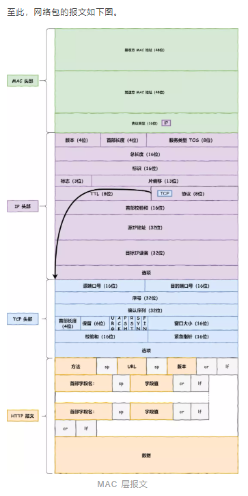
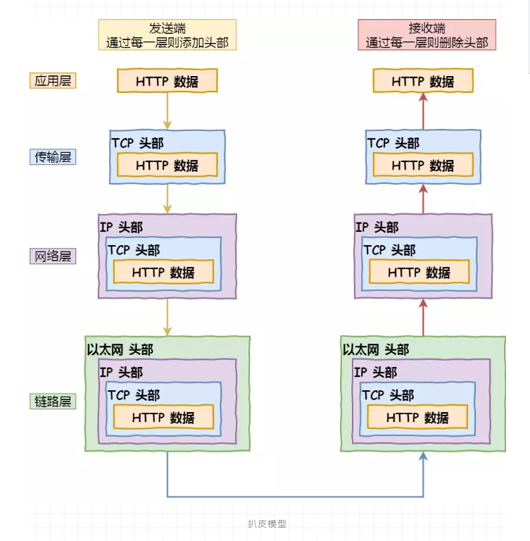

<https://blog.csdn.net/u012505618/article/details/78383390>

助记：

- 应用层、传输层、网络层、链路层
- 浏览器通过DNS获取到web服务器真的IP地址后，便向Web服务器发起TCP连接请求，通过TCP三次握手建立好连接后，浏览器便可以将HTTP请求数据通过发送给服务器了

最好的：<http://url.cn/1mosjxnS>    [原文链接](<https://mp.weixin.qq.com/s?__biz=MzAwNDA2OTM1Ng==&mid=2453143291&idx=1&sn=d22c5bc68b8503998511c317874f4eac&chksm=8cf2dc78bb85556ef7e3e461b6d6a0d1422a312f3e84c184457eab6df07b014451bbef49b092&mpshare=1&scene=23&srcid=&sharer_sharetime=1591763081816&sharer_shareid=e6d90aec84add5cf004cb1ab6979727c#rd>)

### 我的概括：

http一次请求

简单说，dns找到目标ip，发送http请求，服务器处理，返回http响应数据
深了说，在http传输之前，都要tcp三次握手建立连接
而http数据，在传输层加了tcp头，在网络层通过路由器路由表找到相应ip加ip头，在链路层交换机处通过arp协议加了Mac头（以太网头），

然后通过网卡，数字转电信号顺着网线发出去，再通过链路层交换机解析找到正确的mac，再到路由器找到ip地址，路由表查找下一跳ip，再封包

#### 数据包

#### 流程

