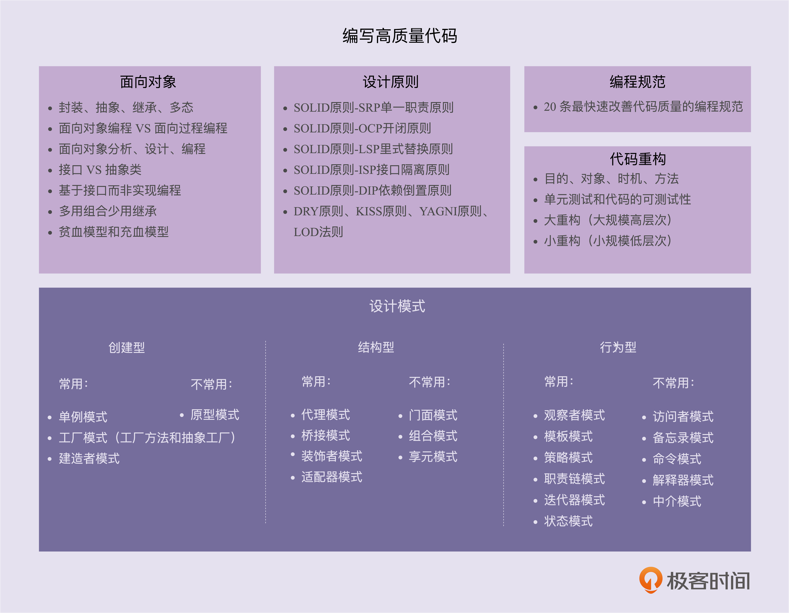

# 0x00 学习导读

- 最常用的评价标准

  ```
  可维护性、可读性、可扩展性、灵活性、简洁性、可复用性、可测试性。
  其中，可维护性、可读性、可扩展性又是提到最多的、最重要的三个评价标准。
  ```

- 几个常用的**设计原则**

  ```
  SOLID 原则 -SRP 单一职责原则
  SOLID 原则-OCP 开闭原则
  SOLID 原则 -LSP 里式替换原则
  SOLID 原则 -ISP 接口隔离原则
  SOLID 原则 -DIP 依赖倒置原则
  DRY 原则、KISS 原则、YAGNI 原则、LOD 法则
  ```

- ### 23 种经典的设计模式,可分三大类

  ```
  创建型、结构型、行为型
  
  创建型设计模式主要解决“对象的创建”问题，
  结构型设计模式主要解决“类或对象的组合或组装”问题，
  行为型设计模式主要解决的就是“类或对象之间的交互”问题。
  
  设计模式要干的事情就是**解耦**。
  创建型模式是将创建和使用代码解耦，
  结构型模式是将不同功能代码解耦，
  行为型模式是将不同的行为代码解耦，具体到观察者模式，它是将观察者和被观察者代码解耦。
  ```

  - #### 创建型

    常用的有：单例模式、工厂模式（工厂方法和抽象工厂）、建造者模式。

    不常用的有：原型模式

  - #### 结构型

    常用的有：代理模式、桥接模式、装饰者模式、适配器模式

    不常用的有：门面模式、组合模式、享元模式

  - #### 行为型

    常用的有：观察者模式、模板模式、策略模式、职责链模式、迭代器模式、状态模式

    不常用的有：访问者模式、备忘录模式、命令模式、解释器模式、中介模式

- **编程规范**

  编程规范主要解决的是代码的可读性问题

- **代码重构**

  - 重构的目的（why）、对象（what）、时机（when）、方法（how）
  - 保证重构不出错的技术手段：单元测试和代码的可测试性
  - 两种不同规模的重构：大重构（大规模高层次）和小重构（小规模低层次）。



### 创建型

创建型模式主要解决对象的创建问题，封装复杂的创建过程，解耦对象的创建代码和使用代码

- 单例模式：用来创建全局唯一的对象
- 工厂模式：用来创建不同但是相关类型的对象（继承同一父类或者接口的一组子类），由给定的参数来决定创建哪种类型的对象
- 建造者模式：用来创建复杂对象，可以通过设置不同的可选参数，“定制化”地创建不同的对象
- 原型模式：针对创建成本比较大的对象，利用对已有对象进行复制的方式进行创建，以达到节省创建时间的目的

### 结构型

主要总结了一些类或对象组合在一起的经典结构，这些经典的结构可以解决特定应用场景的问题

- 代理模式
- 桥接模式
- 适配器模式
- 门面模式
- 组合模式

- 享元模式


# 0x01 面向对象

- 什么是面向对象编程？

  ```
  面向对象编程是一种编程范式或编程风格。它以类或对象作为组织代码的基本单元，并将封装、抽象、继承、多态四个特性，作为代码设计和实现的基石 。
  ```

- 什么是面向对象编程语言？

  ```
  面向对象编程语言是支持类或对象的语法机制，并有现成的语法机制，能方便地实现面向对象编程四大特性（封装、抽象、继承、多态）的编程语言。
  ```

- 面向对象编程和面向对象编程语言之间有何关系?

  ```
  向对象编程一般使用面向对象编程语言来进行，但是，不用面向对象编程语言，我们照样可以进行面向对象编程。反过来讲，即便我们使用面向对象编程语言，写出来的代码也不一定是面向对象编程风格的，也有可能是面向过程编程风格的。
  ```

- 如何判定某编程语言是否是面向对象编程语言？

  ```
  如果按照严格的的定义，需要有现成的语法支持类、对象、四大特性才能叫作面向对象编程语言。如果放宽要求的话，只要某种编程语言支持类、对象语法机制，那基本上就可以说这种编程语言是面向对象编程语言了，不一定非得要求具有所有的四大特性。
  ```

- 什么是面向对象分析和面向对象设计？

  ```
  简单点讲，面向对象分析就是要搞清楚做什么，面向对象设计就是要搞清楚怎么做。两个阶段最终的产出是类的设计，包括程序被拆解为哪些类，每个类有哪些属性方法、类与类之间如何交互等等。
  ```

- 什么是 **UML**？我们是否需要 UML？

  ```
  UML（Unified Model Language），统一建模语言。用它来画图表达面向对象或设计模式的设计思路.
  UML 是一种非常复杂的东西。它不仅仅包含我们常提到类图，还有用例图、顺序图、活动图、状态图、组件图等
  仅仅使用类图，学习成本也是很高的。就单说类之间的关系，UML 就定义了很多种，比如【泛化、实现、关联、聚合、组合、依赖】等。
  UML 在互联网公司的项目开发中，用处可能并不大
  ```

  拓展：

  ```
  丁丁历险记
  下班后发现争哥让我出代码示例和说明区别，赶紧做。
  写点简单粗暴的个人理解。
  一 show me the code ..
  泛化（Generalization）class BaseComponent { ... } class Dingdding extend BaseComponent { .. }
  实现(Realization) 类实现接口 虚线加三角interface crud { func create(); func update();func get(); func() del{ } }
  class DingdingModel implements crud {
  func create(){ ...}
  func update(){ ...}
  func get(){ ...}
  func del(){ ...}
  }
  关键是后面四个 （关联，聚合，组合，依赖）先说关联关系。 （A has B）
  class DingdingUser {
  privte $account; //有一个账号对象，
  }
  再说聚合，是一种特殊的关联。
  聚合，组合， 一对多的关联
  聚合关系是“has-a”关系，组合关系是“contains-a”关系，少一个宿主对象死掉没。
  uml2.x 已合并这种无聊的区分
  聚合示例class birdsGroup(){
  private $birds;
  //聚合往往可以干增减相关的操作
  public func addBird( $bird) { ... }
  public func removeBird( $bird) { ... }
  }
  组合示例。class bird (){public $wing; //鸟由翅膀 组成.
  }
  最后说关联合依赖。
  泛化 = 实现 > 组合 > 聚合 > 关联 > 依赖
  2 然后说些个人理解：我回顾了一下，oop 的过程。
  在框架的辅助下，数据库建模一作，其实文件放哪，啥关系就出来了，画uml 图反而了一个体力活。
  往往是去实现一个需求，将一个业务流走通，写了一段代码后，发现这里写死了，于是做点配置管理（中心控制原则） ，一个类权责过多，于是将其支解。（类的单一职责原则），重复的代码出现了不符dry 了，赶紧抽离出来，先简单粗爆的用一个类的静态方法抽（很多大神不建议这样做，我不明其理，慢慢研究）， 某个操作，有几种不同的类可以去做实施。例如日志。（redis 写日志，文本日志，数据库日志，控制台输出） 于是搞个【工厂模式】，遵守下【dip原则】，让Log::log($log_msg, $type,$tags) 成为一种面向抽象开始，而不是面向具体实现。老板看到gmail 的undo 很酷闲着蛋疼的让你对所有操作 ，都要求在半分钟类允许undo ，上个command 应付下，不出意外 没多久，老板的redo 需求来了，就顺着扩展 ，进一步的有时候，一个主体业务完成后，要做一堆关联的杂七杂八的事，于是搞个【观察者模式】，这样将主体业务和后序操作业务解耦了。 既然扯到解藕(decouple)了, 我粗浅的来看，折腾设计模式，本质是解藕，找到合适的方法，在合适的场景下做对应的解藕操作。
  这么一折腾下来，类和类啥关系，好像压根没太在意到。。。。 但类之前又确实有关系 。 挺想想知道其它伙伴们是如何做oop 的。
  自我总结，套路包确实掌握了几个，但总感觉是在很浅的层面上折腾，上述错的乱七八糟的，烦请指正，个人平时就这么想的，这八个月就跟着争哥好好学习了。
  ```

## 封装（Encapsulation）

