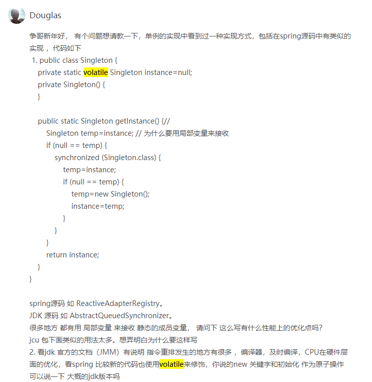
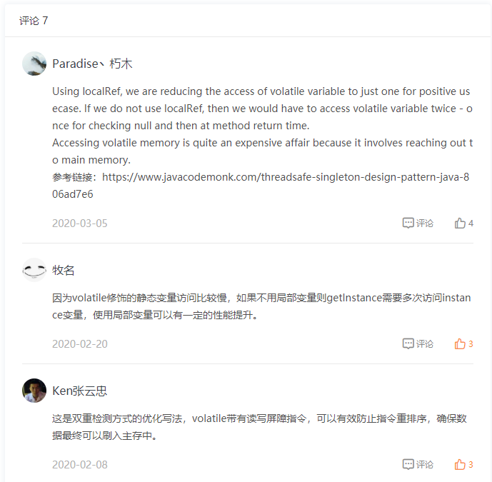

##  参考

- 极客时间
- [被面试官虐过之后，他轻蔑的问我：你还说你了解单例模式吗？](<https://mp.weixin.qq.com/s?__biz=MzI3NzE0NjcwMg==&mid=2650127331&idx=1&sn=44d49fe46f14053e638d2fb0caba7a7b&chksm=f36ba6c2c41c2fd44ec8ea65bb01d49fdf326f38e00903ac23323a16f2209defc3bbb42cc372&mpshare=1&scene=23&srcid=&sharer_sharetime=1588136175997&sharer_shareid=e6d90aec84add5cf004cb1ab6979727c#rd>)


# 定义

单例设计模式（Singleton Design Pattern），一个类只允许创建一个对象（或者实例），那这个类就是一个单例类，这种设计模式就叫作单例设计模式，简称单例模式。


## 实战作用

- **处理资源访问冲突**   (代替`synchronsize(this.class)`)

  - Logger

  ```java
  Logger.getInstance().log   //去访问单例类  Logger
  ```

- **表示全局唯一类**

  - 配置信息类
  - 连接池类
  - 唯一递增ID号码生成器


# 如何实现一个单例？

注意点：

- 构造函数需要是 **private** 访问权限的，这样才能避免外部通过 new 创建实例
- 考虑对象**创建时的线程安全**问题
- 考虑是否支持**延迟加载**（在真正用到`该类`的时候，再创建实例）
- 考虑 `getInstance()` 性能是否高（是否加锁）


###  1.饿汉式

在类加载的时候，instance 静态实例就已经创建并初始化好了，所以，instance 实例的创建过程是线程安全的。

不过，这样的实现方式**不支持延迟加载**（在真正用到 `IdGenerator` 的时候，再创建实例），从名字中我们也可以看出这一点。

```java
public class IdGenerator { 
  private AtomicLong id = new AtomicLong(0);
  private static final IdGenerator instance = new IdGenerator();
  private IdGenerator() {}
  public static IdGenerator getInstance() {
    return instance;
  }
  public long getId() { 
    return id.incrementAndGet();
  }
}
```

### 2. 懒汉式

**支持延迟加载**

注意考虑对象创建时的线程安全问题，这里使用`Synchronized`关键字

如果频繁地用到，那频繁加锁、释放锁及**并发度低**等问题，会导致性能瓶颈，这种实现方式就不可取了

```java
public class IdGenerator { 
  private AtomicLong id = new AtomicLong(0);
  private static IdGenerator instance;
  private IdGenerator() {}
  public static synchronized IdGenerator getInstance() {
    if (instance == null) {
      instance = new IdGenerator();
    }
    return instance;
  }
  public long getId() { 
    return id.incrementAndGet();
  }
}
```


### 3. 双重检测

一种既**支持延迟加载**、又**支持高并发**的单例实现方式

```java
public class IdGenerator { 
  private AtomicLong id = new AtomicLong(0);
  private static IdGenerator instance;
  private IdGenerator() {}
  public static IdGenerator getInstance() {
    if (instance == null) {
      synchronized(IdGenerator.class) { // 此处为类级别的锁
        if (instance == null) {
          instance = new IdGenerator();
        }
      }
    }
    return instance;
  }
  public long getId() { 
    return id.incrementAndGet();
  }
}
```

网上有人说，这种实现方式有些问题。因为**指令重排序**，可能会导致 `IdGenerator` 对象被 new 出来，并且赋值给 `instance` 之后，**还没来得及初始化**（执行构造函数中的代码逻辑），**就被另一个线程使用了**。要解决这个问题，我们需要给 `instance` 成员变量**加上 `volatile` 关键字，禁止指令重排序**才行。实际上，**只有很低版本的 Java 才会有这个问题**。我们**现在用的高版本的 Java 已经在 JDK 内部实现中解决了这个问题**（解决的方法很简单，只要**把对象 new 操作和初始化操作设计为原子操作**，就自然能禁止重排序）

### 4. 静态内部类

比双重检测更加简单,利用 Java 的静态内部类。有点类似饿汉式，但又能做到了延迟加载。

```java
public class IdGenerator { 
  private AtomicLong id = new AtomicLong(0);
  private IdGenerator() {}

  private static class SingletonHolder{
    private static final IdGenerator instance = new IdGenerator();
  }
  
  public static IdGenerator getInstance() {
    return SingletonHolder.instance;
  }
 
  public long getId() { 
    return id.incrementAndGet();
  }
}
```

`SingletonHolder` 是一个静态内部类，**当外部类 `IdGenerator` 被加载的时候，并不会创建 `SingletonHolder` 实例对象。只有当调用 `getInstance()` 方法时，`SingletonHolder` 才会被加载，这个时候才会创建 `instance`。**`insance` 的唯一性、创建过程的线程安全性，都由 JVM 来保证。所以，这种实现方法既保证了线程安全，又能做到延迟加载。


延伸：[Java 静态内部类的加载时机](https://www.cnblogs.com/zouxiangzhongyan/p/10762540.html)

```
结论：
静态内部类和非静态内部类一样，都不会因为外部内的加载而加载，
同时静态内部类的加载不需要依附外部类，在使用时才加载，不过在加载静态内部类的过程中也会加载外部类
```


### 5. 枚举

最简单的实现方式，基于枚举类型的单例实现。

这种实现方式通过 Java 枚举类型本身的特性，保证了**实例创建的线程安全性**和**实例的唯一性**

```java
public enum IdGenerator {
  INSTANCE;
  private AtomicLong id = new AtomicLong(0);
 
  public long getId() { 
    return id.incrementAndGet();
  }
}
```


## 实际应用

#### 一、`java.lang.Runtime`

在JDK的源码中，类`java.lang.Runtime`就是一个单例的，

每一个JAVA应用程序都有这样的一个类，主要是应用程序可以与运行的环境进行交互，可以通过`getRuntime()`获取实例。当然也提供了非常多的方法

```java
//饿汉式，没有延迟加载
public class Runtime { 
    private static Runtime currentRuntime = new Runtime();
    public static Runtime getRuntime() {
        return currentRuntime;
    }
    private Runtime() {}
    //.....totalMemory()返回JVM的内存总量，freeMemory()可以内存等方法。
    //.....
}
```


#### 二、有关于Volatile






看过`Eventbus` 的源码，写法是典型的双重锁检验方式，但是构造方法是public 的


#### Spring Boot中单例类实现对象的注入

<https://blog.csdn.net/xtss999/article/details/89139745>

利用`@PostConstruct`来对单例类中对象的注入


# 单例存在哪些问题?

#### 1. 单例对 OOP 特性的支持不友好

​	**比如唯一的ID生成器**。如果未来某一天，我们希望针对不同的业务采用不同的 ID 生成算法。比如，订单 ID 和用户 ID 采用不同的 ID 生成器来生成。为了应对这个需求变化，我们需要修改所有用到 `IdGenerator` 类的地方，这样代码的改动就会比较大。

​	一旦你选择将某个类设计成到单例类，也就意味着**放弃了继承和多态**这两个强有力的面向对象特性，也就相当于损失了可以应对未来需求变化的扩展性

#### 2. 单例会隐藏类之间的依赖关系

**一般类通过构造函数、参数传递等方式声明的类之间的依赖关系**，我们通过查看函数的定义就能很容易识别出来。

单例类不需要显示创建、不需要依赖参数传递，在函数中直接调用就可以了。这种**调用关系就会非常隐蔽**，需要仔细查看每个函数的代码实现，才能知道这个类到底依赖了哪些单例类。

#### 3.单例对代码的扩展性不友好

我们需要**在代码中创建两个实例或多个实例**，那就要对单例类相关代码有比较大的改动

**比如创建两个数据库连接池**，一个处理快SQL，一个处理慢SQL

#### 4. 单例对代码的可测试性不友好

（1）如果单例类**依赖比较重的外部资源**，比如 DB，我们在写单元测试的时候，希望能通过 mock 的方式将它替换掉。而单例类这种硬编码式的使用方式，导致无法实现 mock 替换。

（2）修改了单例类中的同一个成员变量的值（相当于一种全局变量），从而导致测试结果互相影响的问题

#### 5.单例不支持有参数的构造函数

单例不支持有参数的构造函数，比如我们创建一个连接池的单例对象，我们没法通过参数来指定连接池的大小。

- 第一种解决思路是：创建完实例之后，再调用 `init()` 函数传递参数。

- 第二种解决思路是：将参数放到 `getIntance()` 方法中（方法弊端：只能传参构造一次）

- 第三种解决思路是：将参数放到另外一个全局变量中（最值得推荐）

  ```java
  public class Config {
    public static final int PARAM_A = 123;
    public static fianl int PARAM_B = 245;
  }
  
  public class Singleton {
    private static Singleton instance = null;
    private final int paramA;
    private final int paramB;
  
    private Singleton() {
      this.paramA = Config.PARAM_A;
      this.paramB = Config.PARAM_B;
    }
  
    public synchronized static Singleton getInstance() {
      if (instance == null) {
        instance = new Singleton();
      }
      return instance;
    }
  }
  ```


## 有何替代解决方案？

#### 1.静态方法

​	为了保证**全局唯一**，**除了使用单例**，我们还可以用**静态方法**来实现。

​	不过，**静态方法**这种实现思路，**并不能解决我们之前提到的问题**。

​	实际上，它比单例更加不灵活，比如，它**无法支持延迟加载**。

#### 2.将单例生成的对象，作为参数传递给函数（也可以通过构造函数传递给类的成员变量）

​	可以解决单例隐藏类之间依赖关系的问题。

​	不过，对于单例存在的其他问题，比如对 OOP 特性、扩展性、可测性不友好等问题，还是无法解决。

#### 3.从根上出发

​	要从根上，寻找其他方式来实现全局唯一类。实际上类对象的全局唯一性可以通过多种不同的方式来保证。

​	我们既可以通过**单例模式**来强制保证，

​	也可以通过**工厂模式**、**IOC 容器（比如 Spring IOC 容器）**来保证，

​	还可以通过**程序员自己来保证**（自己在编写代码的时候自己保证不要创建两个类对象）。

​	这就类似 Java 中内存对象的释放由 JVM 来负责，而 C++ 中由程序员自己负责，道理是

一样的


# 从根上出发的再讨论

之前粗略给出了替换单例模式的方法，比如工厂模式、IOC 容器。今天，我们再进一步扩展延伸一下，一块讨论一下下面这几个问题：

- 如何理解单例模式中的唯一性？
- 如何实现线程唯一的单例？
- 如何实现集群环境下的单例？
- 如何实现一个多例模式？


### 唯一性

**唯一性**： 集群 > 进程 > 线程   

**集群唯一**”就相当于是进程内唯一、进程间也唯一；  **进程唯一**就相当于线程内唯一、线程间也唯一；


#### 线程内唯一实现

```java
public class IdGenerator {
  private AtomicLong id = new AtomicLong(0);

  private static final ConcurrentHashMap<Long, IdGenerator> instances
          = new ConcurrentHashMap<>();

  private IdGenerator() {}

  public static IdGenerator getInstance() {
    Long currentThreadId = Thread.currentThread().getId();
    instances.putIfAbsent(currentThreadId, new IdGenerator());
    return instances.get(currentThreadId);
  }

  public long getId() {
    return id.incrementAndGet();
  }
}
```


#### 集群内唯一实现

把这个单例对象序列化并存储到**外部共享存储区**（比如文件）

需要对对象**加锁**，避免其他进程再将其获取.

在进程使用完这个对象之后，还需要显式地将对象从内存中**删除**，并且**释放**对对象的加锁。

```java
public class IdGenerator {
  private AtomicLong id = new AtomicLong(0);
  private static IdGenerator instance;
  private static SharedObjectStorage storage = FileSharedObjectStorage(/*入参省略，比如文件地址*/);
  private static DistributedLock lock = new DistributedLock();
  
  private IdGenerator() {}

  public synchronized static IdGenerator getInstance() 
    if (instance == null) {
      lock.lock();
      instance = storage.load(IdGenerator.class);
    }
    return instance;
  }
  
  public synchroinzed void freeInstance() {
    storage.save(this, IdGeneator.class);
    instance = null; //释放对象
    lock.unlock();
  }
  
  public long getId() { 
    return id.incrementAndGet();
  }
}

// IdGenerator使用举例
IdGenerator idGeneator = IdGenerator.getInstance();
long id = idGenerator.getId();
IdGenerator.freeInstance();
```


#### 如何实现一个多例模式？

“多例”指的就是，一个类可以创建多个对象，但是个数是有限制的，比如只能创建 3 个对象。

实际上，对于多例模式，还有一种理解方式：同一类型的只能创建一个对象（`就是同一个键只有一个值`），不同类型的可以创建多个对象。

**它跟工厂模式的不同之处**是，多例模式创建的对象都是**同一个类**的对象，而工厂模式创建的是**不同子类**的对象


#### 单例类对象的唯一性的作用范围

在文章中，我们讲到单例唯一性的作用范围是进程，实际上，对于 Java 语言来说，单例类对象的唯一性的作用范围并非进程，而是类加载器（Class Loader）

```
要回答这个课后问题，要理解classloader和JDK8中使用的双亲委派模型。
classloader有两个作用：1. 用于将class文件加载到JVM中；2. 确认每个类应该由哪个类加载器加载，并且也用于判断JVM运行时的两个类是否相等。
双亲委派模型的原理是当一个类加载器接收到类加载请求时，首先会请求其父类加载器加载，每一层都是如此，当父类加载器无法找到这个类时（根据类的全限定名称），子类加载器才会尝试自己去加载。
所以双亲委派模型解决了类重复加载的问题， 比如可以试想没有双亲委派模型时，如果用户自己写了一个全限定名为java.lang.Object的类，并用自己的类加载器去加载，同时BootstrapClassLoader加载了rt.jar包中的JDK本身的java.lang.Object，这样内存中就存在两份Object类了，此时就会出现很多问题，例如根据全限定名无法定位到具体的类。有了双亲委派模型后，所有的类加载操作都会优先委派给父类加载器，这样一来，即使用户自定义了一个java.lang.Object，但由于BootstrapClassLoader已经检测到自己加载了这个类，用户自定义的类加载器就不会再重复加载了。所以，双亲委派模型能够保证类在内存中的唯一性。
联系到课后的问题，所以用户定义了单例类，这样JDK使用双亲委派模型加载一次之后就不会重复加载了，保证了单例类的进程内的唯一性，也可以认为是classloader内的唯一性。当然，如果没有双亲委派模型，那么多个classloader就会有多个实例，无法保证唯一性。
```


# 实际应用

**Spring 中 bean 的默认作用域就是 singleton(单例)的。**

**线程池**、缓存、对话框、**注册表**、**日志对象**、充当打印机、显卡等设备驱动程序的对象。


