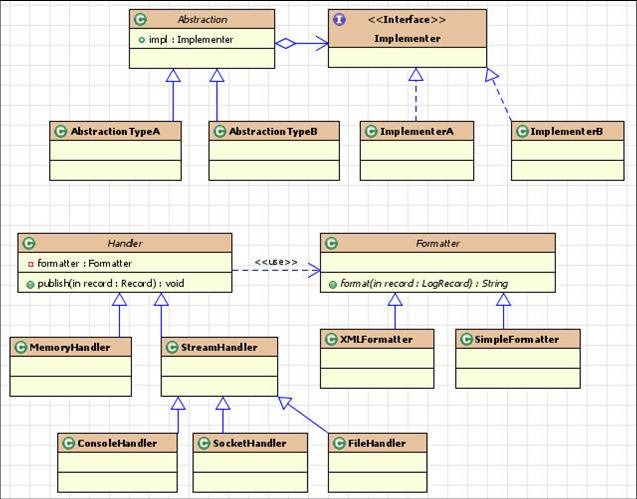

# 桥接模式

“将抽象和实现解耦，让它们可以独立变化。”

“一个类存在两个（或多个）独立变化的维度，我们通过组合的方式，让这两个（或多个）维度可以独立进行扩展。”通过组合关系来替代继承关系，避免继承层次的指数级爆炸。

看来桥接模式挺难理解···


## JDBC中的桥接模式

想要把 MySQL 数据库换成 Oracle 数据库，只需要把配置文件第一行代码中的 `com.mysql.jdbc.Driver` 换成 `oracle.jdbc.driver.OracleDriver` 就可以了。

- `Class.forName(“com.mysql.jdbc.Driver”)`

  - 要求 JVM 查找并加载指定的 Driver 类
  - 执行该类的静态代码，也就是将 MySQL Driver 注册到 `DriverManager` 类中

- `DriverManager` 类

  当我们把具体的 Driver 实现类（比如，`com.mysql.jdbc.Driver`）注册到 `DriverManager` 之后，后续所有对 JDBC 接口的调用，都会委派到对具体的 Driver 实现类来执行。而 Driver 实现类都实现了相同的接口（`java.sql.Driver` ），这也是可以灵活切换 Driver 的原因。

- JDBC 本身就相当于“抽象”。注意，这里所说的“抽象”，指的并非“抽象类”或“接口”，而是跟具体的数据库无关的、被抽象出来的一套“类库”。具体的 Driver（比如，com.mysql.jdbc.Driver）就相当于“实现”


## 桥接模式的应用举例

一个 API 接口监控告警的例子：告警支持多种通知渠道，紧急程度有多种类型，不同的紧急程度对应不同的通知渠道。

`Notification` 类相当于抽象，`MsgSender` 类相当于实现，两者可以独立开发，通过组合关系（也就是桥梁）任意组合在一起

```java

public interface MsgSender {
  void send(String message);
}

public class TelephoneMsgSender implements MsgSender {
  private List<String> telephones;

  public TelephoneMsgSender(List<String> telephones) {
    this.telephones = telephones;
  }

  @Override
  public void send(String message) {
    //...
  }

}

public class EmailMsgSender implements MsgSender {
  // 与TelephoneMsgSender代码结构类似，所以省略...
}

public class WechatMsgSender implements MsgSender {
  // 与TelephoneMsgSender代码结构类似，所以省略...
}

public abstract class Notification {
  protected MsgSender msgSender;

  public Notification(MsgSender msgSender) {
    this.msgSender = msgSender;
  }

  public abstract void notify(String message);
}

public class SevereNotification extends Notification {
  public SevereNotification(MsgSender msgSender) {
    super(msgSender);
  }

  @Override
  public void notify(String message) {
    msgSender.send(message);
  }
}

public class UrgencyNotification extends Notification {
  // 与SevereNotification代码结构类似，所以省略...
}
public class NormalNotification extends Notification {
  // 与SevereNotification代码结构类似，所以省略...
}
public class TrivialNotification extends Notification {
  // 与SevereNotification代码结构类似，所以省略...
}
```


**我的简单理解：**

（1）就是类中有接口成员变量，调用接口的方法，

​          而传入类的是接口的实现类，对类中接口成员变量赋值，所以实际调用的是接口的实现类的方法这样。

（2）还可以像JDBC这样（注册方式）

**从下面的理解来看，我的理解基本错了**


## 理解

“将抽象和实现解耦，让它们可以独立变化。”

定义中的“抽象”，指的并非“抽象类”或“接口”，而是**被抽象出来的一套“类库”**，它只包含骨架代码，真正的业务逻辑需要委派给定义中的“实现”来完成。

而定义中的“实现”，也**并非“接口的实现类”**，而是的一套独立的“类库”。


### 课堂问题

在桥接模式的第二种理解方式的第一段代码实现中，Notification 类中的三个成员变量通过 set 方法来设置，但是这样的代码实现存在一个明显的问题，那就是 `emailAddresses`、`telephones`、`wechatIds` 中的数据有可能在 Notification 类外部被修改，那如何重构代码才能避免这种情况的发生呢？


答：  

课后题：可以考虑使用建造者模式来重构！参见46讲中

建造者使用场景：
1.构造方法必填属性很多，需要检验
2.类属性之间有依赖关系或者约束条件
3.创建不可变对象(此题刚好符合这种场景)  


问题的本质是**构造器初始化成员变量, 而不是setter.**
根据**依赖倒转原则**,尽量不要为客户提供new的方式初始化对象,即构造器私有.
所以无论是Builder还是简单工厂都能很好的完成任务.
当然Builder的扩展性要好于简单工厂, 特别是**构造对象需要多个参数时**.


# 实际

JDK中体现：java.util.logging中的Handler和Formatter
类图：



**JDBC驱动   ：** 

第一件事情是要求 JVM 查找并加载指定的 Driver 类，第二件事情是执行该类的静态代码，也就是将 MySQL Driver 注册到 DriverManager 类中。被抽象出来的一套“类库”。具体的 Driver（比如，com.mysql.jdbc.Driver）就相当于“实现”。JDBC 的所有逻辑操作，最终都委托给 Driver 来执行。