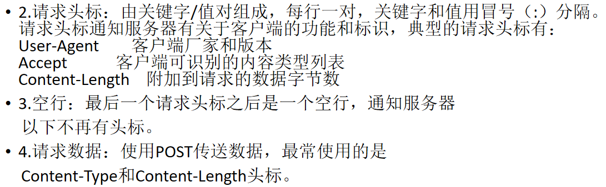

 #### 代码  炸了····简单的都没写好

  1.用过哪些设计模式    单例模式    static    双重检测    

- synchronized（方法，代码块，我甚至还说加类上，好sb）   

- volatile   

- 枚举类都不太了解····

- 如何禁止反射的时候实例化呢（我说用枚举类。瞎bb，唉）

   - 增加boolean flag在第二次赋值的时候报错
   - enum完美解决
     - 因为没有无参构造函数，只有(String name, Integer ordinal) 构造，若构造正确但检测到是enum还是会创建失败

   2.JAVA 

- 代码里异常检测没有写到每一位

- String为null时`valueOf`返回值 

   > throw new Exception     

- 如果String超出表达范围时则么办  

   其实也就是，如何增加越界校验？

   <https://www.cnblogs.com/shuhaoz/p/4396112.html>

   - NumberFormatException 
   - 先把String转成long，把int边界值设置成long，然后比较判断是否在范围内

### 问问题，继续炸

3. tcp  三次握手，四次挥手（为啥四次）  

4. tcp端口重用（不会）

   - 我以 SO_REUSEADDR 选项调用 setsockopt。为了允许地址重用，我设置整型参数（on）为 1 
   - 使用 SO_REUSEADDR 套接字选项避免地址使用错误（在应用了 SO_REUSEADDR 选项之后，bind API 函数将允许地址的立即重用）

5. tcp应用场景   http请求 

6. dns用的是什么协议

   DNS在进行区域传输的时候使用TCP，普通的查询使用UDP

   <https://www.zhihu.com/question/310145373>

7. get post区别，如何区分head和body

   

8. https， ssl协议建立

9. mysql的数据存储结构

10. 简述进程线程、知不知道进程创建方式windows（process）和liuix（fork）区别

11. redis 限流实现

12. 线程池

    - **核心线程是如何在没任务时候等待的**

      - BlockingQueue阻塞队列中拿任务，生产者消费者

      - > 　　如果当前活动线程数**大于**核心线程数，当去缓存队列中取任务的时候，如果缓存队列中没任务了，则**等待keepAliveTime的时长**，此时还没任务就返回null，这就意味着runWorker()方法中的while循环会被退出，其对应的线程就要销毁了，也就是线程池中少了一个线程了。因此只要线程池中的线程数大于核心线程数就会这样一个一个地销毁这些多余的线程。

      - > 如果当前活动线程数**小于等于**核心线程数，同样也是去缓存队列中取任务，但当缓存队列中没任务了，就会进入**阻塞状态**，直到能取出任务为止，因此这个线程是处于阻塞状态的，并不会因为缓存队列中没有任务了而被销毁。这样就保证了线程池有N个线程是活的，可以随时处理任务，从而达到重复利用的目的。

    - **线程报错如何处理**

      <https://blog.csdn.net/luoyoub/article/details/81571360>

      <https://blog.csdn.net/not_in_mountain/article/details/77861399>

      - 在run方法上增加异常处理
      - 使用UncaughtExceptionHandler处理未捕获异常
      - 为所有的Thread设置一个默认的UncaughtExceptionHandler，通过调用Thread.setDefaultUncaughtExceptionHandler(Thread.UncaughtExceptionHandler eh)方法

    - **线程池异常处理**

      <https://blog.csdn.net/luoyoub/article/details/81571360>

      <https://blog.csdn.net/not_in_mountain/article/details/77861399>

      - 只有通过execute提交的任务，才能将它抛出的异常交给UncaughtExceptionHandler，而通过submit提交的任务，无论是抛出的未检测异常还是已检查异常，都将被认为是任务返回状态的一部分

        ```java
        public class ExecuteCaught
        {
        public static void main(String[] args)
        {
        ExecutorService exec = Executors.newCachedThreadPool();
        exec.execute(new ThreadPoolTask());
        exec.shutdown();
        }
        }
        
        class ThreadPoolTask implements Runnable
        {
        @Override
        public void run()
        {
        Thread.currentThread().setUncaughtExceptionHandler(new ExceptionHandler());
        System.out.println(3/2);
        System.out.println(3/0);
        System.out.println(3/1);
        }
        }
        ```

    - **线程报错后如何通知其他线程**

      ?，其实意思应该是如何给线程池内所有线程设置UncaughtExceptionHandler

      - 写在Runnable里

      - ```java
        ThreadFactory executorThreadFactory = new BasicThreadFactory.Builder()
                .namingPattern("task-scanner-executor-%d")
                .uncaughtExceptionHandler(new LogUncaughtExceptionHandler(LOGGER))
                .build();
        Executors.newSingleThreadExecutor(executorThreadFactory);
        ```

      - 扩展：`execute(Runnable)` 抛异常， `submit(Callable/Runnable)`不抛，除非调用get的话会重新抛出


```
设计模式
1、单例
class Demo {
	private volatile static Demo demo;
	private Demo(){};
	public static Demo getInstance() {
		if(demo == null) {
			// 2
			synchronize(Demo.class) {
				if(demo == null ) {
					demo = new Demo();
				}
			}
			// 2
		}

		return demo;
	}	
}
///
Demo demo = Demo.getInstance();

你那边信号好像不好


1、给定一个字符串，转化成数字（整型）， 自行考虑边界问题
2、不能使用工具类中的parse和valueOf等函数
3、在20分钟内完成
String "123" -> int 123
public class Solution {

	public int slove(String str) {
		if(str == null || str.length() == 0) {
			throw new Exception("无");
		}
		// 首先判断有无+shi -
		int flag = 1;
		boolean f = false;
		if(str.charAt(0) == '+') {
			flag = 1;
			f = true;
		} else  if(str.charAt(0) == '-') {
			flag = -1;
			f = true;
		}
		char[] arr = str.toCharArray();
		int sum = 0;
		//进位
		int de = 1;
		for(int i = arr.length-1; i >= 0; i++) {
			//跳过符号位
			if(f == true && i == 0)  continue;
			int num = ch - '0';
			sum += num * de;
			de *= 10;
		}
		return sum * flag;
	}

}

听不到我说话？
是的····
我能听到你

```

